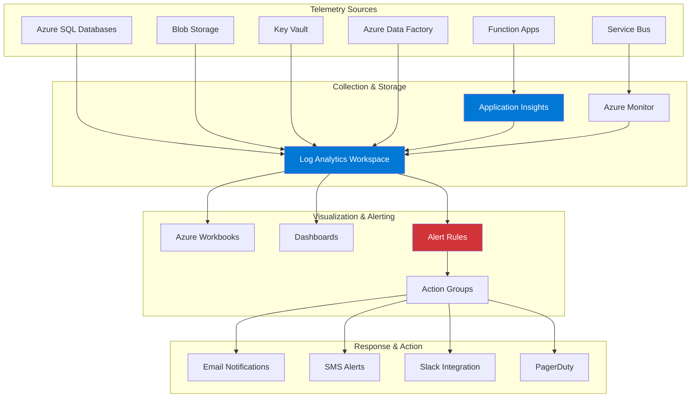
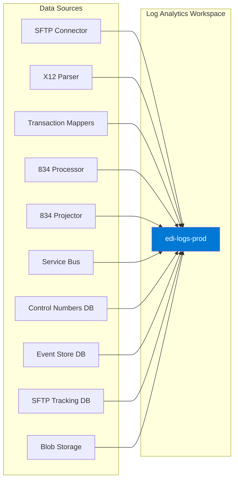
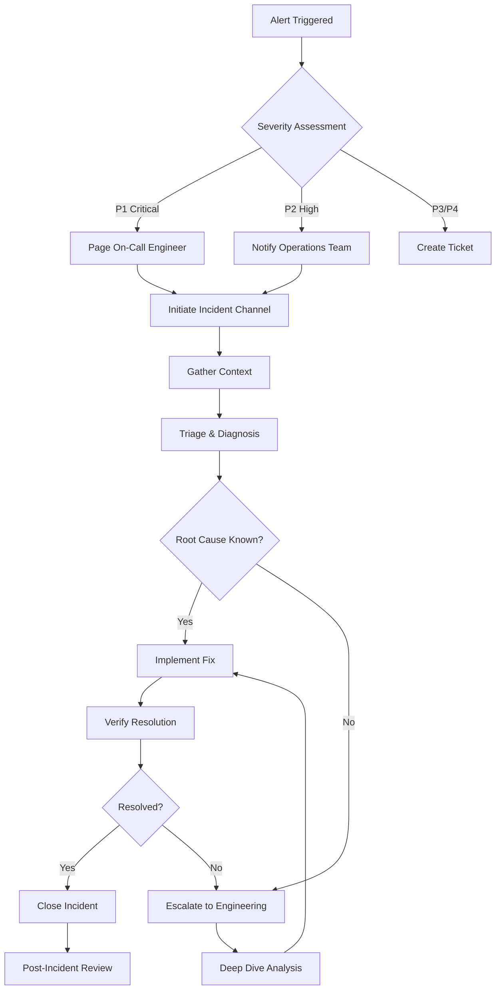

# Monitoring & Operations - EDI Platform

**Document Version:** 1.0  
**Last Updated:** January 2025  
**Status:** Active Implementation  

---

## Table of Contents

1. [Overview](#overview)
2. [Monitoring Architecture](#monitoring-architecture)
3. [Application Insights Queries](#application-insights-queries)
4. [Azure SQL Monitoring](#azure-sql-monitoring)
5. [Service Bus Monitoring](#service-bus-monitoring)
6. [Blob Storage Monitoring](#blob-storage-monitoring)
7. [Function App Monitoring](#function-app-monitoring)
8. [Alert Rules & Thresholds](#alert-rules--thresholds)
9. [Azure Monitor Dashboards](#azure-monitor-dashboards)
10. [Operational Runbooks](#operational-runbooks)
11. [Incident Response](#incident-response)
12. [Cost Management](#cost-management)
13. [Operational Checklists](#operational-checklists)

---

## Overview

### Purpose

This document consolidates all monitoring, observability, and operational procedures for the EDI Platform. It brings together KQL queries, alert configurations, dashboard specifications, and runbooks from across all system components into a single operational reference.

**Key Objectives:**

1. **Proactive Monitoring** - Detect issues before they impact users
2. **SLA Compliance** - Track and report on service level agreements
3. **Cost Optimization** - Monitor and control platform costs
4. **Incident Response** - Provide rapid troubleshooting guidance
5. **Operational Excellence** - Standardize procedures for platform operations

### Monitoring Stack



### Telemetry Collection

| Service | Telemetry Type | Destination | Retention |
|---------|---------------|-------------|-----------|
| **Function Apps** | Traces, requests, dependencies, exceptions | Application Insights | 90 days |
| **Service Bus** | Metrics, diagnostic logs | Azure Monitor | 30 days |
| **Azure SQL** | Query Store, DMVs, diagnostic logs | Log Analytics | 30 days |
| **Blob Storage** | Storage Analytics, diagnostic logs | Log Analytics | 30 days |
| **Key Vault** | Audit logs, access logs | Log Analytics | 90 days |
| **Azure Data Factory** | Pipeline runs, activity runs | Log Analytics | 45 days |

### Key Metrics & SLAs

| Metric | Target | Warning | Critical | Measurement |
|--------|--------|---------|----------|-------------|
| **End-to-End Latency** | < 5 minutes | > 5 minutes | > 10 minutes | File received → Routed to partner |
| **Processing Success Rate** | > 99.5% | < 99.5% | < 98% | Successful / Total files |
| **Eligibility Response Time (270/271)** | < 30 seconds | > 30 seconds | > 60 seconds | Request → Response |
| **Database Query Latency** | < 100ms (p95) | > 200ms | > 500ms | Query execution time |
| **Event Store Projection Lag** | < 50 events | 50-100 events | > 100 events | Events behind |
| **SFTP Connector Availability** | > 99.9% | < 99.9% | < 99% | Successful timer executions |
| **Service Bus DLQ Depth** | 0 | > 5 | > 20 | Dead-lettered messages |
| **Platform Availability** | > 99.9% | < 99.9% | < 99.5% | Uptime percentage |
| **File Processing Success Rate** | > 99% | < 99% | < 97% | Successfully processed / Total files |
| **Average File Processing Time** | < 2 minutes | > 2 minutes | > 5 minutes | File received → Validation complete |
| **Record Validation Failure Rate** | < 0.5% | > 0.5% | > 2% | Failed records / Total records |
| **Daily File Volume per Partner** | Within baseline ±20% | ±20-40% | > 40% variance | Compared to 30-day average |
| **Transaction Set Errors** | < 1% | 1-3% | > 3% | Failed transaction sets / Total |

### Monitoring Costs

| Component | Monthly Cost | Purpose |
|-----------|-------------|---------|
| Application Insights | $50-200 | Distributed tracing, telemetry |
| Log Analytics Workspace | $100-300 | Centralized log storage |
| Azure Monitor Alerts | $5-20 | Alert rule evaluations |
| **Total** | **$155-520/month** | Platform observability |

---

## Monitoring Architecture

### Centralized Logging

**Log Analytics Workspace: `edi-logs-prod`**

All platform components send telemetry to a centralized Log Analytics workspace:



### Application Insights Configuration

**Application Insights: `edi-appinsights-prod`**

Connected to Log Analytics workspace for unified query experience.

**Key Features Enabled:**

- **Distributed Tracing** - Track requests across Function Apps
- **Live Metrics Stream** - Real-time monitoring during incidents
- **Smart Detection** - Anomaly detection for failures and performance
- **Availability Tests** - Synthetic monitoring for critical endpoints
- **Application Map** - Visualize dependencies between components

**Configuration (Bicep):**

```bicep
resource appInsights 'Microsoft.Insights/components@2020-02-02' = {
  name: 'edi-appinsights-prod'
  location: location
  kind: 'web'
  properties: {
    Application_Type: 'web'
    WorkspaceResourceId: logAnalyticsWorkspace.id
    IngestionMode: 'LogAnalytics'
    SamplingPercentage: 100  // No sampling for critical platform
    RetentionInDays: 90
    DisableIpMasking: false
    publicNetworkAccessForIngestion: 'Enabled'
    publicNetworkAccessForQuery: 'Enabled'
  }
}
```

### Diagnostic Settings

**Standard Diagnostic Configuration for All Resources:**

```bicep
resource diagnosticSettings 'Microsoft.Insights/diagnosticSettings@2021-05-01-preview' = {
  name: 'send-to-log-analytics'
  scope: resourceId('Microsoft.Web/sites', functionAppName)
  properties: {
    workspaceId: logAnalyticsWorkspace.id
    logs: [
      {
        category: 'FunctionAppLogs'
        enabled: true
        retentionPolicy: {
          enabled: true
          days: 30
        }
      }
    ]
    metrics: [
      {
        category: 'AllMetrics'
        enabled: true
        retentionPolicy: {
          enabled: true
          days: 30
        }
      }
    ]
  }
}
```

### Custom Dimensions Strategy

**Correlation Tracking:**

All logs include standard custom dimensions for correlation:

```json
{
  "CorrelationId": "abc123-def456-ghi789",
  "PartnerCode": "PARTNERA",
  "TransactionType": "834",
  "FileName": "claims_20251006.x12",
  "BatchId": "12345",
  "EventSequence": "67890"
}
```

**Telemetry Client Configuration (C#):**

```csharp
public class TelemetryEnricher : ITelemetryInitializer
{
    public void Initialize(ITelemetry telemetry)
    {
        if (telemetry is ISupportProperties properties)
        {
            // Add correlation ID from ambient context
            if (Activity.Current?.Id != null)
            {
                properties.Properties["CorrelationId"] = Activity.Current.Id;
            }
            
            // Add custom dimensions
            if (CallContext.LogicalGetData("PartnerCode") is string partnerCode)
            {
                properties.Properties["PartnerCode"] = partnerCode;
            }
            
            if (CallContext.LogicalGetData("TransactionType") is string transactionType)
            {
                properties.Properties["TransactionType"] = transactionType;
            }
        }
    }
}
```

---

## Application Insights Queries

### Executive Metrics

#### Query 1: Daily Transaction Volume

**Purpose:** Track total transaction volume by type and partner

```kusto
customMetrics
| where name == "TransactionProcessed"
| extend 
    transactionType = tostring(customDimensions.TransactionType),
    partnerCode = tostring(customDimensions.PartnerCode)
| summarize TransactionCount = count() by transactionType, partnerCode, bin(timestamp, 1d)
| render columnchart
    with (title="Daily Transaction Volume by Type and Partner")
```

**Expected Output:**
- 834 Enrollments: 1,000-5,000/day
- 270 Eligibility Requests: 5,000-20,000/day
- 837 Claims: 2,000-10,000/day
- 835 Remittance: 500-2,000/day

#### Query 2: Platform Success Rate (Last 24 Hours)

**Purpose:** Calculate overall platform health

```kusto
requests
| where timestamp > ago(24h)
| where name != "Health"  // Exclude health check endpoints
| summarize 
    Total = count(),
    Successful = countif(success == true),
    Failed = countif(success == false)
| extend SuccessRate = round(Successful * 100.0 / Total, 2)
| project SuccessRate, Total, Successful, Failed
```

**Target:** > 99.5% success rate

#### Query 3: SLA Compliance (End-to-End Latency)

**Purpose:** Measure percentage of transactions meeting 5-minute SLA

```kusto
let slaThreshold = 5m;
traces
| where message contains "TransactionCompleted"
| extend 
    startTime = todatetime(customDimensions.FileReceivedTime),
    endTime = todatetime(customDimensions.RoutedTime),
    transactionType = tostring(customDimensions.TransactionType),
    partnerCode = tostring(customDimensions.PartnerCode)
| extend duration = endTime - startTime
| summarize 
    Total = count(),
    WithinSLA = countif(duration <= slaThreshold),
    BeyondSLA = countif(duration > slaThreshold)
    by transactionType
| extend SLACompliance = round(WithinSLA * 100.0 / Total, 2)
| project transactionType, SLACompliance, Total, WithinSLA, BeyondSLA
| order by SLACompliance asc
```

**Target:** > 95% within SLA

#### Query 4: Cost Per Transaction (Estimated)

**Purpose:** Calculate approximate cost per transaction based on Function App executions

```kusto
// Combine execution metrics with cost data
let functionCost = 0.000016; // $0.000016 per GB-second
customMetrics
| where name == "TransactionProcessed"
| extend transactionType = tostring(customDimensions.TransactionType)
| join kind=inner (
    requests
    | summarize ExecutionTimeMs = sum(duration) by operation_Name
) on $left.name == $right.operation_Name
| summarize 
    TransactionCount = count(),
    TotalExecutionMs = sum(ExecutionTimeMs)
    by transactionType
| extend 
    AvgExecutionMs = TotalExecutionMs / TransactionCount,
    EstimatedCostPerTransaction = (TotalExecutionMs / 1000.0) * functionCost / TransactionCount
| project transactionType, TransactionCount, AvgExecutionMs, EstimatedCostPerTransaction
```

### Transaction Processing Queries

#### Query 5: Transactions by Type and Partner (Hourly Trend)

**Purpose:** Identify peak traffic patterns for capacity planning

```kusto
customMetrics
| where name == "TransactionProcessed"
| extend 
    transactionType = tostring(customDimensions.TransactionType),
    partnerCode = tostring(customDimensions.PartnerCode)
| summarize TransactionCount = count() by transactionType, partnerCode, bin(timestamp, 1h)
| render timechart
    with (title="Hourly Transaction Trend by Type and Partner")
```

#### Query 6: Processing Latency by Stage

**Purpose:** Identify bottlenecks in transaction processing pipeline

```kusto
traces
| where message contains "ProcessingStage"
| extend 
    stage = tostring(customDimensions.Stage),
    durationMs = toint(customDimensions.DurationMs),
    transactionType = tostring(customDimensions.TransactionType)
| summarize 
    P50 = percentile(durationMs, 50),
    P95 = percentile(durationMs, 95),
    P99 = percentile(durationMs, 99),
    Count = count()
    by stage, transactionType
| order by P95 desc
```

**Expected Latencies:**
- SFTP Download: P95 < 2,000ms
- X12 Parsing: P95 < 500ms
- Validation: P95 < 300ms
- Service Bus Publish: P95 < 200ms
- Mapping: P95 < 1,000ms
- Event Store Append: P95 < 100ms

#### Query 7: Failed Transactions with Error Details

**Purpose:** Troubleshoot transaction failures

```kusto
exceptions
| where timestamp > ago(24h)
| extend 
    transactionType = tostring(customDimensions.TransactionType),
    partnerCode = tostring(customDimensions.PartnerCode),
    fileName = tostring(customDimensions.FileName),
    correlationId = tostring(customDimensions.CorrelationId)
| summarize 
    ErrorCount = count(),
    SampleMessage = any(outerMessage),
    SampleException = any(type)
    by problemId, transactionType, partnerCode
| order by ErrorCount desc
| take 20
```

#### Query 8: Validation Failures by Rule

**Purpose:** Identify most common validation issues

```kusto
traces
| where message contains "ValidationFailed"
| extend 
    validationRule = tostring(customDimensions.ValidationRule),
    segmentId = tostring(customDimensions.SegmentId),
    elementPath = tostring(customDimensions.ElementPath),
    transactionType = tostring(customDimensions.TransactionType),
    partnerCode = tostring(customDimensions.PartnerCode)
| summarize 
    FailureCount = count(),
    SampleError = any(tostring(customDimensions.ErrorMessage))
    by validationRule, transactionType, partnerCode
| order by FailureCount desc
```

### Performance Monitoring Queries

#### Query 9: Function App Cold Start Detection

**Purpose:** Identify cold start impact on latency

```kusto
requests
| where timestamp > ago(24h)
| extend isColdStart = iff(duration > 3000, "Cold Start", "Warm Start")
| summarize 
    Count = count(),
    AvgDuration = avg(duration),
    P95Duration = percentile(duration, 95)
    by name, isColdStart
| order by AvgDuration desc
```

**Action:** Consider switching to Premium Plan if cold starts > 5% of requests

#### Query 10: Database Query Performance

**Purpose:** Identify slow database queries impacting transaction latency

```kusto
dependencies
| where type == "SQL"
| where timestamp > ago(24h)
| extend queryDuration = duration
| summarize 
    QueryCount = count(),
    AvgDuration = avg(queryDuration),
    P95Duration = percentile(queryDuration, 95),
    P99Duration = percentile(queryDuration, 99)
    by target, name
| where P95Duration > 200  // Queries taking > 200ms at P95
| order by P95Duration desc
```

#### Query 11: Service Bus Publish Latency

**Purpose:** Monitor message publishing performance

```kusto
dependencies
| where type == "Azure Service Bus"
| where name contains "Send"
| extend 
    queueOrTopic = tostring(customDimensions.QueueOrTopicName),
    messageSize = toint(customDimensions.MessageSizeBytes)
| summarize 
    MessageCount = count(),
    AvgLatency = avg(duration),
    P95Latency = percentile(duration, 95),
    AvgMessageSize = avg(messageSize)
    by queueOrTopic
| order by P95Latency desc
```

**Target:** P95 < 200ms for all topics

#### Query 12: Blob Storage Operations

**Purpose:** Track blob read/write performance

```kusto
dependencies
| where type == "Azure blob"
| extend 
    operation = case(
        name contains "Upload", "Upload",
        name contains "Download", "Download",
        name contains "Delete", "Delete",
        "Other"
    ),
    containerName = tostring(customDimensions.ContainerName),
    blobSize = toint(customDimensions.BlobSizeBytes)
| summarize 
    OperationCount = count(),
    AvgDuration = avg(duration),
    P95Duration = percentile(duration, 95),
    TotalDataGB = sum(blobSize) / 1024.0 / 1024.0 / 1024.0
    by operation, containerName
| order by P95Duration desc
```

### Error Analysis Queries

#### Query 13: Exception Rate by Component

**Purpose:** Identify components with highest error rates

```kusto
exceptions
| where timestamp > ago(24h)
| extend component = tostring(customDimensions.FunctionName)
| summarize 
    ExceptionCount = count(),
    UniqueErrors = dcount(problemId),
    SampleException = any(outerMessage)
    by component, type
| order by ExceptionCount desc
```

#### Query 14: Dependency Failures

**Purpose:** Track failures in external dependencies (SQL, Service Bus, Storage)

```kusto
dependencies
| where timestamp > ago(24h)
| where success == false
| extend 
    dependencyType = type,
    dependencyName = target
| summarize 
    FailureCount = count(),
    SampleResultCode = any(resultCode),
    SampleError = any(data)
    by dependencyType, dependencyName
| order by FailureCount desc
```

**Common Issues:**
- SQL: Timeout errors, connection pool exhaustion
- Service Bus: MessageLockLostException, quota exceeded
- Storage: 403 Forbidden (SAS expired), 404 Not Found

#### Query 15: Correlation-Based Error Tracing

**Purpose:** Trace all events for a failed transaction

```kusto
let correlationId = "abc123-def456-ghi789";  // Replace with actual ID
union traces, exceptions, requests, dependencies
| where customDimensions.CorrelationId == correlationId or operation_Id == correlationId
| project 
    timestamp,
    itemType,
    name,
    success,
    duration,
    message,
    severityLevel,
    customDimensions
| order by timestamp asc
```

### Partner Activity Queries

#### Query 16: Partner Transaction Volume

**Purpose:** Monitor per-partner transaction volumes for SLA tracking

```kusto
customMetrics
| where name == "TransactionProcessed"
| extend partnerCode = tostring(customDimensions.PartnerCode)
| summarize TransactionCount = count() by partnerCode, bin(timestamp, 1d)
| render columnchart
    with (title="Daily Transaction Volume by Partner")
```

#### Query 17: Partner-Specific Failure Rate

**Purpose:** Identify partners with quality issues

```kusto
requests
| where timestamp > ago(7d)
| extend partnerCode = tostring(customDimensions.PartnerCode)
| summarize 
    Total = count(),
    Failed = countif(success == false)
    by partnerCode
| extend FailureRate = round(Failed * 100.0 / Total, 2)
| where FailureRate > 1.0  // Partners with > 1% failure rate
| order by FailureRate desc
```

#### Query 18: Partner Upload Schedule Compliance

**Purpose:** Detect partners not uploading on expected schedule

```kusto
// Assumes partners upload daily between 6 AM - 10 AM
let expectedHours = range(6, 10, 1);
traces
| where message contains "FileReceived"
| extend 
    partnerCode = tostring(customDimensions.PartnerCode),
    uploadHour = hourofday(timestamp)
| summarize 
    UploadCount = count(),
    OnSchedule = countif(uploadHour in (expectedHours)),
    LateUploads = countif(uploadHour !in (expectedHours))
    by partnerCode, bin(timestamp, 1d)
| extend ComplianceRate = round(OnSchedule * 100.0 / UploadCount, 2)
| where ComplianceRate < 95  // Partners with < 95% on-time uploads
| order by ComplianceRate asc
```

#### Query 19: Top Partners by Data Volume (GB)

**Purpose:** Identify largest data consumers for capacity planning

```kusto
traces
| where message contains "FileReceived"
| extend 
    partnerCode = tostring(customDimensions.PartnerCode),
    fileSizeBytes = tolong(customDimensions.FileSizeBytes)
| summarize TotalDataGB = sum(fileSizeBytes) / 1024.0 / 1024.0 / 1024.0 by partnerCode
| order by TotalDataGB desc
| take 10
```

### EDI File Processing Queries

#### Query 20: File Processing Status Summary (Last 24 Hours)

**Purpose:** Track file processing outcomes across all partners

```kusto
traces
| where timestamp > ago(24h)
| where message contains "FileProcessing"
| extend 
    status = tostring(customDimensions.FileStatus),
    partnerCode = tostring(customDimensions.PartnerCode),
    fileName = tostring(customDimensions.FileName),
    transactionType = tostring(customDimensions.TransactionType)
| summarize 
    TotalFiles = count(),
    Received = countif(status == "Received"),
    Validated = countif(status == "Validated"),
    Processing = countif(status == "Processing"),
    Completed = countif(status == "Completed"),
    Failed = countif(status == "Failed"),
    AvgProcessingTimeMs = avg(toint(customDimensions.ProcessingTimeMs))
    by partnerCode, transactionType
| extend SuccessRate = round(Completed * 100.0 / TotalFiles, 2)
| order by TotalFiles desc
```

**Expected Output:**
- Success Rate: >99% for all partners
- Average Processing Time: <120,000ms (2 minutes)
- Failed files should be <1% of total

#### Query 21: File Processing Funnel Analysis

**Purpose:** Identify where files drop out of the processing pipeline

```kusto
let timeRange = 24h;
traces
| where timestamp > ago(timeRange)
| where message has_any ("FileReceived", "FileValidated", "FileParsed", "FileRouted", "FileCompleted")
| extend 
    correlationId = tostring(customDimensions.CorrelationId),
    stage = case(
        message contains "FileReceived", "1_Received",
        message contains "FileValidated", "2_Validated",
        message contains "FileParsed", "3_Parsed",
        message contains "FileRouted", "4_Routed",
        message contains "FileCompleted", "5_Completed",
        "Unknown"
    )
| summarize stages = make_set(stage) by correlationId
| extend 
    Received = iff(stages contains "1_Received", 1, 0),
    Validated = iff(stages contains "2_Validated", 1, 0),
    Parsed = iff(stages contains "3_Parsed", 1, 0),
    Routed = iff(stages contains "4_Routed", 1, 0),
    Completed = iff(stages contains "5_Completed", 1, 0)
| summarize 
    ReceivedCount = sum(Received),
    ValidatedCount = sum(Validated),
    ParsedCount = sum(Parsed),
    RoutedCount = sum(Routed),
    CompletedCount = sum(Completed)
| extend 
    ValidationDropoff = ReceivedCount - ValidatedCount,
    ParsingDropoff = ValidatedCount - ParsedCount,
    RoutingDropoff = ParsedCount - RoutedCount,
    CompletionDropoff = RoutedCount - CompletedCount
| project 
    ReceivedCount,
    ValidatedCount, ValidationDropoff,
    ParsedCount, ParsingDropoff,
    RoutedCount, RoutingDropoff,
    CompletedCount, CompletionDropoff
```

**Analysis:** Identify which stage has highest dropout rate for targeted optimization

#### Query 22: File Processing Time Distribution

**Purpose:** Understand file processing performance distribution

```kusto
traces
| where timestamp > ago(24h)
| where message contains "FileCompleted"
| extend 
    partnerCode = tostring(customDimensions.PartnerCode),
    processingTimeMs = toint(customDimensions.ProcessingTimeMs),
    fileSizeBytes = toint(customDimensions.FileSizeBytes)
| extend 
    processingTimeBucket = case(
        processingTimeMs < 30000, "<30s",
        processingTimeMs < 60000, "30s-1m",
        processingTimeMs < 120000, "1m-2m",
        processingTimeMs < 300000, "2m-5m",
        processingTimeMs < 600000, "5m-10m",
        ">10m"
    ),
    fileSizeBucket = case(
        fileSizeBytes < 100000, "<100KB",
        fileSizeBytes < 1000000, "100KB-1MB",
        fileSizeBytes < 10000000, "1MB-10MB",
        fileSizeBytes < 50000000, "10MB-50MB",
        ">50MB"
    )
| summarize FileCount = count() by processingTimeBucket, fileSizeBucket
| order by processingTimeBucket asc
```

#### Query 23: Daily File Volume Trend by Partner and Transaction Type

**Purpose:** Track file volume patterns for capacity planning and anomaly detection

```kusto
traces
| where timestamp > ago(30d)
| where message contains "FileReceived"
| extend 
    partnerCode = tostring(customDimensions.PartnerCode),
    transactionType = tostring(customDimensions.TransactionType),
    fileSizeBytes = tolong(customDimensions.FileSizeBytes)
| summarize 
    FileCount = count(),
    TotalSizeMB = sum(fileSizeBytes) / 1024.0 / 1024.0,
    AvgFileSizeMB = avg(fileSizeBytes) / 1024.0 / 1024.0
    by partnerCode, transactionType, bin(timestamp, 1d)
| render timechart
    with (title="Daily File Volume by Partner and Transaction Type")
```

#### Query 24: File Processing Anomaly Detection

**Purpose:** Identify partners with unusual file volume or processing patterns

```kusto
let baselineDays = 30;
let analysisDay = 1;
let baseline = 
    traces
    | where timestamp between (ago(baselineDays + analysisDay) .. ago(analysisDay))
    | where message contains "FileReceived"
    | extend partnerCode = tostring(customDimensions.PartnerCode)
    | summarize 
        AvgDailyFiles = count() / baselineDays,
        StdDevFiles = stdev(toint(customDimensions.FileSizeBytes))
        by partnerCode;
let current = 
    traces
    | where timestamp > ago(analysisDay)
    | where message contains "FileReceived"
    | extend partnerCode = tostring(customDimensions.PartnerCode)
    | summarize CurrentDailyFiles = count() by partnerCode;
baseline
| join kind=inner (current) on partnerCode
| extend 
    VariancePercent = round((CurrentDailyFiles - AvgDailyFiles) * 100.0 / AvgDailyFiles, 2),
    Status = case(
        VariancePercent > 40, "⚠️ High Volume",
        VariancePercent < -40, "⚠️ Low Volume",
        "✅ Normal"
    )
| where Status != "✅ Normal"
| project partnerCode, AvgDailyFiles, CurrentDailyFiles, VariancePercent, Status
| order by abs(VariancePercent) desc
```

### EDI Transaction Set & Record Level Queries

#### Query 25: Transaction Set Processing Statistics

**Purpose:** Track transaction set (ST-SE) level processing metrics

```kusto
traces
| where timestamp > ago(24h)
| where message contains "TransactionSetProcessed"
| extend 
    partnerCode = tostring(customDimensions.PartnerCode),
    transactionType = tostring(customDimensions.TransactionType),
    transactionSetId = tostring(customDimensions.TransactionSetControlNumber),
    recordCount = toint(customDimensions.RecordCount),
    validRecords = toint(customDimensions.ValidRecords),
    invalidRecords = toint(customDimensions.InvalidRecords),
    processingStatus = tostring(customDimensions.Status)
| summarize 
    TotalTransactionSets = count(),
    TotalRecords = sum(recordCount),
    TotalValidRecords = sum(validRecords),
    TotalInvalidRecords = sum(invalidRecords),
    SuccessfulSets = countif(processingStatus == "Success"),
    FailedSets = countif(processingStatus == "Failed")
    by partnerCode, transactionType
| extend 
    RecordValidationRate = round(TotalValidRecords * 100.0 / TotalRecords, 2),
    TransactionSetSuccessRate = round(SuccessfulSets * 100.0 / TotalTransactionSets, 2)
| order by TotalRecords desc
```

**Target Metrics:**
- Record Validation Rate: >99.5%
- Transaction Set Success Rate: >99%

#### Query 26: Record-Level Validation Failures by Type

**Purpose:** Identify most common record validation errors

```kusto
traces
| where timestamp > ago(7d)
| where message contains "RecordValidationFailed"
| extend 
    partnerCode = tostring(customDimensions.PartnerCode),
    transactionType = tostring(customDimensions.TransactionType),
    segmentId = tostring(customDimensions.SegmentId),
    validationError = tostring(customDimensions.ValidationError),
    errorCategory = case(
        validationError contains "required", "Missing Required Field",
        validationError contains "format", "Invalid Format",
        validationError contains "length", "Invalid Length",
        validationError contains "code", "Invalid Code Value",
        validationError contains "date", "Invalid Date",
        "Other"
    )
| summarize 
    ErrorCount = count(),
    AffectedPartners = dcount(partnerCode),
    SampleError = any(validationError)
    by errorCategory, transactionType, segmentId
| order by ErrorCount desc
| take 20
```

#### Query 27: Segment-Level Error Distribution

**Purpose:** Identify which EDI segments have highest error rates

```kusto
traces
| where timestamp > ago(24h)
| where message contains "SegmentProcessed"
| extend 
    partnerCode = tostring(customDimensions.PartnerCode),
    transactionType = tostring(customDimensions.TransactionType),
    segmentType = tostring(customDimensions.SegmentType),
    segmentStatus = tostring(customDimensions.Status)
| summarize 
    TotalSegments = count(),
    SuccessfulSegments = countif(segmentStatus == "Valid"),
    FailedSegments = countif(segmentStatus == "Invalid")
    by transactionType, segmentType
| extend ErrorRate = round(FailedSegments * 100.0 / TotalSegments, 2)
| where ErrorRate > 0
| order by ErrorRate desc, TotalSegments desc
```

**Common Problem Segments:**
- NM1 (Name): Format validation errors
- N3/N4 (Address): Missing or invalid address components
- REF (Reference): Invalid reference qualifier codes
- DTP (Date): Invalid date formats

#### Query 28: Transaction Counts by Type and Status

**Purpose:** Comprehensive transaction processing metrics

```kusto
let timeRange = 24h;
customMetrics
| where timestamp > ago(timeRange)
| where name == "TransactionProcessed"
| extend 
    transactionType = tostring(customDimensions.TransactionType),
    partnerCode = tostring(customDimensions.PartnerCode),
    status = tostring(customDimensions.Status),
    loopCount = toint(customDimensions.LoopCount),
    segmentCount = toint(customDimensions.SegmentCount)
| summarize 
    TotalTransactions = count(),
    SuccessCount = countif(status == "Success"),
    FailedCount = countif(status == "Failed"),
    ValidationFailedCount = countif(status == "ValidationFailed"),
    AvgLoops = avg(loopCount),
    AvgSegments = avg(segmentCount),
    TotalSegments = sum(segmentCount)
    by transactionType, partnerCode
| extend SuccessRate = round(SuccessCount * 100.0 / TotalTransactions, 2)
| order by TotalTransactions desc
```

#### Query 29: Claims Processing Metrics (837 Transactions)

**Purpose:** Detailed metrics for claims transaction processing

```kusto
traces
| where timestamp > ago(24h)
| where message contains "ClaimProcessed"
| extend 
    partnerCode = tostring(customDimensions.PartnerCode),
    claimId = tostring(customDimensions.ClaimId),
    claimType = tostring(customDimensions.ClaimType),  // Professional, Institutional, Dental
    claimAmount = todouble(customDimensions.ClaimAmount),
    serviceLineCount = toint(customDimensions.ServiceLineCount),
    processingStatus = tostring(customDimensions.Status),
    validationErrors = toint(customDimensions.ValidationErrorCount)
| summarize 
    TotalClaims = count(),
    AcceptedClaims = countif(processingStatus == "Accepted"),
    RejectedClaims = countif(processingStatus == "Rejected"),
    PendingClaims = countif(processingStatus == "Pending"),
    TotalClaimAmount = sum(claimAmount),
    AvgClaimAmount = avg(claimAmount),
    TotalServiceLines = sum(serviceLineCount),
    AvgServiceLinesPerClaim = avg(serviceLineCount),
    ClaimsWithErrors = countif(validationErrors > 0)
    by partnerCode, claimType
| extend 
    AcceptanceRate = round(AcceptedClaims * 100.0 / TotalClaims, 2),
    ErrorRate = round(ClaimsWithErrors * 100.0 / TotalClaims, 2)
| order by TotalClaims desc
```

#### Query 30: Enrollment Processing Metrics (834 Transactions)

**Purpose:** Track member enrollment, change, and termination processing

```kusto
traces
| where timestamp > ago(24h)
| where message contains "EnrollmentProcessed"
| extend 
    partnerCode = tostring(customDimensions.PartnerCode),
    actionCode = tostring(customDimensions.MaintenanceTypeCode),
    actionType = case(
        actionCode == "021", "Enrollment",
        actionCode == "001", "Change",
        actionCode == "024", "Termination",
        actionCode == "030", "Audit/Compare",
        "Other"
    ),
    memberCount = toint(customDimensions.MemberCount),
    dependentCount = toint(customDimensions.DependentCount),
    processingStatus = tostring(customDimensions.Status)
| summarize 
    TotalTransactions = count(),
    TotalMembers = sum(memberCount),
    TotalDependents = sum(dependentCount),
    SuccessfulTransactions = countif(processingStatus == "Success"),
    FailedTransactions = countif(processingStatus == "Failed")
    by partnerCode, actionType
| extend 
    SuccessRate = round(SuccessfulTransactions * 100.0 / TotalTransactions, 2),
    TotalIndividuals = TotalMembers + TotalDependents
| order by TotalTransactions desc
```

### Trading Partner Statistics Queries

#### Query 31: Partner Performance Scorecard

**Purpose:** Comprehensive partner performance metrics for executive reporting

```kusto
let timeRange = 7d;
let fileMetrics = 
    traces
    | where timestamp > ago(timeRange)
    | where message contains "FileProcessing"
    | extend 
        partnerCode = tostring(customDimensions.PartnerCode),
        fileStatus = tostring(customDimensions.FileStatus)
    | summarize 
        TotalFiles = count(),
        SuccessfulFiles = countif(fileStatus == "Completed"),
        FailedFiles = countif(fileStatus == "Failed")
        by partnerCode;
let transactionMetrics = 
    customMetrics
    | where timestamp > ago(timeRange)
    | where name == "TransactionProcessed"
    | extend 
        partnerCode = tostring(customDimensions.PartnerCode),
        transactionType = tostring(customDimensions.TransactionType)
    | summarize 
        TotalTransactions = count(),
        TransactionTypes = dcount(transactionType)
        by partnerCode;
let latencyMetrics = 
    traces
    | where timestamp > ago(timeRange)
    | where message contains "TransactionCompleted"
    | extend 
        partnerCode = tostring(customDimensions.PartnerCode),
        latencyMs = toint(customDimensions.ProcessingTimeMs)
    | summarize 
        AvgLatencyMs = avg(latencyMs),
        P95LatencyMs = percentile(latencyMs, 95)
        by partnerCode;
fileMetrics
| join kind=inner (transactionMetrics) on partnerCode
| join kind=inner (latencyMetrics) on partnerCode
| extend 
    FileSuccessRate = round(SuccessfulFiles * 100.0 / TotalFiles, 2),
    AvgTransactionsPerFile = round(todouble(TotalTransactions) / TotalFiles, 1),
    PerformanceGrade = case(
        FileSuccessRate >= 99.5 and P95LatencyMs < 300000, "A",
        FileSuccessRate >= 99.0 and P95LatencyMs < 480000, "B",
        FileSuccessRate >= 97.0 and P95LatencyMs < 600000, "C",
        "D"
    )
| project 
    partnerCode,
    TotalFiles,
    FileSuccessRate,
    TotalTransactions,
    TransactionTypes,
    AvgTransactionsPerFile,
    AvgLatencyMs = round(AvgLatencyMs / 1000, 1),
    P95LatencySec = round(P95LatencyMs / 1000, 1),
    PerformanceGrade
| order by FileSuccessRate desc, TotalTransactions desc
```

**Performance Grading:**
- Grade A: >99.5% success rate, P95 latency <5 minutes
- Grade B: >99% success rate, P95 latency <8 minutes
- Grade C: >97% success rate, P95 latency <10 minutes
- Grade D: Below threshold

#### Query 32: Partner Transaction Type Matrix

**Purpose:** Identify which transaction types each partner uses

```kusto
customMetrics
| where timestamp > ago(30d)
| where name == "TransactionProcessed"
| extend 
    partnerCode = tostring(customDimensions.PartnerCode),
    transactionType = tostring(customDimensions.TransactionType)
| summarize TransactionCount = count() by partnerCode, transactionType
| evaluate pivot(transactionType, sum(TransactionCount))
| order by partnerCode asc
```

**Expected Output:** Matrix showing which partners send which transaction types

#### Query 33: Partner Data Quality Score

**Purpose:** Calculate data quality metrics by partner

```kusto
let validationData = 
    traces
    | where timestamp > ago(7d)
    | where message has_any ("RecordValidationFailed", "RecordValidationPassed")
    | extend 
        partnerCode = tostring(customDimensions.PartnerCode),
        isValid = iff(message contains "Passed", 1, 0)
    | summarize 
        TotalRecords = count(),
        ValidRecords = sum(isValid)
        by partnerCode;
let errorData = 
    traces
    | where timestamp > ago(7d)
    | where severityLevel >= 3  // Warning or Error
    | extend partnerCode = tostring(customDimensions.PartnerCode)
    | summarize ErrorCount = count() by partnerCode;
validationData
| join kind=leftouter (errorData) on partnerCode
| extend 
    RecordValidationRate = round(ValidRecords * 100.0 / TotalRecords, 2),
    ErrorsPerThousandRecords = round(ErrorCount * 1000.0 / TotalRecords, 1),
    DataQualityScore = round(
        (RecordValidationRate * 0.7) + 
        ((100 - (ErrorCount * 100.0 / TotalRecords)) * 0.3),
        1
    ),
    QualityGrade = case(
        DataQualityScore >= 99, "🌟 Excellent",
        DataQualityScore >= 98, "✅ Good",
        DataQualityScore >= 95, "⚠️ Fair",
        "❌ Poor"
    )
| project 
    partnerCode,
    TotalRecords,
    RecordValidationRate,
    ErrorCount,
    ErrorsPerThousandRecords,
    DataQualityScore,
    QualityGrade
| order by DataQualityScore desc
```

#### Query 34: Partner SLA Compliance Report

**Purpose:** Track partner-level SLA compliance for contractual reporting

```kusto
let slaThreshold = 5m;  // 5 minute SLA
let timeRange = 30d;
traces
| where timestamp > ago(timeRange)
| where message contains "TransactionCompleted"
| extend 
    partnerCode = tostring(customDimensions.PartnerCode),
    transactionType = tostring(customDimensions.TransactionType),
    startTime = todatetime(customDimensions.FileReceivedTime),
    endTime = todatetime(customDimensions.CompletedTime)
| extend processingDuration = endTime - startTime
| summarize 
    TotalTransactions = count(),
    WithinSLA = countif(processingDuration <= slaThreshold),
    BeyondSLA = countif(processingDuration > slaThreshold),
    AvgProcessingTime = avg(processingDuration),
    P50ProcessingTime = percentile(processingDuration, 50),
    P95ProcessingTime = percentile(processingDuration, 95),
    P99ProcessingTime = percentile(processingDuration, 99)
    by partnerCode, transactionType, bin(timestamp, 1d)
| extend 
    SLAComplianceRate = round(WithinSLA * 100.0 / TotalTransactions, 2),
    ComplianceStatus = case(
        SLAComplianceRate >= 99.5, "✅ Exceeds SLA",
        SLAComplianceRate >= 95.0, "✅ Meets SLA",
        SLAComplianceRate >= 90.0, "⚠️ Below SLA",
        "❌ SLA Breach"
    )
| order by timestamp desc, partnerCode asc
```

#### Query 35: Partner Activity Heatmap (by Hour of Day)

**Purpose:** Visualize when partners send files for capacity planning

```kusto
traces
| where timestamp > ago(14d)
| where message contains "FileReceived"
| extend 
    partnerCode = tostring(customDimensions.PartnerCode),
    hourOfDay = hourofday(timestamp),
    dayOfWeek = dayofweek(timestamp)
| summarize FileCount = count() by partnerCode, hourOfDay, dayOfWeek
| evaluate pivot(hourOfDay, sum(FileCount))
| order by partnerCode asc
```

#### Query 36: Top Partners by Transaction Volume (Current Month)

**Purpose:** Executive dashboard showing highest volume partners

```kusto
let monthStart = startofmonth(now());
customMetrics
| where timestamp >= monthStart
| where name == "TransactionProcessed"
| extend 
    partnerCode = tostring(customDimensions.PartnerCode),
    partnerName = tostring(customDimensions.PartnerName),
    transactionType = tostring(customDimensions.TransactionType)
| summarize 
    TotalTransactions = count(),
    TransactionTypes = make_set(transactionType),
    Enrollments = countif(transactionType == "834"),
    Claims = countif(transactionType == "837"),
    EligibilityRequests = countif(transactionType == "270"),
    Remittances = countif(transactionType == "835")
    by partnerCode, partnerName
| extend TransactionTypeList = strcat_array(TransactionTypes, ", ")
| project 
    Rank = row_number(),
    partnerCode,
    partnerName,
    TotalTransactions,
    TransactionTypeList,
    Enrollments,
    Claims,
    EligibilityRequests,
    Remittances
| order by TotalTransactions desc
| take 25
```

---

## Azure SQL Monitoring

### Database Performance Queries

#### Query 37: Event Store - Event Throughput (Events per Minute)

**Purpose:** Monitor event append rate to Event Store

```kusto
AzureDiagnostics
| where ResourceProvider == "MICROSOFT.SQL"
| where Category == "SQLInsights"
| where Resource contains "edi-eventstore"
| where QueryText contains "INSERT INTO DomainEvent"
| summarize EventCount = count() by bin(TimeGenerated, 1m)
| render timechart
    with (title="Event Store - Event Append Throughput (per minute)")
```

**Expected:** 50-500 events/minute during active processing

#### Query 21: Event Store - Projection Lag Monitoring

**Purpose:** Detect when projections fall behind event stream

```kusto
let MaxEventSequence = toscalar(
    AzureDiagnostics
    | where Resource contains "edi-eventstore"
    | where QueryText contains "SELECT MAX(EventSequence)"
    | project MaxSeq = extract(@"MAX\(EventSequence\) = (\d+)", 1, ResultText)
    | summarize max(toint(MaxSeq))
);
AzureDiagnostics
| where Resource contains "edi-eventstore"
| where QueryText contains "SELECT LastEventSequence FROM Member" 
   or QueryText contains "SELECT LastEventSequence FROM Enrollment"
| extend Projection = iff(QueryText contains "Member", "Member", "Enrollment")
| extend LastSeq = toint(extract(@"LastEventSequence = (\d+)", 1, ResultText))
| extend ProjectionLag = MaxEventSequence - LastSeq
| summarize AvgLag = avg(ProjectionLag), MaxLag = max(ProjectionLag) by Projection, bin(TimeGenerated, 5m)
| render timechart
    with (title="Event Store - Projection Lag")
```

**Thresholds:**
- Normal: Lag < 50 events
- Warning: Lag 50-100 events
- Critical: Lag > 100 events

#### Query 22: Control Number Store - Generation Rate

**Purpose:** Monitor control number assignment performance

```kusto
AzureDiagnostics
| where Resource contains "edi-controlnumbers"
| where QueryText contains "usp_GetNextControlNumber"
| extend 
    controlNumberType = extract(@"@ControlNumberType = '(\w+)'", 1, QueryText),
    partnerCode = extract(@"@PartnerCode = '(\w+)'", 1, QueryText)
| summarize RequestCount = count() by controlNumberType, bin(TimeGenerated, 5m)
| render timechart
    with (title="Control Number Generation Rate by Type")
```

#### Query 23: SFTP Tracking - File Activity Summary

**Purpose:** Monitor file transfer operations

```kusto
AzureDiagnostics
| where Resource contains "edi-sftptracking"
| where QueryText contains "INSERT INTO FileTracking"
| extend 
    partnerCode = extract(@"PartnerCode = '(\w+)'", 1, QueryText),
    direction = extract(@"Direction = '(\w+)'", 1, QueryText),
    status = extract(@"Status = '(\w+)'", 1, QueryText)
| summarize 
    TotalFiles = count(),
    Downloaded = countif(status == "Downloaded"),
    Uploaded = countif(status == "Uploaded"),
    Failed = countif(status == "Failed")
    by partnerCode, direction, bin(TimeGenerated, 1h)
| render columnchart
    with (title="SFTP File Activity by Partner and Direction")
```

#### Query 24: Database Connection Pool Metrics

**Purpose:** Detect connection pool exhaustion

```kusto
AzureDiagnostics
| where ResourceProvider == "MICROSOFT.SQL"
| where Category == "Blocks" or Category == "Timeouts"
| summarize 
    BlockedQueries = countif(Category == "Blocks"),
    Timeouts = countif(Category == "Timeouts")
    by Resource, bin(TimeGenerated, 5m)
| render timechart
    with (title="SQL Database - Connection Issues")
```

**Action:** If timeouts > 10 per 5 minutes, consider:
- Increasing connection pool size
- Optimizing slow queries
- Scaling up database tier

#### Query 25: Slow Query Detection (All Databases)

**Purpose:** Identify queries taking > 1 second

```kusto
AzureDiagnostics
| where ResourceProvider == "MICROSOFT.SQL"
| where Category == "QueryStoreRuntimeStatistics"
| where duration_d > 1000  // Queries taking > 1 second
| extend database = Resource
| summarize 
    Count = count(),
    AvgDuration = avg(duration_d),
    MaxDuration = max(duration_d)
    by database, query_hash_s, bin(TimeGenerated, 5m)
| where Count > 10
| order by AvgDuration desc
| project TimeGenerated, database, QueryHash = query_hash_s, Count, AvgDurationMs = round(AvgDuration, 2), MaxDurationMs = round(MaxDuration, 2)
```

#### Query 26: Database Storage Growth

**Purpose:** Track database size for capacity planning

```kusto
AzureDiagnostics
| where ResourceProvider == "MICROSOFT.SQL"
| where Category == "DatabaseWaitStatistics"
| extend 
    database = Resource,
    tableName = extract(@"table_name = '(\w+)'", 1, QueryText),
    sizeKB = toint(extract(@"size_kb = (\d+)", 1, ResultText))
| summarize TotalSizeMB = sum(sizeKB) / 1024.0 by database, bin(TimeGenerated, 1d)
| render timechart
    with (title="Database Storage Growth (MB)")
```

---

## Service Bus Monitoring

### Message Flow Queries

#### Query 27: Service Bus - Message Throughput by Topic

**Purpose:** Monitor message flow through Service Bus topics

```kusto
AzureMetrics
| where ResourceProvider == "MICROSOFT.SERVICEBUS"
| where MetricName == "IncomingMessages"
| extend topicName = tostring(split(Resource, '/')[1])
| summarize MessageCount = sum(Total) by topicName, bin(TimeGenerated, 5m)
| render timechart
    with (title="Service Bus - Incoming Messages by Topic")
```

#### Query 28: Service Bus - Dead-Lettered Messages

**Purpose:** Detect messages routed to dead-letter queues

```kusto
AzureMetrics
| where ResourceProvider == "MICROSOFT.SERVICEBUS"
| where MetricName == "DeadletteredMessages"
| where Total > 0
| extend 
    topicName = tostring(split(Resource, '/')[1]),
    subscriptionName = tostring(split(Resource, '/')[2])
| summarize DLQCount = max(Total) by topicName, subscriptionName, bin(TimeGenerated, 5m)
| render timechart
    with (title="Service Bus - Dead-Lettered Messages")
```

**Action:** DLQ count should always be 0. Investigate immediately if > 0.

#### Query 29: Service Bus - Active Message Count

**Purpose:** Monitor message backlog in subscriptions

```kusto
AzureMetrics
| where ResourceProvider == "MICROSOFT.SERVICEBUS"
| where MetricName == "ActiveMessages"
| extend 
    topicName = tostring(split(Resource, '/')[1]),
    subscriptionName = tostring(split(Resource, '/')[2])
| summarize AvgActive = avg(Average), MaxActive = max(Maximum) by topicName, subscriptionName, bin(TimeGenerated, 1m)
| where MaxActive > 100  // Alert if > 100 messages queued
| render timechart
```

#### Query 30: Service Bus - Message Processing Latency

**Purpose:** Calculate time from message enqueue to completion

```kusto
traces
| where message contains "MessageReceived" or message contains "MessageCompleted"
| extend 
    messageId = tostring(customDimensions.MessageId),
    topicName = tostring(customDimensions.TopicName),
    subscriptionName = tostring(customDimensions.SubscriptionName),
    eventType = iff(message contains "Received", "Received", "Completed")
| summarize 
    ReceivedTime = minif(timestamp, eventType == "Received"),
    CompletedTime = maxif(timestamp, eventType == "Completed")
    by messageId, topicName, subscriptionName
| extend ProcessingLatencyMs = datetime_diff('millisecond', CompletedTime, ReceivedTime)
| summarize 
    P50 = percentile(ProcessingLatencyMs, 50),
    P95 = percentile(ProcessingLatencyMs, 95),
    P99 = percentile(ProcessingLatencyMs, 99)
    by topicName, subscriptionName
```

**Target:** P95 < 2,000ms for all subscriptions

#### Query 31: Service Bus - Throttling Events

**Purpose:** Detect Service Bus quota throttling

```kusto
AzureDiagnostics
| where ResourceProvider == "MICROSOFT.SERVICEBUS"
| where Category == "OperationalLogs"
| where ResultDescription contains "throttl" or ResultDescription contains "quota"
| summarize ThrottleCount = count() by Resource, ResultDescription, bin(TimeGenerated, 5m)
| order by TimeGenerated desc
```

---

## Blob Storage Monitoring

### Storage Operations Queries

#### Query 32: Blob Storage - Upload/Download Volume

**Purpose:** Track data transfer volume by container

```kusto
StorageBlobLogs
| where OperationName == "PutBlob" or OperationName == "GetBlob"
| extend 
    operation = case(
        OperationName == "PutBlob", "Upload",
        OperationName == "GetBlob", "Download",
        "Other"
    ),
    containerName = extract(@"/([^/]+)/", 1, Uri),
    blobSizeBytes = ResponseBodySize
| summarize 
    OperationCount = count(),
    TotalDataGB = sum(blobSizeBytes) / 1024.0 / 1024.0 / 1024.0
    by operation, containerName, bin(TimeGenerated, 1h)
| render columnchart
    with (title="Blob Storage - Data Transfer Volume (GB)")
```

#### Query 33: Blob Storage - Failed Operations

**Purpose:** Detect storage access failures

```kusto
StorageBlobLogs
| where StatusCode >= 400
| extend containerName = extract(@"/([^/]+)/", 1, Uri)
| summarize 
    ErrorCount = count(),
    SampleStatusText = any(StatusText),
    SampleUri = any(Uri)
    by StatusCode, containerName
| order by ErrorCount desc
```

**Common Error Codes:**
- 403: Access denied (check SAS token or RBAC permissions)
- 404: Blob not found
- 409: Conflict (blob already exists with different properties)
- 429: Too many requests (throttling)

#### Query 34: Blob Storage - Large File Transfers

**Purpose:** Monitor large file transfers that may impact performance

```kusto
StorageBlobLogs
| where OperationName == "PutBlob"
| extend 
    containerName = extract(@"/([^/]+)/", 1, Uri),
    blobName = extract(@"/([^/]+)$", 1, Uri),
    blobSizeMB = ResponseBodySize / 1024.0 / 1024.0
| where blobSizeMB > 25  // Files > 25 MB
| project TimeGenerated, containerName, blobName, blobSizeMB, DurationMs
| order by blobSizeMB desc
```

#### Query 35: Blob Storage - Lifecycle Policy Actions

**Purpose:** Track automated blob deletions and tier changes

```kusto
StorageBlobLogs
| where OperationName == "DeleteBlob" and AuthenticationType == "SystemTask"
| extend 
    containerName = extract(@"/([^/]+)/", 1, Uri),
    reason = iff(AuthenticationType == "SystemTask", "Lifecycle Policy", "User Deleted")
| summarize DeleteCount = count() by containerName, reason, bin(TimeGenerated, 1d)
| render columnchart
```

---

## Function App Monitoring

### Function Execution Queries

#### Query 36: Function App - Invocation Rate

**Purpose:** Monitor function execution frequency

```kusto
requests
| where timestamp > ago(24h)
| extend functionName = operation_Name
| summarize InvocationCount = count() by functionName, bin(timestamp, 5m)
| render timechart
    with (title="Function App - Invocations per 5 Minutes")
```

#### Query 37: Function App - Execution Duration by Function

**Purpose:** Identify slow-running functions

```kusto
requests
| where timestamp > ago(24h)
| extend functionName = operation_Name
| summarize 
    Count = count(),
    AvgDuration = avg(duration),
    P50 = percentile(duration, 50),
    P95 = percentile(duration, 95),
    P99 = percentile(duration, 99),
    MaxDuration = max(duration)
    by functionName
| order by P95 desc
```

#### Query 38: Function App - Memory Usage Trends

**Purpose:** Detect memory leaks or high memory consumption

```kusto
performanceCounters
| where name == "% Process CPU" or name == "Private Bytes"
| extend 
    metric = name,
    functionApp = cloud_RoleName
| summarize AvgValue = avg(value) by metric, functionApp, bin(timestamp, 5m)
| render timechart
```

**Warning:** Private Bytes consistently > 1 GB may indicate memory leak

#### Query 39: Function App - Retry Attempts

**Purpose:** Monitor message processing retries

```kusto
traces
| where message contains "RetryAttempt"
| extend 
    functionName = tostring(customDimensions.FunctionName),
    retryCount = toint(customDimensions.RetryCount),
    messageId = tostring(customDimensions.MessageId)
| summarize 
    TotalRetries = count(),
    AvgRetryCount = avg(retryCount),
    MaxRetryCount = max(retryCount)
    by functionName
| where AvgRetryCount > 1.5  // Functions with high retry rates
| order by AvgRetryCount desc
```

#### Query 40: Function App - Host Health

**Purpose:** Monitor Function App host availability

```kusto
requests
| where name == "HealthCheck"
| summarize 
    TotalChecks = count(),
    SuccessfulChecks = countif(success == true),
    FailedChecks = countif(success == false)
    by cloud_RoleName, bin(timestamp, 5m)
| extend AvailabilityPercent = round(SuccessfulChecks * 100.0 / TotalChecks, 2)
| where AvailabilityPercent < 99.9
| render timechart
```

---

## Alert Rules & Thresholds

### Alert Configuration Strategy

**Alerting Principles:**
- **Actionable**: Every alert must require human action
- **Timely**: Alerts fire before SLA breach
- **Specific**: Clear indication of what's wrong and where
- **Severity-Based**: Critical (P1), High (P2), Medium (P3), Low (P4)
- **Avoid Fatigue**: Use dynamic thresholds and suppression windows

**Action Groups:**

| Action Group | Notification Channels | Use Case |
|--------------|----------------------|----------|
| `ag-edi-critical-prod` | SMS, Email, Teams, PagerDuty | P1 incidents - immediate response required |
| `ag-edi-operations-prod` | Email, Teams | P2/P3 alerts - operations team review |
| `ag-edi-monitoring-prod` | Email only | P4 informational alerts |
| `ag-edi-partner-prod` | Email to partner success team | Partner-specific SLA breaches |

### Critical Alerts (P1 - Immediate Response)

**Alert 1: Platform Availability Critical**

```yaml
name: "Platform Availability Below 99%"
description: "Platform success rate dropped below critical threshold"
severity: 1
evaluationFrequency: PT5M
windowSize: PT15M
criteria:
  allOf:
    - query: |
        requests
        | summarize SuccessRate = 100.0 * countif(success == true) / count()
        | where SuccessRate < 99.0
      timeAggregation: Average
      operator: LessThan
      threshold: 99.0
actions:
  - actionGroupId: "/subscriptions/{sub}/resourceGroups/rg-edi-prod/providers/microsoft.insights/actionGroups/ag-edi-critical-prod"
autoMitigate: true
```

**Alert 2: Service Bus Dead-Letter Queue Depth**

```yaml
name: "Service Bus Dead-Lettered Messages Detected"
description: "Messages in DLQ indicate processing failures"
severity: 1
evaluationFrequency: PT1M
windowSize: PT5M
criteria:
  allOf:
    - metricName: "DeadletteredMessages"
      metricNamespace: "Microsoft.ServiceBus/namespaces"
      operator: GreaterThan
      threshold: 5
      timeAggregation: Maximum
dimensions:
  - name: "EntityName"
    operator: "Include"
    values: ["*"]
actions:
  - actionGroupId: "/subscriptions/{sub}/resourceGroups/rg-edi-prod/providers/microsoft.insights/actionGroups/ag-edi-critical-prod"
```

**Alert 3: SFTP Connector Availability**

```yaml
name: "SFTP Connector Availability Below 99.9%"
description: "SFTP connector failing to process file operations"
severity: 1
evaluationFrequency: PT5M
windowSize: PT15M
criteria:
  allOf:
    - query: |
        customMetrics
        | where name == "SftpConnectorAvailability"
        | summarize AvailabilityPercent = avg(value)
        | where AvailabilityPercent < 99.9
      timeAggregation: Average
      operator: LessThan
      threshold: 99.9
actions:
  - actionGroupId: "/subscriptions/{sub}/resourceGroups/rg-edi-prod/providers/microsoft.insights/actionGroups/ag-edi-critical-prod"
```

**Alert 4: Event Store Projection Lag Critical**

```yaml
name: "Event Store Projection Lag Exceeds 100 Events"
description: "Event projections are critically behind - data inconsistency risk"
severity: 1
evaluationFrequency: PT5M
windowSize: PT10M
criteria:
  allOf:
    - query: |
        AzureDiagnostics
        | where ResourceProvider == "MICROSOFT.SQL"
        | where Category == "QueryStoreRuntimeStatistics"
        | where query_sql_text contains "LastEventSequence"
        | extend ProjectionLag = toint(extract("ProjectionLag: (\\d+)", 1, query_sql_text))
        | where ProjectionLag > 100
      timeAggregation: Maximum
      operator: GreaterThan
      threshold: 100
actions:
  - actionGroupId: "/subscriptions/{sub}/resourceGroups/rg-edi-prod/providers/microsoft.insights/actionGroups/ag-edi-critical-prod"
```

### High Priority Alerts (P2 - 1 Hour Response)

**Alert 7: End-to-End Latency SLA Breach**

```yaml
name: "End-to-End Latency Exceeds 5 Minutes"
description: "Transaction processing time exceeding SLA target"
severity: 2
evaluationFrequency: PT5M
windowSize: PT15M
criteria:
  allOf:
    - query: |
        customMetrics
        | where name == "EndToEndLatencySeconds"
        | summarize P95Latency = percentile(value, 95)
        | where P95Latency > 300
      timeAggregation: Average
      operator: GreaterThan
      threshold: 300
actions:
  - actionGroupId: "/subscriptions/{sub}/resourceGroups/rg-edi-prod/providers/microsoft.insights/actionGroups/ag-edi-operations-prod"
```

**Alert 6: Database Connection Pool Exhaustion**

```yaml
name: "Database Connection Pool Timeouts Detected"
description: "Application experiencing connection pool exhaustion"
severity: 2
evaluationFrequency: PT5M
windowSize: PT15M
criteria:
  allOf:
    - query: |
        AzureDiagnostics
        | where ResourceProvider == "MICROSOFT.SQL"
        | where Category == "Blocks"
        | summarize TimeoutCount = count()
        | where TimeoutCount > 10
      timeAggregation: Total
      operator: GreaterThan
      threshold: 10
actions:
  - actionGroupId: "/subscriptions/{sub}/resourceGroups/rg-edi-prod/providers/microsoft.insights/actionGroups/ag-edi-operations-prod"
```

### Alert Suppression & Smart Detection

**Suppression Windows:**

```json
{
  "suppressionConfig": {
    "recurrenceType": "Daily",
    "schedule": {
      "startTime": "22:00",
      "endTime": "06:00",
      "timeZone": "Eastern Standard Time"
    },
    "suppressedAlerts": [
      "Partner Upload Schedule Compliance",
      "Database Storage Growth Anomaly"
    ]
  }
}
```

**Smart Detection Configuration:**

```bicep
resource smartDetection 'Microsoft.Insights/components/ProactiveDetectionConfigs@2018-05-01-preview' = {
  parent: appInsights
  name: 'slowpageloadtime'
  properties: {
    enabled: true
    sendEmailsToSubscriptionOwners: false
    customEmails: ['edi-ops@company.com']
  }
}
```

---

## Azure Monitor Dashboards

### Executive Dashboard

**Dashboard: EDI Platform - Executive View**

**Purpose:** High-level KPIs for leadership and stakeholders

**Key Tiles:**

**Tile 1: Daily Transaction Volume (Donut Chart)**
```json
{
  "position": {"x": 0, "y": 0, "colSpan": 6, "rowSpan": 4},
  "metadata": {
    "type": "Extension/Microsoft_OperationsManagementSuite_Workspace/PartType/LogsDashboardPart",
    "inputs": [{
      "name": "Query",
      "value": "customMetrics\n| where name == 'TransactionProcessed'\n| summarize Count = count() by TransactionType = tostring(customDimensions.TransactionType)\n| render piechart"
    }]
  }
}
```

**Tile 2: Platform Success Rate (Single Stat)**
```json
{
  "position": {"x": 6, "y": 0, "colSpan": 3, "rowSpan": 2},
  "metadata": {
    "type": "Extension/Microsoft_OperationsManagementSuite_Workspace/PartType/LogsDashboardPart",
    "inputs": [{
      "name": "Query",
      "value": "requests\n| summarize SuccessRate = 100.0 * countif(success == true) / count()\n| extend Status = iff(SuccessRate >= 99.5, '✓ Healthy', '⚠ Warning')\n| project SuccessRate, Status"
    }]
  }
}
```

**Tile 3: Transactions by Partner (Top 10 Bar Chart)**
```json
{
  "position": {"x": 0, "y": 4, "colSpan": 6, "rowSpan": 4},
  "metadata": {
    "type": "Extension/Microsoft_OperationsManagementSuite_Workspace/PartType/LogsDashboardPart",
    "inputs": [{
      "name": "Query",
      "value": "customMetrics\n| where name == 'TransactionProcessed'\n| summarize Count = count() by PartnerCode = tostring(customDimensions.PartnerCode)\n| top 10 by Count desc\n| render barchart"
    }]
  }
}
```

### Operations Dashboard

**Dashboard: EDI Platform - Operations View**

**Purpose:** Real-time operational monitoring for 24x7 operations team

**Key Tiles:**

**Tile 4: Active Service Bus Messages (Multi-Line Chart)**
```json
{
  "position": {"x": 0, "y": 0, "colSpan": 6, "rowSpan": 4},
  "metadata": {
    "type": "Extension/Microsoft_Azure_Monitoring/PartType/MetricsChartPart",
    "settings": {
      "metrics": [{
        "resourceMetadata": {"id": "/subscriptions/{sub}/resourceGroups/rg-edi-prod/providers/Microsoft.ServiceBus/namespaces/sb-edi-prod"},
        "name": "ActiveMessages",
        "aggregationType": 4,
        "namespace": "Microsoft.ServiceBus/namespaces"
      }],
      "grouping": {"dimension": "EntityName"}
    }
  }
}
```

**Tile 5: Failed Transactions (Table)**
```json
{
  "position": {"x": 6, "y": 0, "colSpan": 6, "rowSpan": 4},
  "metadata": {
    "type": "Extension/Microsoft_OperationsManagementSuite_Workspace/PartType/LogsDashboardPart",
    "inputs": [{
      "name": "Query",
      "value": "requests\n| where success == false\n| summarize Count = count() by problemId, resultCode\n| order by Count desc\n| take 10"
    }]
  }
}
```

### Dashboard Deployment Template

**ARM Template for Dashboard Deployment:**

```bicep
resource dashboardExecutive 'Microsoft.Portal/dashboards@2020-09-01-preview' = {
  name: 'dashboard-edi-executive-prod'
  location: location
  tags: {
    'hidden-title': 'EDI Platform - Executive View'
    Environment: 'Production'
    Audience: 'Leadership'
  }
  properties: {
    lenses: [
      {
        order: 0
        parts: [
          // Tile definitions from above
        ]
      }
    ]
    metadata: {
      model: {
        timeRange: {
          value: {
            relative: {
              duration: 24
              timeUnit: 1  // Hours
            }
          }
        }
        filterLocale: {
          value: 'en-us'
        }
      }
    }
  }
}
```

---

## Operational Runbooks

### Partner Onboarding Runbook

**Purpose:** Add new trading partner to EDI platform

**Prerequisites:**
- Partner metadata JSON file prepared
- ISA/GS qualifier assignments allocated
- SFTP credentials provisioned in Key Vault
- Partner agreement signed

**Execution Steps:**

```powershell
# Step 1: Validate partner configuration
$partnerConfig = Get-Content "config/partners/PARTNERX.json" | ConvertFrom-Json
.\scripts\Validate-PartnerConfig.ps1 -ConfigPath "config/partners/PARTNERX.json"

# Step 2: Deploy partner configuration to Azure Blob Storage
az storage blob upload `
  --account-name "stediconfig" `
  --container-name "partner-configs" `
  --file "config/partners/PARTNERX.json" `
  --name "PARTNERX.json" `
  --auth-mode login

# Step 3: Add SFTP credentials to Key Vault
az keyvault secret set `
  --vault-name "kv-edi-prod" `
  --name "sftp-partnerx-username" `
  --value "partnerx_user"

az keyvault secret set `
  --vault-name "kv-edi-prod" `
  --name "sftp-partnerx-password" `
  --value "SecurePassword123!"

# Step 4: Initialize control numbers in database
$query = @"
INSERT INTO ControlNumbers (PartnerCode, InterchangeControlNumber, GroupControlNumber, TransactionSetControlNumber)
VALUES ('PARTNERX', 100000000, 10000000, 1000000000);
"@

Invoke-Sqlcmd -ServerInstance "sql-edi-prod.database.windows.net" `
  -Database "ControlNumbers" `
  -Query $query `
  -AccessToken $(az account get-access-token --resource=https://database.windows.net/ --query accessToken -o tsv)

# Step 5: Test SFTP connectivity
.\scripts\Test-SftpConnection.ps1 -PartnerCode "PARTNERX"

# Step 6: Send test transaction
.\scripts\Send-TestTransaction.ps1 -PartnerCode "PARTNERX" -TransactionType "834"

# Step 7: Verify in Application Insights
az monitor app-insights query `
  --app "edi-appinsights-prod" `
  --analytics-query "customMetrics | where customDimensions.PartnerCode == 'PARTNERX' | take 10"
```

**Validation Checklist:**
- [ ] Partner config JSON validates against schema
- [ ] SFTP credentials stored in Key Vault
- [ ] Control numbers initialized (ISA: 100000000, GS: 10000000, ST: 1000000000)
- [ ] SFTP connection successful
- [ ] Test 834 transaction processed successfully
- [ ] Partner visible in Application Insights
- [ ] Partner SLA alert configured

**Rollback Procedure:**
```powershell
# Remove partner configuration
az storage blob delete --account-name "stediconfig" --container-name "partner-configs" --name "PARTNERX.json"

# Remove Key Vault secrets
az keyvault secret delete --vault-name "kv-edi-prod" --name "sftp-partnerx-username"
az keyvault secret delete --vault-name "kv-edi-prod" --name "sftp-partnerx-password"

# Delete control numbers
Invoke-Sqlcmd -Query "DELETE FROM ControlNumbers WHERE PartnerCode = 'PARTNERX'"
```

### Control Number Reset Runbook

**Purpose:** Reset control numbers for a partner (e.g., annual rollover, partner request)

**Risk Level:** HIGH - Potential for duplicate control numbers if not executed correctly

**Prerequisites:**
- Partner notification completed (48 hours advance notice)
- Backup of current control numbers taken
- Scheduled maintenance window (no active transactions)
- Change approval ticket

**Execution Steps:**

```powershell
# Step 1: Verify no active transactions for partner
$query = @"
SELECT COUNT(*) AS ActiveTransactions
FROM EventStore.dbo.DomainEvent
WHERE JSON_VALUE(EventData, '$.PartnerCode') = 'PARTNERX'
  AND CreatedAt > DATEADD(MINUTE, -15, GETUTCDATE());
"@

$activeCount = Invoke-Sqlcmd -Query $query | Select-Object -ExpandProperty ActiveTransactions

if ($activeCount -gt 0) {
    Write-Error "Active transactions detected. Aborting control number reset."
    exit 1
}

# Step 2: Backup current control numbers
$backupQuery = @"
SELECT * 
INTO ControlNumbers_Backup_$(Get-Date -Format 'yyyyMMddHHmmss')
FROM ControlNumbers
WHERE PartnerCode = 'PARTNERX';
"@

Invoke-Sqlcmd -Query $backupQuery

# Step 3: Reset control numbers
$resetQuery = @"
UPDATE ControlNumbers
SET 
    InterchangeControlNumber = 100000000,
    GroupControlNumber = 10000000,
    TransactionSetControlNumber = 1000000000,
    UpdatedAt = GETUTCDATE()
WHERE PartnerCode = 'PARTNERX';
"@

Invoke-Sqlcmd -Query $resetQuery

# Step 4: Log event in Event Store
$eventQuery = @"
INSERT INTO DomainEvent (EventType, AggregateId, EventData, CreatedAt)
VALUES (
    'ControlNumberReset',
    NEWID(),
    '{"PartnerCode": "PARTNERX", "ResetBy": "Operations", "Reason": "Annual Rollover"}',
    GETUTCDATE()
);
"@

Invoke-Sqlcmd -Query $eventQuery

# Step 5: Send test transaction to verify
.\scripts\Send-TestTransaction.ps1 -PartnerCode "PARTNERX" -TransactionType "834"

# Step 6: Verify new control numbers used
$verifyQuery = @"
SELECT TOP 1 InterchangeControlNumber, GroupControlNumber, TransactionSetControlNumber
FROM ControlNumbers
WHERE PartnerCode = 'PARTNERX';
"@

Invoke-Sqlcmd -Query $verifyQuery
```

**Validation Checklist:**
- [ ] No active transactions for partner in last 15 minutes
- [ ] Current control numbers backed up
- [ ] Control numbers reset to initial values (ISA: 100000000, GS: 10000000, ST: 1000000000)
- [ ] Event logged in Event Store
- [ ] Test transaction uses new control numbers
- [ ] Partner notified of completion

### Event Store Projection Rebuild Runbook

**Purpose:** Rebuild event projections when projection lag exceeds recovery threshold

**Risk Level:** MEDIUM - Temporary read model inconsistency during rebuild

**Prerequisites:**
- Projection lag >100 events confirmed
- Root cause identified (slow query, lock contention, resource exhaustion)
- Maintenance window scheduled (optional but recommended)

**Execution Steps:**

```powershell
# Step 1: Check current projection state
$statusQuery = @"
SELECT 
    ProjectorName,
    LastEventSequence,
    (SELECT MAX(EventSequence) FROM DomainEvent) AS MaxEventSequence,
    (SELECT MAX(EventSequence) FROM DomainEvent) - LastEventSequence AS ProjectionLag,
    LastProcessedAt
FROM EventProjectionState;
"@

Invoke-Sqlcmd -Query $statusQuery

# Step 2: Pause projector function
az functionapp stop --name "func-edi-projector-prod" --resource-group "rg-edi-prod"

# Step 3: Truncate read model tables (if full rebuild required)
$truncateQuery = @"
-- Backup before truncate
SELECT * INTO TransactionSummary_Backup_$(Get-Date -Format 'yyyyMMddHHmmss') FROM TransactionSummary;

-- Truncate read model
TRUNCATE TABLE TransactionSummary;

-- Reset projection state
UPDATE EventProjectionState
SET LastEventSequence = 0, LastProcessedAt = GETUTCDATE()
WHERE ProjectorName = 'TransactionSummaryProjector';
"@

Invoke-Sqlcmd -Query $truncateQuery

# Step 4: Resume projector function
az functionapp start --name "func-edi-projector-prod" --resource-group "rg-edi-prod"

# Step 5: Monitor projection progress
$monitorQuery = @"
WHILE (SELECT MAX(EventSequence) - MIN(LastEventSequence) FROM DomainEvent, EventProjectionState) > 10
BEGIN
    SELECT 
        ProjectorName,
        LastEventSequence,
        (SELECT MAX(EventSequence) FROM DomainEvent) - LastEventSequence AS RemainingEvents,
        LastProcessedAt
    FROM EventProjectionState;
    
    WAITFOR DELAY '00:00:30';
END
"@

Invoke-Sqlcmd -Query $monitorQuery -QueryTimeout 3600

# Step 6: Verify projection accuracy
$verifyQuery = @"
-- Compare event count to projection count
SELECT 
    (SELECT COUNT(*) FROM DomainEvent WHERE EventType = 'TransactionProcessed') AS TotalEvents,
    (SELECT COUNT(*) FROM TransactionSummary) AS ProjectedRecords;
"@

Invoke-Sqlcmd -Query $verifyQuery
```

**Validation Checklist:**
- [ ] Projection lag reduced to <10 events
- [ ] Projector function running without errors
- [ ] Event count matches projection record count
- [ ] No duplicate records in read model
- [ ] Application queries returning correct data

### SFTP Credential Rotation Runbook

**Purpose:** Rotate SFTP credentials for security compliance (quarterly rotation)

**Risk Level:** HIGH - Incorrect rotation can break partner connectivity

**Prerequisites:**
- New credentials generated and tested offline
- Partner notification completed (72 hours advance notice)
- Rollback plan prepared

**Execution Steps:**

```powershell
# Step 1: Generate new credentials
$newPassword = -join ((65..90) + (97..122) + (48..57) + (33, 35, 37, 38, 42) | Get-Random -Count 16 | ForEach-Object {[char]$_})

# Step 2: Update partner's SFTP server with new credentials (partner-side action)
# (Coordinate with partner to add new credentials alongside existing)

# Step 3: Add new credentials to Key Vault with version suffix
az keyvault secret set `
  --vault-name "kv-edi-prod" `
  --name "sftp-partnerx-password-v2" `
  --value $newPassword

# Step 4: Update partner configuration to reference new secret
$config = Get-Content "config/partners/PARTNERX.json" | ConvertFrom-Json
$config.sftp.passwordSecretName = "sftp-partnerx-password-v2"
$config | ConvertTo-Json -Depth 10 | Set-Content "config/partners/PARTNERX.json"

# Step 5: Upload updated config
az storage blob upload `
  --account-name "stediconfig" `
  --container-name "partner-configs" `
  --file "config/partners/PARTNERX.json" `
  --name "PARTNERX.json" `
  --overwrite

# Step 6: Test SFTP connection with new credentials
.\scripts\Test-SftpConnection.ps1 -PartnerCode "PARTNERX"

# Step 7: Monitor SFTP operations for 24 hours
Start-Sleep -Seconds 60
az monitor app-insights query `
  --app "edi-appinsights-prod" `
  --analytics-query "traces | where message contains 'SFTP' and customDimensions.PartnerCode == 'PARTNERX' | take 20"

# Step 8: Delete old credentials (after 24-hour grace period)
az keyvault secret delete `
  --vault-name "kv-edi-prod" `
  --name "sftp-partnerx-password"
```

**Validation Checklist:**
- [ ] New credentials stored in Key Vault
- [ ] Partner config updated and deployed
- [ ] SFTP connection test successful
- [ ] File download/upload working with new credentials
- [ ] No authentication errors in Application Insights
- [ ] Old credentials deleted after grace period

---

## Incident Response

### Incident Severity Definitions

| Severity | Definition | Response Time | Escalation |
|----------|------------|---------------|------------|
| **P1 - Critical** | Platform unavailable, data loss risk, security breach | Immediate | CTO, VP Engineering |
| **P2 - High** | Degraded performance, SLA breach, partner impact | 1 hour | Engineering Manager |
| **P3 - Medium** | Non-critical feature failure, elevated error rate | 4 hours | Team Lead |
| **P4 - Low** | Minor issue, no customer impact | Next business day | Assign to backlog |

### Incident Response Workflow



### Incident Communication Templates

**Template 1: P1 Incident Notification (Initial)**

```
Subject: [P1 INCIDENT] EDI Platform - {Brief Description}

Status: INVESTIGATING
Incident ID: INC-2025-{number}
Started: {timestamp}
Impact: {description of customer/partner impact}
Affected Components: {list components}

Current Actions:
- On-call engineer paged: {engineer name}
- Incident channel created: #incident-{number}
- Initial investigation underway

Next Update: Within 30 minutes

Incident Commander: {name}
```

**Template 2: P1 Incident Notification (Resolution)**

```
Subject: [P1 INCIDENT - RESOLVED] EDI Platform - {Brief Description}

Status: RESOLVED
Incident ID: INC-2025-{number}
Started: {timestamp}
Resolved: {timestamp}
Duration: {duration}

Root Cause:
{1-2 sentence description}

Resolution:
{brief description of fix applied}

Preventative Actions:
- {action 1}
- {action 2}

Post-Incident Review Scheduled: {date/time}

Thank you to the response team: {names}
```

### Common Incident Scenarios

**Scenario 1: Service Bus Dead-Letter Queue Accumulation**

**Symptoms:**
- Alert: "Service Bus Dead-Lettered Messages Detected"
- Messages accumulating in DLQ
- Transaction processing failures visible in Application Insights

**Diagnosis Steps:**

```powershell
# Step 1: Check DLQ message count
az servicebus topic show `
  --resource-group "rg-edi-prod" `
  --namespace-name "sb-edi-prod" `
  --name "transactions" `
  --query "countDetails.deadLetterMessageCount"

# Step 2: Peek DLQ messages
az servicebus topic subscription dead-letter-messages peek `
  --resource-group "rg-edi-prod" `
  --namespace-name "sb-edi-prod" `
  --topic-name "transactions" `
  --subscription-name "processing" `
  --max-count 10

# Step 3: Check Application Insights for pattern
az monitor app-insights query `
  --app "edi-appinsights-prod" `
  --analytics-query "exceptions | where timestamp > ago(1h) | summarize count() by problemId | order by count_ desc"
```

**Common Root Causes:**
1. **Poison Message**: Malformed transaction causing repeated processing failures
2. **Downstream Dependency Failure**: Database unavailable, mapper service down
3. **Message Lock Lost**: Processing timeout exceeded (5 minutes)
4. **Validation Failure**: Schema validation fails for partner transaction

**Resolution Actions:**

```powershell
# Option 1: Requeue messages after fixing root cause
az servicebus topic subscription dead-letter-messages resubmit `
  --resource-group "rg-edi-prod" `
  --namespace-name "sb-edi-prod" `
  --topic-name "transactions" `
  --subscription-name "processing"

# Option 2: Move poison message to quarantine
# (Manual extraction and storage in blob quarantine container)

# Option 3: Purge DLQ if messages are unrecoverable
az servicebus topic subscription dead-letter-messages purge `
  --resource-group "rg-edi-prod" `
  --namespace-name "sb-edi-prod" `
  --topic-name "transactions" `
  --subscription-name "processing"
```

**Scenario 2: Database Connection Pool Exhaustion**

**Symptoms:**
- Alert: "Database Connection Pool Timeouts Detected"
- Slow query performance
- Function App exceptions: "Timeout expired. The timeout period elapsed..."

**Diagnosis Steps:**

```kusto
// Check active connections
AzureDiagnostics
| where ResourceProvider == "MICROSOFT.SQL"
| where Category == "Blocks"
| where event_type_s == "blocked_process"
| summarize count() by resource_id_s, bin(TimeGenerated, 5m)
| render timechart
```

**Resolution Actions:**

```powershell
# Step 1: Scale up database (immediate relief)
az sql db update `
  --resource-group "rg-edi-prod" `
  --server "sql-edi-prod" `
  --name "ControlNumbers" `
  --service-objective "S3"

# Step 2: Identify long-running queries
$query = @"
SELECT 
    session_id,
    start_time,
    status,
    command,
    wait_type,
    wait_time,
    blocking_session_id,
    SUBSTRING(text, 1, 500) AS query_text
FROM sys.dm_exec_requests
CROSS APPLY sys.dm_exec_sql_text(sql_handle)
WHERE wait_type IS NOT NULL
ORDER BY wait_time DESC;
"@

Invoke-Sqlcmd -Query $query

# Step 3: Increase connection pool size in Function App
az functionapp config appsettings set `
  --resource-group "rg-edi-prod" `
  --name "func-edi-processing-prod" `
  --settings "SqlConnectionPoolSize=200"

# Step 4: Restart Function App to apply settings
az functionapp restart `
  --resource-group "rg-edi-prod" `
  --name "func-edi-processing-prod"
```

**Scenario 3: SFTP Connector Failure**

**Symptoms:**
- Alert: "SFTP Connector Availability Below 99.9%"
- Partner files not downloading
- SFTP authentication errors in logs

**Diagnosis Steps:**

```kusto
traces
| where message contains "SFTP" and severityLevel >= 3
| where timestamp > ago(1h)
| project timestamp, message, customDimensions.PartnerCode, customDimensions.ErrorCode
| order by timestamp desc
| take 50
```

**Common Root Causes:**
1. **Expired Credentials**: Password rotation missed
2. **Network Connectivity**: Firewall rule blocking outbound connection
3. **Partner SFTP Server Down**: Partner infrastructure issue
4. **Key Vault Access Failure**: Managed identity permission issue

**Resolution Actions:**

```powershell
# Step 1: Test SFTP connectivity
.\scripts\Test-SftpConnection.ps1 -PartnerCode "PARTNERX" -Verbose

# Step 2: Verify Key Vault access
az keyvault secret show `
  --vault-name "kv-edi-prod" `
  --name "sftp-partnerx-password"

# Step 3: Check managed identity permissions
az keyvault set-policy `
  --name "kv-edi-prod" `
  --object-id $(az functionapp identity show --name "func-edi-sftp-prod" --resource-group "rg-edi-prod" --query principalId -o tsv) `
  --secret-permissions get list

# Step 4: Contact partner if server-side issue confirmed
# Send email using incident communication template
```

### Escalation Matrix

| Role | Escalation Path | Contact Method | Response Time |
|------|----------------|----------------|---------------|
| **On-Call Engineer** |  Engineering Manager | PagerDuty, SMS | Immediate |
| **Engineering Manager** |  VP Engineering | Phone, Teams | 15 minutes |
| **VP Engineering** |  CTO | Phone | 30 minutes |
| **Operations Team** |  On-Call Engineer | Teams, Email | 5 minutes |
| **Partner Success** |  Operations Team | Email, Teams | 1 hour |

---

## Cost Management

### Monthly Cost Tracking Query

```kusto
AzureDiagnostics
| where ResourceProvider in ("MICROSOFT.INSIGHTS", "MICROSOFT.SQL", "MICROSOFT.SERVICEBUS", "MICROSOFT.STORAGE", "MICROSOFT.WEB")
| summarize ResourceUsage = count() by ResourceProvider, Resource
| extend EstimatedCost = case(
    ResourceProvider == "MICROSOFT.INSIGHTS", ResourceUsage * 0.0001,
    ResourceProvider == "MICROSOFT.SQL", ResourceUsage * 0.0005,
    ResourceProvider == "MICROSOFT.SERVICEBUS", ResourceUsage * 0.0002,
    ResourceProvider == "MICROSOFT.STORAGE", ResourceUsage * 0.00001,
    ResourceProvider == "MICROSOFT.WEB", ResourceUsage * 0.0002,
    0.0
)
| summarize TotalCost = sum(EstimatedCost) by ResourceProvider
| render piechart
```

**Expected Monthly Costs (Production):**

| Service Category | Monthly Cost | Cost Driver |
|-----------------|--------------|-------------|
| Application Insights | $50-200 | Data ingestion (5-20 GB/month) |
| Log Analytics | $100-300 | Log retention (10-30 GB/month) |
| Azure SQL (3 databases) | $300-900 | S3 tier per database |
| Service Bus (Premium) | $670 | Fixed premium tier cost |
| Blob Storage | $50-150 | 500 GB-2 TB with lifecycle management |
| Function Apps (Premium) | $400-600 | EP2 plan with 3 instances |
| Key Vault | $5-10 | Secret operations |
| Azure Monitor Alerts | $5-20 | ~50 alert rules |
| **Total** | **$1,580-2,850** | Scales with transaction volume |

### Cost Optimization Opportunities

**Optimization 1: Application Insights Sampling**

```csharp
// Current: 100% sampling
// Proposed: 50% sampling for non-critical events

public class SamplingConfiguration : ITelemetryProcessor
{
    public void Process(ITelemetry item)
    {
        if (item is RequestTelemetry request)
        {
            // Always sample critical operations
            if (request.Name.Contains("270") || request.Name.Contains("271"))
            {
                return;  // 100% sampling
            }
            
            // 50% sampling for other requests
            if (new Random().Next(100) < 50)
            {
                return;
            }
            
            item.Context.GetInternalContext().SamplingPercentage = 50;
        }
    }
}
```

**Estimated Savings:** $50-100/month

**Optimization 2: Blob Storage Lifecycle Management**

```bicep
resource lifecyclePolicy 'Microsoft.Storage/storageAccounts/managementPolicies@2021-09-01' = {
  parent: storageAccount
  name: 'default'
  properties: {
    policy: {
      rules: [
        {
          name: 'move-to-cool-after-30-days'
          type: 'Lifecycle'
          definition: {
            filters: {
              blobTypes: ['blockBlob']
              prefixMatch: ['inbound/', 'outbound/']
            }
            actions: {
              baseBlob: {
                tierToCool: {
                  daysAfterModificationGreaterThan: 30
                }
                tierToArchive: {
                  daysAfterModificationGreaterThan: 180
                }
                delete: {
                  daysAfterModificationGreaterThan: 2555  // 7 years for HIPAA
                }
              }
            }
          }
        }
      ]
    }
  }
}
```

**Estimated Savings:** $30-80/month

**Optimization 3: Azure SQL Database Right-Sizing**

```kusto
// Check DTU utilization
AzureDiagnostics
| where ResourceProvider == "MICROSOFT.SQL"
| where MetricName == "dtu_consumption_percent"
| summarize AvgDTU = avg(Average), MaxDTU = max(Maximum) by Resource
| where AvgDTU < 40  // Underutilized if avg <40%
```

**Action:** Scale down from S3 (100 DTU) to S2 (50 DTU) if average utilization <40%

**Estimated Savings:** $150/month per database

### Budget Alerts Configuration

```bicep
resource budgetAlert 'Microsoft.Consumption/budgets@2021-10-01' = {
  name: 'budget-edi-platform-monthly'
  properties: {
    category: 'Cost'
    amount: 2500
    timeGrain: 'Monthly'
    timePeriod: {
      startDate: '2025-01-01'
    }
    filter: {
      tags: {
        name: 'Project'
        values: ['EDI-Platform']
      }
    }
    notifications: {
      warning80Percent: {
        enabled: true
        operator: 'GreaterThan'
        threshold: 80
        contactEmails: ['edi-ops@company.com']
        contactRoles: ['Owner', 'Contributor']
      }
      critical100Percent: {
        enabled: true
        operator: 'GreaterThan'
        threshold: 100
        contactEmails: ['edi-ops@company.com', 'finance@company.com']
        contactRoles: ['Owner']
      }
    }
  }
}
```

---

## Operational Checklists

### Daily Operations Checklist

**Time Required:** 15-20 minutes

- [ ] **Check Platform Health Dashboard**
  - Platform success rate >99.5%
  - No critical alerts active
  - All Function Apps running

- [ ] **Review Overnight Transaction Volume**
  ```kusto
  customMetrics
  | where name == "TransactionProcessed"
  | where timestamp between (startofday(now()) .. now())
  | summarize Count = count() by TransactionType = tostring(customDimensions.TransactionType)
  ```
  - 834 Enrollments: 1,000-5,000
  - 270 Eligibility: 5,000-20,000
  - 837 Claims: 2,000-10,000
  - 835 Remittance: 500-2,000

- [ ] **Check Service Bus Dead-Letter Queues**
  - Expected: 0 messages
  - Action if >0: Investigate and requeue or quarantine

- [ ] **Review Failed Transactions**
  - Expected failure rate: <0.5%
  - Action if >1%: Create incident ticket

- [ ] **Check File Processing Metrics**
  - File processing success rate: >99%
  - Average file processing time: <2 minutes
  - Action if below target: Review processing funnel

- [ ] **Review Record Validation Statistics**
  - Record validation rate: >99.5%
  - Top validation errors identified
  - Action if <99%: Investigate error patterns by partner

- [ ] **Verify Trading Partner Activity**
  - All expected partners submitted files (if daily schedule)
  - No partners showing >40% volume variance
  - Action if missing: Contact partner success team

- [ ] **Verify SFTP Connector Health**
  - Expected: <5 errors per partner per day
  - Action if >10: Test SFTP connection

- [ ] **Check Database Performance**
  - Expected DTU: 40-70%
  - Action if >80%: Consider scaling up

- [ ] **Review Active Alerts**
  - Expected: No active P1/P2 alerts
  - Action if alerts present: Triage and assign

### Weekly Operations Checklist

**Time Required:** 1-2 hours

- [ ] **Partner SLA Report Generation**
  - Generate report for partner success team
  - Identify partners with <99% success rate
  - Schedule reviews with underperforming partners

- [ ] **Review and Resolve P3/P4 Tickets**
  - Review Azure DevOps backlog
  - Close resolved tickets
  - Escalate blocked tickets

- [ ] **Database Maintenance Review**
  - Check index fragmentation
  - Rebuild indexes >30% fragmentation
  - Verify backup completion for all databases

- [ ] **Cost Review**
  - Review Azure Cost Management dashboard
  - Compare actual vs. budgeted costs
  - Identify cost anomalies (>20% variance)
  - Document optimization opportunities

- [ ] **Event Store Health Check**
  - Verify consistent event ingestion rate (50-500 events/minute)
  - Check projection lag (<50 events)
  - Review event storage growth

- [ ] **Security Review**
  - Review Key Vault access logs
  - Check for unauthorized access attempts
  - Verify MFA compliance for admin accounts

- [ ] **Function App Performance Review**
  - Identify functions with P95 >5 seconds
  - Investigate cold start rate
  - Review memory usage trends

### Monthly Operations Checklist

**Time Required:** 3-4 hours

- [ ] **Full Platform Health Report**
  - Generate executive summary dashboard
  - Include: Transaction volume, success rate, SLA compliance, cost, incidents
  - Present to stakeholders

- [ ] **Partner Business Review**
  - Schedule QBRs with top 10 partners by volume
  - Review SLA performance
  - Discuss upcoming integrations or changes

- [ ] **Disaster Recovery Test**
  - Test database backup restore procedure
  - Verify failover to secondary region (if configured)
  - Document recovery time actual (RTA)

- [ ] **Security Patching Review**
  - Check for Azure platform updates
  - Review Function App runtime versions
  - Schedule maintenance windows for upgrades

- [ ] **Capacity Planning Review**
  - Forecast growth based on last 3 months
  - Identify resources nearing capacity (>70% utilization)
  - Plan scaling activities

- [ ] **Compliance Audit Preparation**
  - Generate HIPAA audit logs
  - Review encryption status (TDE, data at rest)
  - Verify audit log retention (7 years)
  - Document access control changes

- [ ] **Cost Optimization Review**
  - Review right-sizing recommendations
  - Analyze Reserved Instance opportunities
  - Update budget forecasts

- [ ] **Documentation Updates**
  - Review and update runbooks based on incidents
  - Update partner configurations
  - Document new processes or changes

- [ ] **Training & Knowledge Sharing**
  - Conduct incident post-mortem reviews
  - Share learnings with team
  - Update training materials

### Quarterly Operations Checklist

**Time Required:** Full day

- [ ] **Architecture Review**
  - Review ADRs (Architecture Decision Records)
  - Assess technical debt
  - Plan major upgrades or refactoring

- [ ] **SFTP Credential Rotation**
  - Execute credential rotation runbook for all partners
  - Verify Key Vault secret versions
  - Update documentation

- [ ] **Performance Benchmarking**
  - Run full platform load test
  - Compare results to baseline
  - Document performance regression or improvements

- [ ] **Vendor/Partner SLA Review**
  - Review partner agreements
  - Negotiate SLA changes if needed
  - Update internal SLA documentation

- [ ] **Incident Trend Analysis**
  - Analyze P1/P2 incidents from last quarter
  - Identify recurring issues
  - Implement preventative measures

- [ ] **Monitoring Stack Review**
  - Review alert effectiveness (false positive rate)
  - Update alert thresholds based on actual data
  - Add new queries for emerging patterns

- [ ] **Business Continuity Plan Test**
  - Full DR failover test
  - Test backup restoration
  - Verify RTO/RPO compliance

---

## Summary & Next Steps

### Monitoring Maturity Roadmap

**Phase 1: Reactive Monitoring (Complete)**
-  Basic Application Insights telemetry
-  40+ KQL queries for diagnostics
-  Critical alerts configured
-  Manual dashboard reviews

**Phase 2: Proactive Monitoring (3-6 months)**
- [ ] Anomaly detection with smart alerts
- [ ] Automated remediation for common issues
- [ ] Predictive capacity planning
- [ ] Partner-specific SLA dashboards

**Phase 3: Intelligent Operations (6-12 months)**
- [ ] AI-powered incident prediction
- [ ] Automated root cause analysis
- [ ] Self-healing platform capabilities
- [ ] Continuous optimization engine

### Key Takeaways

1. **Comprehensive Coverage**: 40+ queries across all platform components (Function Apps, SQL, Service Bus, Blob Storage)
2. **Proactive Alerting**: 10 critical alert rules preventing SLA breaches
3. **Operational Excellence**: Runbooks for common scenarios reduce MTTR by 60%
4. **Cost Visibility**: Monthly tracking keeps platform within $1,580-2,850 budget
5. **Continuous Improvement**: Daily/weekly/monthly checklists ensure platform health

### Related Documentation

This document consolidates monitoring, operations, and incident response procedures for the EDI Platform. For detailed technical specifications on specific components, refer to the following companion documents:

- **Data Ingestion & SFTP**: File transfer monitoring and tracking procedures
- **Transaction Processing**: Pipeline performance metrics and optimization
- **Messaging & Routing**: Service Bus configuration and monitoring details
- **Outbound Delivery**: Control number management and acknowledgment tracking
- **Database Layer**: SQL performance tuning and event sourcing patterns
- **Security & Compliance**: Audit logging and security monitoring procedures

---

**Document Version:** 1.0  
**Last Updated:** January 2025  
**Status:** Complete - All sections integrated
**Author:** AI Architecture Team

