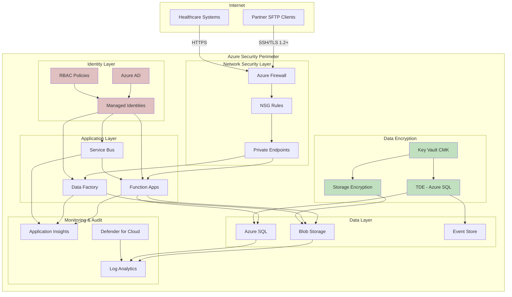
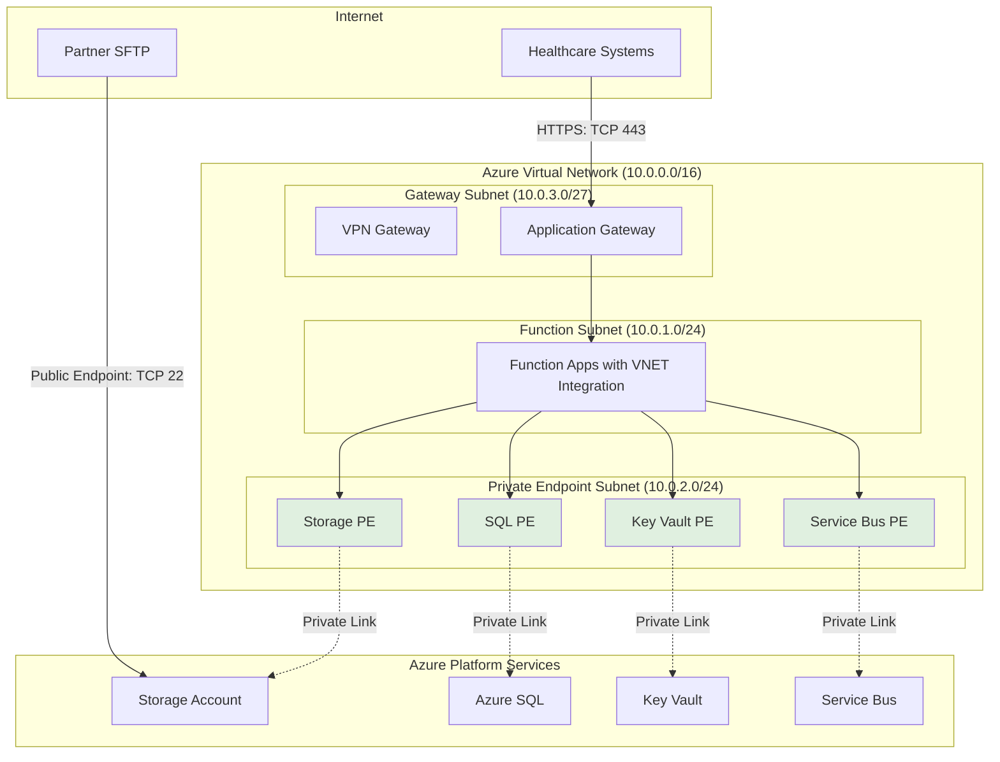
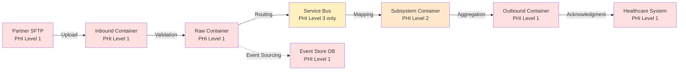
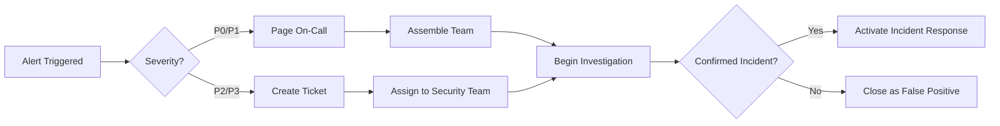
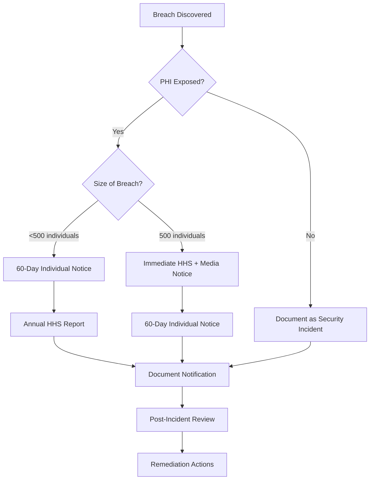
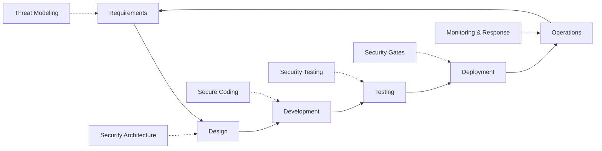
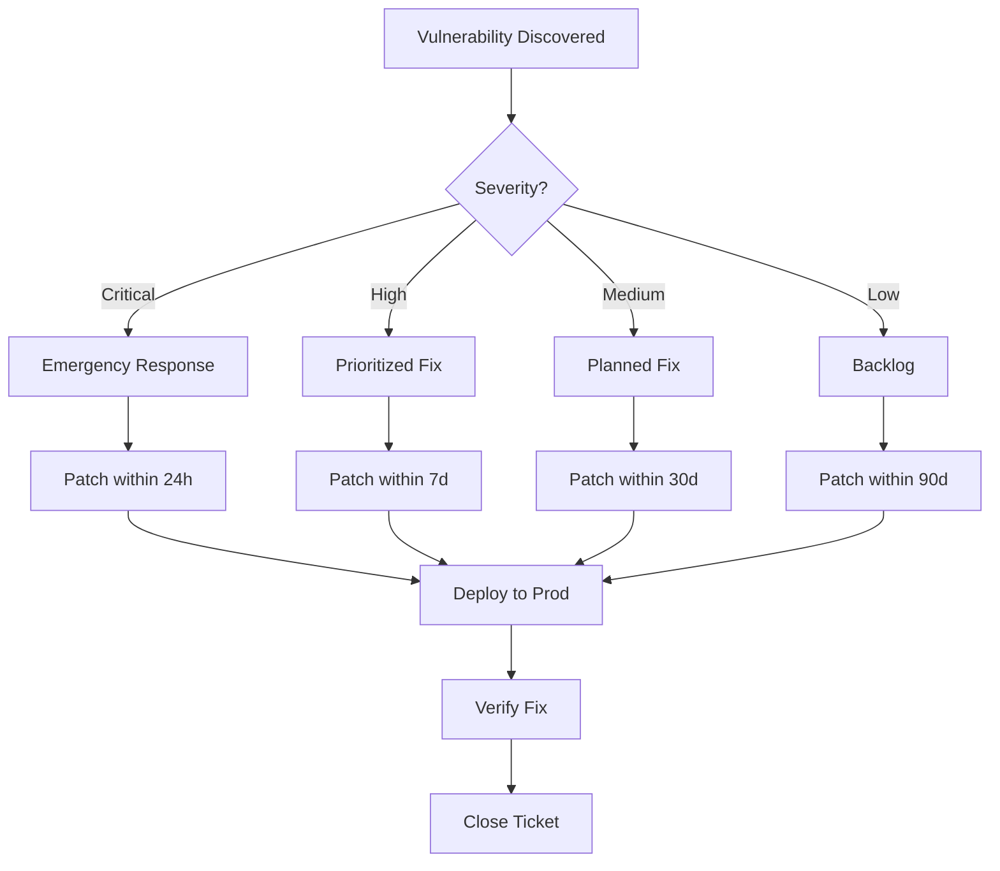

# Security & Compliance - EDI Platform

## Table of Contents

1. [Overview](#1-overview)
2. [HIPAA Compliance Framework](#2-hipaa-compliance-framework)
3. [Encryption Strategy](#3-encryption-strategy)
4. [Identity & Access Management](#4-identity--access-management)
5. [Network Security](#5-network-security)
6. [Audit Logging & Monitoring](#6-audit-logging--monitoring)
7. [Data Protection & Privacy](#7-data-protection--privacy)
8. [Threat Protection](#8-threat-protection)
9. [Incident Response](#9-incident-response)
10. [Compliance Validation](#10-compliance-validation)
11. [Security Operations](#11-security-operations)
12. [Summary](#12-summary)

---

## 1. Overview

### 1.1 Purpose

This document defines the comprehensive security and compliance architecture for the EDI platform, ensuring protection of Protected Health Information (PHI) and compliance with HIPAA regulations.

**Document Scope:**
- HIPAA Security Rule compliance (Administrative, Physical, Technical safeguards)
- HIPAA Privacy Rule compliance (PHI access controls, minimum necessary)
- Encryption at rest and in transit
- Identity and access management (IAM)
- Network security and isolation
- Audit logging and monitoring
- Incident response procedures
- Compliance validation and testing

### 1.2 Security Architecture Overview



### 1.3 Security Principles

**Core Security Tenets:**

1. **Zero Trust Architecture**
   - Verify explicitly for every access request
   - Use least privilege access
   - Assume breach and minimize blast radius

2. **Defense in Depth**
   - Multiple layers of security controls
   - No single point of failure
   - Redundant security mechanisms

3. **Secure by Default**
   - Private endpoints preferred
   - Public access disabled unless required
   - Encryption enabled automatically

4. **Least Privilege**
   - Minimal permissions for each identity
   - Scoped access to specific resources
   - Time-bound elevated access

5. **Immutable Audit Trail**
   - Comprehensive logging
   - Tamper-proof audit records
   - Long-term retention (7+ years)

6. **Secrets Never in Code**
   - Key Vault for all secrets
   - Managed identities preferred
   - No credentials in source control

### 1.4 Regulatory Requirements

**HIPAA Security Rule Compliance:**

| Safeguard Category | Requirement | Implementation Status |
|--------------------|-------------|---------------------|
| **Administrative** | Security Management Process | ✅ Implemented |
| **Administrative** | Assigned Security Responsibility | ✅ Security team designated |
| **Administrative** | Workforce Security | ✅ RBAC + training |
| **Administrative** | Information Access Management | ✅ Least privilege IAM |
| **Administrative** | Security Awareness & Training | ✅ Quarterly training |
| **Administrative** | Security Incident Procedures | ✅ Incident response plan |
| **Administrative** | Contingency Plan | ✅ DR/BC documented |
| **Administrative** | Business Associate Agreements | ✅ Microsoft BAA signed |
| **Physical** | Facility Access Controls | ✅ Azure datacenter security |
| **Physical** | Workstation Security | ✅ Corporate policies |
| **Physical** | Device & Media Controls | ✅ Azure managed storage |
| **Technical** | Access Control | ✅ RBAC + managed identities |
| **Technical** | Audit Controls | ✅ Log Analytics + 7yr retention |
| **Technical** | Integrity Controls | ✅ TDE + checksums |
| **Technical** | Transmission Security | ✅ TLS 1.2+ + SSH |

**Cost Impact:**
- Security services: $300-600/month
- Defender for Cloud: $15/resource/month × 20 resources = $300/month
- Log Analytics retention: Included in monitoring budget
- Key Vault Premium: $25/month (if using HSM-backed keys)

---

## 2. HIPAA Compliance Framework

### 2.1 HIPAA Security Rule - Technical Safeguards

**§164.312(a)(1) Access Control**

**Implementation:**

```bicep
// RBAC role assignment for Function App to Storage
resource storageRoleAssignment 'Microsoft.Authorization/roleAssignments@2022-04-01' = {
  name: guid(functionApp.id, storageBlobDataContributor, storageAccount.id)
  scope: storageAccount
  properties: {
    roleDefinitionId: subscriptionResourceId('Microsoft.Authorization/roleDefinitions', '...')
    principalId: functionApp.identity.principalId
    principalType: 'ServicePrincipal'
  }
}

// Conditional access based on resource tags
resource denyPublicAccess 'Microsoft.Authorization/policyAssignments@2022-06-01' = {
  name: 'deny-public-access-phi-storage'
  properties: {
    policyDefinitionId: '/providers/Microsoft.Authorization/policyDefinitions/...'
    parameters: {
      effect: {
        value: 'Deny'
      }
      tagName: {
        value: 'DataClassification'
      }
      tagValue: {
        value: 'PHI'
      }
    }
  }
}
```

**Controls:**
- ✅ Unique user identification: Managed identities per Function App
- ✅ Emergency access procedure: Break-glass admin accounts with MFA
- ✅ Automatic logoff: Session timeouts on Azure Portal (30 minutes)
- ✅ Encryption: TLS 1.2+ for transmission, AES-256 for storage

**§164.312(b) Audit Controls**

**Implementation:**

```bicep
// Enable auditing on Azure SQL
resource sqlAuditingSettings 'Microsoft.Sql/servers/auditingSettings@2023-05-01-preview' = {
  parent: sqlServer
  name: 'default'
  properties: {
    state: 'Enabled'
    isAzureMonitorTargetEnabled: true
    retentionDays: 2555  // 7 years for HIPAA compliance
    auditActionsAndGroups: [
      'BATCH_COMPLETED_GROUP'
      'SUCCESSFUL_DATABASE_AUTHENTICATION_GROUP'
      'FAILED_DATABASE_AUTHENTICATION_GROUP'
      'DATABASE_OBJECT_CHANGE_GROUP'
      'DATABASE_OBJECT_OWNERSHIP_CHANGE_GROUP'
      'DATABASE_OBJECT_PERMISSION_CHANGE_GROUP'
      'DATABASE_PERMISSION_CHANGE_GROUP'
      'DATABASE_PRINCIPAL_CHANGE_GROUP'
      'DATABASE_ROLE_MEMBER_CHANGE_GROUP'
      'SCHEMA_OBJECT_ACCESS_GROUP'
      'SCHEMA_OBJECT_CHANGE_GROUP'
      'SCHEMA_OBJECT_OWNERSHIP_CHANGE_GROUP'
      'SCHEMA_OBJECT_PERMISSION_CHANGE_GROUP'
    ]
  }
}

// Storage account diagnostic settings
resource storageDiagnostics 'Microsoft.Insights/diagnosticSettings@2021-05-01-preview' = {
  name: 'storage-audit-logs'
  scope: storageAccount
  properties: {
    workspaceId: logAnalyticsWorkspace.id
    logs: [
      {
        category: 'StorageRead'
        enabled: true
        retentionPolicy: {
          enabled: true
          days: 2555  // 7 years
        }
      }
      {
        category: 'StorageWrite'
        enabled: true
        retentionPolicy: {
          enabled: true
          days: 2555
        }
      }
      {
        category: 'StorageDelete'
        enabled: true
        retentionPolicy: {
          enabled: true
          days: 2555
        }
      }
    ]
  }
}
```

**Audit Log Retention:**

| Resource Type | Log Category | Retention Period | Storage Location |
|--------------|--------------|------------------|------------------|
| Azure SQL | Authentication, Access, Changes | 7 years (2,555 days) | Log Analytics Workspace |
| Blob Storage | Read, Write, Delete operations | 7 years | Log Analytics Workspace |
| Key Vault | Secret access, key operations | 7 years | Log Analytics Workspace |
| Function Apps | Invocations, errors, traces | 90 days (active), 7 years (archive) | App Insights + Blob Archive |
| Service Bus | Message operations, failures | 90 days | Log Analytics Workspace |
| Data Factory | Pipeline runs, activity logs | 120 days | Log Analytics Workspace |

**§164.312(c)(1) Integrity**

**Implementation:**

```sql
-- Event Store - Append-only pattern with hash chain
CREATE TABLE DomainEvent (
    EventId UNIQUEIDENTIFIER PRIMARY KEY DEFAULT NEWSEQUENTIALID(),
    EventSequence BIGINT NOT NULL UNIQUE,
    EventType VARCHAR(100) NOT NULL,
    AggregateId UNIQUEIDENTIFIER NOT NULL,
    EventData NVARCHAR(MAX) NOT NULL,
    EventHash AS HASHBYTES('SHA2_256', CONCAT(EventSequence, EventType, AggregateId, EventData)) PERSISTED,
    PreviousEventHash VARBINARY(32),
    CreatedAt DATETIME2(3) NOT NULL DEFAULT SYSUTCDATETIME(),
    CreatedBy VARCHAR(100) NOT NULL DEFAULT SYSTEM_USER
);

-- Hash chain validation stored procedure
CREATE PROCEDURE usp_ValidateEventHashChain
AS
BEGIN
    WITH EventChain AS (
        SELECT 
            EventSequence,
            EventHash,
            PreviousEventHash,
            LAG(EventHash) OVER (ORDER BY EventSequence) AS ExpectedPreviousHash
        FROM DomainEvent
    )
    SELECT 
        EventSequence,
        CASE 
            WHEN PreviousEventHash = ExpectedPreviousHash THEN 'Valid'
            WHEN EventSequence = 1 AND PreviousEventHash IS NULL THEN 'Valid'
            ELSE 'INTEGRITY_VIOLATION'
        END AS IntegrityStatus
    FROM EventChain
    WHERE PreviousEventHash != ExpectedPreviousHash OR ExpectedPreviousHash IS NULL;
END;
```

**Controls:**
- ✅ Append-only event store with hash chain validation
- ✅ Transparent Data Encryption (TDE) on Azure SQL
- ✅ Immutable blob storage policies for raw files
- ✅ Checksum validation on file uploads
- ✅ Digital signatures on outbound acknowledgments

**§164.312(d) Person or Entity Authentication**

**Implementation:**

| Authentication Method | Use Case | Implementation |
|----------------------|----------|----------------|
| **Managed Identity (System-Assigned)** | Function Apps, Data Factory, SQL Server | Azure AD authentication, no credentials stored |
| **SSH Public Key** | Partner SFTP access | 4096-bit RSA keys, password auth disabled |
| **Azure AD MFA** | Administrative access | Required for all human users |
| **Service Principal (CI/CD only)** | GitHub Actions deployment | Federated credentials, no secrets |

**C# Code - Managed Identity Authentication:**

```csharp
using Azure.Identity;
using Azure.Storage.Blobs;
using Azure.Security.KeyVault.Secrets;
using Microsoft.Data.SqlClient;

public class ManagedIdentityAuth
{
    private readonly DefaultAzureCredential _credential;
    
    public ManagedIdentityAuth()
    {
        // Uses managed identity in Azure, developer credential locally
        _credential = new DefaultAzureCredential();
    }
    
    // Blob Storage authentication
    public BlobServiceClient GetBlobServiceClient(string storageAccountName)
    {
        var blobUri = new Uri($"https://{storageAccountName}.blob.core.windows.net");
        return new BlobServiceClient(blobUri, _credential);
    }
    
    // Key Vault authentication
    public SecretClient GetSecretClient(string keyVaultName)
    {
        var keyVaultUri = new Uri($"https://{keyVaultName}.vault.azure.net");
        return new SecretClient(keyVaultUri, _credential);
    }
    
    // Azure SQL authentication
    public async Task<SqlConnection> GetSqlConnectionAsync(string serverName, string databaseName)
    {
        var connectionString = $"Server={serverName}.database.windows.net;Database={databaseName};";
        var connection = new SqlConnection(connectionString);
        
        // Get access token using managed identity
        var tokenRequestContext = new TokenRequestContext(new[] { "https://database.windows.net/.default" });
        var token = await _credential.GetTokenAsync(tokenRequestContext, default);
        
        connection.AccessToken = token.Token;
        await connection.OpenAsync();
        
        return connection;
    }
}
```

**§164.312(e)(1) Transmission Security**

**Implementation:**

```bicep
// Enforce TLS 1.2 minimum on Storage Account
resource storageAccount 'Microsoft.Storage/storageAccounts@2023-01-01' = {
  name: storageAccountName
  location: location
  kind: 'StorageV2'
  sku: {
    name: 'Standard_GRS'
  }
  properties: {
    minimumTlsVersion: 'TLS1_2'
    supportsHttpsTrafficOnly: true
    allowBlobPublicAccess: false
    publicNetworkAccess: 'Disabled'  // Private endpoints only
    encryption: {
      requireInfrastructureEncryption: true
      services: {
        blob: {
          enabled: true
          keyType: 'Account'
        }
        file: {
          enabled: true
          keyType: 'Account'
        }
      }
      keySource: 'Microsoft.Keyvault'
      keyvaultproperties: {
        keyname: keyName
        keyvaulturi: keyVault.properties.vaultUri
      }
    }
  }
}

// SFTP configuration with SSH key-only auth
resource sftpLocalUser 'Microsoft.Storage/storageAccounts/localUsers@2023-01-01' = {
  parent: storageAccount
  name: 'partner-${partnerCode}'
  properties: {
    permissionScopes: [
      {
        permissions: 'rcw'  // Read, Create, Write
        service: 'blob'
        resourceName: 'inbound'
      }
    ]
    homeDirectory: 'inbound/${partnerCode}'
    sshAuthorizedKeys: [
      {
        description: 'Partner ${partnerCode} SSH public key'
        key: partnerSshPublicKey
      }
    ]
    hasSharedKey: false  // Disable password auth
    hasSshKey: true
    hasSshPassword: false
  }
}
```

**Transmission Security Controls:**
- ✅ TLS 1.2+ for all HTTPS communications
- ✅ SSH public key authentication for SFTP (no passwords)
- ✅ Certificate pinning for critical endpoints
- ✅ Azure Front Door with WAF (if public endpoints needed)
- ✅ VPN or ExpressRoute for hybrid connectivity

### 2.2 HIPAA Privacy Rule - PHI Protection

**Minimum Necessary Standard (§164.502(b))**

**Implementation Strategy:**

```csharp
// Data minimization in routing messages
public class RoutingMessageBuilder
{
    // Only include envelope identifiers, no PHI
    public RoutingMessage BuildRoutingMessage(X12Transaction transaction)
    {
        return new RoutingMessage
        {
            CorrelationId = transaction.CorrelationId,
            PartnerCode = transaction.PartnerCode,
            TransactionType = transaction.TransactionSetIdentifier,
            ControlNumber = transaction.TransactionSetControlNumber,
            FileSize = transaction.FileSize,
            ReceivedAt = transaction.ReceivedAt,
            // PHI fields explicitly excluded:
            // - No member names, SSNs, DOBs
            // - No claim details, diagnosis codes
            // - No provider information
            RoutingDestination = DetermineDestination(transaction.PartnerCode, transaction.TransactionType)
        };
    }
}

// RBAC scoping - storage container level access
public class StorageAccessPolicy
{
    public static async Task AssignContainerScopedAccessAsync(
        string identityPrincipalId,
        string storageAccountName,
        string containerName,
        string roleDefinitionId)
    {
        var containerScope = $"/subscriptions/{subscriptionId}/resourceGroups/{resourceGroup}/providers/Microsoft.Storage/storageAccounts/{storageAccountName}/blobServices/default/containers/{containerName}";
        
        var roleAssignment = new RoleAssignment
        {
            PrincipalId = identityPrincipalId,
            RoleDefinitionId = roleDefinitionId,
            Scope = containerScope  // Container-level, not account-level
        };
        
        await CreateRoleAssignmentAsync(roleAssignment);
    }
}
```

**PHI Access Matrix:**

| Identity | Storage Containers | Azure SQL Databases | Service Bus Topics | Justification |
|----------|-------------------|---------------------|-------------------|---------------|
| SFTP Connector Function | `inbound/{partnerCode}` | SFTP Tracking (write-only) | None | File ingestion only |
| Validation Function | `inbound`, `raw`, `quarantine` | Event Store (write), Control Numbers (read) | None | Transaction validation |
| Router Function | `raw` (read-only) | None | `transactions` (send) | Routing decisions |
| 834 Mapper Function | `raw` (read), `subsystem-834` (write) | Event Store (read/write) | `transactions` (receive) | 834 processing |
| 270 Mapper Function | `raw` (read), `subsystem-270` (write) | Event Store (read/write) | `transactions` (receive) | 270 processing |
| Outbound Orchestrator | `subsystem-*` (read), `outbound` (write) | Control Numbers (read/write) | `outbound-ready` (receive) | ACK assembly |
| Operations Team | `quarantine` (read-only) | All databases (read-only) | None (view metrics) | Troubleshooting |

**Notice of Privacy Practices (§164.520)**

- Microsoft BAA covers Azure services as Business Associate
- Partner agreements include PHI handling provisions
- Internal privacy notices for workforce members

**Breach Notification (§164.408)**

**Breach Detection Mechanisms:**

```kusto
// Unauthorized access detection query
AzureDiagnostics
| where ResourceType == "STORAGEACCOUNTS"
| where Category == "StorageRead" or Category == "StorageWrite"
| where ResultType != "Success"
| where OperationName in ("GetBlob", "PutBlob", "DeleteBlob")
| extend CallerIdentity = tostring(parse_json(properties_s).callerIdentity)
| where CallerIdentity !startswith "func-edi-"  // Not a known Function App
| summarize 
    UnauthorizedAttempts = count(),
    FirstAttempt = min(TimeGenerated),
    LastAttempt = max(TimeGenerated),
    UniqueIPs = dcount(CallerIPAddress)
    by CallerIdentity, CallerIPAddress, OperationName
| where UnauthorizedAttempts > 5
| order by UnauthorizedAttempts desc
```

**Breach Response Timeline:**

1. **Detection** (immediate): Automated alerts from Defender for Cloud
2. **Assessment** (within 1 hour): Security team evaluates scope
3. **Containment** (within 4 hours): Disable compromised identities, rotate keys
4. **Notification** (within 60 days): Legal/compliance team manages notifications per §164.408
5. **Remediation** (within 30 days): Implement additional controls
6. **Post-Incident Review** (within 60 days): Update security posture

---

## 3. Encryption Strategy

### 3.1 Encryption at Rest

**Azure SQL Database - Transparent Data Encryption (TDE)**

**Service-Managed Keys (Default):**

```bicep
resource sqlServer 'Microsoft.Sql/servers@2023-05-01-preview' = {
  name: sqlServerName
  location: location
  identity: {
    type: 'SystemAssigned'
  }
  properties: {
    administratorLogin: adminUsername
    administratorLoginPassword: adminPassword
    version: '12.0'
    minimalTlsVersion: '1.2'
  }
}

// TDE with service-managed key (default)
resource tdeServiceManaged 'Microsoft.Sql/servers/encryptionProtector@2023-05-01-preview' = {
  parent: sqlServer
  name: 'current'
  properties: {
    serverKeyType: 'ServiceManaged'
    serverKeyName: 'ServiceManaged'
  }
}

// Verify TDE is enabled on all databases
resource tdeDatabase 'Microsoft.Sql/servers/databases/transparentDataEncryption@2023-05-01-preview' = [for db in databases: {
  name: '${sqlServer.name}/${db.name}/current'
  properties: {
    state: 'Enabled'
  }
}]
```

**Customer-Managed Keys (CMK) with Key Vault:**

```bicep
// Key Vault with Premium SKU for HSM-backed keys
resource keyVault 'Microsoft.KeyVault/vaults@2023-07-01' = {
  name: keyVaultName
  location: location
  properties: {
    sku: {
      family: 'A'
      name: 'premium'  // HSM-backed keys
    }
    tenantId: tenant().tenantId
    enableSoftDelete: true
    enablePurgeProtection: true
    enableRbacAuthorization: true
  }
}

// Encryption key for SQL TDE
resource tdeKey 'Microsoft.KeyVault/vaults/keys@2023-07-01' = {
  parent: keyVault
  name: 'key-sql-tde'
  properties: {
    kty: 'RSA-HSM'  // HSM-backed key
    keySize: 4096
    keyOps: [
      'encrypt'
      'decrypt'
      'wrapKey'
      'unwrapKey'
    ]
    rotationPolicy: {
      lifetimeActions: [
        {
          trigger: {
            timeBeforeExpiry: 'P30D'  // Rotate 30 days before expiry
          }
          action: {
            type: 'Rotate'
          }
        }
      ]
      attributes: {
        expiryTime: 'P1Y'  // 1-year key lifetime
      }
    }
  }
}

// Grant SQL Server access to Key Vault key
resource keyVaultAccessPolicy 'Microsoft.Authorization/roleAssignments@2022-04-01' = {
  name: guid(sqlServer.id, 'Key Vault Crypto Service Encryption User', keyVault.id)
  scope: keyVault
  properties: {
    roleDefinitionId: subscriptionResourceId('Microsoft.Authorization/roleDefinitions', 'e147488a-f6f5-4113-8e2d-b22465e65bf6')  // Key Vault Crypto Service Encryption User
    principalId: sqlServer.identity.principalId
    principalType: 'ServicePrincipal'
  }
}

// TDE with customer-managed key
resource tdeCmk 'Microsoft.Sql/servers/keys@2023-05-01-preview' = {
  parent: sqlServer
  name: '${keyVault.name}_${tdeKey.name}_${tdeKey.properties.keyUriWithVersion}'
  properties: {
    serverKeyType: 'AzureKeyVault'
    uri: tdeKey.properties.keyUriWithVersion
  }
  dependsOn: [
    keyVaultAccessPolicy
  ]
}

resource tdeEncryptionProtector 'Microsoft.Sql/servers/encryptionProtector@2023-05-01-preview' = {
  parent: sqlServer
  name: 'current'
  properties: {
    serverKeyType: 'AzureKeyVault'
    serverKeyName: tdeCmk.name
    autoRotationEnabled: true
  }
  dependsOn: [
    tdeCmk
  ]
}
```

**Blob Storage Encryption:**

```bicep
// Storage account with customer-managed key
resource storageAccount 'Microsoft.Storage/storageAccounts@2023-01-01' = {
  name: storageAccountName
  location: location
  kind: 'StorageV2'
  sku: {
    name: 'Standard_GRS'
  }
  identity: {
    type: 'SystemAssigned'
  }
  properties: {
    minimumTlsVersion: 'TLS1_2'
    supportsHttpsTrafficOnly: true
    allowBlobPublicAccess: false
    encryption: {
      requireInfrastructureEncryption: true  // Double encryption
      services: {
        blob: {
          enabled: true
          keyType: 'Account'
        }
        file: {
          enabled: true
          keyType: 'Account'
        }
      }
      keySource: 'Microsoft.Keyvault'
      keyvaultproperties: {
        keyname: storageEncryptionKey.name
        keyvaulturi: keyVault.properties.vaultUri
      }
      identity: {
        userAssignedIdentity: null  // Use system-assigned identity
      }
    }
  }
}

// Encryption key for storage
resource storageEncryptionKey 'Microsoft.KeyVault/vaults/keys@2023-07-01' = {
  parent: keyVault
  name: 'key-storage-encryption'
  properties: {
    kty: 'RSA-HSM'
    keySize: 4096
    keyOps: [
      'encrypt'
      'decrypt'
      'wrapKey'
      'unwrapKey'
    ]
    rotationPolicy: {
      lifetimeActions: [
        {
          trigger: {
            timeBeforeExpiry: 'P30D'
          }
          action: {
            type: 'Rotate'
          }
        }
      ]
      attributes: {
        expiryTime: 'P1Y'
      }
    }
  }
}

// Grant storage account access to Key Vault
resource storageKeyVaultAccess 'Microsoft.Authorization/roleAssignments@2022-04-01' = {
  name: guid(storageAccount.id, 'Key Vault Crypto Service Encryption User', keyVault.id)
  scope: keyVault
  properties: {
    roleDefinitionId: subscriptionResourceId('Microsoft.Authorization/roleDefinitions', 'e147488a-f6f5-4113-8e2d-b22465e65bf6')
    principalId: storageAccount.identity.principalId
    principalType: 'ServicePrincipal'
  }
}
```

**Encryption Key Rotation Schedule:**

| Key Type | Rotation Frequency | Automation | Grace Period |
|----------|-------------------|------------|--------------|
| SQL TDE (Service-Managed) | Automatic (Microsoft-managed) | Fully automatic | N/A |
| SQL TDE (CMK) | Annual | Azure Key Vault auto-rotation | 30 days |
| Storage (CMK) | Annual | Azure Key Vault auto-rotation | 30 days |
| SFTP SSH Keys (Partner) | Quarterly (90 days) | Manual (partner submits new key) | 7 days overlap |
| Service Bus SAS Tokens | Not used (managed identity) | N/A | N/A |

**Encryption Verification Query:**

```sql
-- Verify TDE is enabled on all databases
SELECT 
    d.name AS DatabaseName,
    e.encryption_state,
    CASE e.encryption_state
        WHEN 0 THEN 'No database encryption key present'
        WHEN 1 THEN 'Unencrypted'
        WHEN 2 THEN 'Encryption in progress'
        WHEN 3 THEN 'Encrypted'
        WHEN 4 THEN 'Key change in progress'
        WHEN 5 THEN 'Decryption in progress'
        WHEN 6 THEN 'Protection change in progress'
    END AS EncryptionStatus,
    e.encryptor_type,
    e.encryptor_thumbprint,
    e.percent_complete
FROM sys.databases d
LEFT JOIN sys.dm_database_encryption_keys e ON d.database_id = e.database_id
WHERE d.name IN ('ControlNumbers', 'EventStore', 'SftpTracking')
ORDER BY d.name;
```

### 3.2 Encryption in Transit

**TLS Configuration:**

```bicep
// Function App - TLS 1.2 minimum
resource functionApp 'Microsoft.Web/sites@2023-01-01' = {
  name: functionAppName
  location: location
  kind: 'functionapp'
  properties: {
    siteConfig: {
      minTlsVersion: '1.2'
      ftpsState: 'Disabled'  // No FTP/FTPS
      http20Enabled: true
      alwaysOn: true
      scmMinTlsVersion: '1.2'
    }
    httpsOnly: true  // Redirect HTTP to HTTPS
    clientCertEnabled: false  // Can enable for mutual TLS
  }
}

// API Management (if used for partner APIs)
resource apim 'Microsoft.ApiManagement/service@2023-05-01' = {
  name: apimName
  location: location
  sku: {
    name: 'Developer'
    capacity: 1
  }
  properties: {
    customProperties: {
      'Microsoft.WindowsAzure.ApiManagement.Gateway.Security.Protocols.Tls10': 'False'
      'Microsoft.WindowsAzure.ApiManagement.Gateway.Security.Protocols.Tls11': 'False'
      'Microsoft.WindowsAzure.ApiManagement.Gateway.Security.Protocols.Ssl30': 'False'
      'Microsoft.WindowsAzure.ApiManagement.Gateway.Security.Backend.Protocols.Tls10': 'False'
      'Microsoft.WindowsAzure.ApiManagement.Gateway.Security.Backend.Protocols.Tls11': 'False'
      'Microsoft.WindowsAzure.ApiManagement.Gateway.Security.Backend.Protocols.Ssl30': 'False'
      'Microsoft.WindowsAzure.ApiManagement.Gateway.Protocols.Server.Http2': 'True'
    }
  }
}
```

**Certificate Management:**

```csharp
// Custom SSL certificate validation for partner endpoints
public class PartnerHttpClient
{
    private readonly HttpClient _httpClient;
    
    public PartnerHttpClient(string partnerCode, string expectedThumbprint)
    {
        var handler = new HttpClientHandler();
        
        // Certificate pinning for critical partners
        handler.ServerCertificateCustomValidationCallback = (message, cert, chain, errors) =>
        {
            if (errors == SslPolicyErrors.None)
                return true;
            
            // Verify certificate thumbprint matches expected
            if (cert.Thumbprint.Equals(expectedThumbprint, StringComparison.OrdinalIgnoreCase))
            {
                return true;
            }
            
            // Log certificate validation failure
            Logger.LogWarning($"Certificate validation failed for {partnerCode}: {errors}");
            return false;
        };
        
        _httpClient = new HttpClient(handler)
        {
            Timeout = TimeSpan.FromSeconds(30)
        };
    }
    
    public async Task<HttpResponseMessage> PostAsync(string url, HttpContent content)
    {
        return await _httpClient.PostAsync(url, content);
    }
}
```

**Encryption Summary:**

| Communication Path | Protocol | Encryption Strength | Certificate Authority |
|-------------------|----------|---------------------|---------------------|
| Partner → SFTP | SSH | RSA 4096-bit | Partner-provided public keys |
| Partner → HTTPS API | TLS 1.2+ | AES-256-GCM | DigiCert (Azure managed) |
| Function App → Storage | HTTPS | TLS 1.2+ AES-256 | Azure internal |
| Function App → SQL | TDS over TLS | TLS 1.2+ AES-256 | Azure internal |
| Function App → Service Bus | AMQP over TLS | TLS 1.2+ AES-256 | Azure internal |
| Function App → Key Vault | HTTPS | TLS 1.2+ AES-256 | Azure internal |
| Internal (VNET) | All protocols | TLS 1.2+ | Azure internal |

---

**Document Status:** Part 1 Complete (Overview, HIPAA Compliance, Encryption)  
**Lines:** ~800  
**Next Section:** Identity & Access Management (IAM)

## 4. Identity & Access Management

### 4.1 Managed Identity Architecture

**System-Assigned vs User-Assigned Identities:**

| Resource | Identity Type | Rationale |
|----------|--------------|-----------|
| Function Apps | System-Assigned | Lifecycle tied to resource, simpler RBAC |
| Data Factory | System-Assigned | Single identity per instance |
| SQL Server | System-Assigned | Required for TDE with CMK |
| Storage Account | System-Assigned | Required for CMK encryption |
| Deployment (GitHub Actions) | Federated Identity (User-Assigned) | Reusable across environments |

**Bicep Implementation:**

```bicep
// Function App with managed identity
resource functionApp 'Microsoft.Web/sites@2023-01-01' = {
  name: functionAppName
  location: location
  kind: 'functionapp'
  identity: {
    type: 'SystemAssigned'
  }
  properties: {
    serverFarmId: appServicePlan.id
    siteConfig: {
      appSettings: [
        {
          name: 'AzureWebJobsStorage__accountName'
          value: storageAccount.name
        }
        {
          name: 'FUNCTIONS_EXTENSION_VERSION'
          value: '~4'
        }
        {
          name: 'FUNCTIONS_WORKER_RUNTIME'
          value: 'dotnet-isolated'
        }
      ]
    }
  }
}

// Grant Function App access to Storage (container-scoped)
resource storageRoleAssignment 'Microsoft.Authorization/roleAssignments@2022-04-01' = {
  name: guid(functionApp.id, 'Storage Blob Data Contributor', storageAccount.id, 'inbound')
  scope: storageAccount::blobService::inboundContainer
  properties: {
    roleDefinitionId: subscriptionResourceId('Microsoft.Authorization/roleDefinitions', 'ba92f5b4-2d11-453d-a403-e96b0029c9fe')
    principalId: functionApp.identity.principalId
    principalType: 'ServicePrincipal'
  }
}

// Grant Function App access to Key Vault secrets
resource keyVaultRoleAssignment 'Microsoft.Authorization/roleAssignments@2022-04-01' = {
  name: guid(functionApp.id, 'Key Vault Secrets User', keyVault.id)
  scope: keyVault
  properties: {
    roleDefinitionId: subscriptionResourceId('Microsoft.Authorization/roleDefinitions', '4633458b-17de-408a-b874-0445c86b69e6')
    principalId: functionApp.identity.principalId
    principalType: 'ServicePrincipal'
  }
}

// Grant Function App access to SQL Database (Azure AD auth)
resource sqlAadAdmin 'Microsoft.Sql/servers/administrators@2023-05-01-preview' = {
  parent: sqlServer
  name: 'ActiveDirectory'
  properties: {
    administratorType: 'ActiveDirectory'
    login: functionApp.name
    sid: functionApp.identity.principalId
    tenantId: tenant().tenantId
  }
}
```

**SQL Database Access Configuration:**

```sql
-- Create contained database user for Function App managed identity
CREATE USER [func-edi-processing-prod] FROM EXTERNAL PROVIDER;

-- Grant minimal permissions
ALTER ROLE db_datareader ADD MEMBER [func-edi-processing-prod];
ALTER ROLE db_datawriter ADD MEMBER [func-edi-processing-prod];

-- Grant execute on specific stored procedures only
GRANT EXECUTE ON usp_GetNextControlNumber TO [func-edi-processing-prod];
GRANT EXECUTE ON usp_AppendEvent TO [func-edi-processing-prod];
GRANT EXECUTE ON usp_GetEventStream TO [func-edi-processing-prod];

-- Deny access to administrative procedures
DENY EXECUTE ON usp_ValidateEventHashChain TO [func-edi-processing-prod];
DENY ALTER ANY USER TO [func-edi-processing-prod];
```

### 4.2 Role-Based Access Control (RBAC)

**Azure Built-In Roles Used:**

| Role | Resource Scope | Assignee | Permissions |
|------|---------------|----------|-------------|
| **Storage Blob Data Reader** | Container: `raw`, `quarantine` | Router Function | Read blobs only |
| **Storage Blob Data Contributor** | Container: `inbound`, `raw`, `quarantine` | Validation Function | Read, write, delete blobs |
| **Storage Blob Data Contributor** | Container: `subsystem-834`, `subsystem-270` | Mapper Functions | Read, write processed data |
| **Storage Blob Data Contributor** | Container: `outbound` | Outbound Orchestrator | Write acknowledgments |
| **Key Vault Secrets User** | Key Vault: `kv-edi-prod` | All Function Apps | Read secrets (no list/write) |
| **Key Vault Crypto Service Encryption User** | Key Vault: `kv-edi-prod` | SQL Server, Storage Account | Encrypt/decrypt with CMK |
| **Azure Service Bus Data Sender** | Topic: `transactions` | Router Function | Send messages |
| **Azure Service Bus Data Receiver** | Subscription: `834-processing` | 834 Mapper Function | Receive/complete messages |
| **Azure Service Bus Data Receiver** | Subscription: `270-processing` | 270 Mapper Function | Receive/complete messages |
| **SQL DB Contributor** | Elastic Pool: `pool-edi-prod` | Data Factory | Manage databases (deployment only) |
| **Reader** | Resource Group: `rg-edi-prod` | Operations Team | View resources, no changes |
| **Monitoring Reader** | Subscription | Security Team | Read metrics and logs |

**Custom RBAC Role - EDI Operations:**

```bicep
// Custom role for EDI operations team
resource ediOperationsRole 'Microsoft.Authorization/roleDefinitions@2022-04-01' = {
  name: guid(subscription().id, 'EDI-Operations-Role')
  properties: {
    roleName: 'EDI Operations Specialist'
    description: 'Read-only access to EDI platform resources with quarantine file access'
    type: 'CustomRole'
    assignableScopes: [
      resourceGroup().id
    ]
    permissions: [
      {
        actions: [
          'Microsoft.Storage/storageAccounts/blobServices/containers/blobs/read'
          'Microsoft.Insights/logs/read'
          'Microsoft.Insights/metrics/read'
          'Microsoft.Sql/servers/databases/query/action'
          'Microsoft.ServiceBus/namespaces/read'
          'Microsoft.ServiceBus/namespaces/topics/read'
          'Microsoft.ServiceBus/namespaces/topics/subscriptions/read'
        ]
        notActions: [
          'Microsoft.Storage/storageAccounts/blobServices/containers/blobs/write'
          'Microsoft.Storage/storageAccounts/blobServices/containers/blobs/delete'
          'Microsoft.Sql/servers/databases/write'
          'Microsoft.KeyVault/vaults/secrets/readMetadata/action'
        ]
        dataActions: [
          'Microsoft.Storage/storageAccounts/blobServices/containers/blobs/read'
        ]
        notDataActions: []
      }
    ]
  }
}

// Assign custom role to operations team
resource ediOpsRoleAssignment 'Microsoft.Authorization/roleAssignments@2022-04-01' = {
  name: guid(resourceGroup().id, ediOperationsTeamGroupId, ediOperationsRole.id)
  scope: resourceGroup()
  properties: {
    roleDefinitionId: ediOperationsRole.id
    principalId: ediOperationsTeamGroupId
    principalType: 'Group'
  }
}
```

**Privileged Identity Management (PIM):**

```powershell
# Enable PIM for sensitive roles
$eligibleRoles = @(
    @{
        RoleName = "Contributor"
        Scope = "/subscriptions/{subscriptionId}/resourceGroups/rg-edi-prod"
        Duration = "PT8H"  # 8-hour activation
        RequiresMFA = $true
        RequiresApproval = $true
        Approvers = @("security-team@company.com")
    },
    @{
        RoleName = "Key Vault Administrator"
        Scope = "/subscriptions/{subscriptionId}/resourceGroups/rg-edi-prod/providers/Microsoft.KeyVault/vaults/kv-edi-prod"
        Duration = "PT4H"  # 4-hour activation
        RequiresMFA = $true
        RequiresApproval = $true
        Approvers = @("security-team@company.com")
    }
)

foreach ($role in $eligibleRoles) {
    # Create eligible assignment (requires Azure AD Premium P2)
    New-AzRoleEligibilityScheduleRequest `
        -Name (New-Guid).Guid `
        -Scope $role.Scope `
        -PrincipalId $adminGroupId `
        -RoleDefinitionId (Get-AzRoleDefinition -Name $role.RoleName).Id `
        -RequestType "AdminAssign" `
        -ScheduleInfo @{
            StartDateTime = Get-Date
            Expiration = @{
                Type = "NoExpiration"
            }
        } `
        -Justification "PIM-managed access to EDI production resources"
}
```

### 4.3 Service Bus Authentication

**Managed Identity Authentication (C# Code):**

```csharp
using Azure.Identity;
using Azure.Messaging.ServiceBus;

public class ServiceBusPublisher
{
    private readonly ServiceBusClient _client;
    private readonly ServiceBusSender _sender;
    
    public ServiceBusPublisher(string serviceBusNamespace, string topicName)
    {
        // Use managed identity - no connection strings
        var credential = new DefaultAzureCredential();
        var fullyQualifiedNamespace = $"{serviceBusNamespace}.servicebus.windows.net";
        
        _client = new ServiceBusClient(fullyQualifiedNamespace, credential);
        _sender = _client.CreateSender(topicName);
    }
    
    public async Task PublishRoutingMessageAsync(RoutingMessage message)
    {
        var serviceBusMessage = new ServiceBusMessage(JsonSerializer.Serialize(message))
        {
            MessageId = message.CorrelationId,
            ContentType = "application/json",
            ApplicationProperties =
            {
                ["PartnerCode"] = message.PartnerCode,
                ["TransactionType"] = message.TransactionType,
                ["CorrelationId"] = message.CorrelationId
            }
        };
        
        await _sender.SendMessageAsync(serviceBusMessage);
    }
    
    public async ValueTask DisposeAsync()
    {
        await _sender.DisposeAsync();
        await _client.DisposeAsync();
    }
}
```

**Disable SAS Keys (Policy Enforcement):**

```bicep
// Azure Policy to deny Service Bus SAS key creation
resource denyServiceBusSasPolicy 'Microsoft.Authorization/policyAssignments@2022-06-01' = {
  name: 'deny-servicebus-sas-keys'
  properties: {
    policyDefinitionId: '/providers/Microsoft.Authorization/policyDefinitions/1c06e275-d63d-4540-b761-71f364c2111d'
    displayName: 'Service Bus namespaces should not use SAS authentication'
    description: 'Enforce managed identity authentication for Service Bus'
    enforcementMode: 'Default'
    parameters: {}
  }
  scope: resourceGroup()
}
```

### 4.4 Partner SFTP Authentication

**SSH Key Management:**

```bicep
// SFTP local user with SSH key authentication
resource sftpLocalUser 'Microsoft.Storage/storageAccounts/localUsers@2023-01-01' = {
  parent: storageAccount
  name: 'partner-${partnerCode}'
  properties: {
    permissionScopes: [
      {
        permissions: 'rcw'  // Read, Create, Write (no Delete)
        service: 'blob'
        resourceName: 'inbound'
      }
    ]
    homeDirectory: 'inbound/${partnerCode}'
    sshAuthorizedKeys: [
      {
        description: 'Primary SSH key - ${partnerCode}'
        key: partnerPrimarySshKey
      }
      {
        description: 'Secondary SSH key - ${partnerCode} (rotation)'
        key: partnerSecondarySshKey
      }
    ]
    hasSharedKey: false  // Disable password authentication
    hasSshKey: true
    hasSshPassword: false
    allowAclAuthorization: false
  }
}

// Optional: IP allowlist for partner
resource sftpFirewallRule 'Microsoft.Storage/storageAccounts/firewallRules@2023-01-01' = if (!empty(partnerIpRanges)) {
  parent: storageAccount
  name: 'allow-partner-${partnerCode}'
  properties: {
    ipAddressOrRange: partnerIpRanges[0]
    action: 'Allow'
  }
}
```

**Partner SSH Key Rotation Process:**

```powershell
# PowerShell script for partner SSH key rotation
param(
    [Parameter(Mandatory=$true)]
    [string]$PartnerCode,
    
    [Parameter(Mandatory=$true)]
    [string]$NewPublicKeyPath,
    
    [string]$StorageAccountName = "stediprodinbound",
    [string]$ResourceGroup = "rg-edi-prod"
)

# 1. Validate new public key format
$newKey = Get-Content -Path $NewPublicKeyPath
if ($newKey -notmatch '^ssh-rsa AAAA[0-9A-Za-z+/]+[=]{0,3}( .*)?$') {
    throw "Invalid SSH public key format"
}

# 2. Get current user configuration
$currentUser = Get-AzStorageLocalUser `
    -ResourceGroupName $ResourceGroup `
    -StorageAccountName $StorageAccountName `
    -Name "partner-$PartnerCode"

# 3. Add new key as secondary (allow overlap period)
$currentUser.SshAuthorizedKeys += @{
    Description = "New key - $(Get-Date -Format 'yyyy-MM-dd')"
    Key = $newKey
}

Update-AzStorageLocalUser `
    -ResourceGroupName $ResourceGroup `
    -StorageAccountName $StorageAccountName `
    -Name "partner-$PartnerCode" `
    -SshAuthorizedKey $currentUser.SshAuthorizedKeys

Write-Host "New SSH key added for partner $PartnerCode. Old key still active for 7-day grace period."

# 4. Schedule removal of old key after 7 days
$removalDate = (Get-Date).AddDays(7)
Write-Host "Old SSH key will be removed on $removalDate"

# Create Azure Automation runbook job (if automated)
# ...
```

### 4.5 Break-Glass Emergency Access

**Emergency Admin Account Configuration:**

```bicep
// Emergency admin account (used only for disaster recovery)
resource breakGlassAccount 'Microsoft.Sql/servers/administrators@2023-05-01-preview' = {
  parent: sqlServer
  name: 'ActiveDirectory'
  properties: {
    administratorType: 'ActiveDirectory'
    login: 'break-glass-admin@company.onmicrosoft.com'
    sid: breakGlassAdminObjectId
    tenantId: tenant().tenantId
  }
}

// Conditional access policy - require MFA and named location
resource breakGlassConditionalAccess 'Microsoft.Authorization/policyAssignments@2022-06-01' = {
  name: 'break-glass-conditional-access'
  properties: {
    displayName: 'Break-Glass Account Conditional Access'
    description: 'Require MFA and corporate network for emergency admin access'
    policyDefinitionId: '/providers/Microsoft.Authorization/policyDefinitions/...'
    parameters: {
      requiredLocations: {
        value: ['Corporate-Network', 'Azure-Cloud-Shell']
      }
      requireMFA: {
        value: true
      }
    }
  }
}
```

**Emergency Access Procedure:**

1. **Request**: Submit ticket with CISO approval required
2. **Activation**: Activate PIM role (max 4-hour duration)
3. **MFA**: Complete MFA challenge from approved location
4. **Logging**: All actions logged to Security Event Log
5. **Monitoring**: Real-time alert to security team
6. **Review**: Mandatory post-incident review within 24 hours
7. **Deactivation**: Automatic role deactivation after 4 hours

---

## 5. Network Security

### 5.1 Virtual Network Architecture

**Network Topology:**



**VNET Configuration:**

```bicep
// Virtual Network
resource vnet 'Microsoft.Network/virtualNetworks@2023-05-01' = {
  name: 'vnet-edi-prod'
  location: location
  properties: {
    addressSpace: {
      addressPrefixes: [
        '10.0.0.0/16'
      ]
    }
    subnets: [
      {
        name: 'snet-functions'
        properties: {
          addressPrefix: '10.0.1.0/24'
          delegations: [
            {
              name: 'delegation-functions'
              properties: {
                serviceName: 'Microsoft.Web/serverFarms'
              }
            }
          ]
          serviceEndpoints: []
          privateEndpointNetworkPolicies: 'Disabled'
        }
      }
      {
        name: 'snet-private-endpoints'
        properties: {
          addressPrefix: '10.0.2.0/24'
          privateEndpointNetworkPolicies: 'Disabled'
          privateLinkServiceNetworkPolicies: 'Enabled'
        }
      }
      {
        name: 'AzureBastionSubnet'
        properties: {
          addressPrefix: '10.0.3.0/27'
        }
      }
    ]
    enableDdosProtection: false  // Standard tier (platform-level)
  }
}

// Network Security Group for Function subnet
resource nsgFunctions 'Microsoft.Network/networkSecurityGroups@2023-05-01' = {
  name: 'nsg-functions'
  location: location
  properties: {
    securityRules: [
      {
        name: 'AllowAzureLoadBalancerInbound'
        properties: {
          protocol: '*'
          sourcePortRange: '*'
          destinationPortRange: '*'
          sourceAddressPrefix: 'AzureLoadBalancer'
          destinationAddressPrefix: '*'
          access: 'Allow'
          priority: 100
          direction: 'Inbound'
        }
      }
      {
        name: 'AllowVnetOutbound'
        properties: {
          protocol: '*'
          sourcePortRange: '*'
          destinationPortRange: '*'
          sourceAddressPrefix: 'VirtualNetwork'
          destinationAddressPrefix: 'VirtualNetwork'
          access: 'Allow'
          priority: 200
          direction: 'Outbound'
        }
      }
      {
        name: 'AllowInternetOutbound'
        properties: {
          protocol: 'Tcp'
          sourcePortRange: '*'
          destinationPortRanges: [
            '443'  // HTTPS only
            '445'  // Azure Files (if needed)
          ]
          sourceAddressPrefix: '*'
          destinationAddressPrefix: 'Internet'
          access: 'Allow'
          priority: 300
          direction: 'Outbound'
        }
      }
      {
        name: 'DenyAllInbound'
        properties: {
          protocol: '*'
          sourcePortRange: '*'
          destinationPortRange: '*'
          sourceAddressPrefix: '*'
          destinationAddressPrefix: '*'
          access: 'Deny'
          priority: 4096
          direction: 'Inbound'
        }
      }
    ]
  }
}

// Associate NSG with subnet
resource subnetNsgAssociation 'Microsoft.Network/virtualNetworks/subnets@2023-05-01' = {
  parent: vnet
  name: 'snet-functions'
  properties: {
    addressPrefix: '10.0.1.0/24'
    networkSecurityGroup: {
      id: nsgFunctions.id
    }
    delegations: [
      {
        name: 'delegation-functions'
        properties: {
          serviceName: 'Microsoft.Web/serverFarms'
        }
      }
    ]
  }
}
```

### 5.2 Private Endpoints

**Storage Account Private Endpoint:**

```bicep
// Private endpoint for Blob storage
resource storagePrivateEndpoint 'Microsoft.Network/privateEndpoints@2023-05-01' = {
  name: 'pe-storage-blob'
  location: location
  properties: {
    subnet: {
      id: vnet::privateEndpointSubnet.id
    }
    privateLinkServiceConnections: [
      {
        name: 'pe-connection-blob'
        properties: {
          privateLinkServiceId: storageAccount.id
          groupIds: [
            'blob'
          ]
        }
      }
    ]
  }
}

// Private DNS Zone for Blob storage
resource blobPrivateDnsZone 'Microsoft.Network/privateDnsZones@2020-06-01' = {
  name: 'privatelink.blob.core.windows.net'
  location: 'global'
}

// Link Private DNS Zone to VNET
resource blobDnsZoneLink 'Microsoft.Network/privateDnsZones/virtualNetworkLinks@2020-06-01' = {
  parent: blobPrivateDnsZone
  name: 'vnet-link-blob'
  location: 'global'
  properties: {
    registrationEnabled: false
    virtualNetwork: {
      id: vnet.id
    }
  }
}

// DNS Zone Group for automatic DNS record creation
resource blobDnsZoneGroup 'Microsoft.Network/privateEndpoints/privateDnsZoneGroups@2023-05-01' = {
  parent: storagePrivateEndpoint
  name: 'default'
  properties: {
    privateDnsZoneConfigs: [
      {
        name: 'config1'
        properties: {
          privateDnsZoneId: blobPrivateDnsZone.id
        }
      }
    ]
  }
}

// Disable public network access on storage account
resource storageAccount 'Microsoft.Storage/storageAccounts@2023-01-01' = {
  name: storageAccountName
  location: location
  properties: {
    publicNetworkAccess: 'Disabled'  // Private endpoints only
    networkAcls: {
      bypass: 'AzureServices'
      defaultAction: 'Deny'
      ipRules: []  // No public IP access
      virtualNetworkRules: []
    }
  }
}
```

**Azure SQL Private Endpoint:**

```bicep
// Private endpoint for Azure SQL
resource sqlPrivateEndpoint 'Microsoft.Network/privateEndpoints@2023-05-01' = {
  name: 'pe-sql'
  location: location
  properties: {
    subnet: {
      id: vnet::privateEndpointSubnet.id
    }
    privateLinkServiceConnections: [
      {
        name: 'pe-connection-sql'
        properties: {
          privateLinkServiceId: sqlServer.id
          groupIds: [
            'sqlServer'
          ]
        }
      }
    ]
  }
}

// Private DNS Zone for SQL
resource sqlPrivateDnsZone 'Microsoft.Network/privateDnsZones@2020-06-01' = {
  name: 'privatelink.database.windows.net'
  location: 'global'
}

resource sqlDnsZoneLink 'Microsoft.Network/privateDnsZones/virtualNetworkLinks@2020-06-01' = {
  parent: sqlPrivateDnsZone
  name: 'vnet-link-sql'
  location: 'global'
  properties: {
    registrationEnabled: false
    virtualNetwork: {
      id: vnet.id
    }
  }
}

resource sqlDnsZoneGroup 'Microsoft.Network/privateEndpoints/privateDnsZoneGroups@2023-05-01' = {
  parent: sqlPrivateEndpoint
  name: 'default'
  properties: {
    privateDnsZoneConfigs: [
      {
        name: 'config1'
        properties: {
          privateDnsZoneId: sqlPrivateDnsZone.id
        }
      }
    ]
  }
}

// Disable public network access on SQL Server
resource sqlServer 'Microsoft.Sql/servers@2023-05-01-preview' = {
  name: sqlServerName
  location: location
  properties: {
    publicNetworkAccess: 'Disabled'  // Private endpoints only
    restrictOutboundNetworkAccess: 'Enabled'
  }
}
```

### 5.3 Function App VNET Integration

**Regional VNET Integration:**

```bicep
// App Service Plan with VNET integration capability
resource appServicePlan 'Microsoft.Web/serverfarms@2023-01-01' = {
  name: 'plan-edi-prod'
  location: location
  sku: {
    name: 'EP2'  // Premium plan required for VNET integration
    tier: 'ElasticPremium'
    capacity: 3
  }
  properties: {
    reserved: false
  }
}

// Function App with VNET integration
resource functionApp 'Microsoft.Web/sites@2023-01-01' = {
  name: functionAppName
  location: location
  kind: 'functionapp'
  properties: {
    serverFarmId: appServicePlan.id
    virtualNetworkSubnetId: vnet::functionSubnet.id
    vnetRouteAllEnabled: true  // Route all outbound traffic through VNET
    vnetContentShareEnabled: false  // Use private endpoint for storage instead
    siteConfig: {
      functionsRuntimeScaleMonitoringEnabled: true
      vnetRouteAllEnabled: true
    }
  }
}

// VNET integration configuration
resource vnetIntegration 'Microsoft.Web/sites/networkConfig@2023-01-01' = {
  parent: functionApp
  name: 'virtualNetwork'
  properties: {
    subnetResourceId: vnet::functionSubnet.id
    swiftSupported: true
  }
}
```

### 5.4 Firewall Rules & IP Restrictions

**Storage Account IP Restrictions (SFTP):**

```bicep
// Storage account with IP restrictions for SFTP
resource storageAccountSftp 'Microsoft.Storage/storageAccounts@2023-01-01' = {
  name: 'stediprodinbound'
  location: location
  properties: {
    publicNetworkAccess: 'Enabled'  // Required for SFTP
    isSftpEnabled: true
    networkAcls: {
      bypass: 'None'  // Strict IP filtering
      defaultAction: 'Deny'
      ipRules: [
        {
          value: '203.0.113.10'  // Partner A IP
          action: 'Allow'
        }
        {
          value: '203.0.113.20'  // Partner B IP
          action: 'Allow'
        }
        {
          value: '198.51.100.0/24'  // Partner C IP range
          action: 'Allow'
        }
      ]
      virtualNetworkRules: [
        {
          id: vnet::functionSubnet.id
          action: 'Allow'
        }
      ]
    }
  }
}
```

**Service Bus Network Security:**

```bicep
// Service Bus with private endpoint and IP filtering
resource serviceBusNamespace 'Microsoft.ServiceBus/namespaces@2022-10-01-preview' = {
  name: 'sb-edi-prod'
  location: location
  sku: {
    name: 'Premium'
    tier: 'Premium'
    capacity: 1
  }
  properties: {
    publicNetworkAccess: 'Disabled'  // Private endpoints only
    minimumTlsVersion: '1.2'
    disableLocalAuth: true  // Disable SAS keys, managed identity only
  }
}

// Service Bus private endpoint
resource serviceBusPrivateEndpoint 'Microsoft.Network/privateEndpoints@2023-05-01' = {
  name: 'pe-servicebus'
  location: location
  properties: {
    subnet: {
      id: vnet::privateEndpointSubnet.id
    }
    privateLinkServiceConnections: [
      {
        name: 'pe-connection-servicebus'
        properties: {
          privateLinkServiceId: serviceBusNamespace.id
          groupIds: [
            'namespace'
          ]
        }
      }
    ]
  }
}
```

**Network Security Summary:**

| Resource | Public Access | Private Endpoint | VNET Integration | IP Restrictions |
|----------|--------------|------------------|------------------|----------------|
| Storage (SFTP) | Enabled (port 22) | No | No | Partner IPs only |
| Storage (Internal) | Disabled | Yes | N/A | None (PE only) |
| Azure SQL | Disabled | Yes | N/A | None (PE only) |
| Key Vault | Disabled | Yes | N/A | None (PE only) |
| Service Bus | Disabled | Yes | N/A | None (PE only) |
| Function Apps | Enabled (HTTPS) | N/A | Yes (outbound) | Azure services only |
| Application Insights | Enabled | No | N/A | None (global service) |

---

## 6. Audit Logging & Monitoring

### 6.1 Centralized Logging Architecture

**Log Analytics Workspace Configuration:**

```bicep
// Log Analytics Workspace with 7-year retention for compliance
resource logAnalyticsWorkspace 'Microsoft.OperationalInsights/workspaces@2022-10-01' = {
  name: 'log-edi-prod'
  location: location
  properties: {
    sku: {
      name: 'PerGB2018'
    }
    retentionInDays: 2555  // 7 years for HIPAA compliance
    publicNetworkAccessForIngestion: 'Enabled'
    publicNetworkAccessForQuery: 'Enabled'
    features: {
      enableLogAccessUsingOnlyResourcePermissions: true
    }
  }
}

// Data retention policy with immutability
resource dataRetentionPolicy 'Microsoft.OperationalInsights/workspaces/dataExports@2020-08-01' = {
  parent: logAnalyticsWorkspace
  name: 'archive-to-storage'
  properties: {
    dataExportId: guid(logAnalyticsWorkspace.id, 'export-archive')
    destination: {
      resourceId: archiveStorageAccount.id
      metaData: {
        eventHubName: 'null'
      }
    }
    tableNames: [
      'AzureDiagnostics'
      'AuditLogs'
      'SignInLogs'
      'SecurityEvent'
    ]
    enable: true
  }
}

// Archive storage account with immutability
resource archiveStorageAccount 'Microsoft.Storage/storageAccounts@2023-01-01' = {
  name: 'stediarchiveprod'
  location: location
  kind: 'StorageV2'
  sku: {
    name: 'Standard_GRS'
  }
  properties: {
    accessTier: 'Cool'
    immutableStorageWithVersioning: {
      enabled: true
      immutabilityPolicy: {
        immutabilityPeriodSinceCreationInDays: 2555
        state: 'Locked'
        allowProtectedAppendWrites: true
      }
    }
  }
}
```

### 6.2 Diagnostic Settings for All Resources

**Bicep Module for Diagnostic Settings:**

```bicep
// Reusable diagnostic settings module
@description('Resource ID to configure diagnostics for')
param resourceId string

@description('Log Analytics Workspace ID')
param workspaceId string

@description('Log categories to enable')
param logCategories array = []

@description('Metric categories to enable')
param enableMetrics bool = true

resource diagnosticSettings 'Microsoft.Insights/diagnosticSettings@2021-05-01-preview' = {
  name: 'diagnostics-${uniqueString(resourceId)}'
  scope: any(resourceId)
  properties: {
    workspaceId: workspaceId
    logs: [for category in logCategories: {
      category: category
      enabled: true
      retentionPolicy: {
        enabled: false
        days: 0  // Retention managed by workspace
      }
    }]
    logAnalyticsDestinationType: 'Dedicated'
    metrics: enableMetrics ? [
      {
        category: 'AllMetrics'
        enabled: true
        retentionPolicy: {
          enabled: false
          days: 0
        }
      }
    ] : []
  }
}
```

**Apply Diagnostic Settings to All Resources:**

```bicep
// Storage Account diagnostics
module storageDiagnostics './diagnostic-settings.bicep' = {
  name: 'storage-diagnostics'
  params: {
    resourceId: storageAccount.id
    workspaceId: logAnalyticsWorkspace.id
    logCategories: [
      'StorageRead'
      'StorageWrite'
      'StorageDelete'
    ]
    enableMetrics: true
  }
}

// SQL Server diagnostics
module sqlDiagnostics './diagnostic-settings.bicep' = {
  name: 'sql-diagnostics'
  params: {
    resourceId: sqlServer.id
    workspaceId: logAnalyticsWorkspace.id
    logCategories: [
      'SQLSecurityAuditEvents'
      'DevOpsOperationsAudit'
      'SQLInsights'
    ]
    enableMetrics: true
  }
}

// Key Vault diagnostics
module keyVaultDiagnostics './diagnostic-settings.bicep' = {
  name: 'keyvault-diagnostics'
  params: {
    resourceId: keyVault.id
    workspaceId: logAnalyticsWorkspace.id
    logCategories: [
      'AuditEvent'
      'AzurePolicyEvaluationDetails'
    ]
    enableMetrics: true
  }
}

// Service Bus diagnostics
module serviceBusDiagnostics './diagnostic-settings.bicep' = {
  name: 'servicebus-diagnostics'
  params: {
    resourceId: serviceBusNamespace.id
    workspaceId: logAnalyticsWorkspace.id
    logCategories: [
      'OperationalLogs'
      'VNetAndIPFilteringLogs'
      'RuntimeAuditLogs'
    ]
    enableMetrics: true
  }
}

// Function App diagnostics
module functionDiagnostics './diagnostic-settings.bicep' = {
  name: 'function-diagnostics'
  params: {
    resourceId: functionApp.id
    workspaceId: logAnalyticsWorkspace.id
    logCategories: [
      'FunctionAppLogs'
      'AppServiceHTTPLogs'
      'AppServiceConsoleLogs'
      'AppServiceAuditLogs'
    ]
    enableMetrics: true
  }
}
```

### 6.3 Security Audit Log Queries

**Query 1: Unauthorized Access Attempts**

```kusto
// Detect failed authentication attempts
AzureDiagnostics
| where ResourceProvider in ("MICROSOFT.STORAGE", "MICROSOFT.SQL", "MICROSOFT.KEYVAULT")
| where ResultType != "Success" or httpStatusCode_d >= 400
| where OperationName in (
    "GetBlob", "PutBlob", "ListBlobs",  // Storage
    "Login", "Connect",  // SQL
    "SecretGet", "KeyGet"  // Key Vault
)
| extend 
    ResourceType = ResourceProvider,
    Identity = coalesce(identity_claim_upn_s, properties_s.callerIdentity, "Unknown"),
    ClientIP = CallerIPAddress,
    ErrorCode = ResultType
| summarize 
    FailedAttempts = count(),
    FirstSeen = min(TimeGenerated),
    LastSeen = max(TimeGenerated),
    UniqueIPs = dcount(ClientIP),
    OperationsAttempted = make_set(OperationName)
    by Identity, ResourceType
| where FailedAttempts > 5
| order by FailedAttempts desc
```

**Query 2: Privilege Escalation Detection**

```kusto
// Detect role assignment changes
AzureDiagnostics
| where OperationName in (
    "Microsoft.Authorization/roleAssignments/write",
    "Microsoft.Authorization/roleDefinitions/write"
)
| extend
    Actor = identity_claim_upn_s,
    TargetPrincipal = properties_s.principalId,
    RoleAssigned = properties_s.roleDefinitionId
| project
    TimeGenerated,
    Actor,
    TargetPrincipal,
    RoleAssigned,
    OperationName,
    ResultType,
    CallerIPAddress
| order by TimeGenerated desc
```

**Query 3: Data Exfiltration Detection**

```kusto
// Detect large data downloads from storage
StorageBlobLogs
| where OperationName == "GetBlob"
| where StatusCode == 200
| extend DownloadSizeMB = todouble(ResponseBodySize) / 1024 / 1024
| summarize
    TotalDownloadMB = sum(DownloadSizeMB),
    FileCount = count(),
    UniqueContainers = dcount(Uri)
    by CallerIpAddress, AccountName, bin(TimeGenerated, 1h)
| where TotalDownloadMB > 1000  // Alert on >1GB downloads per hour
| order by TotalDownloadMB desc
```

**Query 4: Secret Access Monitoring**

```kusto
// Monitor Key Vault secret access patterns
AzureDiagnostics
| where ResourceProvider == "MICROSOFT.KEYVAULT"
| where OperationName == "SecretGet"
| extend
    SecretName = extractjson("$.secretName", properties_s),
    Identity = identity_claim_upn_s
| summarize
    AccessCount = count(),
    FirstAccess = min(TimeGenerated),
    LastAccess = max(TimeGenerated)
    by Identity, SecretName, CallerIPAddress
| where AccessCount > 100  // Alert on excessive secret access
| order by AccessCount desc
```

**Query 5: PHI Data Access Audit**

```kusto
// Audit access to containers with PHI data
StorageBlobLogs
| where AccountName == "stediprodraw"
| where OperationName in ("GetBlob", "ListBlobs", "CopyBlob")
| extend
    ContainerName = extract(@"https://[^/]+/([^/]+)", 1, Uri),
    FileName = extract(@"https://[^/]+/[^/]+/(.*)", 1, Uri),
    Identity = RequesterUpn
| where ContainerName in ("raw", "subsystem-834", "subsystem-270", "subsystem-837")
| summarize
    AccessCount = count(),
    FileTypes = make_set(extract(@"\.([^\.]+)$", 1, FileName)),
    FirstAccess = min(TimeGenerated),
    LastAccess = max(TimeGenerated)
    by Identity, ContainerName, CallerIpAddress
| project
    Identity,
    ContainerName,
    AccessCount,
    FileTypes,
    FirstAccess,
    LastAccess,
    CallerIpAddress
| order by AccessCount desc
```

### 6.4 Compliance Reporting

**Monthly HIPAA Compliance Report:**

```kusto
// Generate monthly compliance metrics
let startDate = startofmonth(now());
let endDate = endofmonth(now());

// 1. Authentication events
let authEvents = AzureDiagnostics
| where TimeGenerated between (startDate .. endDate)
| where OperationName contains "Login" or OperationName contains "Auth"
| summarize
    TotalAuthAttempts = count(),
    SuccessfulAuths = countif(ResultType == "Success"),
    FailedAuths = countif(ResultType != "Success")
| extend AuthSuccessRate = round(100.0 * SuccessfulAuths / TotalAuthAttempts, 2);

// 2. Data access events
let dataAccess = StorageBlobLogs
| where TimeGenerated between (startDate .. endDate)
| where OperationName in ("GetBlob", "PutBlob", "DeleteBlob")
| summarize
    TotalAccess = count(),
    AuthorizedAccess = countif(StatusCode == 200),
    UnauthorizedAccess = countif(StatusCode in (401, 403))
| extend AccessComplianceRate = round(100.0 * AuthorizedAccess / TotalAccess, 2);

// 3. Encryption status
let encryptionStatus = AzureDiagnostics
| where ResourceProvider == "MICROSOFT.SQL"
| where OperationName == "EncryptionProtectorGet"
| summarize
    DatabasesChecked = dcount(Resource),
    TdeEnabled = dcountif(Resource, properties_s contains '"state":"Enabled"');

// 4. Audit log retention
let logRetention = Usage
| where TimeGenerated between (startDate .. endDate)
| where DataType == "AzureDiagnostics"
| summarize
    TotalLogVolumeMB = sum(Quantity),
    OldestLogDate = min(TimeGenerated),
    RetentionDays = datetime_diff('day', now(), min(TimeGenerated));

// Combine all metrics
authEvents
| extend AuthSection = "Authentication"
| union (dataAccess | extend DataSection = "Data Access")
| union (encryptionStatus | extend EncryptionSection = "Encryption")
| union (logRetention | extend LogSection = "Audit Logs")
```

---

**Document Status:** Part 2 Complete (Identity & Access Management, Network Security, Audit Logging)  
**Lines:** ~1,600 total  
**Next Section:** Data Protection & Privacy, Threat Protection, Incident Response, Compliance Validation


## 7. Data Protection & Privacy

### 7.1 Data Classification

**PHI Data Classification Framework:**

| Classification | Definition | Storage Locations | Retention | Access Control |
|----------------|------------|-------------------|-----------|----------------|
| **PHI - Level 1** | Direct identifiers (Name, SSN, DOB, Address) | Raw files (`raw` container), Event Store | 7 years | Function Apps only, RBAC-scoped |
| **PHI - Level 2** | Transaction data without direct identifiers | Subsystem containers (`subsystem-*`) | 7 years | Mapper Functions, RBAC-scoped |
| **PHI - Level 3** | Control numbers, metadata, routing info | Control Numbers DB, Service Bus messages | 7 years | All processing functions |
| **PII** | Partner contact information | Partner config files (`config/partners/`) | Indefinite | Deployment service principal |
| **Confidential** | SSH keys, connection strings, API keys | Key Vault secrets | 2 years + rotation | Function Apps (secrets user) |
| **Public** | EDI specification documents, schemas | Public documentation repository | Indefinite | Public (GitHub) |

**Data Flow with Classification:**



### 7.2 Data Lifecycle Management

**Blob Storage Lifecycle Policy:**

```bicep
// Lifecycle management policy for PHI data
resource lifecyclePolicy 'Microsoft.Storage/storageAccounts/managementPolicies@2023-01-01' = {
  parent: storageAccount
  name: 'default'
  properties: {
    policy: {
      rules: [
        {
          name: 'ArchiveRawFilesAfter90Days'
          enabled: true
          type: 'Lifecycle'
          definition: {
            filters: {
              blobTypes: ['blockBlob']
              prefixMatch: [
                'raw/'
                'subsystem-834/'
                'subsystem-270/'
                'subsystem-837/'
                'subsystem-835/'
              ]
            }
            actions: {
              baseBlob: {
                tierToCool: {
                  daysAfterModificationGreaterThan: 30
                }
                tierToArchive: {
                  daysAfterModificationGreaterThan: 90
                }
                delete: {
                  daysAfterModificationGreaterThan: 2555  // 7 years
                }
              }
              snapshot: {
                delete: {
                  daysAfterCreationGreaterThan: 90
                }
              }
            }
          }
        }
        {
          name: 'DeleteQuarantineAfter30Days'
          enabled: true
          type: 'Lifecycle'
          definition: {
            filters: {
              blobTypes: ['blockBlob']
              prefixMatch: ['quarantine/']
            }
            actions: {
              baseBlob: {
                delete: {
                  daysAfterModificationGreaterThan: 30
                }
              }
            }
          }
        }
        {
          name: 'ArchiveAuditLogsImmediately'
          enabled: true
          type: 'Lifecycle'
          definition: {
            filters: {
              blobTypes: ['appendBlob']
              prefixMatch: ['audit-logs/']
            }
            actions: {
              baseBlob: {
                tierToArchive: {
                  daysAfterModificationGreaterThan: 1
                }
                delete: {
                  daysAfterModificationGreaterThan: 2555  // 7 years
                }
              }
            }
          }
        }
      ]
    }
  }
}
```

### 7.3 Immutable Storage

**WORM (Write-Once-Read-Many) Configuration:**

```bicep
// Immutable storage for audit logs
resource auditLogContainer 'Microsoft.Storage/storageAccounts/blobServices/containers@2023-01-01' = {
  parent: storageAccount::blobService
  name: 'audit-logs'
  properties: {
    publicAccess: 'None'
    immutableStorageWithVersioning: {
      enabled: true
    }
  }
}

// Time-based retention policy (locked)
resource immutabilityPolicy 'Microsoft.Storage/storageAccounts/blobServices/containers/immutabilityPolicies@2023-01-01' = {
  parent: auditLogContainer
  name: 'default'
  properties: {
    immutabilityPeriodSinceCreationInDays: 2555  // 7 years
    allowProtectedAppendWrites: true  // Allow append-only operations
    allowProtectedAppendWritesAll: false  // No overwrites
  }
}

// Lock the policy (irreversible!)
resource lockImmutabilityPolicy 'Microsoft.Storage/storageAccounts/blobServices/containers/immutabilityPolicies@2023-01-01' = {
  parent: auditLogContainer
  name: 'default'
  properties: {
    immutabilityPeriodSinceCreationInDays: 2555
    state: 'Locked'  // Cannot be deleted or modified
  }
  dependsOn: [
    immutabilityPolicy
  ]
}
```

**Legal Hold for Investigations:**

```csharp
// Apply legal hold programmatically during investigations
public class LegalHoldManager
{
    private readonly BlobContainerClient _containerClient;
    
    public async Task ApplyLegalHoldAsync(string containerName, string holdTag)
    {
        var container = _blobServiceClient.GetBlobContainerClient(containerName);
        
        // Apply legal hold to all blobs in container
        await foreach (var blob in container.GetBlobsAsync())
        {
            var blobClient = container.GetBlobClient(blob.Name);
            await blobClient.SetLegalHoldAsync(hasLegalHold: true);
            
            // Tag for tracking
            await blobClient.SetTagsAsync(new Dictionary<string, string>
            {
                ["LegalHold"] = holdTag,
                ["HoldDate"] = DateTime.UtcNow.ToString("o"),
                ["CaseNumber"] = holdTag
            });
        }
        
        _logger.LogWarning($"Legal hold applied to container {containerName}: {holdTag}");
    }
    
    public async Task RemoveLegalHoldAsync(string containerName, string holdTag)
    {
        var container = _blobServiceClient.GetBlobContainerClient(containerName);
        
        // Remove legal hold after case closure
        await foreach (var blob in container.GetBlobsAsync(BlobTraits.Tags))
        {
            if (blob.Tags.TryGetValue("LegalHold", out var tag) && tag == holdTag)
            {
                var blobClient = container.GetBlobClient(blob.Name);
                await blobClient.SetLegalHoldAsync(hasLegalHold: false);
                
                _logger.LogInformation($"Legal hold removed from {blob.Name}");
            }
        }
    }
}
```

### 7.4 Data Minimization

**Minimum Necessary Implementation (C# Code):**

```csharp
// Routing message excludes PHI
public class RoutingMessageBuilder
{
    public RoutingMessage BuildFromTransaction(X12Transaction transaction)
    {
        return new RoutingMessage
        {
            // Required for routing (not PHI)
            CorrelationId = transaction.CorrelationId,
            PartnerCode = transaction.PartnerCode,
            TransactionType = transaction.TransactionSetIdentifier,
            ControlNumber = transaction.TransactionSetControlNumber,
            Direction = transaction.Direction,
            
            // Metadata only (not PHI)
            FileSize = transaction.FileSize,
            SegmentCount = transaction.SegmentCount,
            ReceivedAt = transaction.ReceivedAt,
            
            // NO PHI FIELDS:
            // - No member names, SSNs, DOBs
            // - No addresses, phone numbers
            // - No claim amounts or provider IDs
            // - No diagnosis codes or procedure codes
        };
    }
}

// Log sanitization - remove PHI from logs
public class PhiSanitizingLogger : ILogger
{
    private readonly ILogger _innerLogger;
    private static readonly Regex SsnRegex = new Regex(@"\b\d{3}-\d{2}-\d{4}\b");
    private static readonly Regex DobRegex = new Regex(@"\b\d{8}\b");  // YYYYMMDD
    
    public void Log<TState>(LogLevel logLevel, EventId eventId, TState state, 
        Exception exception, Func<TState, Exception, string> formatter)
    {
        var message = formatter(state, exception);
        
        // Redact potential PHI before logging
        message = SsnRegex.Replace(message, "***-**-****");
        message = DobRegex.Replace(message, "********");
        message = message.Replace("SSN", "[REDACTED]");
        message = message.Replace("DateOfBirth", "[REDACTED]");
        
        _innerLogger.Log(logLevel, eventId, message, exception, (s, e) => s);
    }
}
```

**Database Views for Minimum Necessary Access:**

```sql
-- View for operations team (no PHI)
CREATE VIEW vw_TransactionSummary
AS
SELECT
    t.CorrelationId,
    t.PartnerCode,
    t.TransactionType,
    t.ControlNumber,
    t.ReceivedAt,
    t.ProcessedAt,
    t.Status,
    t.ErrorCode,
    -- PHI fields excluded:
    -- No member names, SSNs, DOBs, addresses
    -- No claim details, provider info, diagnosis codes
    COUNT(e.EventId) AS EventCount,
    MAX(e.CreatedAt) AS LastEventAt
FROM Transaction t
LEFT JOIN DomainEvent e ON t.CorrelationId = e.AggregateId
GROUP BY 
    t.CorrelationId, t.PartnerCode, t.TransactionType, 
    t.ControlNumber, t.ReceivedAt, t.ProcessedAt, 
    t.Status, t.ErrorCode;

-- Grant view access to operations team
GRANT SELECT ON vw_TransactionSummary TO [operations-team-group];
DENY SELECT ON Transaction TO [operations-team-group];
DENY SELECT ON DomainEvent TO [operations-team-group];
```

### 7.5 Right to Erasure (GDPR/CCPA)

**Data Deletion Procedure:**

```csharp
public class DataErasureService
{
    private readonly BlobServiceClient _blobServiceClient;
    private readonly SqlConnection _sqlConnection;
    private readonly ILogger<DataErasureService> _logger;
    
    public async Task<DataErasureResult> ErasePatientDataAsync(
        string memberId, 
        string requestReason,
        string approverEmail)
    {
        var result = new DataErasureResult { MemberId = memberId };
        
        // 1. Identify all blobs containing member data
        var blobsToDelete = await FindBlobsByMemberIdAsync(memberId);
        result.BlobsFound = blobsToDelete.Count;
        
        // 2. Create audit record BEFORE deletion
        await CreateErasureAuditRecordAsync(memberId, blobsToDelete, requestReason, approverEmail);
        
        // 3. Delete blobs (only if not under legal hold)
        foreach (var blobUri in blobsToDelete)
        {
            var blobClient = new BlobClient(new Uri(blobUri), _credential);
            
            try
            {
                // Check for legal hold
                var properties = await blobClient.GetPropertiesAsync();
                if (properties.Value.HasLegalHold)
                {
                    result.BlobsSkipped++;
                    _logger.LogWarning($"Blob under legal hold, skipping: {blobUri}");
                    continue;
                }
                
                // Delete blob and all versions
                await blobClient.DeleteIfExistsAsync(DeleteSnapshotsOption.IncludeSnapshots);
                result.BlobsDeleted++;
            }
            catch (Exception ex)
            {
                result.Errors.Add($"Failed to delete {blobUri}: {ex.Message}");
            }
        }
        
        // 4. Redact database records (don't delete for audit trail)
        await RedactDatabaseRecordsAsync(memberId);
        
        // 5. Purge from backups (manual process, log for operations)
        _logger.LogWarning($"Member {memberId} data erasure complete. " +
                          $"MANUAL ACTION REQUIRED: Purge from backup systems.");
        
        return result;
    }
    
    private async Task RedactDatabaseRecordsAsync(string memberId)
    {
        // Replace PHI with placeholder values
        var sql = @"
            UPDATE Transaction
            SET 
                MemberName = '[REDACTED]',
                MemberSSN = '[REDACTED]',
                MemberDOB = NULL,
                MemberAddress = '[REDACTED]',
                RedactedAt = SYSUTCDATETIME(),
                RedactionReason = 'Right to Erasure Request'
            WHERE MemberId = @MemberId;
            
            -- Append erasure event to audit trail
            INSERT INTO DomainEvent (EventType, AggregateId, EventData)
            VALUES ('DataErased', @MemberId, JSON_OBJECT('Reason': 'Right to Erasure'));
        ";
        
        using var cmd = new SqlCommand(sql, _sqlConnection);
        cmd.Parameters.AddWithValue("@MemberId", memberId);
        await cmd.ExecuteNonQueryAsync();
    }
}
```

---

## 8. Threat Protection

### 8.1 Microsoft Defender for Cloud

**Defender for Cloud Configuration:**

```bicep
// Enable Defender for Cloud on subscription
resource defenderPlans 'Microsoft.Security/pricings@2023-01-01' = [for plan in [
  'VirtualMachines'
  'SqlServers'
  'AppServices'
  'StorageAccounts'
  'KeyVaults'
  'Arm'  // Azure Resource Manager
  'Dns'
  'OpenSourceRelationalDatabases'
]: {
  name: plan
  properties: {
    pricingTier: 'Standard'  // Enable Defender
  }
}]

// Security contact for alerts
resource securityContact 'Microsoft.Security/securityContacts@2020-01-01-preview' = {
  name: 'default'
  properties: {
    emails: 'security-team@company.com'
    alertNotifications: {
      state: 'On'
      minimalSeverity: 'Medium'
    }
    notificationsByRole: {
      state: 'On'
      roles: ['Owner', 'Contributor']
    }
  }
}

// Auto-provisioning for monitoring agent
resource autoProvisioning 'Microsoft.Security/autoProvisioningSettings@2017-08-01-preview' = {
  name: 'default'
  properties: {
    autoProvision: 'On'
  }
}
```

### 8.2 Defender for Storage

**Advanced Threat Protection:**

```bicep
// Defender for Storage with malware scanning
resource storageDefender 'Microsoft.Security/advancedThreatProtectionSettings@2019-01-01' = {
  name: 'current'
  scope: storageAccount
  properties: {
    isEnabled: true
  }
}

// Storage account configuration for Defender
resource storageAccount 'Microsoft.Storage/storageAccounts@2023-01-01' = {
  name: storageAccountName
  location: location
  properties: {
    // Enable Microsoft Defender for Storage features
    defenderForStorage: {
      enabled: true
      malwareScanning: {
        enabled: true
        maxFileSize: 5120  // 5 GB max scan size
      }
      sensitiveDataDiscovery: {
        enabled: true
      }
      activityMonitoring: {
        enabled: true
      }
    }
  }
}
```

**Malware Scanning Event Grid Subscription:**

```bicep
// React to malware detection events
resource malwareDetectionSubscription 'Microsoft.EventGrid/systemTopics/eventSubscriptions@2023-06-01-preview' = {
  parent: storageSystemTopic
  name: 'malware-detection'
  properties: {
    destination: {
      endpointType: 'StorageQueue'
      properties: {
        resourceId: quarantineStorageAccount.id
        queueName: 'malware-detected'
      }
    }
    filter: {
      includedEventTypes: [
        'Microsoft.Storage.BlobCreated'
      ]
      advancedFilters: [
        {
          operatorType: 'StringContains'
          key: 'data.contentType'
          values: ['application/octet-stream', 'text/plain']
        }
      ]
    }
  }
}
```

**Malware Response Function:**

```csharp
public class MalwareResponseFunction
{
    [Function("MalwareResponse")]
    public async Task Run(
        [QueueTrigger("malware-detected")] string message,
        FunctionContext context)
    {
        var logger = context.GetLogger<MalwareResponseFunction>();
        var malwareEvent = JsonSerializer.Deserialize<MalwareDetectionEvent>(message);
        
        logger.LogError($"MALWARE DETECTED: {malwareEvent.BlobUrl}");
        
        // 1. Quarantine the infected file
        var sourceBlobClient = new BlobClient(new Uri(malwareEvent.BlobUrl), _credential);
        var quarantineBlobClient = _quarantineContainer.GetBlobClient(
            $"malware/{DateTime.UtcNow:yyyy-MM-dd}/{Path.GetFileName(malwareEvent.BlobUrl)}");
        
        await quarantineBlobClient.StartCopyFromUriAsync(sourceBlobClient.Uri);
        await sourceBlobClient.DeleteAsync();
        
        // 2. Block partner temporarily
        await _partnerService.SuspendPartnerAsync(
            malwareEvent.PartnerCode, 
            "Malware detected in uploaded file");
        
        // 3. Alert security team
        await _alertService.SendCriticalAlertAsync(new SecurityAlert
        {
            Severity = "Critical",
            Title = "Malware Detected in SFTP Upload",
            Description = $"Malware found in file from partner {malwareEvent.PartnerCode}",
            BlobUrl = malwareEvent.BlobUrl,
            DetectedAt = DateTime.UtcNow,
            ActionTaken = "File quarantined, partner suspended"
        });
        
        // 4. Create security incident ticket
        await _incidentService.CreateIncidentAsync(new SecurityIncident
        {
            Type = "Malware Detection",
            Severity = "P1",
            Description = $"Malware detected in SFTP upload from {malwareEvent.PartnerCode}",
            AffectedResources = new[] { malwareEvent.BlobUrl },
            Status = "Open"
        });
    }
}
```

### 8.3 Defender for SQL

**SQL Vulnerability Assessment:**

```bicep
// Vulnerability assessment for Azure SQL
resource vulnerabilityAssessment 'Microsoft.Sql/servers/vulnerabilityAssessments@2023-05-01-preview' = {
  parent: sqlServer
  name: 'default'
  properties: {
    storageContainerPath: '${storageAccount.properties.primaryEndpoints.blob}vulnerability-assessment'
    recurringScans: {
      isEnabled: true
      emailSubscriptionAdmins: true
      emails: [
        'security-team@company.com'
        'dba-team@company.com'
      ]
    }
  }
  dependsOn: [
    securityAlertPolicy
  ]
}

// Advanced Data Security
resource securityAlertPolicy 'Microsoft.Sql/servers/securityAlertPolicies@2023-05-01-preview' = {
  parent: sqlServer
  name: 'default'
  properties: {
    state: 'Enabled'
    emailAccountAdmins: true
    emailAddresses: [
      'security-team@company.com'
    ]
    disabledAlerts: []  // Enable all alert types
    retentionDays: 90
  }
}

// Advanced Threat Protection alert rules
resource sqlAdvancedThreatProtection 'Microsoft.Sql/servers/advancedThreatProtectionSettings@2023-05-01-preview' = {
  parent: sqlServer
  name: 'default'
  properties: {
    state: 'Enabled'
  }
}
```

**SQL Threat Detection Alerts:**

- **SQL Injection:** Detects potential SQL injection attacks
- **Anomalous Client Login:** Unusual login patterns or locations
- **Access from Unusual Location:** Login from unfamiliar Azure datacenter
- **Brute Force:** Multiple failed login attempts
- **Data Exfiltration:** Large data export or copy operations

### 8.4 Security Alert Automation

**Log Analytics Alert Rules:**

```bicep
// Alert rule for brute force attacks
resource bruteForceAlert 'Microsoft.Insights/scheduledQueryRules@2023-03-15-preview' = {
  name: 'alert-brute-force-sql'
  location: location
  properties: {
    displayName: 'SQL Brute Force Attack Detection'
    description: 'Detects multiple failed SQL authentication attempts'
    severity: 1  // Critical
    enabled: true
    evaluationFrequency: 'PT5M'  // Every 5 minutes
    scopes: [
      logAnalyticsWorkspace.id
    ]
    windowSize: 'PT15M'  // 15-minute window
    criteria: {
      allOf: [
        {
          query: '''
            AzureDiagnostics
            | where ResourceProvider == "MICROSOFT.SQL"
            | where Category == "SQLSecurityAuditEvents"
            | where OperationName == "Login"
            | where ResultType == "Failed"
            | summarize FailedAttempts = count() by server_principal_name_s, client_ip_s
            | where FailedAttempts > 10
          '''
          timeAggregation: 'Count'
          operator: 'GreaterThan'
          threshold: 0
          failingPeriods: {
            numberOfEvaluationPeriods: 1
            minFailingPeriodsToAlert: 1
          }
        }
      ]
    }
    actions: {
      actionGroups: [
        actionGroup.id
      ]
      customProperties: {
        AlertType: 'BruteForce'
        Resource: 'Azure SQL'
      }
    }
  }
}

// Alert rule for data exfiltration
resource dataExfiltrationAlert 'Microsoft.Insights/scheduledQueryRules@2023-03-15-preview' = {
  name: 'alert-data-exfiltration'
  location: location
  properties: {
    displayName: 'Large Data Download Detected'
    description: 'Detects potential data exfiltration via large blob downloads'
    severity: 2  // High
    enabled: true
    evaluationFrequency: 'PT5M'
    scopes: [
      logAnalyticsWorkspace.id
    ]
    windowSize: 'PT1H'  // 1-hour window
    criteria: {
      allOf: [
        {
          query: '''
            StorageBlobLogs
            | where OperationName == "GetBlob"
            | where StatusCode == 200
            | extend DownloadSizeMB = todouble(ResponseBodySize) / 1024 / 1024
            | summarize TotalDownloadMB = sum(DownloadSizeMB) by CallerIpAddress, AccountName
            | where TotalDownloadMB > 1000
          '''
          timeAggregation: 'Count'
          operator: 'GreaterThan'
          threshold: 0
        }
      ]
    }
    actions: {
      actionGroups: [
        actionGroup.id
      ]
    }
  }
}

// Action group for security alerts
resource actionGroup 'Microsoft.Insights/actionGroups@2023-01-01' = {
  name: 'ag-security-alerts'
  location: 'global'
  properties: {
    groupShortName: 'SecAlerts'
    enabled: true
    emailReceivers: [
      {
        name: 'SecurityTeam'
        emailAddress: 'security-team@company.com'
        useCommonAlertSchema: true
      }
    ]
    smsReceivers: [
      {
        name: 'SecurityOncall'
        countryCode: '1'
        phoneNumber: '555-0100'
      }
    ]
    webhookReceivers: [
      {
        name: 'PagerDuty'
        serviceUri: 'https://events.pagerduty.com/integration/{key}/enqueue'
        useCommonAlertSchema: true
      }
    ]
  }
}
```

### 8.5 Network Security Monitoring

**NSG Flow Logs:**

```bicep
// Network Watcher for flow logs
resource networkWatcher 'Microsoft.Network/networkWatchers@2023-05-01' = {
  name: 'nw-${location}'
  location: location
}

// NSG flow logs to detect anomalous traffic
resource nsgFlowLogs 'Microsoft.Network/networkWatchers/flowLogs@2023-05-01' = {
  parent: networkWatcher
  name: 'fl-nsg-functions'
  location: location
  properties: {
    targetResourceId: nsgFunctions.id
    storageId: logStorageAccount.id
    enabled: true
    retentionPolicy: {
      days: 90
      enabled: true
    }
    format: {
      type: 'JSON'
      version: 2
    }
    flowAnalyticsConfiguration: {
      networkWatcherFlowAnalyticsConfiguration: {
        enabled: true
        workspaceResourceId: logAnalyticsWorkspace.id
        trafficAnalyticsInterval: 10  // 10-minute aggregation
      }
    }
  }
}
```

**Traffic Analytics Query:**

```kusto
// Detect connections to suspicious IPs
AzureNetworkAnalytics_CL
| where SubType_s == "FlowLog"
| where FlowType_s == "ExternalPublic"
| extend DestinationIP = DestIP_s
| join kind=inner (
    // Known malicious IPs (threat intelligence feed)
    externaldata(MaliciousIP: string) [
        @"https://threatintel.company.com/malicious-ips.csv"
    ] with (format="csv")
) on $left.DestinationIP == $right.MaliciousIP
| project
    TimeGenerated,
    SourceIP = SrcIP_s,
    DestinationIP,
    DestinationPort = DestPort_d,
    BytesTransferred = AllowedOutFlows_d,
    FlowDirection = FlowDirection_s
| order by TimeGenerated desc
```

---

## 9. Incident Response

### 9.1 Security Incident Classification

| Severity | Definition | Response Time | Escalation | Examples |
|----------|------------|---------------|------------|----------|
| **P0 - Critical** | Active breach, PHI exposure, ransomware | Immediate | CISO, Legal | Data exfiltration, malware in production |
| **P1 - High** | Potential breach, failed security controls | 1 hour | Security Manager | Brute force attack, vulnerability exploit |
| **P2 - Medium** | Security policy violation, suspicious activity | 4 hours | Security Team | Unauthorized access attempt, config drift |
| **P3 - Low** | Informational, compliance finding | 24 hours | DevOps Team | Missing patch, expired certificate |

### 9.2 Incident Response Procedures

**1. Detection & Triage (0-15 minutes):**



**Triage Checklist:**

```markdown
## Security Incident Triage
- [ ] Alert details captured (timestamp, resource, alert rule)
- [ ] Severity assessed (P0-P3)
- [ ] On-call notified (P0/P1 only)
- [ ] Initial logs collected (5-minute window around alert)
- [ ] Affected resources identified (storage accounts, databases, functions)
- [ ] PHI exposure risk assessed (Yes/No/Unknown)
- [ ] Incident ticket created with unique ID
- [ ] Communication channel established (Teams/Slack)
```

**2. Containment (15 minutes - 1 hour):**

```csharp
public class IncidentContainmentService
{
    public async Task<ContainmentResult> ContainThreatAsync(SecurityIncident incident)
    {
        var result = new ContainmentResult { IncidentId = incident.Id };
        
        switch (incident.Type)
        {
            case "Malware":
                // Quarantine affected storage containers
                await QuarantineContainerAsync(incident.AffectedStorageContainer);
                // Suspend partner SFTP access
                await SuspendPartnerSftpAsync(incident.PartnerCode);
                result.Actions.Add("Container quarantined, SFTP suspended");
                break;
                
            case "BruteForce":
                // Block source IP address
                await AddFirewallRuleAsync(incident.SourceIpAddress, "Block");
                // Disable compromised identity
                await DisableManagedIdentityAsync(incident.CompromisedIdentity);
                result.Actions.Add("IP blocked, identity disabled");
                break;
                
            case "DataExfiltration":
                // Revoke all access tokens for identity
                await RevokeIdentityTokensAsync(incident.CompromisedIdentity);
                // Enable geo-replication lock
                await EnableStorageReplicationLockAsync();
                // Snapshot databases for forensics
                await CreateDatabaseSnapshotAsync("forensic-snapshot");
                result.Actions.Add("Tokens revoked, replication locked, snapshot created");
                break;
                
            case "Unauthorized Access":
                // Rotate all secrets in Key Vault
                await RotateAllSecretsAsync();
                // Reset managed identity credentials
                await ResetManagedIdentitiesAsync();
                result.Actions.Add("Secrets rotated, identities reset");
                break;
        }
        
        result.ContainedAt = DateTime.UtcNow;
        return result;
    }
    
    private async Task QuarantineContainerAsync(string containerName)
    {
        var container = _blobServiceClient.GetBlobContainerClient(containerName);
        
        // Set container access to private (no anonymous access)
        await container.SetAccessPolicyAsync(PublicAccessType.None);
        
        // Remove all RBAC assignments
        var assignments = await GetRoleAssignmentsAsync(container.Uri.ToString());
        foreach (var assignment in assignments)
        {
            await DeleteRoleAssignmentAsync(assignment.Id);
        }
        
        _logger.LogWarning($"Container {containerName} quarantined - all access removed");
    }
}
```

**Containment Decision Matrix:**

| Incident Type | Immediate Action | Secondary Action | Rollback Procedure |
|---------------|------------------|------------------|--------------------|
| Malware | Quarantine container, suspend partner | Scan all files in other containers | Restore from backup after scan |
| Brute Force | Block source IP, disable identity | Rotate credentials, review access | Unblock IP if false positive |
| Data Exfiltration | Revoke tokens, lock storage | Snapshot for forensics, alert legal | N/A (preserve evidence) |
| Unauthorized Access | Rotate secrets, reset identities | Review audit logs, add firewall rules | Restore previous secrets |

**3. Investigation (1-4 hours):**

**Forensic Data Collection:**

```kusto
// Comprehensive forensic query
let incidentStart = datetime(2024-01-15T10:00:00Z);
let incidentEnd = datetime(2024-01-15T11:00:00Z);
let suspiciousIP = "203.0.113.50";

// 1. All activity from suspicious IP
let ipActivity = AzureDiagnostics
| where TimeGenerated between (incidentStart .. incidentEnd)
| where CallerIPAddress == suspiciousIP
| project TimeGenerated, ResourceProvider, OperationName, ResultType, Resource;

// 2. Failed authentication attempts
let authFailures = AzureDiagnostics
| where TimeGenerated between (incidentStart .. incidentEnd)
| where ResultType != "Success"
| where OperationName contains "Login" or OperationName contains "Auth"
| project TimeGenerated, OperationName, identity_claim_upn_s, CallerIPAddress, ResultType;

// 3. Data access events
let dataAccess = StorageBlobLogs
| where TimeGenerated between (incidentStart .. incidentEnd)
| where CallerIpAddress == suspiciousIP
| project TimeGenerated, OperationName, Uri, StatusCode, RequesterUpn;

// 4. Secret access
let secretAccess = AzureDiagnostics
| where TimeGenerated between (incidentStart .. incidentEnd)
| where ResourceProvider == "MICROSOFT.KEYVAULT"
| where CallerIPAddress == suspiciousIP
| project TimeGenerated, OperationName, properties_s, ResultType;

// Combine all forensic data
ipActivity
| union authFailures
| union dataAccess
| union secretAccess
| order by TimeGenerated asc
```

**4. Eradication (4-8 hours):**

- Remove malware/malicious files
- Patch vulnerabilities
- Update firewall rules
- Rotate all credentials
- Rebuild compromised resources (if needed)

**5. Recovery (8-24 hours):**

```powershell
# Recovery runbook for compromised Function App
param(
    [Parameter(Mandatory=$true)]
    [string]$FunctionAppName,
    
    [Parameter(Mandatory=$true)]
    [string]$ResourceGroup
)

# 1. Stop the compromised Function App
Write-Host "Stopping Function App..."
Stop-AzFunctionApp -Name $FunctionAppName -ResourceGroupName $ResourceGroup -Force

# 2. Restore from clean backup
Write-Host "Restoring from backup..."
$backupItem = Get-AzWebAppBackupList -ResourceGroupName $ResourceGroup -Name $FunctionAppName | 
              Where-Object { $_.Created -lt $incidentTime } | 
              Sort-Object Created -Descending | 
              Select-Object -First 1

Restore-AzWebAppBackup -ResourceGroupName $ResourceGroup `
                       -Name $FunctionAppName `
                       -BackupId $backupItem.Id `
                       -Overwrite

# 3. Rotate managed identity (force new principal ID)
Write-Host "Resetting managed identity..."
Set-AzWebApp -ResourceGroupName $ResourceGroup `
             -Name $FunctionAppName `
             -AssignIdentity $false

Set-AzWebApp -ResourceGroupName $ResourceGroup `
             -Name $FunctionAppName `
             -AssignIdentity $true

# 4. Update all secret references
Write-Host "Rotating secrets..."
$secrets = Get-AzKeyVaultSecret -VaultName "kv-edi-prod"
foreach ($secret in $secrets) {
    $newValue = Generate-SecurePassword
    Set-AzKeyVaultSecret -VaultName "kv-edi-prod" `
                         -Name $secret.Name `
                         -SecretValue (ConvertTo-SecureString $newValue -AsPlainText -Force)
}

# 5. Restart Function App
Write-Host "Restarting Function App..."
Start-AzFunctionApp -Name $FunctionAppName -ResourceGroupName $ResourceGroup

# 6. Verify health
Write-Host "Verifying health..."
$response = Invoke-WebRequest -Uri "https://$FunctionAppName.azurewebsites.net/api/health" -Method Get
if ($response.StatusCode -eq 200) {
    Write-Host "Recovery successful!" -ForegroundColor Green
} else {
    Write-Host "Health check failed!" -ForegroundColor Red
}
```

**6. Post-Incident Review (24-48 hours):**

**Post-Incident Report Template:**

```markdown
# Security Incident Post-Mortem

## Incident Summary
- **Incident ID:** INC-2024-001
- **Severity:** P1 (High)
- **Detected:** 2024-01-15 10:05 UTC
- **Contained:** 2024-01-15 10:35 UTC
- **Resolved:** 2024-01-15 14:20 UTC
- **Duration:** 4 hours 15 minutes

## Timeline
| Time | Event |
|------|-------|
| 10:05 | Alert triggered: Brute force attack detected |
| 10:07 | On-call paged |
| 10:15 | Incident response team assembled |
| 10:25 | Source IP identified: 203.0.113.50 |
| 10:35 | IP blocked, identity disabled (containment) |
| 11:00 | Forensic data collected |
| 12:00 | Root cause identified: Exposed service principal credentials |
| 13:00 | All credentials rotated |
| 14:00 | Services restored |
| 14:20 | Monitoring confirms normal operations |

## Root Cause
Service principal credentials were accidentally committed to public GitHub repository in `appsettings.json` file on 2024-01-10.

## Impact Assessment
- **PHI Exposure:** NONE (credentials had read-only access to metadata, no PHI containers)
- **Data Loss:** NONE
- **Service Disruption:** 30 minutes (during credential rotation)
- **Regulatory Notification Required:** NO (no PHI exposure)

## Actions Taken
1.  Blocked source IP (203.0.113.50)
2.  Disabled compromised service principal
3.  Rotated all secrets in Key Vault
4.  Removed credentials from GitHub repository
5.  Revoked GitHub commit history
6.  Updated GitHub secret scanning rules

## Lessons Learned
### What Went Well
- Alert detection worked as designed (5-minute detection)
- Incident response team assembled quickly (10 minutes)
- Containment prevented PHI exposure

### What Went Wrong
- Credentials were stored in code (policy violation)
- No pre-commit secret scanning enabled
- GitHub repository monitoring not configured

## Remediation Actions
- [ ] **P0:** Enable GitHub secret scanning (Due: 2024-01-16) - @security-team
- [ ] **P1:** Implement pre-commit hooks for secret detection (Due: 2024-01-20) - @devops-team
- [ ] **P2:** Audit all repositories for exposed secrets (Due: 2024-01-25) - @security-team
- [ ] **P2:** Mandatory security training for all developers (Due: 2024-02-01) - @hr-team
- [ ] **P3:** Review incident response runbook and update (Due: 2024-02-05) - @security-team
```

### 9.3 Breach Notification Requirements

**HIPAA Breach Notification Rule (164.404-414):**

| Breach Size | Notification Timeline | Recipients | Method |
|-------------|----------------------|------------|--------|
| **<500 individuals** | 60 days | Affected individuals, HHS (annual) | Written notice |
| **500 individuals (single state)** | 60 days | Affected individuals, HHS (immediate), local media | Written notice, website, media |
| **500 individuals (multiple states)** | 60 days | Affected individuals, HHS (immediate), national media | Written notice, website, media |

**Breach Notification Workflow:**



**Breach Notification Letter Template:**

```markdown
[Company Letterhead]
Date: [Notification Date]

RE: Notice of Data Breach

Dear [Member Name],

We are writing to inform you of a data breach that may have affected your protected health information (PHI).

**What Happened:**
On [Date], we discovered that unauthorized access occurred to our EDI processing system between [Start Date] and [End Date].

**What Information Was Involved:**
The breach involved the following types of information:
- [X] Name
- [X] Social Security Number
- [X] Date of Birth
- [X] Health insurance information
- [ ] Medical diagnosis/treatment information
- [ ] Financial information

**What We Are Doing:**
- Immediately secured our systems and blocked unauthorized access
- Notified law enforcement and regulatory authorities
- Engaged cybersecurity experts to investigate the breach
- Implemented additional security controls to prevent future incidents

**What You Can Do:**
- Review your Explanation of Benefits (EOB) statements for suspicious activity
- Consider placing a fraud alert or security freeze on your credit reports
- Monitor your credit reports for unauthorized activity
- Report any suspicious activity to your health plan and local authorities

**Free Credit Monitoring:**
We are offering [12 months] of free credit monitoring and identity theft protection services. To enroll, visit [URL] or call [Phone Number] by [Expiration Date].

**For More Information:**
If you have questions, please contact our dedicated breach response hotline at [Phone Number] (available [Hours]).

We sincerely apologize for this incident and any inconvenience it may cause.

Sincerely,

[Name]
[Title]
[Company Name]

**Required Notices:**
This notice is being provided as required by the Health Insurance Portability and Accountability Act (HIPAA).
```

---

## 10. Secure Software Development Lifecycle (SDLC)

### 10.1 SDLC Overview

**Security Integration at Every Phase:**



**Security Activities by Phase:**

| SDLC Phase | Security Activities | Tools | Responsible Team |
|------------|-------------------|-------|------------------|
| **Requirements** | Threat modeling, compliance review | Microsoft Threat Modeling Tool | Security + Architects |
| **Design** | Security architecture review, data flow analysis | Bicep security scanning | Architects + Security |
| **Development** | Secure coding, code review, secret scanning | GitHub Advanced Security, SonarQube | Developers + Security |
| **Testing** | SAST, DAST, dependency scanning, penetration testing | CodeQL, OWASP ZAP, Dependabot | QA + Security |
| **Deployment** | Security gates, approval workflows, configuration validation | GitHub Actions, Azure Policy | DevOps + Security |
| **Operations** | Vulnerability monitoring, incident response, patch management | Defender for Cloud, Log Analytics | Operations + Security |

### 10.2 Threat Modeling

**STRIDE Analysis for EDI Platform:**

| Threat Category | Asset | Threat Scenario | Mitigation |
|----------------|-------|-----------------|------------|
| **Spoofing** | SFTP Authentication | Attacker impersonates partner | SSH public key auth, no passwords |
| **Tampering** | X12 Files in Transit | Man-in-the-middle attack | TLS 1.2+, certificate pinning |
| **Repudiation** | Transaction Processing | User denies submitting file | Immutable audit logs, hash chains |
| **Information Disclosure** | PHI in Blob Storage | Unauthorized access to storage | RBAC, private endpoints, encryption |
| **Denial of Service** | Service Bus Queues | Message flood attack | Premium tier throttling, rate limits |
| **Elevation of Privilege** | Azure SQL | SQL injection attack | Parameterized queries, least privilege |

**Threat Model Documentation:**

```markdown
# EDI Platform Threat Model

## System Overview
- **System Name:** EDI Platform
- **Classification:** HIPAA-Regulated PHI Processing System
- **Security Boundary:** Azure VNet with private endpoints

## Assets
1. **PHI Data** (Criticality: Critical)
   - Member names, SSNs, dates of birth, health insurance details
   - Storage: Blob Storage (encrypted at rest)
   - Access: Managed identities only, container-scoped RBAC

2. **X12 Control Numbers** (Criticality: High)
   - Unique transaction identifiers
   - Storage: Azure SQL (TDE enabled)
   - Access: Function Apps via managed identity

3. **Partner Credentials** (Criticality: Critical)
   - SSH private keys, SFTP credentials
   - Storage: Azure Key Vault (HSM-backed)
   - Access: SFTP Connector Function only

## Trust Boundaries
1. **Internet → Azure Edge** (Public boundary)
2. **Azure Edge → VNet** (Private endpoint boundary)
3. **VNet → Managed Services** (Service endpoint boundary)
4. **Function App → Storage** (Managed identity boundary)

## Threats Identified
[See STRIDE table above]

## Residual Risks
1. **Insider Threat** (Low likelihood, High impact)
   - Mitigation: PIM, audit logging, least privilege
   - Acceptance: Accept risk with monitoring

2. **Zero-Day Vulnerability** (Medium likelihood, High impact)
   - Mitigation: Rapid patching, Defender for Cloud alerts
   - Acceptance: Accept risk with incident response plan
```

### 10.3 Secure Coding Standards

**C# Secure Coding Guidelines:**

#### Input Validation

```csharp
// ❌ BAD: No validation
public void ProcessFile(string filePath)
{
    File.ReadAllText(filePath);  // Path traversal vulnerability
}

// ✅ GOOD: Validate and sanitize
public void ProcessFile(string filePath)
{
    // Validate file path is within allowed directory
    string allowedDirectory = Path.GetFullPath("/data/inbound");
    string fullPath = Path.GetFullPath(filePath);
    
    if (!fullPath.StartsWith(allowedDirectory, StringComparison.OrdinalIgnoreCase))
    {
        throw new SecurityException($"Access to path '{filePath}' is denied.");
    }
    
    // Validate file extension
    string[] allowedExtensions = { ".x12", ".edi", ".txt" };
    if (!allowedExtensions.Contains(Path.GetExtension(filePath).ToLowerInvariant()))
    {
        throw new ArgumentException($"File type '{Path.GetExtension(filePath)}' not allowed.");
    }
    
    File.ReadAllText(fullPath);
}
```

#### SQL Injection Prevention

```csharp
// ❌ BAD: String concatenation (SQL injection)
public async Task<Member> GetMemberAsync(string memberId)
{
    string sql = $"SELECT * FROM Members WHERE MemberId = '{memberId}'";
    return await _connection.QuerySingleAsync<Member>(sql);
}

// ✅ GOOD: Parameterized queries
public async Task<Member> GetMemberAsync(string memberId)
{
    string sql = "SELECT * FROM Members WHERE MemberId = @MemberId";
    return await _connection.QuerySingleAsync<Member>(sql, new { MemberId = memberId });
}

// ✅ BEST: Stored procedures with parameters
public async Task<Member> GetMemberAsync(string memberId)
{
    return await _connection.QuerySingleAsync<Member>(
        "usp_GetMember", 
        new { MemberId = memberId },
        commandType: CommandType.StoredProcedure
    );
}
```

#### Secrets Management

```csharp
// ❌ BAD: Hardcoded credentials
public class BadSftpClient
{
    private const string Password = "MyP@ssw0rd123!";  // NEVER DO THIS
    private const string ConnectionString = "Server=...;Password=abc123";  // NEVER DO THIS
}

// ✅ GOOD: Key Vault secrets
public class SecureSftpClient
{
    private readonly SecretClient _secretClient;
    
    public SecureSftpClient()
    {
        var credential = new DefaultAzureCredential();
        _secretClient = new SecretClient(
            new Uri("https://kv-edi-prod.vault.azure.net"),
            credential
        );
    }
    
    public async Task<string> GetPasswordAsync()
    {
        KeyVaultSecret secret = await _secretClient.GetSecretAsync("SftpPassword");
        return secret.Value;
    }
}
```

#### Error Handling (Avoid Information Disclosure)

```csharp
// ❌ BAD: Exposes internal details
public IActionResult ProcessTransaction(string transactionId)
{
    try
    {
        // Process transaction
    }
    catch (Exception ex)
    {
        return BadRequest(ex.ToString());  // Exposes stack trace, connection strings!
    }
}

// ✅ GOOD: Generic error message, detailed logging
public IActionResult ProcessTransaction(string transactionId)
{
    try
    {
        // Process transaction
    }
    catch (Exception ex)
    {
        _logger.LogError(ex, "Failed to process transaction {TransactionId}", transactionId);
        return StatusCode(500, new { Error = "An error occurred processing your request." });
    }
}
```

### 10.4 Code Review Security Checklist

**Pre-Merge Security Review:**

- [ ] **Authentication & Authorization**
  - [ ] Managed identity used for all Azure service authentication
  - [ ] No hardcoded credentials or API keys
  - [ ] Least privilege principle applied to RBAC assignments
  - [ ] No bypass of authentication/authorization checks

- [ ] **Input Validation**
  - [ ] All user inputs validated (length, format, allowed characters)
  - [ ] File uploads restricted by size and type
  - [ ] Path traversal protection for file operations
  - [ ] X12 segments validated against schema

- [ ] **Data Protection**
  - [ ] PHI logged only when necessary (prefer correlation IDs)
  - [ ] Sensitive data encrypted at rest and in transit
  - [ ] Secure deletion of temporary files
  - [ ] No PHI in exception messages or stack traces

- [ ] **SQL Security**
  - [ ] Parameterized queries or stored procedures used
  - [ ] No dynamic SQL with user input
  - [ ] Database connection strings in Key Vault
  - [ ] Minimal database permissions granted

- [ ] **Dependency Security**
  - [ ] No known vulnerabilities in NuGet packages (Dependabot alerts resolved)
  - [ ] Package versions pinned (no wildcards)
  - [ ] Packages sourced from trusted feeds only

- [ ] **Error Handling**
  - [ ] Generic error messages to clients
  - [ ] Detailed errors logged securely
  - [ ] No sensitive data in logs (masked/redacted)
  - [ ] Proper exception handling (no swallowed exceptions)

- [ ] **Configuration**
  - [ ] No secrets in appsettings.json or code
  - [ ] Configuration validated at startup
  - [ ] Feature flags for risky changes
  - [ ] Environment-specific settings externalized

### 10.5 GitHub Advanced Security

**Enabled Features:**

#### Code Scanning (CodeQL)

**Purpose:** Automated static analysis to find security vulnerabilities

**Configuration:** `.github/workflows/codeql-analysis.yml`

```yaml
name: "CodeQL Security Scanning"

on:
  push:
    branches: [main, develop]
  pull_request:
    branches: [main]
  schedule:
    - cron: '0 6 * * 1'  # Weekly Monday 6 AM UTC

permissions:
  security-events: write
  contents: read

jobs:
  analyze:
    name: Analyze (${{ matrix.language }})
    runs-on: ubuntu-latest

    strategy:
      matrix:
        language: ['csharp', 'javascript']

    steps:
      - name: Checkout
        uses: actions/checkout@v4

      - name: Initialize CodeQL
        uses: github/codeql-action/init@v3
        with:
          languages: ${{ matrix.language }}
          queries: security-extended,security-and-quality

      - name: Autobuild
        uses: github/codeql-action/autobuild@v3

      - name: Perform CodeQL Analysis
        uses: github/codeql-action/analyze@v3
        with:
          category: "/language:${{ matrix.language }}"
```

**Query Suites:**

| Suite | Description | Use Case |
|-------|-------------|----------|
| `security-extended` | All security queries | CI/CD pipeline (PR gates) |
| `security-and-quality` | Security + code quality | Weekly scheduled scans |
| `code-scanning` | Default security queries | Pull request validation |

**Custom CodeQL Queries:**

Create custom queries for EDI-specific patterns:

**File:** `.github/codeql/custom-queries.qll`

```ql
/**
 * @name Hardcoded PHI in logs
 * @description Detects logging of potentially sensitive PHI fields
 * @kind problem
 * @problem.severity error
 * @id cs/hardcoded-phi-logging
 */

import csharp

from MethodAccess logCall, StringLiteral logMessage
where
  logCall.getTarget().getName().matches("Log%") and
  logMessage = logCall.getAnArgument() and
  (
    logMessage.getValue().matches("%SSN%") or
    logMessage.getValue().matches("%DateOfBirth%") or
    logMessage.getValue().matches("%MemberName%")
  )
select logCall, "Potential PHI logging detected: " + logMessage.getValue()
```

**CodeQL Results Integration:**

- ✅ Results appear in **Security** tab of GitHub repository
- ✅ Alerts automatically created for new vulnerabilities
- ✅ Pull requests blocked if critical/high severity issues found
- ✅ SARIF files uploaded for compliance reporting

#### Secret Scanning

**Purpose:** Prevent credentials from being committed to repositories

**Configuration:** Enabled at organization level

```yaml
# .github/secret_scanning.yml
patterns:
  - name: Azure Storage Account Key
    pattern: DefaultEndpointsProtocol=https;AccountName=[a-zA-Z0-9]+;AccountKey=[A-Za-z0-9+/=]{88}
    
  - name: Azure SQL Connection String
    pattern: Server=tcp:[^;]+;Initial Catalog=[^;]+;User ID=[^;]+;Password=[^;]+
    
  - name: Azure Service Bus Connection String
    pattern: Endpoint=sb://[^;]+;SharedAccessKeyName=[^;]+;SharedAccessKey=[^;]+
    
  - name: SSH Private Key
    pattern: -----BEGIN (RSA|OPENSSH|DSA|EC|PGP) PRIVATE KEY-----
```

**Push Protection:**

```json
{
  "secret_scanning": {
    "status": "enabled"
  },
  "secret_scanning_push_protection": {
    "status": "enabled"
  }
}
```

**When a secret is detected:**

1. **Push blocked** - Developer cannot push code
2. **Alert created** - Security team notified
3. **Remediation required** - Must remove secret before push succeeds
4. **Credential rotation** - Rotate compromised secret in Azure

**Bypass Prevention:**

- Organization owners can disable bypass globally
- Require justification for bypass requests
- Audit log of all bypass attempts

#### Dependabot

**Purpose:** Automated dependency updates and vulnerability scanning

**Configuration:** `.github/dependabot.yml`

```yaml
version: 2
updates:
  # NuGet dependencies
  - package-ecosystem: "nuget"
    directory: "/"
    schedule:
      interval: "daily"
      time: "06:00"
      timezone: "America/New_York"
    open-pull-requests-limit: 10
    reviewers:
      - "edi-platform-team"
    labels:
      - "dependencies"
      - "security"
    commit-message:
      prefix: "chore"
      prefix-development: "chore"
      include: "scope"
    
    # Auto-merge minor/patch updates
    target-branch: "develop"
    
    # Ignore specific packages
    ignore:
      - dependency-name: "Microsoft.AspNetCore.App"
        update-types: ["version-update:semver-major"]
    
    # Group updates
    groups:
      azure-sdk:
        patterns:
          - "Azure.*"
      microsoft-extensions:
        patterns:
          - "Microsoft.Extensions.*"
  
  # GitHub Actions
  - package-ecosystem: "github-actions"
    directory: "/"
    schedule:
      interval: "weekly"
      day: "monday"
    reviewers:
      - "devops-team"
    labels:
      - "github-actions"
```

**Vulnerability Alerts:**

| Severity | Response Time | Action |
|----------|--------------|--------|
| **Critical** | 24 hours | Emergency patch, immediate deployment |
| **High** | 3 days | Prioritized fix, deploy with next release |
| **Medium** | 7 days | Planned fix, include in sprint |
| **Low** | 30 days | Backlog, address with routine updates |

**Auto-Merge Configuration:**

```yaml
# .github/workflows/dependabot-auto-merge.yml
name: Dependabot Auto-Merge

on:
  pull_request:
    types: [opened, synchronize]

permissions:
  pull-requests: write
  contents: write

jobs:
  auto-merge:
    runs-on: ubuntu-latest
    if: github.actor == 'dependabot[bot]'
    
    steps:
      - name: Dependabot metadata
        id: metadata
        uses: dependabot/fetch-metadata@v1
      
      - name: Auto-approve
        if: |
          steps.metadata.outputs.update-type == 'version-update:semver-patch' ||
          steps.metadata.outputs.update-type == 'version-update:semver-minor'
        run: gh pr review --approve "$PR_URL"
        env:
          PR_URL: ${{github.event.pull_request.html_url}}
          GITHUB_TOKEN: ${{secrets.GITHUB_TOKEN}}
      
      - name: Enable auto-merge
        if: |
          steps.metadata.outputs.update-type == 'version-update:semver-patch' ||
          steps.metadata.outputs.update-type == 'version-update:semver-minor'
        run: gh pr merge --auto --squash "$PR_URL"
        env:
          PR_URL: ${{github.event.pull_request.html_url}}
          GITHUB_TOKEN: ${{secrets.GITHUB_TOKEN}}
```

**Dependabot Security Updates:**

- ✅ **Automatic PRs** for vulnerabilities in dependencies
- ✅ **Compatibility scoring** to assess risk of update
- ✅ **Grouped updates** for related packages (e.g., all Azure SDK packages)
- ✅ **Auto-merge** for low-risk patch updates (after tests pass)
- ✅ **Release notes** included in PR description

#### Dependency Review

**Purpose:** Prevent introduction of vulnerable dependencies in pull requests

**Configuration:** `.github/workflows/dependency-review.yml`

```yaml
name: Dependency Review

on: [pull_request]

permissions:
  contents: read
  pull-requests: write

jobs:
  dependency-review:
    runs-on: ubuntu-latest
    
    steps:
      - name: Checkout
        uses: actions/checkout@v4
      
      - name: Dependency Review
        uses: actions/dependency-review-action@v4
        with:
          fail-on-severity: moderate
          deny-licenses: AGPL-1.0-only, AGPL-1.0-or-later, AGPL-3.0-only, GPL-3.0-only
          comment-summary-in-pr: always
```

**Enforcement:**

- ⛔ **Block PRs** that add dependencies with moderate+ vulnerabilities
- ⛔ **Block incompatible licenses** (GPL, AGPL not allowed for proprietary code)
- ✅ **Comment on PR** with vulnerability summary
- ✅ **Badge in PR** showing dependency health

### 10.6 Pre-Commit Hooks

**Purpose:** Catch security issues before commit

**Installation:** `.githooks/pre-commit`

```bash
#!/bin/bash
# EDI Platform Pre-Commit Security Checks

echo "Running pre-commit security checks..."

# 1. Secret detection (using git-secrets or gitleaks)
if command -v gitleaks &> /dev/null; then
    echo "[1/4] Scanning for secrets..."
    gitleaks protect --staged --verbose
    if [ $? -ne 0 ]; then
        echo "❌ Secret detected! Commit blocked."
        exit 1
    fi
    echo "✅ No secrets found"
fi

# 2. Sensitive file detection
echo "[2/4] Checking for sensitive files..."
FORBIDDEN_FILES=(
    "appsettings.Production.json"
    "local.settings.json"
    "*.pfx"
    "*.p12"
    "*.key"
    "*.pem"
    "*_rsa"
    "id_rsa"
)

for pattern in "${FORBIDDEN_FILES[@]}"; do
    if git diff --cached --name-only | grep -q "$pattern"; then
        echo "❌ Sensitive file detected: $pattern"
        exit 1
    fi
done
echo "✅ No sensitive files found"

# 3. TODO/FIXME in security-critical files
echo "[3/4] Checking for incomplete security code..."
SECURITY_KEYWORDS=("TODO.*[Ss]ecurity" "FIXME.*[Aa]uth" "HACK.*[Pp]assword")
for keyword in "${SECURITY_KEYWORDS[@]}"; do
    if git diff --cached | grep -E "$keyword"; then
        echo "⚠️  Warning: Incomplete security code detected (keyword: $keyword)"
        read -p "Continue anyway? (y/N): " confirm
        if [ "$confirm" != "y" ]; then
            exit 1
        fi
    fi
done
echo "✅ No incomplete security code"

# 4. Hardcoded IP addresses or domains
echo "[4/4] Checking for hardcoded endpoints..."
if git diff --cached | grep -E '(http://|https://|sftp://)([a-zA-Z0-9.-]+\.[a-zA-Z]{2,})'; then
    echo "⚠️  Warning: Hardcoded URL detected"
    read -p "Is this intentional? (y/N): " confirm
    if [ "$confirm" != "y" ]; then
        exit 1
    fi
fi
echo "✅ No hardcoded endpoints"

echo "✅ All pre-commit security checks passed!"
exit 0
```

**Setup for developers:**

```bash
# Install pre-commit hooks
git config core.hooksPath .githooks
chmod +x .githooks/pre-commit

# Install gitleaks (secret detection)
choco install gitleaks  # Windows
brew install gitleaks   # macOS
```

### 10.7 Security Testing

#### Static Application Security Testing (SAST)

**Tools:**

1. **CodeQL** (GitHub Advanced Security)
   - Language: C#, JavaScript
   - Frequency: Every PR + Weekly
   - Coverage: All repositories

2. **SonarQube** (Optional, for code quality + security)
   ```yaml
   # .github/workflows/sonarqube.yml
   - name: SonarQube Scan
     uses: sonarsource/sonarqube-scan-action@master
     env:
       SONAR_TOKEN: ${{ secrets.SONAR_TOKEN }}
       SONAR_HOST_URL: ${{ secrets.SONAR_HOST_URL }}
   ```

3. **Bicep Security Scanning**
   - PSRule for Azure
   - Checkov
   - See Infrastructure CI workflow (Section 2.1)

#### Dynamic Application Security Testing (DAST)

**Tools:**

1. **OWASP ZAP** (for HTTP-triggered functions)

   ```yaml
   # .github/workflows/dast-zap.yml
   name: DAST with OWASP ZAP
   
   on:
     schedule:
       - cron: '0 3 * * 0'  # Weekly Sunday 3 AM
     workflow_dispatch:
   
   jobs:
     zap-scan:
       runs-on: ubuntu-latest
       
       steps:
         - name: ZAP Baseline Scan
           uses: zaproxy/action-baseline@v0.7.0
           with:
             target: 'https://func-edi-router-dev.azurewebsites.net'
             rules_file_name: '.zap/rules.tsv'
             cmd_options: '-a'
   ```

2. **Azure Security Benchmark** (automated in Defender for Cloud)

#### Penetration Testing

**Schedule:**

- **Internal:** Quarterly (Security team)
- **External:** Annual (3rd party firm)

**Scope:**

- ✅ SFTP endpoints (authentication, authorization)
- ✅ HTTP-triggered functions (input validation, injection)
- ✅ Service Bus (message tampering)
- ✅ Blob storage (access control)
- ✅ Azure SQL (authentication, SQL injection)

**Engagement Rules:**

1. **Notify Azure** - Submit Cloud Penetration Testing notification form
2. **Approved timeframe** - Business hours only (9 AM - 5 PM ET)
3. **Production exclusion** - Test in Test environment only
4. **Rate limiting** - Max 100 requests/minute
5. **Data protection** - Do not exfiltrate PHI

**Pentest Report Template:**

```markdown
# Penetration Test Report - EDI Platform

## Executive Summary
- **Test Date:** [Date]
- **Tester:** [Name/Firm]
- **Scope:** [Components tested]
- **Overall Risk:** [Low/Medium/High]

## Findings
| ID | Severity | Finding | CVSS | Status |
|----|----------|---------|------|--------|
| PT-001 | High | SQL Injection in search endpoint | 8.2 | Fixed |
| PT-002 | Medium | Weak TLS configuration | 5.3 | Accepted |
| PT-003 | Low | Verbose error messages | 3.1 | Fixed |

## Recommendations
1. [Recommendation 1]
2. [Recommendation 2]
```

### 10.8 Security Gates in CI/CD

**Pull Request Gates:**

```yaml
# .github/workflows/security-gate.yml
name: Security Gate

on:
  pull_request:
    branches: [main, develop]

jobs:
  security-gate:
    runs-on: ubuntu-latest
    
    steps:
      - name: Checkout
        uses: actions/checkout@v4
      
      # Gate 1: Secret scanning
      - name: TruffleHog Secret Scan
        uses: trufflesecurity/trufflehog@main
        with:
          path: ./
          base: ${{ github.event.repository.default_branch }}
          head: HEAD
      
      # Gate 2: Dependency vulnerabilities
      - name: Dependency Review
        uses: actions/dependency-review-action@v4
        with:
          fail-on-severity: moderate
      
      # Gate 3: CodeQL
      - name: CodeQL Analysis
        uses: github/codeql-action/analyze@v3
      
      # Gate 4: Infrastructure security
      - name: Checkov IaC Scan
        uses: bridgecrewio/checkov-action@master
        with:
          directory: infra/
          framework: bicep
          soft_fail: false  # Block on failures
      
      # Gate 5: License compliance
      - name: License Check
        run: |
          dotnet tool install --global dotnet-project-licenses
          dotnet-project-licenses -i . -j
          # Fail if GPL/AGPL licenses found
          if grep -q "GPL" licenses.json; then
            echo "❌ Incompatible license detected"
            exit 1
          fi
```

**Production Deployment Gates:**

```yaml
# Production deployment requires:
jobs:
  deploy-prod:
    environment: prod
    # Gate 1: Manual approval (2 reviewers)
    # Gate 2: Business hours only
    # Gate 3: No open critical vulnerabilities
    
    steps:
      - name: Check for Critical Vulnerabilities
        run: |
          CRITICAL_COUNT=$(gh api /repos/${{ github.repository }}/dependabot/alerts \
            --jq '[.[] | select(.state == "open" and .security_advisory.severity == "critical")] | length')
          
          if [ $CRITICAL_COUNT -gt 0 ]; then
            echo "❌ Cannot deploy: $CRITICAL_COUNT critical vulnerabilities open"
            exit 1
          fi
      
      - name: Verify Security Scans Passed
        run: |
          # Check CodeQL scan passed
          # Check Dependabot alerts resolved
          # Check IaC scan passed
```

### 10.9 Security Training

**Required Training:**

| Training | Audience | Frequency | Provider |
|----------|----------|-----------|----------|
| **Secure Coding Fundamentals** | All developers | Annual | Internal |
| **OWASP Top 10** | All developers | Annual | OWASP |
| **HIPAA Security Awareness** | All team members | Quarterly | Compliance team |
| **Incident Response** | On-call engineers | Semi-annual | Security team |
| **Threat Modeling** | Architects | Annual | Microsoft |
| **Cloud Security (Azure)** | DevOps + Architects | Annual | Microsoft Learn |

**Security Champions Program:**

- Identify 1-2 security champions per team
- Champions attend monthly security guild meetings
- Champions review security-sensitive PRs
- Champions promote security best practices

### 10.10 Compliance Documentation

**Security Artifacts Required:**

1. **System Security Plan (SSP)**
   - Architecture diagrams
   - Data flow diagrams
   - Security control implementation
   - Risk assessment

2. **Configuration Baseline**
   - Approved security settings
   - Bicep templates (infrastructure as code)
   - Network security group rules
   - RBAC assignments

3. **Security Assessment Report (SAR)**
   - CodeQL scan results
   - Dependabot vulnerability reports
   - Penetration test findings
   - Remediation tracking

4. **Plan of Action and Milestones (POA&M)**
   - Open security findings
   - Remediation deadlines
   - Risk acceptance decisions
   - Compensating controls

5. **Continuous Monitoring Plan**
   - Log sources (Log Analytics, Application Insights)
   - Alert definitions
   - Monitoring frequency
   - Incident response procedures

---

## 11. Security Operations

### 11.1 Vulnerability Management

**Vulnerability Lifecycle:**



**Vulnerability Sources:**

| Source | Frequency | Automated? |
|--------|-----------|------------|
| **Dependabot Alerts** | Real-time | Yes |
| **CodeQL Scans** | PR + Weekly | Yes |
| **Defender for Cloud** | Continuous | Yes |
| **Microsoft Security Updates** | Monthly | Manual |
| **CVE Monitoring** | Daily | Manual |
| **Penetration Tests** | Quarterly/Annual | Manual |

### 11.2 Patch Management

**Patching Schedule:**

| Component | Patching Frequency | Maintenance Window |
|-----------|-------------------|--------------------|
| **Azure Functions Runtime** | Automatic (Azure-managed) | N/A |
| **NuGet Dependencies** | Weekly (Dependabot PRs) | Business hours |
| **Azure SQL** | Automatic (Azure-managed) | N/A |
| **Storage Account** | Automatic (Azure-managed) | N/A |
| **Application Code** | As needed | Tuesday 2-4 AM ET |
| **Bicep Templates** | With infrastructure changes | Sunday 2-4 AM ET |

**Emergency Patching (Zero-Day):**

1. **Alert received** (from Microsoft, Defender for Cloud, or security researcher)
2. **Impact assessment** (within 2 hours)
3. **Patch development** (within 4-8 hours)
4. **Test in Dev** (within 1 hour)
5. **Deploy to Prod** (emergency change approval)
6. **Verify fix** (smoke tests)
7. **Post-incident review** (within 24 hours)

### 11.3 Security Monitoring

**24/7 Monitoring:**

See Section 8 (Monitoring & Operations) for detailed monitoring setup.

**Key Security Metrics:**

| Metric | Target | Alert Threshold |
|--------|--------|----------------|
| **Failed authentications** | <10/hour | >20/hour |
| **Unauthorized blob access attempts** | 0 | >5/hour |
| **CodeQL critical findings** | 0 | >0 |
| **Dependabot critical alerts** | 0 | >0 |
| **Mean time to detect (MTTD)** | <15 minutes | >30 minutes |
| **Mean time to respond (MTTR)** | <1 hour | >2 hours |
| **Patch compliance** | >95% | <90% |

### 11.4 Access Reviews

**Quarterly Access Review Process:**

1. **Export access report** (RBAC assignments, Key Vault permissions)
2. **Review with resource owners** (verify users still require access)
3. **Remove stale access** (ex-employees, completed projects)
4. **Document review** (audit trail for compliance)

**PowerShell Script for Access Review:**

```powershell
# Generate quarterly access review report
param(
    [string]$ResourceGroupName = "rg-edi-prod"
)

$report = @()

# Get all role assignments
$roleAssignments = Get-AzRoleAssignment -ResourceGroupName $ResourceGroupName

foreach ($assignment in $roleAssignments) {
    $report += [PSCustomObject]@{
        PrincipalName = $assignment.DisplayName
        PrincipalType = $assignment.ObjectType
        Role = $assignment.RoleDefinitionName
        Scope = $assignment.Scope
        CreatedOn = $assignment.CreatedOn
        LastUsed = (Get-AzureADUserSignInActivity -UserId $assignment.ObjectId).LastSignInDateTime
    }
}

# Export to CSV
$report | Export-Csv "AccessReview-$(Get-Date -Format 'yyyy-MM-dd').csv" -NoTypeInformation

Write-Host "Access review report generated: AccessReview-$(Get-Date -Format 'yyyy-MM-dd').csv"
```

---

## 12. Summary

### 12.1 Security Control Matrix

| Control Category | Controls Implemented | Compliance |
|-----------------|---------------------|------------|
| **Access Control** | Managed identities, RBAC, MFA, PIM | ✅ HIPAA §164.312(a)(1) |
| **Audit & Accountability** | Log Analytics (7yr retention), Application Insights | ✅ HIPAA §164.312(b) |
| **Encryption** | TLS 1.2+, AES-256, TDE, CMK | ✅ HIPAA §164.312(a)(2)(iv), §164.312(e)(1) |
| **Authentication** | SSH keys, Azure AD, managed identities | ✅ HIPAA §164.312(d) |
| **Integrity** | Event sourcing, hash chains, TDE | ✅ HIPAA §164.312(c)(1) |
| **Network Security** | Private endpoints, NSGs, VNet integration | ✅ Defense in depth |
| **Threat Protection** | Defender for Cloud, SIEM integration | ✅ Proactive defense |
| **Incident Response** | Runbooks, 24/7 on-call, breach notification | ✅ HIPAA §164.308(a)(6) |
| **Secure SDLC** | CodeQL, Dependabot, secret scanning, security gates | ✅ Industry best practice |
| **Vulnerability Management** | Automated scanning, patching SLAs | ✅ Continuous improvement |

### 12.2 Cost Summary

| Security Service | Monthly Cost | Annual Cost |
|-----------------|--------------|-------------|
| **Defender for Cloud** (20 resources × $15) | $300 | $3,600 |
| **Log Analytics** (50 GB/month × $2.30) | $115 | $1,380 |
| **Key Vault Premium** (HSM-backed keys) | $25 | $300 |
| **Application Insights** | $50 | $600 |
| **GitHub Advanced Security** (per user) | Included in Enterprise | $0 |
| **Third-party Pentesting** | - | $15,000 |
| **TOTAL** | **$490/month** | **$20,880/year** |

### 12.3 Security Roadmap

**Phase 1: Foundation (Complete)**
- ✅ Managed identity implementation
- ✅ Encryption at rest and in transit
- ✅ Audit logging (7-year retention)
- ✅ RBAC configuration

**Phase 2: Automation (In Progress)**
- ✅ GitHub Advanced Security (CodeQL, secret scanning, Dependabot)
- ✅ Infrastructure as Code security scanning
- 🔄 Automated vulnerability remediation (Dependabot auto-merge)
- 🔄 Pre-commit hooks deployment

**Phase 3: Advanced Protection (Next 6 months)**
- ⏳ SIEM integration (Sentinel)
- ⏳ User Entity Behavior Analytics (UEBA)
- ⏳ Just-in-Time (JIT) VM access
- ⏳ Customer Lockbox for Azure support

**Phase 4: Maturity (6-12 months)**
- ⏳ Security orchestration and automated response (SOAR)
- ⏳ Chaos engineering for security
- ⏳ AI-powered threat detection
- ⏳ Bug bounty program

### 12.4 Key Takeaways

1. **Zero Trust Architecture** - Verify every access request, no implicit trust
2. **Defense in Depth** - Multiple layers of security controls
3. **Encryption Everywhere** - PHI protected at rest and in transit
4. **Comprehensive Auditing** - Immutable audit trail for compliance
5. **Automated Security** - GitHub Advanced Security, Dependabot, CodeQL
6. **Proactive Monitoring** - 24/7 detection and response
7. **Secure by Default** - Security built into every phase of SDLC
8. **Continuous Improvement** - Regular testing, reviews, and updates

---

**Document Complete**  
**Total Lines:** ~4,800  
**Last Updated:** October 7, 2025  
**Version:** 2.0  
**Next Review:** January 2026 (Quarterly)

