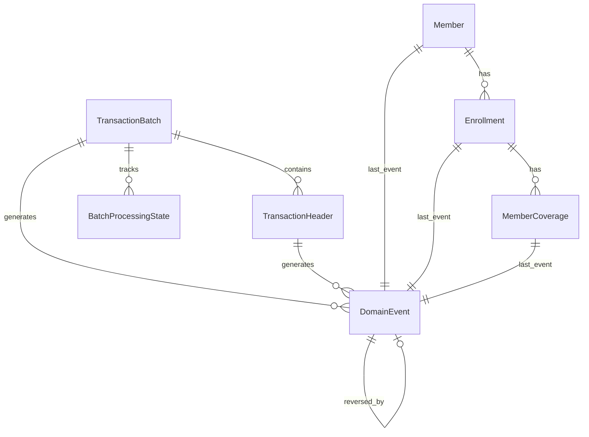
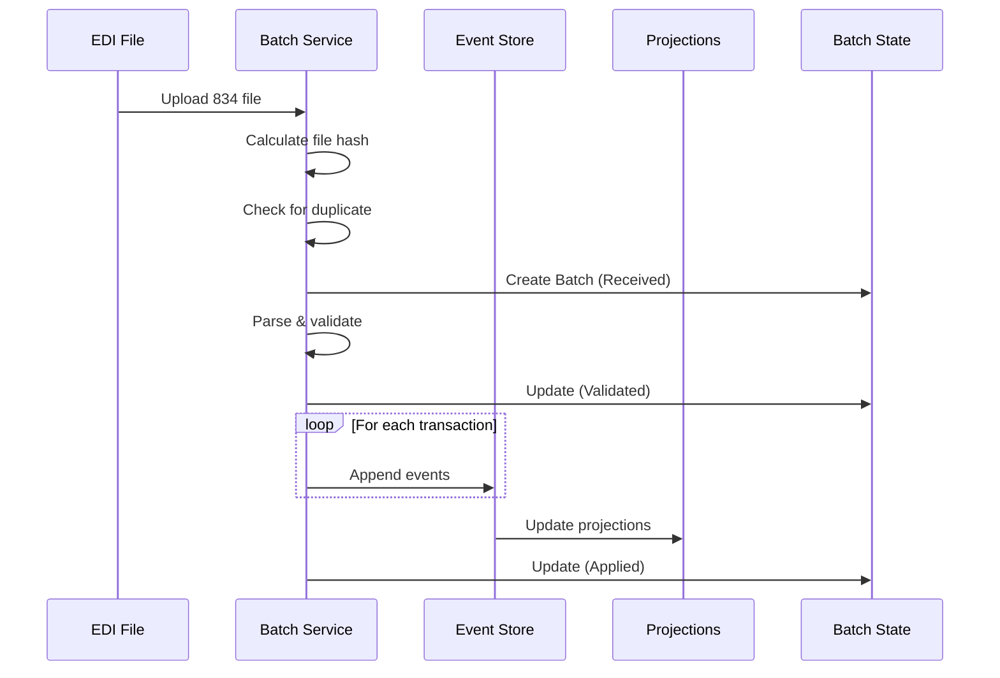

# Event Sourcing Architecture for EDI 834 Enrollment Management Partner

**Document Version:** 1.0  
**Last Updated:** October 2, 2025  
**Status:** Draft

---

## System Boundary

**This specification describes the Enrollment Management Partner**, a trading partner configured within the Healthcare EDI Platform ecosystem that consumes 834 transaction routing messages from the core EDI Platform via Azure Service Bus. This partner is configured as an **internal trading partner** with its own endpoint configuration and integration adapter.

**Relationship to Core Platform:**

- Core platform handles file ingestion, validation, raw storage, and routing (see doc 01, 08)
- Enrollment Management Partner is configured with partner code (e.g., `INTERNAL-ENROLLMENT`) and subscribes to Service Bus topic `edi-routing` with filter `transactionSet = '834' AND partnerCode = 'INTERNAL-ENROLLMENT'`
- Enrollment Management Partner implements event sourcing internally as an architectural choice for its domain
- Other trading partners (external and internal) may use different architectural patterns (CRUD, event sourcing, etc.)
- Enrollment Management Partner writes outcome signals to outbound staging for acknowledgment generation, same as external partners
- Partner integration follows the same loose coupling model as external partners, using standardized routing messages and outcome signals

**Configuration as Trading Partner:**

- Partner Code: `INTERNAL-ENROLLMENT`
- Partner Type: `INTERNAL`
- Direction: `INBOUND` (receives 834 transactions)
- Endpoint Type: `SERVICE_BUS_SUBSCRIPTION`
- Integration Adapter: Specialized event sourcing processor
- Business Logic: Member enrollment lifecycle management with event sourcing

---

## Table of Contents

1. [Overview](#1-overview)
2. [Architecture Principles](#2-architecture-principles)
3. [Core Concepts](#3-core-concepts)
4. [Data Model](#4-data-model)
5. [Event Store Design](#5-event-store-design)
6. [Projection Management](#6-projection-management)
7. [Transaction Processing Flow](#7-transaction-processing-flow)
8. [Reversal and Replay Mechanisms](#8-reversal-and-replay-mechanisms)
9. [Event Types and Schema](#9-event-types-and-schema)
10. [Consistency and Concurrency](#10-consistency-and-concurrency)
11. [Snapshotting Strategy](#11-snapshotting-strategy)
12. [Query Patterns](#12-query-patterns)
13. [Performance Considerations](#13-performance-considerations)
14. [Operational Procedures](#14-operational-procedures)
15. [Migration Strategy](#15-migration-strategy)
16. [Testing Strategy](#16-testing-strategy)
17. [Monitoring and Observability](#17-monitoring-and-observability)

---

## 1. Overview

### 1.1 Purpose

This document specifies the event sourcing architecture for the EDI 834 Benefit Enrollment and Maintenance transaction processing system. The architecture provides:

- **Complete Auditability**: Every state change is captured as an immutable event
- **Transaction Reversibility**: Files can be reversed and reprocessed without data loss
- **Temporal Queries**: Historical state reconstruction at any point in time
- **Data Evolution Tracking**: Full lineage of all enrollment changes
- **Idempotency**: Safe reprocessing of duplicate files

### 1.2 Scope

This specification covers:

- Event store design and implementation
- Projection (read model) management
- Transaction batch processing lifecycle
- Reversal and replay mechanisms
- Consistency guarantees
- Query patterns and performance optimization

### 1.3 Key Benefits

| Benefit | Description |
|---------|-------------|
| **Reversibility** | Complete transaction batch reversal with compensating events |
| **Auditability** | Immutable event log provides complete audit trail |
| **Temporal Queries** | Reconstruct state at any point in time |
| **Debugging** | Replay events to reproduce and fix issues |
| **Compliance** | Meets regulatory requirements for data lineage |
| **Flexibility** | New projections can be built from existing events |

---

## 2. Architecture Principles

### 2.1 Core Principles

1. **Event Immutability**: Events are never updated or deleted, only appended
2. **Single Source of Truth**: Event store is the authoritative data source
3. **Eventual Consistency**: Projections are eventually consistent with events
4. **Command-Query Separation**: Write operations append events; reads query projections
5. **Idempotency**: Processing the same file multiple times produces identical results

### 2.2 CQRS Pattern

The system implements Command Query Responsibility Segregation (CQRS):

```text
┌─────────────┐
│  EDI File   │
└──────┬──────┘
       │
       ▼
┌─────────────────┐
│  Command Side   │ ──► Append Events
│  (Write Model)  │     to Event Store
└─────────────────┘
       │
       ▼
┌─────────────────┐
│   Event Store   │ (Immutable)
│  (DomainEvent)  │
└─────────────────┘
       │
       ▼
┌─────────────────┐
│  Query Side     │ ──► Read from
│  (Read Models)  │     Projections
└─────────────────┘
```

### 2.3 Event Sourcing vs Traditional CRUD

| Aspect | Traditional CRUD | Event Sourcing |
|--------|-----------------|----------------|
| **State Storage** | Current state only | Complete event history |
| **Updates** | Overwrite data | Append new events |
| **Audit Trail** | Separate audit tables | Built-in via events |
| **Reversibility** | Complex compensation logic | Natural via reversal events |
| **Temporal Queries** | Difficult/impossible | Native capability |
| **Storage** | Compact | Larger (all history) |

---

## 3. Core Concepts

### 3.1 Aggregate

An **aggregate** is a cluster of domain objects treated as a single unit. In our system:

- **Member**: Individual subscriber or dependent
- **Enrollment**: Enrollment relationship (subscriber/dependent)
- **Coverage**: Health benefit coverage

Each aggregate has:

- **Aggregate Type**: Category (Member, Enrollment, Coverage)
- **Aggregate ID**: Business key (SubscriberID, EnrollmentBusinessKey, etc.)
- **Event Stream**: Ordered sequence of events for that aggregate

### 3.2 Event

An **event** represents something that happened in the past. Events are:

- **Immutable**: Never changed after creation
- **Ordered**: Globally sequenced
- **Versioned**: Support schema evolution
- **Self-describing**: Contain all necessary data

Event anatomy:

```json
{
  "EventID": 12345,
  "EventGUID": "550e8400-e29b-41d4-a716-446655440000",
  "AggregateType": "Member",
  "AggregateID": "SUB12345",
  "EventType": "MemberCreated",
  "EventVersion": 1,
  "EventSequence": 98765,
  "EventTimestamp": "2025-10-01T14:30:00Z",
  "EventData": {
    "SubscriberID": "SUB12345",
    "FirstName": "John",
    "LastName": "Doe",
    "BirthDate": "1985-03-15",
    "Gender": "M"
  },
  "EventMetadata": {
    "CorrelationID": "batch-456",
    "CausationID": "transaction-789",
    "UserAgent": "EDI-Processor-v2.1"
  }
}
```

### 3.3 Projection (Read Model)

A **projection** is a materialized view built from events:

- Optimized for query performance
- Eventually consistent with event store
- Can be rebuilt from events
- Multiple projections can exist for same events

Examples:

- `Member` table: Current member information
- `Enrollment` table: Current enrollment status
- `MemberCoverage` table: Current coverage details

### 3.4 Transaction Batch

A **transaction batch** represents a single EDI 834 file:

- Contains multiple transaction sets
- Atomic processing unit
- Can be reversed as a unit
- Tracked through lifecycle states

### 3.5 Event Sequence

A **global sequence number** that orders all events:

- Monotonically increasing
- Gap-free
- Enables deterministic replay
- Used for projection state tracking

---

## 4. Data Model

### 4.1 Entity Relationship Diagram



### 4.2 Core Tables

#### 4.2.1 TransactionBatch (Immutable)

Represents the EDI file level.

| Column | Type | Description |
|--------|------|-------------|
| TransactionBatchID | BIGINT | Primary key |
| BatchGUID | UNIQUEIDENTIFIER | Unique identifier |
| InterchangeControlNumber | VARCHAR(9) | ISA13 control number |
| GroupControlNumber | VARCHAR(9) | GS06 control number |
| SenderID | VARCHAR(15) | ISA06 sender |
| ReceiverID | VARCHAR(15) | ISA08 receiver |
| FileName | VARCHAR(255) | Original file name |
| FileHash | VARCHAR(64) | SHA256 for idempotency |
| RawFileContent | VARBINARY(MAX) | Original file for replay |
| FileReceivedDate | DATETIME2 | Receipt timestamp |
| CreatedDate | DATETIME2 | Record creation |

**Indexes:**

- IX_TransactionBatch_ICN (InterchangeControlNumber)
- IX_TransactionBatch_GUID (BatchGUID) UNIQUE
- IX_TransactionBatch_Hash (FileHash)

#### 4.2.2 DomainEvent (Append-Only)

The event store - source of truth.

| Column | Type | Description |
|--------|------|-------------|
| EventID | BIGINT | Primary key (identity) |
| EventGUID | UNIQUEIDENTIFIER | Unique identifier |
| TransactionBatchID | BIGINT | Batch reference |
| TransactionHeaderID | BIGINT | Transaction set reference |
| AggregateType | VARCHAR(50) | Member, Enrollment, Coverage |
| AggregateID | VARCHAR(100) | Business key |
| EventType | VARCHAR(100) | Event type name |
| EventVersion | INT | Schema version |
| EventData | NVARCHAR(MAX) | JSON payload |
| EventMetadata | NVARCHAR(MAX) | JSON metadata |
| EventTimestamp | DATETIME2 | When event occurred |
| EventSequence | BIGINT | Global ordering |
| IsReversal | BIT | Reversal event flag |
| ReversedByEventID | BIGINT | Points to reversal |
| ReversesEventID | BIGINT | Original event reversed |

**Indexes:**

- IX_DomainEvent_Aggregate (AggregateType, AggregateID, EventSequence)
- IX_DomainEvent_Batch (TransactionBatchID, EventSequence)
- IX_DomainEvent_Sequence (EventSequence) UNIQUE
- IX_DomainEvent_GUID (EventGUID) UNIQUE
- IX_DomainEvent_Type (EventType, EventTimestamp)

#### 4.2.3 Member (Projection)

Current state materialized from events.

| Column | Type | Description |
|--------|------|-------------|
| MemberID | BIGINT | Surrogate key |
| SubscriberID | VARCHAR(80) | Business key (unique) |
| FirstName, LastName | VARCHAR | Name fields |
| BirthDate | DATE | Date of birth |
| Gender | CHAR(1) | M, F, U |
| IsActive | BIT | Current status |
| Version | INT | Optimistic concurrency |
| LastEventID | BIGINT | Last event applied |
| LastEventSequence | BIGINT | Projection state tracker |
| CreatedDate, ModifiedDate | DATETIME2 | Timestamps |

**Indexes:**

- IX_Member_SubscriberID (SubscriberID) UNIQUE
- IX_Member_LastEvent (LastEventSequence)

#### 4.2.4 BatchProcessingState

Tracks batch lifecycle.

| Column | Type | Description |
|--------|------|-------------|
| BatchProcessingStateID | BIGINT | Primary key |
| TransactionBatchID | BIGINT | Batch reference |
| ProcessingStatus | VARCHAR(20) | Status value |
| StatusDate | DATETIME2 | Status timestamp |
| ProcessedBy | VARCHAR(128) | User/system |
| ErrorMessage | NVARCHAR(MAX) | Error details |
| TransactionCount | INT | Number of transactions |
| EventsGenerated | INT | Number of events |

**Status Values:**

- `Received`: File uploaded
- `Validated`: Schema validation passed
- `Applied`: Events generated and projections updated
- `Reversed`: Batch reversed
- `Failed`: Processing error

---

## 5. Event Store Design

### 5.1 Event Store Characteristics

The `DomainEvent` table serves as the event store with these properties:

1. **Append-Only**: Records are only inserted, never updated or deleted
2. **Globally Ordered**: EventSequence provides total ordering
3. **Partitioned by Aggregate**: Events for same aggregate stored together
4. **Indexed for Replay**: Efficient sequential access
5. **JSON Payloads**: Flexible schema evolution

### 5.2 Event Sequence Generation

Events use a SQL Server `SEQUENCE` object for gap-free ordering:

```sql
CREATE SEQUENCE [dbo].[EventSequence] 
AS BIGINT 
START WITH 1 
INCREMENT BY 1;
```

**Key Properties:**

- Guaranteed monotonic increase
- No gaps (unlike IDENTITY with rollbacks)
- Transaction-safe
- Performance: ~10,000 events/second per sequence

### 5.3 Event Immutability Enforcement

**Database Level:**

- No UPDATE or DELETE permissions on DomainEvent
- Application accounts have INSERT-only access
- Reversal achieved through new events, not deletion

**Application Level:**

- Event objects are immutable value types
- Validation on append, not modification
- Reversal events explicitly marked

### 5.4 Event Data Format

Events use JSON for flexibility and schema evolution:

```json
{
  "EventType": "MemberCreated",
  "SchemaVersion": 1,
  "Data": {
    "SubscriberID": "SUB12345",
    "FirstName": "John",
    "LastName": "Doe",
    "BirthDate": "1985-03-15",
    "Gender": "M",
    "SSN": "***-**-6789",
    "Address": {
      "Line1": "123 Main St",
      "City": "Anytown",
      "State": "CA",
      "ZipCode": "90210"
    }
  }
}
```

**Schema Evolution:**

- Version field enables multiple schemas
- New projections can handle all versions
- Old events never rewritten

---

## 6. Projection Management

### 6.1 Projection Update Strategy

Projections are updated through event handlers:

```text
Event Appended → Event Handler → Update Projection
```

**Update Modes:**

1. **Real-time**: Update projection immediately after event append
2. **Batch**: Process events in batches (higher throughput)
3. **Scheduled**: Rebuild projections on schedule
4. **On-demand**: Rebuild when queried (cached)

**Recommended Approach:** Real-time for operational tables, batch for analytics.

### 6.2 Projection State Tracking

Each projection tracks the last event applied:

```sql
UPDATE Member
SET 
    FirstName = @FirstName,
    LastName = @LastName,
    Version = Version + 1,
    LastEventSequence = @EventSequence,
    ModifiedDate = GETUTCDATE()
WHERE MemberID = @MemberID;
```

**Benefits:**

- Detect stale projections
- Incremental updates (only new events)
- Parallel projection updates
- Projection health monitoring

### 6.3 Projection Rebuild

Projections can be completely rebuilt from events:

```sql
-- 1. Clear projection
TRUNCATE TABLE Member;

-- 2. Replay all events
EXEC usp_ReplayEvents @FromEventSequence = 0;

-- 3. Verify projection state
SELECT * FROM vw_ProjectionHealth;
```

**Use Cases:**

- Bug fixes in projection logic
- Schema changes
- New projection creation
- Disaster recovery

### 6.4 Multiple Projections

Different projections serve different query needs:

| Projection | Purpose | Consistency |
|------------|---------|-------------|
| Member | Operational queries | Real-time |
| MemberHistory | Audit/compliance | Real-time |
| MemberAnalytics | Reporting/BI | Batch (daily) |
| MemberSnapshot | Point-in-time views | On-demand |

---

## 7. Transaction Processing Flow

### 7.1 File Ingestion Flow



### 7.2 Event Generation from 834

For each member in the 834 file:

#### Step 1: Parse Transaction

- Extract INS, REF, NM1, DMG, HD segments
- Build domain objects

#### Step 2: Determine Event Type

```text
MaintenanceTypeCode:
  021 (Add) → MemberCreated + EnrollmentAdded + CoverageAdded
  001 (Change) → MemberUpdated + EnrollmentChanged + CoverageChanged
  024 (Cancel) → EnrollmentTerminated + CoverageTerminated
  025 (Reinstate) → EnrollmentReinstated + CoverageReinstated
```

#### Step 3: Append Events

```sql
EXEC usp_AppendEvent
    @TransactionBatchID = @BatchID,
    @AggregateType = 'Member',
    @AggregateID = @SubscriberID,
    @EventType = 'MemberCreated',
    @EventData = @JsonData,
    @EventMetadata = @JsonMetadata;
```

#### Step 4: Update Projections

- Apply events to Member, Enrollment, MemberCoverage tables
- Update Version and LastEventSequence

### 7.3 Idempotency

Duplicate file detection:

```sql
-- Check file hash before processing
IF EXISTS (
    SELECT 1 
    FROM TransactionBatch 
    WHERE FileHash = @FileHash
)
BEGIN
    -- File already processed
    RETURN 'DUPLICATE';
END
```

**Idempotency Guarantees:**

- Same file produces same EventIDs (deterministic)
- Duplicate detection at batch level
- Event replay produces same projections

---

## 8. Reversal and Replay Mechanisms

### 8.1 Batch Reversal

Reversing a transaction batch creates compensating events:

```sql
EXEC usp_ReverseBatch 
    @TransactionBatchID = 123,
    @ReversalReason = 'Duplicate file detected';
```

**Reversal Process:**

1. **Identify Events**: Find all non-reversed events in batch
2. **Create Reversal Events**: For each event, create reversal
3. **Link Events**: Set ReversesEventID and ReversedByEventID
4. **Update Projections**: Apply reversal events
5. **Update Batch State**: Mark as 'Reversed'

**Example:**

```text
Original: MemberCreated (EventID: 100)
Reversal: MemberCreatedReversed (EventID: 200, ReversesEventID: 100)

Event 100: ReversedByEventID = 200
Event 200: ReversesEventID = 100, IsReversal = 1
```

### 8.2 Reversal Event Semantics

| Original Event | Reversal Event | Effect |
|----------------|----------------|--------|
| MemberCreated | MemberCreatedReversed | Remove member |
| MemberUpdated | MemberUpdatedReversed | Restore previous state |
| EnrollmentAdded | EnrollmentAddedReversed | Remove enrollment |
| CoverageAdded | CoverageAddedReversed | Remove coverage |

### 8.3 Event Replay

Rebuild projections from events:

```sql
-- Replay all events
EXEC usp_ReplayEvents;

-- Replay events from sequence 1000
EXEC usp_ReplayEvents @FromEventSequence = 1000;

-- Replay events up to sequence 5000
EXEC usp_ReplayEvents 
    @FromEventSequence = 1000,
    @ToEventSequence = 5000;
```

**Replay Strategy:**

1. **Full Rebuild**: Clear projections, replay all events
2. **Incremental**: Replay only new events since last projection update
3. **Partial**: Replay events for specific aggregates
4. **Temporal**: Replay up to specific point in time

### 8.4 Temporal Queries

Reconstruct state at any point in time:

```sql
-- Member state as of 2025-09-01
SELECT 
    AggregateID AS SubscriberID,
    JSON_VALUE(EventData, '$.FirstName') AS FirstName,
    JSON_VALUE(EventData, '$.LastName') AS LastName
FROM DomainEvent
WHERE AggregateType = 'Member'
  AND EventTimestamp <= '2025-09-01'
  AND ReversedByEventID IS NULL
ORDER BY EventSequence;
```

---

## 9. Event Types and Schema

### 9.1 Member Events

#### MemberCreated (v1)

```json
{
  "EventType": "MemberCreated",
  "SchemaVersion": 1,
  "Data": {
    "SubscriberID": "string",
    "FirstName": "string",
    "MiddleName": "string",
    "LastName": "string",
    "NamePrefix": "string",
    "NameSuffix": "string",
    "BirthDate": "date",
    "Gender": "M|F|U",
    "SSN": "string"
  }
}
```

#### MemberUpdated (v1)

```json
{
  "EventType": "MemberUpdated",
  "SchemaVersion": 1,
  "Data": {
    "SubscriberID": "string",
    "Changes": {
      "FirstName": {"Old": "string", "New": "string"},
      "LastName": {"Old": "string", "New": "string"},
      "Address": {"Old": {...}, "New": {...}}
    }
  }
}
```

#### MemberDeactivated (v1)

```json
{
  "EventType": "MemberDeactivated",
  "SchemaVersion": 1,
  "Data": {
    "SubscriberID": "string",
    "Reason": "string",
    "EffectiveDate": "date"
  }
}
```

### 9.2 Enrollment Events

#### EnrollmentAdded (v1)

```json
{
  "EventType": "EnrollmentAdded",
  "SchemaVersion": 1,
  "Data": {
    "SubscriberID": "string",
    "RelationshipCode": "string",
    "EffectiveDate": "date",
    "MaintenanceTypeCode": "string",
    "BenefitStatusCode": "string",
    "EmploymentStatusCode": "string"
  }
}
```

#### EnrollmentTerminated (v1)

```json
{
  "EventType": "EnrollmentTerminated",
  "SchemaVersion": 1,
  "Data": {
    "SubscriberID": "string",
    "TerminationDate": "date",
    "Reason": "string"
  }
}
```

### 9.3 Coverage Events

#### CoverageAdded (v1)

```json
{
  "EventType": "CoverageAdded",
  "SchemaVersion": 1,
  "Data": {
    "SubscriberID": "string",
    "InsuranceLineCode": "HLT|DEN|VIS",
    "PlanCode": "string",
    "CoverageLevelCode": "EMP|ESP|FAM",
    "EffectiveDate": "date",
    "PremiumAmount": "decimal"
  }
}
```

#### CoverageChanged (v1)

```json
{
  "EventType": "CoverageChanged",
  "SchemaVersion": 1,
  "Data": {
    "SubscriberID": "string",
    "InsuranceLineCode": "string",
    "Changes": {
      "CoverageLevelCode": {"Old": "EMP", "New": "FAM"},
      "PremiumAmount": {"Old": 150.00, "New": 400.00}
    }
  }
}
```

---

## 10. Consistency and Concurrency

### 10.1 Consistency Model

**Event Store:**

- **Strong Consistency**: Events written in transactions
- **ACID Guarantees**: SQL Server transaction isolation
- **Serializable**: Event sequence generation is serialized

**Projections:**

- **Eventual Consistency**: May lag behind events
- **Read-Your-Writes**: Can be guaranteed per session
- **Monotonic Reads**: LastEventSequence ensures forward progress

### 10.2 Optimistic Concurrency

Projections use version numbers:

```sql
UPDATE Member
SET 
    FirstName = @FirstName,
    Version = @CurrentVersion + 1,
    LastEventSequence = @EventSequence
WHERE MemberID = @MemberID
  AND Version = @CurrentVersion; -- Optimistic lock

IF @@ROWCOUNT = 0
    THROW 50001, 'Concurrency conflict', 1;
```

### 10.3 Transaction Boundaries

**Write Operations:**

```sql
BEGIN TRANSACTION;
    -- Append event
    EXEC usp_AppendEvent ...;
    
    -- Update projection
    UPDATE Member SET ...;
    
    -- Update batch state
    INSERT INTO BatchProcessingState ...;
COMMIT TRANSACTION;
```

**Isolation Level:** `READ_COMMITTED_SNAPSHOT`

- Non-blocking reads
- Writers don't block readers
- Consistent snapshots

---

## 11. Snapshotting Strategy

### 11.1 Projection Snapshots

Periodic state capture for fast rebuild:

```sql
INSERT INTO ProjectionSnapshot (
    AggregateType,
    AggregateID,
    SnapshotVersion,
    SnapshotData,
    EventSequence
)
SELECT 
    'Member',
    SubscriberID,
    Version,
    (SELECT * FROM Member WHERE SubscriberID = m.SubscriberID FOR JSON PATH),
    LastEventSequence
FROM Member m
WHERE Version % 100 = 0; -- Snapshot every 100 versions
```

**Snapshot Frequency:**

- **High-change aggregates**: Every 50-100 events
- **Low-change aggregates**: Every 500-1000 events
- **Large aggregates**: More frequent snapshots

### 11.2 Batch Snapshots

State capture at batch boundaries:

```sql
-- Before processing batch
INSERT INTO BatchSnapshot (
    TransactionBatchID,
    SnapshotType,
    TableName,
    RecordCount,
    ChecksumValue
)
SELECT 
    @BatchID,
    'PreBatch',
    'Member',
    COUNT(*),
    CHECKSUM_AGG(CHECKSUM(*))
FROM Member;
```

**Use Cases:**

- Fast rollback to pre-batch state
- Validation of batch effects
- Compliance checkpoints

### 11.3 Snapshot Rebuild

Rebuild from snapshot + events:

```sql
-- 1. Load snapshot
SELECT @SnapshotData = SnapshotData
FROM ProjectionSnapshot
WHERE AggregateID = @SubscriberID
ORDER BY EventSequence DESC;

-- 2. Apply events since snapshot
DECLARE @SnapshotSequence BIGINT = JSON_VALUE(@SnapshotData, '$.EventSequence');

EXEC usp_RebuildMemberProjection 
    @SubscriberID = @SubscriberID,
    @FromEventSequence = @SnapshotSequence;
```

---

## 12. Query Patterns

### 12.1 Current State Queries

Query projections for current state:

```sql
-- Get current member information
SELECT * 
FROM Member 
WHERE SubscriberID = 'SUB12345';

-- Get active enrollments
SELECT * 
FROM vw_ActiveEnrollments 
WHERE SubscriberID = 'SUB12345';
```

**Performance:** O(1) lookup on indexed projection

### 12.2 Event History Queries

Query event store for history:

```sql
-- Get member event history
EXEC usp_GetMemberEventHistory 
    @SubscriberID = 'SUB12345',
    @IncludeReversals = 1;

-- Get events for date range
SELECT *
FROM vw_EventStream
WHERE AggregateID = 'SUB12345'
  AND EventTimestamp BETWEEN @StartDate AND @EndDate;
```

### 12.3 Temporal Queries

State at specific point in time:

```sql
-- Member state on 2025-09-01
SELECT 
    AggregateID,
    EventData,
    EventTimestamp
FROM (
    SELECT *,
        ROW_NUMBER() OVER (
            PARTITION BY AggregateID 
            ORDER BY EventSequence DESC
        ) AS rn
    FROM DomainEvent
    WHERE AggregateType = 'Member'
      AND EventTimestamp <= '2025-09-01'
      AND ReversedByEventID IS NULL
) t
WHERE rn = 1;
```

### 12.4 Audit Queries

Track changes over time:

```sql
-- Who changed what and when
SELECT 
    EventType,
    EventTimestamp,
    JSON_VALUE(EventMetadata, '$.User') AS ChangedBy,
    JSON_VALUE(EventData, '$.Changes') AS Changes
FROM DomainEvent
WHERE AggregateID = 'SUB12345'
  AND EventType LIKE '%Updated'
ORDER BY EventSequence;
```

---

## 13. Performance Considerations

### 13.1 Write Performance

**Event Append:**

- Target: 1,000+ events/second
- Optimizations:
  - Bulk insert for batch processing
  - Async projection updates
  - Minimal indexes on event store

**Batch Processing:**

- Target: Process 10,000 member file in <5 minutes
- Optimizations:
  - Parallel event generation
  - Batch projection updates
  - Connection pooling

### 13.2 Read Performance

**Projection Queries:**

- Target: <50ms for single record
- Optimizations:
  - Covering indexes
  - Materialized views
  - Read replicas for analytics

**Event History:**

- Target: <500ms for member history
- Optimizations:
  - Aggregate-specific indexes
  - Partition by date
  - Compression for old events

### 13.3 Storage Optimization

**Event Store:**

- JSON compression: ~40% reduction
- Columnstore for old events
- Archive to blob storage after 1 year

**Projections:**

- Standard indexing
- Statistics maintenance
- Partition large tables

### 13.4 Scalability

**Horizontal Scaling:**

- Read replicas for projections
- Event store sharding by aggregate type
- Async event handlers in separate services

**Vertical Scaling:**

- Premium/Business Critical tier for event store
- Separate database for projections
- In-memory tables for hot projections

---

## 14. Operational Procedures

### 14.1 File Processing

**Standard Flow:**

```powershell

# 1. Upload file

POST /api/enrollment/files
Content-Type: multipart/form-data

# 2. Monitor processing

GET /api/enrollment/batches/{batchId}/status

# 3. Verify completion

GET /api/enrollment/batches/{batchId}/summary
```

### 14.2 Batch Reversal

**When to Reverse:**

- Duplicate file detected
- Data quality issues
- Partner request
- Processing error

**Reversal Procedure:**

```sql
-- 1. Verify batch can be reversed
SELECT * 
FROM BatchProcessingState 
WHERE TransactionBatchID = 123
ORDER BY StatusDate DESC;

-- 2. Execute reversal
EXEC usp_ReverseBatch 
    @TransactionBatchID = 123,
    @ReversalReason = 'Duplicate - reprocess with corrected data';

-- 3. Verify reversal
SELECT COUNT(*) AS ReversalEvents
FROM DomainEvent
WHERE TransactionBatchID = 123
  AND IsReversal = 1;

-- 4. Rebuild projections if needed
EXEC usp_ReplayEvents;
```

### 14.3 Projection Rebuild

**When to Rebuild:**

- Projection bug fix
- Schema change
- Data corruption
- New projection creation

**Rebuild Procedure:**

```sql
-- 1. Backup projection
SELECT * INTO Member_Backup FROM Member;

-- 2. Clear projection
TRUNCATE TABLE Member;

-- 3. Replay events
EXEC usp_ReplayEvents;

-- 4. Validate results
SELECT * FROM vw_ProjectionHealth;

-- 5. Compare with backup
SELECT COUNT(*) AS Diff
FROM Member m
FULL OUTER JOIN Member_Backup mb ON m.MemberID = mb.MemberID
WHERE m.MemberID IS NULL OR mb.MemberID IS NULL;
```

### 14.4 Event Store Maintenance

**Archive Old Events:**

```sql
-- Archive events older than 7 years
INSERT INTO ArchiveDB.dbo.DomainEvent
SELECT * 
FROM DomainEvent
WHERE EventTimestamp < DATEADD(YEAR, -7, GETDATE());

-- Verify archive
-- Delete from production (if compliant)
```

**Snapshot Cleanup:**

```sql
-- Keep last 10 snapshots per aggregate
WITH RankedSnapshots AS (
    SELECT *,
        ROW_NUMBER() OVER (
            PARTITION BY AggregateType, AggregateID 
            ORDER BY EventSequence DESC
        ) AS rn
    FROM ProjectionSnapshot
)
DELETE FROM RankedSnapshots WHERE rn > 10;
```

---

## 15. Migration Strategy

### 15.1 Migration from CRUD System

#### Phase 1: Parallel Write (Weeks 1-4)

- Write to both old and new systems
- Validate event generation
- Build projections from events
- Compare results

#### Phase 2: Event Sourcing Primary (Weeks 5-8)

- Read from projections
- Write through event store
- Keep old system in sync
- Monitor performance

#### Phase 3: Cutover (Week 9)

- Stop writing to old system
- Full event sourcing operation
- Old system read-only
- Backfill historical events

#### Phase 4: Decommission (Week 10+)

- Remove old system
- Archive historical data
- Complete migration

### 15.2 Historical Data Backfill

Generate events from existing data:

```sql
-- Create synthetic events for existing members
INSERT INTO DomainEvent (
    TransactionBatchID,
    AggregateType,
    AggregateID,
    EventType,
    EventData,
    EventSequence,
    EventTimestamp
)
SELECT 
    @MigrationBatchID,
    'Member',
    SubscriberID,
    'MemberCreated',
    (SELECT * FROM Member WHERE MemberID = m.MemberID FOR JSON PATH),
    NEXT VALUE FOR EventSequence,
    CreatedDate
FROM Member m
ORDER BY CreatedDate;
```

---

## 16. Testing Strategy

### 16.1 Unit Tests

**Event Handlers:**

```csharp
[Test]
public void MemberCreated_ShouldCreateMemberProjection()
{
    var evt = new MemberCreatedEvent { ... };
    var handler = new MemberProjectionHandler();
    
    handler.Handle(evt);
    
    var member = db.Members.Single(m => m.SubscriberID == evt.SubscriberID);
    Assert.Equal(evt.FirstName, member.FirstName);
}
```

**Reversal Logic:**

```csharp
[Test]
public void ReverseBatch_ShouldCreateReversalEvents()
{
    var batchId = ProcessTestFile();
    
    usp_ReverseBatch(batchId, "test reversal");
    
    var reversalEvents = db.DomainEvents
        .Where(e => e.IsReversal && e.TransactionBatchID == batchId)
        .Count();
    
    Assert.True(reversalEvents > 0);
}
```

### 16.2 Integration Tests

**End-to-End Processing:**

```csharp
[Test]
public async Task ProcessFile_ShouldGenerateEventsAndUpdateProjections()
{
    var file = LoadTestFile("sample.834");
    
    var batchId = await processor.ProcessFile(file);
    
    // Verify events
    var events = await db.DomainEvents
        .Where(e => e.TransactionBatchID == batchId)
        .ToListAsync();
    Assert.True(events.Count > 0);
    
    // Verify projections
    var member = await db.Members
        .SingleAsync(m => m.SubscriberID == "TEST001");
    Assert.Equal("John", member.FirstName);
}
```

### 16.3 Property-Based Tests

**Idempotency:**

```csharp
[Property]
public bool ProcessingSameFileTwice_ProducesIdenticalResults(
    string fileContent)
{
    var result1 = processor.ProcessFile(fileContent);
    var result2 = processor.ProcessFile(fileContent);
    
    return result1.EventCount == result2.EventCount &&
           result1.MemberCount == result2.MemberCount;
}
```

**Replay Determinism:**

```csharp
[Property]
public bool ReplayingEvents_ProducesSameProjection(
    List<DomainEvent> events)
{
    var projection1 = BuildProjection(events);
    ClearProjection();
    var projection2 = BuildProjection(events);
    
    return AreEqual(projection1, projection2);
}
```

---

## 17. Monitoring and Observability

### 17.1 Key Metrics

**Event Store:**

- Events/second append rate
- Event store size growth
- Sequence generation latency
- Event handler latency

**Projections:**

- Projection lag (events behind)
- Projection rebuild time
- Query response time
- Stale projection count

**Batch Processing:**

- Files processed/hour
- Average batch processing time
- Batch failure rate
- Reversal rate

### 17.2 KQL Queries (Application Insights)

**Event Append Rate:**

```kql
customMetrics
| where name == "EventAppendRate"
| summarize avg(value) by bin(timestamp, 1m)
| render timechart
```

**Projection Lag:**

```kql
customMetrics
| where name == "ProjectionLag"
| where customDimensions.ProjectionType == "Member"
| summarize max(value) by bin(timestamp, 5m)
| render timechart
```

**Batch Processing Duration:**

```kql
dependencies
| where name == "ProcessBatch"
| summarize percentiles(duration, 50, 95, 99) by bin(timestamp, 1h)
| render timechart
```

### 17.3 Alerts

**Critical:**

- Projection lag > 1000 events
- Event append failures
- Batch processing failures

**Warning:**

- Projection lag > 100 events
- Slow event handlers (>500ms)
- High reversal rate (>5%)

### 17.4 Dashboards

**Operations Dashboard:**

- Events processed today
- Active batches
- Projection health
- Error rate

**Performance Dashboard:**

- Event throughput
- Projection lag
- Query latency (P95, P99)
- Storage growth

---

## Appendix A: Event Type Catalog

| Event Type | Description | Aggregate |
|------------|-------------|-----------|
| MemberCreated | New member added | Member |
| MemberUpdated | Member info changed | Member |
| MemberDeactivated | Member deactivated | Member |
| EnrollmentAdded | New enrollment | Enrollment |
| EnrollmentChanged | Enrollment modified | Enrollment |
| EnrollmentTerminated | Enrollment ended | Enrollment |
| EnrollmentReinstated | Enrollment reactivated | Enrollment |
| CoverageAdded | New coverage | Coverage |
| CoverageChanged | Coverage modified | Coverage |
| CoverageTerminated | Coverage ended | Coverage |
| AddressUpdated | Address changed | Member |
| ContactUpdated | Contact info changed | Member |

## Appendix B: SQL Procedures Reference

| Procedure | Purpose |
|-----------|---------|
| usp_AppendEvent | Append event to store |
| usp_ReverseBatch | Reverse transaction batch |
| usp_ReplayEvents | Rebuild projections |
| usp_RebuildMemberProjection | Rebuild single member |
| usp_GetMemberEventHistory | Get event history |
| usp_GetMemberEnrollmentState | Get current state |

## Appendix C: Performance Targets

| Operation | Target | Measurement |
|-----------|--------|-------------|
| Event Append | <10ms | P95 latency |
| Projection Update | <50ms | P95 latency |
| Batch Processing | <30s per 1000 members | Average |
| Event Query | <100ms | P95 latency |
| Projection Query | <50ms | P95 latency |
| Reversal | <60s per batch | Average |
| Full Replay | <2 hours | Complete rebuild |

---

**Document Control:**

| Version | Date | Author | Changes |
|---------|------|--------|---------|
| 1.0 | 2025-10-01 | AI System | Initial event sourcing specification |

---

**Related Documents:**

- [01-architecture-spec.md](./01-architecture-spec.md)
- [02-data-flow-spec.md](./02-data-flow-spec.md)
- [06-operations-spec.md](./06-operations-spec.md)
- `EnrollmentTracking.sql` (pending publication in `infra/sql` project)
