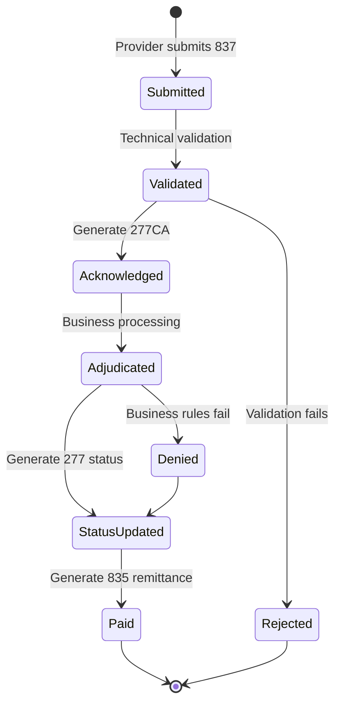
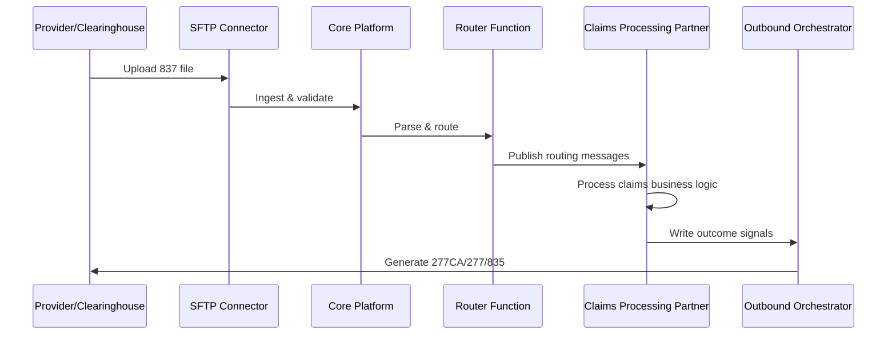
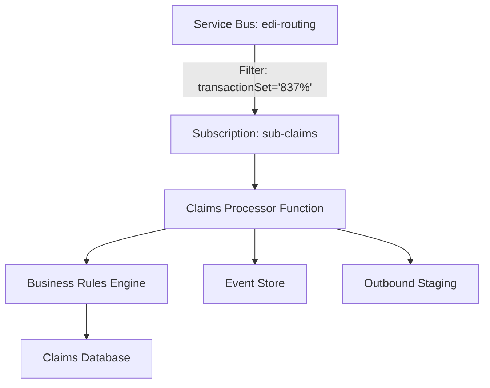
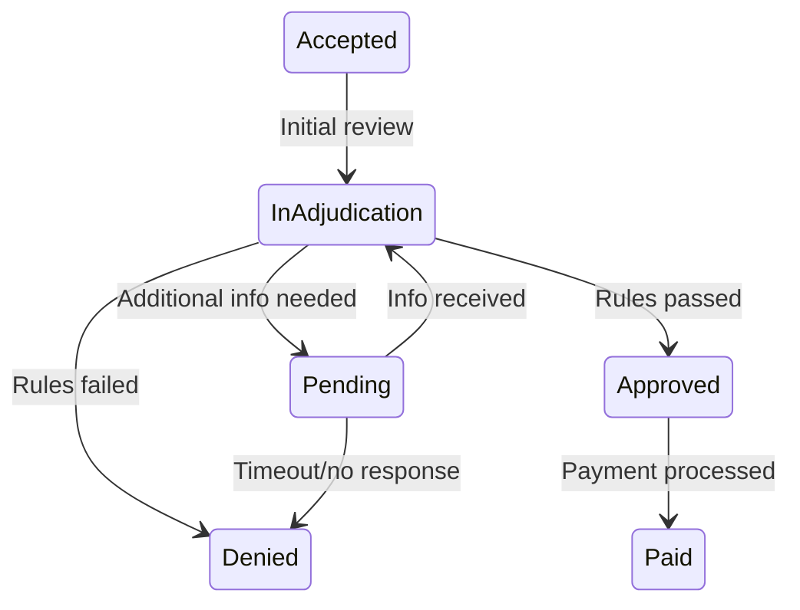
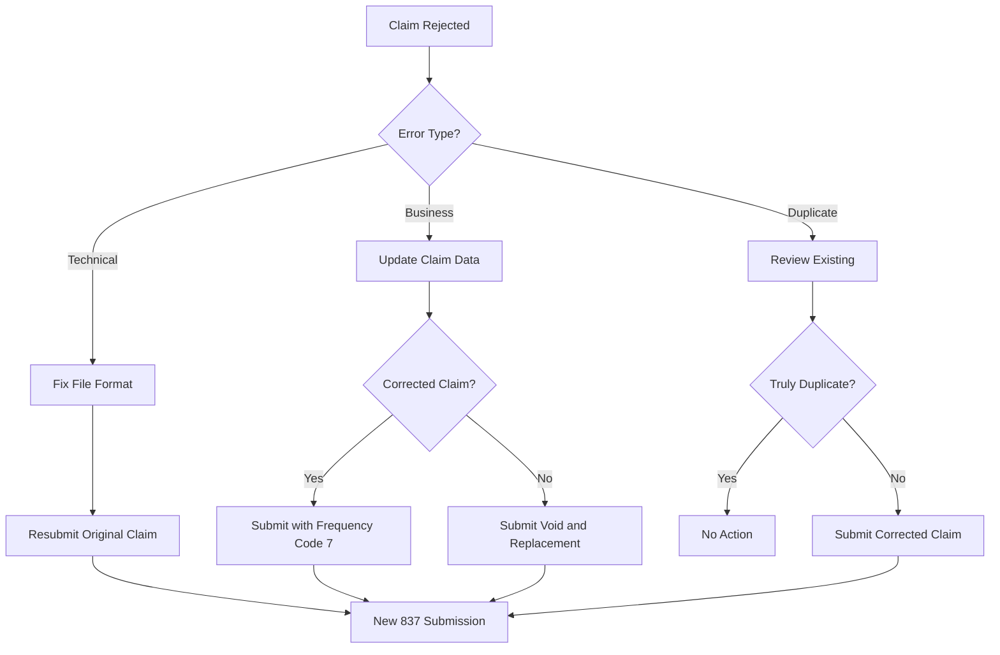

# EDI 837 Claims Transaction Flow - Part 1 of 4

**Document Version:** 1.0  
**Last Updated:** October 6, 2025  
**Status:** Part 1 - Overview and Architecture

---

## Table of Contents

1. [Overview](#1-overview)
2. [Architecture Principles](#2-architecture-principles)
3. [Transaction Types and Variants](#3-transaction-types-and-variants)
4. [End-to-End Claims Lifecycle](#4-end-to-end-claims-lifecycle)

---

## 1. Overview

### 1.1 Purpose

This document specifies the complete transaction flow for EDI 837 Claims (Professional, Institutional, and Dental) from initial submission through final remittance. The 837 transaction is the primary mechanism for healthcare providers to submit claims for reimbursement to payers.

**Covered Transaction Types:**

- **837P** - Professional Claims (physician office visits, outpatient procedures)
- **837I** - Institutional Claims (hospital inpatient, outpatient facility)
- **837D** - Dental Claims (dental services)

### 1.2 Scope

This specification covers:

- Complete claims lifecycle from submission to payment
- Integration with core EDI platform components
- Acknowledgment generation (TA1, 999, 277CA, 277, 835)
- Error handling and resubmission workflows
- Performance targets and SLA requirements
- Monitoring and observability patterns

### 1.3 Claims Lifecycle Stages



**Timeline:**

| Stage | SLA Target | Acknowledgment |
|-------|-----------|----------------|
| Technical Validation | < 15 minutes | TA1 (if structural), 999 (syntax) |
| Business Acknowledgment | < 4 hours | 277CA (claim acceptance) |
| Adjudication | 1-30 days | 277 (status updates) |
| Payment | 15-30 days | 835 (remittance advice) |

### 1.4 Key Benefits

| Benefit | Description |
|---------|-------------|
| **Complete Auditability** | Every claim state change is tracked with timestamps |
| **Multi-Stage Acknowledgments** | Technical, business, and payment acknowledgments |
| **Error Detection** | Validation at multiple stages (syntax, business rules, adjudication) |
| **Performance Monitoring** | SLA tracking for each lifecycle stage |
| **Compliance** | Meets X12 specification and regulatory requirements |

---

## 2. Architecture Principles

### 2.1 Core Principles

1. **Separation of Concerns**: Technical validation, business processing, and payment are separate stages
2. **Asynchronous Processing**: Claims processing is decoupled via Service Bus messaging
3. **Idempotency**: Duplicate claim submissions are detected and handled safely
4. **Traceability**: Complete lineage from raw file to payment outcome
5. **Scalability**: Multi-ST (transaction) claims files are fan-out for parallel processing

### 2.2 Integration Pattern

The 837 claims flow follows the **Trading Partner Integration Adapter** pattern:



**Key Integration Points:**

- **Ingestion**: Core platform validates ISA/IEA/GS/GE/ST/SE envelopes
- **Routing**: Router function publishes claim routing messages to Service Bus
- **Processing**: Claims Processing Partner subscribes to routing messages
- **Acknowledgments**: Outbound Orchestrator generates X12 acknowledgments

### 2.3 Relationship to Core Platform

**This specification describes the Claims Processing Partner**, a trading partner configured within the Healthcare EDI Platform ecosystem that consumes 837 transaction routing messages from the core EDI Platform via Azure Service Bus.

**Configuration as Trading Partner:**

- **Partner Code**: `INTERNAL-CLAIMS`
- **Partner Type**: `INTERNAL`
- **Direction**: `INBOUND` (receives 837 transactions)
- **Endpoint Type**: `SERVICE_BUS_SUBSCRIPTION`
- **Integration Adapter**: Claims processing service with adjudication engine
- **Business Logic**: Claim validation, adjudication, payment calculation

**Core Platform Responsibilities:**

- File ingestion and raw storage (see doc 01)
- ISA/GS/ST envelope validation
- TA1/999 acknowledgment generation (see doc 05)
- Routing message publishing (see doc 03)
- Control number management (see doc 05, 07)

**Claims Partner Responsibilities:**

- Subscribe to Service Bus topic `edi-routing` with filter `transactionSet IN ('837P','837I','837D')`
- Parse 837 transaction segments (CLM, SV1/SV2/SV3, HI, NM1, etc.)
- Validate claim business rules
- Perform adjudication logic
- Write outcome signals to outbound staging
- Generate status updates for 277/835 assembly

---

## 3. Transaction Types and Variants

### 3.1 837P - Professional Claims

**Use Case:** Physician office visits, outpatient procedures, laboratory services

**Key Segments:**

| Segment | Purpose | Required |
|---------|---------|----------|
| CLM | Claim identification and totals | Yes |
| DTP | Service date range | Yes |
| HI | Diagnosis codes (ICD-10) | Yes |
| NM1 | Billing provider, rendering provider, subscriber, patient | Yes |
| SV1 | Professional service line | Yes (per service) |
| REF | Claim reference numbers | Conditional |
| CAS | Claim adjustments | Conditional |

**Common Scenarios:**

- Single provider, single date of service
- Multiple service lines per claim
- Primary and secondary insurance coordination
- Prior authorization references

**Example Structure:**

```text
ST*837*0001*005010X222A1
BHT*0019*00*X12*20251006*1200*CH
NM1*41*2*PROVIDER CLINIC*****46*12345
NM1*40*2*PAYER XYZ*****46*67890
HL*1**20*1 (Billing/Pay-to Provider)
HL*2*1*22*0 (Subscriber)
CLM*CLAIM001*100.00***11:B:1*Y*A*Y*Y
DTP*472*D8*20251001
HI*ABK:R05*ABK:I10
NM1*71*1*PROVIDER*JANE****XX*1234567890
SV1*HC:99213*75.00*UN*1***1
SE*25*0001
```

### 3.2 837I - Institutional Claims

**Use Case:** Hospital inpatient stays, outpatient facility services, emergency department

**Key Segments:**

| Segment | Purpose | Required |
|---------|---------|----------|
| CLM | Claim identification, type of bill, DRG code | Yes |
| DTP | Admission date, discharge date, statement dates | Yes |
| HI | Diagnosis codes (principal, secondary, admitting) | Yes |
| NM1 | Billing facility, attending physician, operating physician | Yes |
| SV2 | Institutional service line | Yes (per service) |
| REF | Medical record number, prior authorization | Conditional |

**Common Scenarios:**

- Multi-day inpatient admissions
- Outpatient surgery
- Emergency department visits
- Observation stays

**Key Differences from 837P:**

- Uses SV2 segments instead of SV1
- Includes facility-specific data (type of bill, revenue codes)
- DRG (Diagnosis Related Group) coding
- Condition codes and occurrence codes

### 3.3 837D - Dental Claims

**Use Case:** Dental procedures, orthodontics, oral surgery

**Key Segments:**

| Segment | Purpose | Required |
|---------|---------|----------|
| CLM | Claim identification, place of service | Yes |
| DTP | Service dates | Yes |
| HI | Diagnosis codes (ICD-10-CM) | Conditional |
| NM1 | Billing dentist, treating dentist, subscriber | Yes |
| SV3 | Dental service line | Yes (per procedure) |
| TOO | Tooth information | Yes (for tooth-specific procedures) |

**Common Scenarios:**

- Routine dental exams and cleanings
- Restorative procedures (fillings, crowns)
- Extractions and oral surgery
- Orthodontic treatment plans

**Key Differences:**

- Uses SV3 segments (dental-specific)
- TOO segment for tooth identification
- Different procedure code system (CDT codes)
- Orthodontic treatment tracking

---

## 4. End-to-End Claims Lifecycle

### 4.1 Stage 1: Submission and Ingestion

**Timeline**: < 5 minutes

**Process:**

1. **Provider Submission**
   - Provider uploads 837 file to SFTP inbound directory
   - File naming convention: `{partnerCode}_837_{timestamp}.x12`

2. **Core Platform Ingestion** (ADF Pipeline)
   - Timer-triggered or Event Grid-triggered ingestion
   - Calculate file hash (SHA256) for deduplication
   - Validate ISA/IEA envelope structure
   - Persist raw file to `raw/` container (immutable)
   - Extract metadata (ISA/GS/ST control numbers, partner code, transaction types)

3. **Initial Validation**
   - Structural validation (envelope integrity)
   - Control number validation (ISA13, GS06, ST02)
   - Partner authentication (sender ID matches configuration)

**Outputs:**

- Raw file persisted in blob storage
- Metadata written to ingestion logs
- File tracking record created in SFTP tracking database

**Error Handling:**

- **ISA/IEA mismatch**: Generate TA1 with error code
- **Unknown sender**: Quarantine file, alert operations
- **Duplicate file hash**: Skip processing, log warning

### 4.2 Stage 2: Technical Validation

**Timeline**: < 15 minutes

**Process:**

1. **Syntax Validation** (999 Generation)
   - Parse X12 segments and elements
   - Validate segment positions and required elements
   - Check data element types and lengths
   - Validate code list values

2. **TA1 Generation** (if needed)
   - Generate TA1 if structural errors detected
   - TA1 code meanings:
     - `TA104=A`: Interchange accepted
     - `TA104=E`: Interchange accepted with errors
     - `TA104=R`: Interchange rejected

3. **999 Generation**
   - AK1: Functional group response header
   - AK2: Transaction set response header (per ST)
   - AK3/AK4: Segment/element error details (if errors)
   - AK9: Summary (accepted/rejected count)

**Outputs:**

- TA1 file (if errors): `{partnerCode}_TA1_{timestamp}.x12`
- 999 file: `{partnerCode}_999_{timestamp}.x12`
- Files persisted to `outbound/{partnerCode}/` container

**Error Handling:**

- **Syntax errors**: 999 with AK5=R (rejected), detail errors in AK3/AK4
- **Missing required segments**: 999 rejection
- **Invalid segment positions**: 999 rejection

### 4.3 Stage 3: Routing and Distribution

**Timeline**: < 5 minutes

**Process:**

1. **Router Function Execution** (Service Bus-triggered)
   - Parse ST segments from 837 file
   - Extract transaction metadata (CLM01, provider NPI, payer ID, service dates)
   - Create routing message per claim (ST segment)

2. **Routing Message Structure**
   ```json
   {
     "routingId": "guid",
     "ingestionId": "guid",
     "partnerCode": "PARTNERA",
     "transactionSet": "837P",
     "direction": "INBOUND",
     "controlNumbers": {
       "isa": "000000001",
       "gs": "1",
       "st": "0001"
     },
     "blobPath": "raw/PARTNERA_837_20251006.x12",
     "priority": "high",
     "receivedUtc": "2025-10-06T10:00:00Z"
   }
   ```

3. **Service Bus Publishing**
   - Publish to topic: `edi-routing`
   - Message properties for filtering:
     - `transactionSet = '837P'` (or 837I, 837D)
     - `partnerCode = 'PARTNERA'`
     - `direction = 'INBOUND'`

**Outputs:**

- Routing messages published to Service Bus
- Routing log entries in Log Analytics

**Error Handling:**

- **Service Bus throttling**: Retry with exponential backoff
- **Invalid message format**: Dead-letter queue, alert operations

---

---

## 5. Claims Processing and Business Validation

### 5.1 Claims Processing Partner Architecture

The Claims Processing Partner is an internal system configured as a trading partner that receives 837 claims via Service Bus and performs business validation and adjudication.

**Components:**



**Configuration:**

```json
{
  "partnerCode": "INTERNAL-CLAIMS",
  "name": "Claims Processing (Internal Partner)",
  "partnerType": "INTERNAL",
  "expectedTransactions": ["837P", "837I", "837D", "276", "277", "277CA"],
  "direction": "INBOUND",
  "priority": {
    "837P": "high",
    "837I": "high",
    "837D": "high"
  },
  "inboundEndpoint": {
    "endpointType": "SERVICE_BUS_SUBSCRIPTION",
    "subscriptionName": "sub-claims-partner",
    "topicName": "edi-routing",
    "filters": ["transactionSet IN ('837P','837I','837D')"]
  }
}
```

### 5.2 Claims Parsing and Extraction

**Process:**

1. **Receive Routing Message**
   - Claims Processor Function triggered by Service Bus message
   - Extract blob path from routing message
   - Download raw 837 file from blob storage

2. **Parse 837 Transaction**
   - Use X12 parser library to extract segments
   - Build claim domain model from segments

3. **Extract Key Data Elements**

**837P Professional Claim Data:**

```csharp
public class ProfessionalClaim
{
    // CLM segment
    public string ClaimId { get; set; }              // CLM01
    public decimal TotalChargeAmount { get; set; }   // CLM02
    public string PlaceOfServiceCode { get; set; }   // CLM05-1
    public string ClaimFrequencyCode { get; set; }   // CLM05-3
    
    // DTP segments
    public DateTime ServiceDateFrom { get; set; }    // DTP*472
    public DateTime ServiceDateTo { get; set; }      // DTP*472
    
    // HI segments
    public List<DiagnosisCode> DiagnosisCodes { get; set; }  // HI*ABK
    
    // NM1 segments
    public Provider BillingProvider { get; set; }    // NM1*85
    public Provider RenderingProvider { get; set; }  // NM1*82
    public Subscriber Subscriber { get; set; }       // NM1*IL
    public Patient Patient { get; set; }             // NM1*QC
    
    // SV1 segments
    public List<ServiceLine> ServiceLines { get; set; }
    
    // REF segments
    public string PriorAuthorizationNumber { get; set; }  // REF*G1
    public string ClaimControlNumber { get; set; }        // REF*D9
}

public class ServiceLine
{
    public string ProcedureCode { get; set; }        // SV101-2
    public decimal LineChargeAmount { get; set; }    // SV102
    public string UnitType { get; set; }             // SV103
    public decimal Quantity { get; set; }            // SV104
    public string PlaceOfService { get; set; }       // SV105
    public List<string> Modifiers { get; set; }      // SV101-3 through SV101-6
}
```

**837I Institutional Claim Data:**

```csharp
public class InstitutionalClaim
{
    // CLM segment
    public string ClaimId { get; set; }              // CLM01
    public decimal TotalChargeAmount { get; set; }   // CLM02
    public string FacilityCode { get; set; }         // CLM05-1 (type of bill)
    public string DrgCode { get; set; }              // CLM11 (DRG code)
    
    // DTP segments
    public DateTime AdmissionDate { get; set; }      // DTP*435
    public DateTime DischargeDate { get; set; }      // DTP*096
    
    // HI segments  
    public DiagnosisCode PrincipalDiagnosis { get; set; }     // HI*ABK (first)
    public List<DiagnosisCode> SecondaryDiagnoses { get; set; }
    public DiagnosisCode AdmittingDiagnosis { get; set; }     // HI*ABJ
    
    // NM1 segments
    public Facility BillingFacility { get; set; }    // NM1*85
    public Provider AttendingPhysician { get; set; } // NM1*71
    public Provider OperatingPhysician { get; set; } // NM1*72
    
    // SV2 segments
    public List<InstitutionalServiceLine> ServiceLines { get; set; }
}

public class InstitutionalServiceLine
{
    public string RevenueCode { get; set; }          // SV201
    public string ProcedureCode { get; set; }        // SV202-2
    public decimal LineChargeAmount { get; set; }    // SV203
    public string UnitType { get; set; }             // SV204
    public decimal Quantity { get; set; }            // SV205
}
```

### 5.3 Business Rules Validation

**Timeline**: < 30 minutes per claim

**Validation Categories:**

#### 5.3.1 Eligibility Validation

```csharp
public class EligibilityValidator
{
    public ValidationResult ValidateClaim(ProfessionalClaim claim)
    {
        var errors = new List<ValidationError>();
        
        // Check subscriber eligibility
        var subscriber = _eligibilityService.GetSubscriber(
            claim.Subscriber.MemberId,
            claim.ServiceDateFrom);
            
        if (subscriber == null)
        {
            errors.Add(new ValidationError
            {
                Code = "E001",
                Description = "Subscriber not found or not eligible on service date",
                Severity = "Critical"
            });
        }
        
        // Check dependent eligibility
        if (claim.Patient.MemberId != claim.Subscriber.MemberId)
        {
            var dependent = _eligibilityService.GetDependent(
                claim.Subscriber.MemberId,
                claim.Patient.MemberId,
                claim.ServiceDateFrom);
                
            if (dependent == null)
            {
                errors.Add(new ValidationError
                {
                    Code = "E002",
                    Description = "Dependent not found or not eligible",
                    Severity = "Critical"
                });
            }
        }
        
        // Check coverage for services
        foreach (var serviceLine in claim.ServiceLines)
        {
            var coverage = _coverageService.CheckCoverage(
                subscriber.MemberId,
                serviceLine.ProcedureCode,
                claim.ServiceDateFrom);
                
            if (!coverage.IsCovered)
            {
                errors.Add(new ValidationError
                {
                    Code = "E003",
                    Description = $"Service {serviceLine.ProcedureCode} not covered",
                    Severity = "Warning",
                    LineNumber = serviceLine.LineNumber
                });
            }
        }
        
        return new ValidationResult { Errors = errors };
    }
}
```

#### 5.3.2 Provider Validation

```csharp
public class ProviderValidator
{
    public ValidationResult ValidateClaim(ProfessionalClaim claim)
    {
        var errors = new List<ValidationError>();
        
        // Validate billing provider NPI
        var billingProvider = _providerService.GetProvider(
            claim.BillingProvider.NPI);
            
        if (billingProvider == null || !billingProvider.IsActive)
        {
            errors.Add(new ValidationError
            {
                Code = "P001",
                Description = "Billing provider NPI not found or inactive",
                Severity = "Critical"
            });
        }
        
        // Validate rendering provider NPI
        if (claim.RenderingProvider != null)
        {
            var renderingProvider = _providerService.GetProvider(
                claim.RenderingProvider.NPI);
                
            if (renderingProvider == null)
            {
                errors.Add(new ValidationError
                {
                    Code = "P002",
                    Description = "Rendering provider NPI not found",
                    Severity = "Critical"
                });
            }
            
            // Check if rendering provider is authorized
            if (!_providerService.IsAuthorized(
                renderingProvider.NPI,
                claim.Subscriber.PayerId))
            {
                errors.Add(new ValidationError
                {
                    Code = "P003",
                    Description = "Provider not authorized for this payer",
                    Severity = "Critical"
                });
            }
        }
        
        return new ValidationResult { Errors = errors };
    }
}
```

#### 5.3.3 Prior Authorization Validation

```csharp
public class PriorAuthValidator
{
    public ValidationResult ValidateClaim(ProfessionalClaim claim)
    {
        var errors = new List<ValidationError>();
        
        foreach (var serviceLine in claim.ServiceLines)
        {
            // Check if procedure requires prior authorization
            var requiresAuth = _authorizationService.RequiresPriorAuth(
                serviceLine.ProcedureCode,
                claim.Subscriber.PayerId);
                
            if (requiresAuth)
            {
                if (string.IsNullOrEmpty(claim.PriorAuthorizationNumber))
                {
                    errors.Add(new ValidationError
                    {
                        Code = "A001",
                        Description = $"Prior authorization required for {serviceLine.ProcedureCode}",
                        Severity = "Critical",
                        LineNumber = serviceLine.LineNumber
                    });
                }
                else
                {
                    // Validate authorization number
                    var auth = _authorizationService.GetAuthorization(
                        claim.PriorAuthorizationNumber);
                        
                    if (auth == null || !auth.IsActive)
                    {
                        errors.Add(new ValidationError
                        {
                            Code = "A002",
                            Description = "Prior authorization not found or expired",
                            Severity = "Critical",
                            LineNumber = serviceLine.LineNumber
                        });
                    }
                    
                    // Check authorization covers service
                    if (!auth.CoveredProcedures.Contains(serviceLine.ProcedureCode))
                    {
                        errors.Add(new ValidationError
                        {
                            Code = "A003",
                            Description = "Procedure not covered by authorization",
                            Severity = "Critical",
                            LineNumber = serviceLine.LineNumber
                        });
                    }
                }
            }
        }
        
        return new ValidationResult { Errors = errors };
    }
}
```

#### 5.3.4 Duplicate Claim Detection

```csharp
public class DuplicateClaimDetector
{
    public ValidationResult ValidateClaim(ProfessionalClaim claim)
    {
        var errors = new List<ValidationError>();
        
        // Check for exact duplicate by claim ID
        var existingClaim = _claimRepository.GetByClaimId(claim.ClaimId);
        if (existingClaim != null)
        {
            errors.Add(new ValidationError
            {
                Code = "D001",
                Description = $"Duplicate claim ID: {claim.ClaimId}",
                Severity = "Critical",
                ReferenceClaimId = existingClaim.ClaimId
            });
            return new ValidationResult { Errors = errors };
        }
        
        // Check for functional duplicate (same subscriber, provider, service date, procedures)
        var duplicates = _claimRepository.FindPotentialDuplicates(
            subscriberId: claim.Subscriber.MemberId,
            providerId: claim.BillingProvider.NPI,
            serviceDateFrom: claim.ServiceDateFrom,
            serviceDateTo: claim.ServiceDateTo,
            procedureCodes: claim.ServiceLines.Select(s => s.ProcedureCode).ToList()
        );
        
        if (duplicates.Any())
        {
            errors.Add(new ValidationError
            {
                Code = "D002",
                Description = "Potential duplicate claim detected",
                Severity = "Warning",
                ReferenceClaimId = duplicates.First().ClaimId
            });
        }
        
        return new ValidationResult { Errors = errors };
    }
}
```

### 5.4 Claims Processing Function Implementation

```csharp
public class ClaimsProcessorFunction
{
    private readonly ILogger<ClaimsProcessorFunction> _logger;
    private readonly IX12Parser _x12Parser;
    private readonly IClaimValidatorOrchestrator _validator;
    private readonly IClaimRepository _claimRepository;
    private readonly IOutboundStagingService _outboundStaging;
    
    [Function("ClaimsProcessor")]
    public async Task Run(
        [ServiceBusTrigger("edi-routing", "sub-claims-partner")] 
        ServiceBusReceivedMessage message,
        ServiceBusMessageActions messageActions)
    {
        var correlationId = message.CorrelationId ?? Guid.NewGuid().ToString();
        
        using (_logger.BeginScope(new Dictionary<string, object>
        {
            ["CorrelationId"] = correlationId,
            ["MessageId"] = message.MessageId
        }))
        {
            try
            {
                _logger.LogInformation("Processing 837 claim routing message");
                
                // 1. Parse routing message
                var routingMessage = JsonSerializer.Deserialize<RoutingMessage>(
                    message.Body.ToString());
                
                // 2. Download raw file from blob storage
                var rawContent = await _blobService.DownloadAsync(
                    routingMessage.BlobPath);
                
                // 3. Parse 837 transaction
                var envelope = _x12Parser.Parse(rawContent);
                var transaction = envelope.FunctionalGroups[0]
                    .Transactions
                    .First(t => t.ControlNumber == routingMessage.ControlNumbers.St);
                
                // 4. Extract claim data
                var claim = ExtractClaimData(transaction, routingMessage.TransactionSet);
                
                // 5. Validate claim
                var validationResult = await _validator.ValidateAsync(claim);
                
                // 6. Process based on validation result
                if (validationResult.IsValid || validationResult.HasWarningsOnly)
                {
                    // Accept claim for adjudication
                    await AcceptClaim(claim, validationResult, correlationId);
                }
                else
                {
                    // Reject claim
                    await RejectClaim(claim, validationResult, correlationId);
                }
                
                // 7. Complete Service Bus message
                await messageActions.CompleteMessageAsync(message);
                
                _logger.LogInformation(
                    "Processed claim {ClaimId}, Status: {Status}",
                    claim.ClaimId,
                    validationResult.IsValid ? "Accepted" : "Rejected");
            }
            catch (Exception ex)
            {
                _logger.LogError(ex, "Failed to process 837 claim");
                await messageActions.DeadLetterMessageAsync(message, ex.Message);
            }
        }
    }
    
    private async Task AcceptClaim(
        ProfessionalClaim claim,
        ValidationResult validationResult,
        string correlationId)
    {
        // 1. Persist claim to database
        var claimEntity = new ClaimEntity
        {
            ClaimId = claim.ClaimId,
            ClaimType = "837P",
            SubscriberId = claim.Subscriber.MemberId,
            ProviderId = claim.BillingProvider.NPI,
            ServiceDateFrom = claim.ServiceDateFrom,
            ServiceDateTo = claim.ServiceDateTo,
            TotalChargeAmount = claim.TotalChargeAmount,
            Status = "Accepted",
            AcceptedDate = DateTime.UtcNow,
            CorrelationId = correlationId
        };
        
        await _claimRepository.CreateAsync(claimEntity);
        
        // 2. Write outcome signal for 277CA generation
        await _outboundStaging.WriteOutcomeSignalAsync(new OutcomeSignal
        {
            TransactionType = "277CA",
            PartnerCode = claim.PartnerCode,
            ClaimId = claim.ClaimId,
            Status = "Accepted",
            ValidationWarnings = validationResult.Warnings,
            CorrelationId = correlationId
        });
        
        _logger.LogInformation(
            "Claim {ClaimId} accepted for adjudication",
            claim.ClaimId);
    }
    
    private async Task RejectClaim(
        ProfessionalClaim claim,
        ValidationResult validationResult,
        string correlationId)
    {
        // 1. Log rejection
        _logger.LogWarning(
            "Claim {ClaimId} rejected: {Errors}",
            claim.ClaimId,
            string.Join(", ", validationResult.Errors.Select(e => e.Code)));
        
        // 2. Write outcome signal for 277CA rejection
        await _outboundStaging.WriteOutcomeSignalAsync(new OutcomeSignal
        {
            TransactionType = "277CA",
            PartnerCode = claim.PartnerCode,
            ClaimId = claim.ClaimId,
            Status = "Rejected",
            ValidationErrors = validationResult.Errors,
            CorrelationId = correlationId
        });
        
        // 3. Optional: Write to rejected claims table for analysis
        await _claimRepository.CreateRejectedClaimAsync(new RejectedClaim
        {
            ClaimId = claim.ClaimId,
            RejectionDate = DateTime.UtcNow,
            RejectionReasons = validationResult.Errors,
            CorrelationId = correlationId
        });
    }
}
```

---

## 6. Acknowledgment Generation

### 6.1 277CA - Claim Acknowledgment

**Timeline**: < 4 hours from claim acceptance

**Purpose**: Acknowledge receipt and initial validation of claim (not final adjudication status)

**Generated By**: Outbound Orchestrator (polls/triggered from outbound staging)

**Process:**

1. **Poll Outbound Staging**
   - Outbound Orchestrator queries staging table for 277CA signals
   - Batch claims by partner code
   - Generate 277CA for each batch

2. **277CA Structure**

```text
ST*277*0001*005010X214
BHT*0010*08*277CA001*20251006*1400*CH
HL*1**20*1 (Information Source)
NM1*PR*2*PAYER XYZ*****PI*67890
HL*2*1*21*1 (Information Receiver)
NM1*41*2*PROVIDER CLINIC*****46*12345
HL*3*2*19*1 (Subscriber)
NM1*IL*1*SMITH*JOHN****MI*123456789
HL*4*3*22*0 (Patient - if different from subscriber)
STC*A1:21*20251006*R*150.00 (Status: Accepted)
REF*1K*CLAIM001 (Claim submitter identifier)
STC*A1:20*20251006*R*75.00 (Service line status)
REF*FJ*99213 (Procedure code)
SE*15*0001
```

**Status Codes (STC segment):**

| Code | Category | Description |
|------|----------|-------------|
| A1 | Acknowledgment | Received |
| A2 | Acknowledgment | Accepted |
| A3 | Acknowledgment | Rejected |
| A4 | Acknowledgment | Not Found |
| A7 | Acknowledgment | Duplicate |

**Example 277CA Generation:**

```csharp
public class Claim277CAGenerator
{
    public X12Envelope Generate277CA(List<OutcomeSignal> claimOutcomes)
    {
        var envelope = new X12Envelope();
        var group = new FunctionalGroup { FunctionalIdentifier = "HC" };
        var transaction = new Transaction { TransactionSet = "277" };
        
        // BHT segment
        transaction.AddSegment(new Segment
        {
            SegmentId = "BHT",
            Elements = new[]
            {
                "0010",  // BHT01: Hierarchical structure code
                "08",    // BHT02: Transaction set purpose (report)
                GenerateReferenceNumber(),  // BHT03
                DateTime.UtcNow.ToString("yyyyMMdd"),  // BHT04
                DateTime.UtcNow.ToString("HHmm"),      // BHT05
                "CH"     // BHT06: Claim or encounter identifier
            }
        });
        
        // Information Source (Payer) - HL*1
        AddInformationSource(transaction);
        
        // Information Receiver (Provider) - HL*2
        foreach (var partnerGroup in claimOutcomes.GroupBy(c => c.PartnerCode))
        {
            AddInformationReceiver(transaction, partnerGroup.Key);
            
            // Claims for this provider
            foreach (var outcome in partnerGroup)
            {
                AddClaimStatus(transaction, outcome);
            }
        }
        
        group.Transactions.Add(transaction);
        envelope.FunctionalGroups.Add(group);
        
        return envelope;
    }
    
    private void AddClaimStatus(Transaction transaction, OutcomeSignal outcome)
    {
        // Subscriber HL
        transaction.AddSegment(new Segment
        {
            SegmentId = "HL",
            Elements = new[] { "3", "2", "19", "1" }
        });
        
        // Subscriber NM1
        // ... extract from outcome
        
        // Status STC segment
        var statusCode = outcome.Status == "Accepted" ? "A2" : "A3";
        transaction.AddSegment(new Segment
        {
            SegmentId = "STC",
            Elements = new[]
            {
                $"A1:{statusCode}",  // STC01: Status code
                DateTime.UtcNow.ToString("yyyyMMdd"),  // STC02
                "R",  // STC03: Action code
                outcome.TotalChargeAmount?.ToString("F2")  // STC04
            }
        });
        
        // Claim ID reference
        transaction.AddSegment(new Segment
        {
            SegmentId = "REF",
            Elements = new[] { "1K", outcome.ClaimId }
        });
        
        // Add error details if rejected
        if (outcome.Status == "Rejected" && outcome.ValidationErrors != null)
        {
            foreach (var error in outcome.ValidationErrors.Take(5))
            {
                transaction.AddSegment(new Segment
                {
                    SegmentId = "STC",
                    Elements = new[]
                    {
                        $"A1:{error.Code}",
                        DateTime.UtcNow.ToString("yyyyMMdd"),
                        "R",
                        null,
                        error.Description
                    }
                });
            }
        }
    }
}
```

---

---

## 7. Claims Adjudication

### 7.1 Adjudication Overview

**Timeline**: 1-30 days (varies by claim complexity and payer policy)

**Process**: After initial acceptance (277CA generated), claims enter the adjudication pipeline where business logic determines payment amounts, adjustments, and denials.

**Adjudication States:**



### 7.2 Adjudication Rules Engine

**Rule Categories:**

1. **Coverage Rules**: Is service covered under member's plan?
2. **Medical Necessity**: Is procedure medically necessary?
3. **Billing Rules**: Are charges appropriate?
4. **Coordination of Benefits**: Primary vs. secondary insurance
5. **Payment Rules**: Calculate allowed amount, adjustments, patient responsibility

**Example Adjudication Engine:**

```csharp
public class ClaimAdjudicator
{
    private readonly ICoverageService _coverageService;
    private readonly IPaymentCalculator _paymentCalculator;
    private readonly ILogger<ClaimAdjudicator> _logger;
    
    public async Task<AdjudicationResult> AdjudicateClaimAsync(string claimId)
    {
        var claim = await _claimRepository.GetAsync(claimId);
        var result = new AdjudicationResult { ClaimId = claimId };
        
        // 1. Coverage determination
        var coverage = await _coverageService.DetermineCoverageAsync(
            claim.SubscriberId,
            claim.ServiceDateFrom,
            claim.ServiceLines.Select(s => s.ProcedureCode).ToList());
        
        if (!coverage.IsCovered)
        {
            result.Decision = "Denied";
            result.DenialReason = coverage.DenialReason;
            result.DenialCode = "CO-50"; // Non-covered service
            return result;
        }
        
        // 2. Process each service line
        foreach (var serviceLine in claim.ServiceLines)
        {
            var lineResult = await ProcessServiceLine(
                claim,
                serviceLine,
                coverage);
            
            result.ServiceLineResults.Add(lineResult);
        }
        
        // 3. Calculate totals
        result.TotalChargedAmount = result.ServiceLineResults.Sum(r => r.ChargedAmount);
        result.TotalAllowedAmount = result.ServiceLineResults.Sum(r => r.AllowedAmount);
        result.TotalAdjustmentAmount = result.TotalChargedAmount - result.TotalAllowedAmount;
        result.TotalPaidAmount = result.ServiceLineResults.Sum(r => r.PaidAmount);
        result.PatientResponsibility = result.ServiceLineResults.Sum(r => r.PatientResponsibility);
        
        // 4. Overall decision
        result.Decision = DetermineOverallDecision(result.ServiceLineResults);
        result.AdjudicationDate = DateTime.UtcNow;
        
        return result;
    }
    
    private async Task<ServiceLineAdjudicationResult> ProcessServiceLine(
        Claim claim,
        ServiceLine serviceLine,
        CoverageResult coverage)
    {
        var result = new ServiceLineAdjudicationResult
        {
            LineNumber = serviceLine.LineNumber,
            ProcedureCode = serviceLine.ProcedureCode,
            ChargedAmount = serviceLine.LineChargeAmount
        };
        
        // 1. Check if line is covered
        var lineCoverage = coverage.ServiceCoverages
            .FirstOrDefault(c => c.ProcedureCode == serviceLine.ProcedureCode);
        
        if (lineCoverage == null || !lineCoverage.IsCovered)
        {
            result.Decision = "Denied";
            result.DenialCode = "CO-50";
            result.DenialReason = "Non-covered service";
            return result;
        }
        
        // 2. Calculate allowed amount (fee schedule)
        result.AllowedAmount = await _paymentCalculator.GetAllowedAmountAsync(
            serviceLine.ProcedureCode,
            claim.BillingProvider.NPI,
            claim.Subscriber.PayerId);
        
        // 3. Apply adjustments
        var adjustment = result.ChargedAmount - result.AllowedAmount;
        if (adjustment > 0)
        {
            result.Adjustments.Add(new ClaimAdjustment
            {
                AdjustmentGroupCode = "CO", // Contractual obligation
                AdjustmentReasonCode = "45", // Charge exceeds fee schedule
                AdjustmentAmount = adjustment
            });
        }
        
        // 4. Calculate member cost-sharing
        var costSharing = await _paymentCalculator.CalculateCostSharingAsync(
            claim.SubscriberId,
            serviceLine.ProcedureCode,
            result.AllowedAmount,
            claim.ServiceDateFrom);
        
        // Deductible
        if (costSharing.DeductibleAmount > 0)
        {
            result.Adjustments.Add(new ClaimAdjustment
            {
                AdjustmentGroupCode = "PR", // Patient responsibility
                AdjustmentReasonCode = "1",  // Deductible
                AdjustmentAmount = costSharing.DeductibleAmount
            });
        }
        
        // Coinsurance
        if (costSharing.CoinsuranceAmount > 0)
        {
            result.Adjustments.Add(new ClaimAdjustment
            {
                AdjustmentGroupCode = "PR",
                AdjustmentReasonCode = "2",  // Coinsurance
                AdjustmentAmount = costSharing.CoinsuranceAmount
            });
        }
        
        // Copayment
        if (costSharing.CopayAmount > 0)
        {
            result.Adjustments.Add(new ClaimAdjustment
            {
                AdjustmentGroupCode = "PR",
                AdjustmentReasonCode = "3",  // Copayment
                AdjustmentAmount = costSharing.CopayAmount
            });
        }
        
        // 5. Calculate payment
        result.PatientResponsibility = costSharing.TotalPatientResponsibility;
        result.PaidAmount = result.AllowedAmount - result.PatientResponsibility;
        result.Decision = "Approved";
        
        return result;
    }
}
```

### 7.3 Coordination of Benefits (COB)

When a patient has multiple insurance coverages, claims must be coordinated:

```csharp
public class CoordinationOfBenefitsProcessor
{
    public async Task<AdjudicationResult> ProcessWithCOBAsync(
        Claim claim,
        AdjudicationResult primaryResult)
    {
        // Check for secondary insurance
        var secondaryInsurance = await _coverageService.GetSecondaryCoverageAsync(
            claim.SubscriberId,
            claim.ServiceDateFrom);
        
        if (secondaryInsurance == null)
        {
            return primaryResult; // No secondary coverage
        }
        
        var secondaryResult = new AdjudicationResult { ClaimId = claim.ClaimId };
        
        // Secondary insurance pays on remaining patient responsibility
        foreach (var primaryLine in primaryResult.ServiceLineResults)
        {
            var secondaryLine = new ServiceLineAdjudicationResult
            {
                LineNumber = primaryLine.LineNumber,
                ProcedureCode = primaryLine.ProcedureCode,
                ChargedAmount = primaryLine.PatientResponsibility
            };
            
            // Secondary allowed amount (may be different)
            secondaryLine.AllowedAmount = await _paymentCalculator.GetAllowedAmountAsync(
                primaryLine.ProcedureCode,
                claim.BillingProvider.NPI,
                secondaryInsurance.PayerId);
            
            // Secondary pays up to their allowed amount, but not more than primary patient responsibility
            var secondaryPayment = Math.Min(
                secondaryLine.AllowedAmount,
                primaryLine.PatientResponsibility);
            
            secondaryLine.PaidAmount = secondaryPayment;
            secondaryLine.PatientResponsibility = primaryLine.PatientResponsibility - secondaryPayment;
            
            secondaryResult.ServiceLineResults.Add(secondaryLine);
        }
        
        return secondaryResult;
    }
}
```

### 7.4 Adjudication Outcomes

**Possible Outcomes:**

| Outcome | Description | Next Step |
|---------|-------------|-----------|
| **Approved** | Claim approved for payment | Generate 835 remittance |
| **Denied** | Claim denied (medical necessity, non-covered, etc.) | Generate 277 denial status |
| **Pending** | Additional information required | Generate 277 pend status, request info |
| **Partially Approved** | Some lines approved, some denied | Generate 835 with line-level details |

---

## 8. Status Updates (277 Transaction)

### 8.1 277 Status Response Overview

**Purpose**: Provide claim status updates during adjudication lifecycle

**Timeline**: Varies based on claim status changes

**Triggered By:**
- Claim moves to "Pending" status
- Additional information received
- Claim approved/denied after adjudication
- Periodic status updates (e.g., every 15 days)

### 8.2 277 Status Structure

```text
ST*277*0002*005010X212
BHT*0010*08*277STATUS001*20251020*1500*RU
HL*1**20*1 (Information Source)
NM1*PR*2*PAYER XYZ*****PI*67890
HL*2*1*21*1 (Information Receiver)
NM1*41*2*PROVIDER CLINIC*****46*12345
HL*3*2*19*1 (Subscriber)
NM1*IL*1*SMITH*JOHN****MI*123456789
TRN*2*CLM123456*1234567890 (Trace number)
STC*A7:P1:U*20251020 (Status: Pending - Under review)
REF*1K*CLAIM001
DTP*472*RD8*20251001-20251001 (Service dates)
SE*12*0002
```

**Status Categories (STC segment):**

| Category Code | Category | Description |
|---------------|----------|-------------|
| A0 | Acknowledgment | General status |
| A1 | Acknowledgment | Received |
| A2 | Acknowledgment | Accepted |
| A3 | Acknowledgment | Rejected |
| P0 | Pending | General pending |
| P1 | Pending | Under review |
| P2 | Pending | Awaiting additional information |
| F0 | Finalized | General finalized |
| F1 | Finalized | Approved |
| F2 | Finalized | Denied |
| E0 | Error | General error |

### 8.3 277 Generation for Status Updates

```csharp
public class Claim277Generator
{
    public async Task<X12Envelope> Generate277StatusAsync(
        List<ClaimStatusUpdate> statusUpdates)
    {
        var envelope = new X12Envelope();
        var group = new FunctionalGroup { FunctionalIdentifier = "HN" };
        var transaction = new Transaction { TransactionSet = "277" };
        
        // BHT segment
        transaction.AddSegment(new Segment
        {
            SegmentId = "BHT",
            Elements = new[]
            {
                "0010",  // Status inquiry/response
                "08",    // Report
                GenerateReferenceNumber(),
                DateTime.UtcNow.ToString("yyyyMMdd"),
                DateTime.UtcNow.ToString("HHmm"),
                "RU"     // Reporting party (payer)
            }
        });
        
        // Group by provider
        foreach (var providerGroup in statusUpdates.GroupBy(s => s.ProviderCode))
        {
            AddInformationReceiver(transaction, providerGroup.Key);
            
            // Add status for each claim
            foreach (var update in providerGroup)
            {
                AddClaimStatusUpdate(transaction, update);
            }
        }
        
        group.Transactions.Add(transaction);
        envelope.FunctionalGroups.Add(group);
        
        return envelope;
    }
    
    private void AddClaimStatusUpdate(Transaction transaction, ClaimStatusUpdate update)
    {
        // Subscriber HL
        transaction.AddSegment(new Segment
        {
            SegmentId = "HL",
            Elements = new[] { "3", "2", "19", "1" }
        });
        
        // Subscriber NM1
        transaction.AddSegment(new Segment
        {
            SegmentId = "NM1",
            Elements = new[]
            {
                "IL",  // Insured/Subscriber
                "1",   // Person
                update.SubscriberLastName,
                update.SubscriberFirstName,
                null,
                null,
                null,
                "MI",  // Member ID
                update.SubscriberMemberId
            }
        });
        
        // Trace number (TRN)
        transaction.AddSegment(new Segment
        {
            SegmentId = "TRN",
            Elements = new[]
            {
                "2",  // Referenced transaction trace number
                update.ClaimId,
                update.PayerId
            }
        });
        
        // Status (STC)
        var statusCode = MapClaimStatusToSTCCode(update.Status);
        transaction.AddSegment(new Segment
        {
            SegmentId = "STC",
            Elements = new[]
            {
                statusCode,  // e.g., "A7:P1:U" (Pending - Under review)
                DateTime.UtcNow.ToString("yyyyMMdd"),
                null,
                update.TotalChargeAmount?.ToString("F2"),
                update.StatusDescription
            }
        });
        
        // Claim reference
        transaction.AddSegment(new Segment
        {
            SegmentId = "REF",
            Elements = new[] { "1K", update.ClaimId }
        });
        
        // Service dates
        transaction.AddSegment(new Segment
        {
            SegmentId = "DTP",
            Elements = new[]
            {
                "472",  // Service date
                "RD8",  // Date range
                $"{update.ServiceDateFrom:yyyyMMdd}-{update.ServiceDateTo:yyyyMMdd}"
            }
        });
    }
    
    private string MapClaimStatusToSTCCode(string status)
    {
        return status switch
        {
            "Accepted" => "A1:20",
            "InAdjudication" => "A7:P1:U",
            "Pending" => "A7:P2",
            "Approved" => "A7:F1",
            "Denied" => "A7:F2",
            _ => "A0"
        };
    }
}
```

---

## 9. Payment and Remittance (835 Transaction)

### 9.1 835 Remittance Advice Overview

**Purpose**: Communicate final payment decision and amounts

**Timeline**: 15-30 days after claim submission (varies by payer policy)

**Generated By**: Outbound Orchestrator after adjudication completes

### 9.2 835 Structure

```text
ST*835*0003*005010X221A1
BPR*I*1500.00*C*ACH*CCP*01*021000021*DA*123456789*1234567890**01*021000089*DA*987654321*20251106
TRN*1*12345678901*1234567890
REF*EV*PAYER67890
DTM*405*20251106
N1*PR*PAYER XYZ
N3*123 PAYER STREET
N4*CITY*ST*12345
N1*PE*PROVIDER CLINIC*XX*1234567890
REF*TJ*123456789
LX*1
CLP*CLAIM001*1*150.00*120.00**MC*1234567890123*11
CAS*CO*45*30.00 (Contractual adjustment)
NM1*QC*1*SMITH*JOHN****MI*123456789
DTM*232*20251001 (Service date)
AMT*AU*150.00 (Total submitted)
AMT*D*30.00 (Total discount)
SVC*HC:99213*75.00*60.00**1
DTM*472*20251001
CAS*CO*45*15.00
CAS*PR*1*15.00 (Patient deductible)
AMT*B6*60.00 (Allowed)
SVC*HC:99214*75.00*60.00**1
DTM*472*20251001
CAS*CO*45*15.00
AMT*B6*60.00
SE*25*0003
```

**Key Segments:**

| Segment | Purpose |
|---------|---------|
| BPR | Financial information (total payment, payment method) |
| TRN | Trace/check number |
| CLP | Claim-level payment info |
| CAS | Claim-level adjustments |
| SVC | Service line-level payment info |
| AMT | Monetary amounts |
| DTM | Dates |

### 9.3 835 Generation

```csharp
public class Claim835Generator
{
    public async Task<X12Envelope> Generate835RemittanceAsync(
        List<AdjudicationResult> adjudicatedClaims,
        PaymentBatch paymentBatch)
    {
        var envelope = new X12Envelope();
        var group = new FunctionalGroup { FunctionalIdentifier = "HP" };
        var transaction = new Transaction { TransactionSet = "835" };
        
        // BPR segment (financial information)
        transaction.AddSegment(new Segment
        {
            SegmentId = "BPR",
            Elements = new[]
            {
                "I",  // BPR01: Transaction handling code (I=Information only, C=Check, etc.)
                paymentBatch.TotalPaymentAmount.ToString("F2"),  // BPR02
                "C",  // BPR03: Credit/debit (C=credit)
                "ACH", // BPR04: Payment method
                "CCP", // BPR05: Payment format (CCP=Cash concentration/disbursement)
                "01",  // BPR06: DFI ID qualifier (01=ABA routing number)
                paymentBatch.ProviderBankRouting,  // BPR07
                "DA",  // BPR08: Account number qualifier
                paymentBatch.ProviderBankAccount,  // BPR09
                paymentBatch.PayerId,  // BPR10
                null,  // BPR11
                "01",  // BPR12: Originating DFI ID qualifier
                paymentBatch.PayerBankRouting,  // BPR13
                "DA",  // BPR14: Originating account number qualifier
                paymentBatch.PayerBankAccount,  // BPR15
                paymentBatch.PaymentDate.ToString("yyyyMMdd")  // BPR16
            }
        });
        
        // TRN segment (trace number)
        transaction.AddSegment(new Segment
        {
            SegmentId = "TRN",
            Elements = new[]
            {
                "1",  // Check/EFT trace number
                paymentBatch.CheckNumber,
                paymentBatch.PayerId
            }
        });
        
        // Payer identification
        AddPayerIdentification(transaction, paymentBatch);
        
        // Payee (provider) identification
        AddPayeeIdentification(transaction, paymentBatch);
        
        // Process each claim
        int claimSequence = 1;
        foreach (var adjResult in adjudicatedClaims)
        {
            AddClaimPayment(transaction, adjResult, claimSequence++);
        }
        
        group.Transactions.Add(transaction);
        envelope.FunctionalGroups.Add(group);
        
        return envelope;
    }
    
    private void AddClaimPayment(
        Transaction transaction,
        AdjudicationResult adjResult,
        int sequence)
    {
        // LX segment (claim sequence)
        transaction.AddSegment(new Segment
        {
            SegmentId = "LX",
            Elements = new[] { sequence.ToString() }
        });
        
        // CLP segment (claim payment information)
        var claimStatusCode = MapClaimStatusToCode(adjResult.Decision);
        transaction.AddSegment(new Segment
        {
            SegmentId = "CLP",
            Elements = new[]
            {
                adjResult.ClaimId,  // CLP01: Claim submitter identifier
                claimStatusCode,    // CLP02: Claim status code (1=processed, 2=denied, etc.)
                adjResult.TotalChargedAmount.ToString("F2"),  // CLP03: Total submitted charges
                adjResult.TotalPaidAmount.ToString("F2"),     // CLP04: Claim payment amount
                adjResult.PatientResponsibility?.ToString("F2"),  // CLP05: Patient responsibility
                "MC",  // CLP06: Claim filing indicator (MC=Medicare, etc.)
                adjResult.PayerClaimControlNumber,  // CLP07: Payer claim control number
                "11"   // CLP08: Facility type code
            }
        });
        
        // CAS segments (claim-level adjustments)
        var claimLevelAdjustments = adjResult.ServiceLineResults
            .SelectMany(l => l.Adjustments)
            .GroupBy(a => new { a.AdjustmentGroupCode, a.AdjustmentReasonCode })
            .Select(g => new
            {
                GroupCode = g.Key.AdjustmentGroupCode,
                ReasonCode = g.Key.AdjustmentReasonCode,
                Amount = g.Sum(a => a.AdjustmentAmount)
            });
        
        foreach (var adjustment in claimLevelAdjustments)
        {
            transaction.AddSegment(new Segment
            {
                SegmentId = "CAS",
                Elements = new[]
                {
                    adjustment.GroupCode,  // CAS01: CO=Contractual, PR=Patient responsibility
                    adjustment.ReasonCode,  // CAS02: Reason code
                    adjustment.Amount.ToString("F2")  // CAS03: Amount
                }
            });
        }
        
        // Patient information
        AddPatientInformation(transaction, adjResult);
        
        // Service line details
        foreach (var lineResult in adjResult.ServiceLineResults)
        {
            AddServiceLinePayment(transaction, lineResult);
        }
    }
    
    private void AddServiceLinePayment(
        Transaction transaction,
        ServiceLineAdjudicationResult lineResult)
    {
        // SVC segment (service payment information)
        transaction.AddSegment(new Segment
        {
            SegmentId = "SVC",
            Elements = new[]
            {
                $"HC:{lineResult.ProcedureCode}",  // SVC01: Procedure code
                lineResult.ChargedAmount.ToString("F2"),  // SVC02: Line submitted charge
                lineResult.PaidAmount.ToString("F2"),     // SVC03: Line payment
                null,  // SVC04: Revenue code (institutional)
                lineResult.Quantity.ToString()  // SVC05: Units
            }
        });
        
        // Service date
        transaction.AddSegment(new Segment
        {
            SegmentId = "DTM",
            Elements = new[]
            {
                "472",  // Service date
                lineResult.ServiceDate.ToString("yyyyMMdd")
            }
        });
        
        // Line-level adjustments
        foreach (var adjustment in lineResult.Adjustments)
        {
            transaction.AddSegment(new Segment
            {
                SegmentId = "CAS",
                Elements = new[]
                {
                    adjustment.AdjustmentGroupCode,
                    adjustment.AdjustmentReasonCode,
                    adjustment.AdjustmentAmount.ToString("F2")
                }
            });
        }
        
        // Allowed amount
        transaction.AddSegment(new Segment
        {
            SegmentId = "AMT",
            Elements = new[]
            {
                "B6",  // Allowed amount
                lineResult.AllowedAmount.ToString("F2")
            }
        });
    }
    
    private string MapClaimStatusToCode(string decision)
    {
        return decision switch
        {
            "Approved" => "1",  // Processed as primary
            "Denied" => "2",    // Processed as secondary
            "Pending" => "19",  // Processed as tertiary
            "PartiallyApproved" => "22",  // Reversal of previous payment
            _ => "1"
        };
    }
}
```

### 9.4 Payment Reconciliation

**Process:**

1. **835 File Generation**: Outbound Orchestrator generates 835 files based on payment batch
2. **Provider Download**: Provider retrieves 835 from SFTP outbound directory
3. **Payment Posting**: Provider's practice management system posts payments to patient accounts
4. **Reconciliation**: Match payment amounts to expected amounts from claims

**Reconciliation Queries:**

```sql
-- Compare 835 payments to adjudicated amounts
SELECT 
    c.ClaimId,
    c.TotalChargeAmount AS Billed,
    ar.TotalPaidAmount AS Expected,
    p835.PaymentAmount AS Actual,
    ar.TotalPaidAmount - p835.PaymentAmount AS Variance
FROM Claims c
INNER JOIN AdjudicationResults ar ON c.ClaimId = ar.ClaimId
LEFT JOIN Payment835 p835 ON c.ClaimId = p835.ClaimId
WHERE ar.Decision = 'Approved'
  AND ABS(ar.TotalPaidAmount - ISNULL(p835.PaymentAmount, 0)) > 0.01
ORDER BY Variance DESC;
```

---

---

## 10. Error Handling and Resubmission

### 10.1 Error Scenarios

**Common Error Types:**

| Error Type | Example | Resolution |
|------------|---------|------------|
| **Technical Validation** | Invalid segment structure, missing required fields | Fix file format, resubmit |
| **Business Validation** | Eligibility mismatch, invalid provider NPI | Update claim data, verify eligibility |
| **Duplicate Detection** | Claim already submitted | Review existing claim, submit corrected claim if needed |
| **Missing Prior Auth** | Service requires authorization | Obtain authorization, add to claim, resubmit |
| **Coverage Denial** | Service not covered by plan | Appeal or bill patient |

### 10.2 Resubmission Workflow



**Claim Frequency Codes:**

| Code | Description | Use Case |
|------|-------------|----------|
| 1 | Original | First submission |
| 7 | Replacement | Corrected version of previously submitted claim |
| 8 | Void | Cancel previously submitted claim |

### 10.3 Error Tracking and Resolution

```csharp
public class ClaimErrorTracker
{
    public async Task TrackErrorAsync(string claimId, ValidationResult validationResult)
    {
        var errorRecord = new ClaimError
        {
            ClaimId = claimId,
            ErrorDate = DateTime.UtcNow,
            ErrorCategory = DetermineErrorCategory(validationResult),
            Errors = validationResult.Errors.Select(e => new ErrorDetail
            {
                ErrorCode = e.ErrorCode,
                ErrorMessage = e.Message,
                SegmentId = e.SegmentId,
                ElementPosition = e.ElementPosition
            }).ToList(),
            ResolutionStatus = "Pending",
            AttemptNumber = await GetAttemptNumberAsync(claimId)
        };
        
        await _errorRepository.SaveAsync(errorRecord);
        
        // Alert if multiple failed attempts
        if (errorRecord.AttemptNumber >= 3)
        {
            await _alertService.SendAlertAsync(new Alert
            {
                Severity = "High",
                Message = $"Claim {claimId} has failed {errorRecord.AttemptNumber} times",
                ClaimId = claimId
            });
        }
    }
    
    public async Task<ResubmissionRecommendation> GetResubmissionGuidanceAsync(
        string claimId)
    {
        var errors = await _errorRepository.GetErrorsForClaimAsync(claimId);
        var latestError = errors.OrderByDescending(e => e.ErrorDate).First();
        
        var recommendation = new ResubmissionRecommendation
        {
            ClaimId = claimId,
            CanResubmit = true,
            RecommendedAction = DetermineRecommendedAction(latestError),
            RequiredFixes = latestError.Errors.Select(e => new RequiredFix
            {
                Field = e.SegmentId,
                CurrentValue = e.CurrentValue,
                ExpectedFormat = e.ExpectedFormat,
                FixInstructions = GenerateFixInstructions(e)
            }).ToList()
        };
        
        return recommendation;
    }
}
```

### 10.4 Dead Letter Queue (DLQ) Handling

**DLQ Configuration:**

```json
{
  "serviceBus": {
    "topics": [
      {
        "name": "edi-routing",
        "subscriptions": [
          {
            "name": "sub-claims-partner",
            "maxDeliveryCount": 5,
            "deadLetteringOnMessageExpiration": true,
            "deadLetteringOnFilterEvaluationExceptions": true
          }
        ]
      }
    ]
  }
}
```

**DLQ Processor:**

```csharp
[Function("ClaimsDLQProcessor")]
public async Task ProcessDeadLetter(
    [ServiceBusTrigger("edi-routing", "sub-claims-partner/$DeadLetterQueue")] 
    ServiceBusReceivedMessage message,
    ServiceBusMessageActions messageActions)
{
    _logger.LogError("Processing dead-lettered claim message. Reason: {Reason}",
        message.DeadLetterReason);
    
    // Extract claim details
    var routingMessage = JsonSerializer.Deserialize<RoutingMessage>(
        message.Body.ToString());
    
    // Log to dead letter tracking table
    await _dlqRepository.LogDeadLetterAsync(new DeadLetterRecord
    {
        MessageId = message.MessageId,
        ClaimId = routingMessage.CorrelationId,
        DeadLetterReason = message.DeadLetterReason,
        DeadLetterErrorDescription = message.DeadLetterErrorDescription,
        EnqueuedTime = message.EnqueuedTime,
        DeadLetterTime = DateTime.UtcNow,
        MessageBody = message.Body.ToString(),
        Properties = message.ApplicationProperties.ToDictionary(p => p.Key, p => p.Value)
    });
    
    // Send alert for manual intervention
    await _alertService.SendAlertAsync(new Alert
    {
        Severity = "Critical",
        AlertType = "DeadLetter",
        Message = $"Claim {routingMessage.CorrelationId} moved to DLQ after {message.DeliveryCount} attempts",
        Details = message.DeadLetterReason
    });
    
    // Complete the DLQ message
    await messageActions.CompleteMessageAsync(message);
}
```

---

## 11. Monitoring and Observability

### 11.1 Key Performance Indicators (KPIs)

**Operational Metrics:**

| Metric | Target | Alert Threshold |
|--------|--------|-----------------|
| **Claims Processing Time** | < 15 min (technical validation) | > 30 min |
| **277CA Generation Time** | < 4 hours | > 6 hours |
| **Acceptance Rate** | > 95% | < 90% |
| **Adjudication Completion** | 90% within 15 days | < 80% |
| **835 Generation Time** | < 24 hours after adjudication | > 48 hours |
| **Error Rate** | < 5% | > 10% |
| **Duplicate Detection Rate** | < 1% | > 3% |

### 11.2 Application Insights Queries

**Claims Volume by Status:**

```kql
customMetrics
| where name == "claims.processed"
| extend status = tostring(customDimensions.status)
| summarize Count = sum(value) by status, bin(timestamp, 1h)
| render timechart
```

**Claims Processing Duration:**

```kql
customMetrics
| where name == "claims.processing.duration"
| extend claimType = tostring(customDimensions.claimType)
| summarize 
    p50 = percentile(value, 50),
    p95 = percentile(value, 95),
    p99 = percentile(value, 99)
  by claimType, bin(timestamp, 1h)
| render timechart
```

**Validation Failures by Error Code:**

```kql
traces
| where message contains "Validation failed"
| extend errorCode = tostring(customDimensions.errorCode)
| summarize Count = count() by errorCode, bin(timestamp, 1d)
| order by Count desc
| render barchart
```

**Adjudication Outcomes:**

```kql
customEvents
| where name == "ClaimAdjudicated"
| extend 
    decision = tostring(customDimensions.decision),
    claimType = tostring(customDimensions.claimType),
    chargedAmount = todouble(customDimensions.chargedAmount),
    paidAmount = todouble(customDimensions.paidAmount)
| summarize 
    TotalClaims = count(),
    TotalCharged = sum(chargedAmount),
    TotalPaid = sum(paidAmount),
    AvgPaidPercentage = avg(paidAmount / chargedAmount * 100)
  by decision, claimType, bin(timestamp, 1d)
```

### 11.3 Custom Telemetry

```csharp
public class ClaimsTelemetry
{
    private readonly TelemetryClient _telemetry;
    
    public void TrackClaimProcessed(string claimId, string status, TimeSpan duration)
    {
        _telemetry.TrackEvent("ClaimProcessed", new Dictionary<string, string>
        {
            ["ClaimId"] = claimId,
            ["Status"] = status
        }, new Dictionary<string, double>
        {
            ["DurationMs"] = duration.TotalMilliseconds
        });
        
        _telemetry.TrackMetric("claims.processed", 1, new Dictionary<string, string>
        {
            ["status"] = status
        });
        
        _telemetry.TrackMetric("claims.processing.duration", duration.TotalMilliseconds,
            new Dictionary<string, string>
            {
                ["claimType"] = "837P"
            });
    }
    
    public void TrackAdjudication(AdjudicationResult result)
    {
        _telemetry.TrackEvent("ClaimAdjudicated", new Dictionary<string, string>
        {
            ["ClaimId"] = result.ClaimId,
            ["Decision"] = result.Decision,
            ["ClaimType"] = result.ClaimType
        }, new Dictionary<string, double>
        {
            ["ChargedAmount"] = (double)result.TotalChargedAmount,
            ["AllowedAmount"] = (double)result.TotalAllowedAmount,
            ["PaidAmount"] = (double)result.TotalPaidAmount,
            ["PatientResponsibility"] = (double)result.PatientResponsibility,
            ["AdjustmentAmount"] = (double)result.TotalAdjustmentAmount
        });
    }
    
    public void TrackValidationFailure(string claimId, List<ValidationError> errors)
    {
        foreach (var error in errors)
        {
            _telemetry.TrackTrace("Validation failed", SeverityLevel.Warning,
                new Dictionary<string, string>
                {
                    ["ClaimId"] = claimId,
                    ["ErrorCode"] = error.ErrorCode,
                    ["ErrorMessage"] = error.Message,
                    ["Segment"] = error.SegmentId
                });
        }
        
        _telemetry.TrackMetric("claims.validation.failures", errors.Count,
            new Dictionary<string, string>
            {
                ["errorCode"] = errors.First().ErrorCode
            });
    }
}
```

### 11.4 Alerts and Notifications

**Azure Monitor Alert Rules:**

```json
{
  "alertRules": [
    {
      "name": "High Claims Processing Time",
      "description": "Alert when claims take longer than 30 minutes to process",
      "severity": 2,
      "condition": {
        "query": "customMetrics | where name == 'claims.processing.duration' and value > 1800000",
        "timeAggregation": "Average",
        "operator": "GreaterThan",
        "threshold": 1800000,
        "frequencyInMinutes": 5,
        "timeWindowInMinutes": 15
      },
      "actions": [
        {
          "actionType": "Email",
          "recipients": ["ops-team@example.com"]
        },
        {
          "actionType": "Webhook",
          "webhookUrl": "https://teams.webhook.url"
        }
      ]
    },
    {
      "name": "Low Claims Acceptance Rate",
      "description": "Alert when acceptance rate drops below 90%",
      "severity": 1,
      "condition": {
        "query": "customMetrics | where name == 'claims.processed' | summarize Accepted = sumif(value, customDimensions.status == 'Accepted'), Total = sum(value) | extend Rate = Accepted / Total * 100 | where Rate < 90",
        "timeAggregation": "Average",
        "operator": "LessThan",
        "threshold": 90,
        "frequencyInMinutes": 15,
        "timeWindowInMinutes": 60
      },
      "actions": [
        {
          "actionType": "Email",
          "recipients": ["claims-team@example.com", "ops-team@example.com"]
        }
      ]
    },
    {
      "name": "Dead Letter Queue Activity",
      "description": "Alert when messages are moved to DLQ",
      "severity": 1,
      "condition": {
        "query": "customEvents | where name == 'DeadLetterMessageReceived'",
        "timeAggregation": "Count",
        "operator": "GreaterThan",
        "threshold": 0,
        "frequencyInMinutes": 5,
        "timeWindowInMinutes": 5
      },
      "actions": [
        {
          "actionType": "Email",
          "recipients": ["ops-team@example.com"]
        }
      ]
    }
  ]
}
```

---

## 12. Performance Optimization

### 12.1 Processing Optimization Strategies

**1. Batch Processing:**

```csharp
public class BatchClaimsProcessor
{
    private const int BATCH_SIZE = 50;
    
    public async Task ProcessClaimsBatchAsync(List<string> claimIds)
    {
        // Process claims in parallel batches
        var batches = claimIds.Chunk(BATCH_SIZE);
        
        foreach (var batch in batches)
        {
            var tasks = batch.Select(claimId => 
                ProcessSingleClaimAsync(claimId));
            
            await Task.WhenAll(tasks);
        }
    }
}
```

**2. Caching Frequently Accessed Data:**

```csharp
public class CachedEligibilityService
{
    private readonly IDistributedCache _cache;
    private readonly IEligibilityService _eligibilityService;
    
    public async Task<EligibilityResult> GetEligibilityAsync(
        string memberId,
        DateTime serviceDate)
    {
        var cacheKey = $"eligibility:{memberId}:{serviceDate:yyyyMMdd}";
        
        var cached = await _cache.GetStringAsync(cacheKey);
        if (cached != null)
        {
            return JsonSerializer.Deserialize<EligibilityResult>(cached);
        }
        
        var result = await _eligibilityService.GetEligibilityAsync(
            memberId, serviceDate);
        
        await _cache.SetStringAsync(
            cacheKey,
            JsonSerializer.Serialize(result),
            new DistributedCacheEntryOptions
            {
                AbsoluteExpirationRelativeToNow = TimeSpan.FromHours(24)
            });
        
        return result;
    }
}
```

**3. Database Query Optimization:**

```sql
-- Add indexes for common claim queries
CREATE NONCLUSTERED INDEX IX_Claims_SubscriberId_ServiceDate
ON Claims (SubscriberId, ServiceDateFrom)
INCLUDE (ClaimId, Status, TotalChargeAmount);

CREATE NONCLUSTERED INDEX IX_Claims_Status_AdjudicationDate
ON Claims (Status, AdjudicationDate)
WHERE Status IN ('InAdjudication', 'Pending');

CREATE NONCLUSTERED INDEX IX_ServiceLines_ProcedureCode
ON ServiceLines (ProcedureCode)
INCLUDE (ClaimId, ChargedAmount, PaidAmount);

-- Optimize duplicate detection query
CREATE NONCLUSTERED INDEX IX_Claims_DuplicateDetection
ON Claims (SubscriberId, BillingProviderNPI, ServiceDateFrom, ServiceDateTo)
INCLUDE (ClaimId, Status);
```

**4. Async Processing with Service Bus:**

```json
{
  "serviceBus": {
    "subscriptions": {
      "sub-claims-partner": {
        "maxConcurrentCalls": 10,
        "prefetchCount": 20,
        "maxAutoLockRenewalDuration": "00:05:00"
      }
    }
  }
}
```

### 12.2 Scalability Considerations

**Horizontal Scaling:**

- **Azure Functions**: Scale out based on Service Bus queue length
- **Service Bus**: Use partitioned topics for high throughput
- **SQL Database**: Use read replicas for reporting queries
- **Redis Cache**: Use clustering for distributed caching

**Function App Scaling Configuration:**

```json
{
  "version": "2.0",
  "extensions": {
    "serviceBus": {
      "prefetchCount": 100,
      "maxConcurrentCalls": 32,
      "maxAutoLockRenewalDuration": "00:05:00",
      "maxConcurrentSessions": 8,
      "sessionIdleTimeout": "00:01:00"
    }
  },
  "functionTimeout": "00:10:00",
  "healthMonitor": {
    "enabled": true,
    "healthCheckInterval": "00:00:10",
    "healthCheckWindow": "00:02:00",
    "healthCheckThreshold": 6,
    "counterThreshold": 0.80
  }
}
```

### 12.3 Performance Benchmarks

**Target Performance:**

| Operation | Target | Optimization Priority |
|-----------|--------|----------------------|
| **Single Claim Parsing** | < 100ms | Medium |
| **Business Validation** | < 500ms | High |
| **Database Write** | < 200ms | Medium |
| **277CA Generation (batch of 100)** | < 10s | Medium |
| **835 Generation (batch of 1000)** | < 60s | Low |
| **Throughput** | 10,000 claims/hour | High |

**Load Testing Scenario:**

```csharp
// Simulated load test
public class ClaimsLoadTest
{
    [Fact]
    public async Task ProcessClaims_Under_Load()
    {
        var claims = GenerateTestClaims(count: 10000);
        var stopwatch = Stopwatch.StartNew();
        
        // Process claims
        await _processor.ProcessClaimsBatchAsync(claims);
        
        stopwatch.Stop();
        
        var throughput = claims.Count / stopwatch.Elapsed.TotalHours;
        Assert.True(throughput >= 10000, 
            $"Throughput {throughput:N0} claims/hour below target");
    }
}
```

---

## 13. Summary

### 13.1 Key Takeaways

**Claims Transaction Flow Overview:**

1. **Submission**: Provider submits 837 claim via SFTP or API
2. **Technical Validation**: X12 structure validated, TA1/999 generated
3. **Business Validation**: Eligibility, provider, authorization, duplicate checks
4. **Acknowledgment**: 277CA generated within 4 hours
5. **Adjudication**: Business rules applied, payment calculated (1-30 days)
6. **Status Updates**: 277 transactions communicate claim status
7. **Payment**: 835 remittance generated with final payment details (15-30 days)

**Architecture Benefits:**

- ✅ **Separation of Concerns**: Core platform vs. claims processing partner
- ✅ **Event-Driven**: Service Bus enables asynchronous, scalable processing
- ✅ **Comprehensive Validation**: Technical and business rule validation
- ✅ **Transparency**: Status updates at every stage (277CA, 277, 835)
- ✅ **Error Handling**: Dead letter queue, retry logic, error tracking
- ✅ **Observability**: Application Insights metrics, alerts, dashboards
- ✅ **Performance**: Batch processing, caching, database optimization

### 13.2 Integration Points

**Inbound:**
- SFTP ingestion → Blob Storage
- Event Grid → Orchestrator → Service Bus (edi-routing topic)

**Claims Processing:**
- Service Bus subscription (sub-claims-partner)
- Claims parsing, validation, processing
- Outcome signals written to outbound staging

**Outbound:**
- Outbound Orchestrator reads staging
- Generates 277CA, 277, 835
- SFTP delivery to providers

### 13.3 Future Enhancements

1. **Real-Time Eligibility Integration**: Check eligibility at submission time via 270/271
2. **Machine Learning**: Predict claim approval likelihood, suggest corrections
3. **Auto-Adjudication**: Automatically approve low-risk claims
4. **Provider Portal**: Web-based claim submission and status checking
5. **Enhanced Analytics**: Claims trend analysis, denial pattern detection
6. **FHIR Integration**: Support FHIR-based claims submission (future standard)

---

**Document Version**: 1.0  
**Last Updated**: 2025-01-06  
**Status**: Complete

**Related Documents:**
- [10-trading-partner-config.md](10-trading-partner-config.md) - Partner configuration
- [03-routing-messaging.md](03-routing-messaging.md) - Service Bus architecture
- [11-transaction-flow-834.md](11-transaction-flow-834.md) - 834 enrollment flow
- [13-transaction-flow-270-271.md](13-transaction-flow-270-271.md) - Eligibility flow (pending)
- [14-transaction-flow-835.md](14-transaction-flow-835.md) - Remittance flow (pending)
