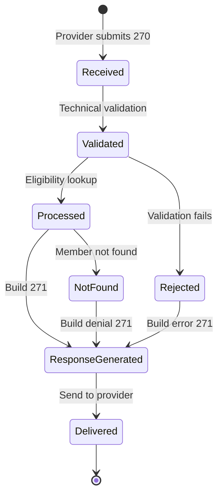
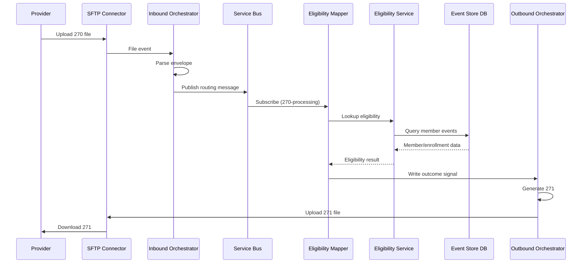
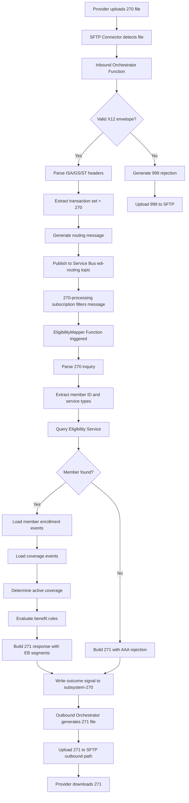
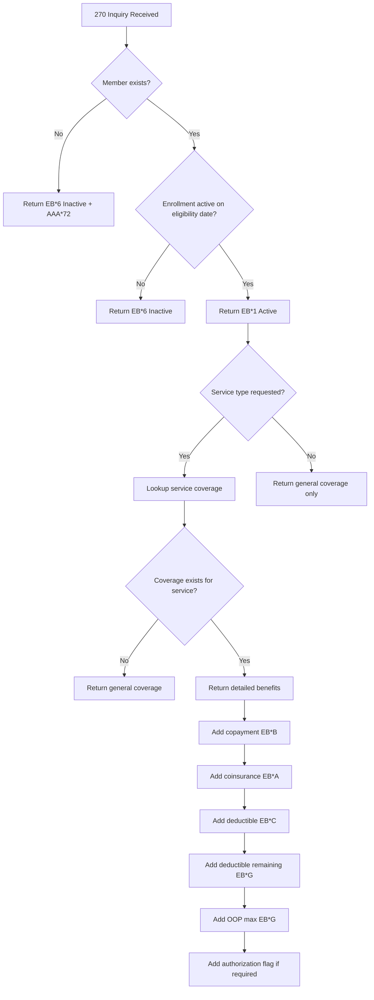

# EDI 270/271 Eligibility Transaction Flow

**Document Version**: 1.0  
**Last Updated**: 2025-01-06  
**Status**: Active

---

## Table of Contents

1. [Overview](#1-overview)
2. [Architecture Principles](#2-architecture-principles)
3. [270 Eligibility Inquiry](#3-270-eligibility-inquiry)
4. [271 Eligibility Response](#4-271-eligibility-response)
5. [Processing Flow](#5-processing-flow)
6. [Benefits and Coverage Rules](#6-benefits-and-coverage-rules)
7. [Error Handling](#7-error-handling)
8. [Monitoring and Observability](#8-monitoring-and-observability)
9. [Performance Optimization](#9-performance-optimization)
10. [Summary](#10-summary)

---

## 1. Overview

### 1.1 Purpose

The 270/271 transaction pair enables real-time or near-real-time eligibility and benefits verification for healthcare services. Providers submit 270 inquiries to verify member eligibility, coverage levels, benefit details, and service-specific information before rendering services or submitting claims.

**Key Use Cases:**
- Pre-service eligibility verification
- Real-time benefit inquiries at point of care
- Coverage determination for specific services
- Copayment and deductible lookups
- Authorization requirements identification

### 1.2 Transaction Lifecycle



**Timeline and SLA Targets:**

| Stage | Target | Acknowledgment |
|-------|--------|----------------|
| Technical Validation | < 5 seconds | 999 (syntax) |
| Eligibility Lookup | < 10 seconds | 271 (business response) |
| Response Generation | < 5 seconds | 271 delivered |
| End-to-End | < 30 seconds | Complete cycle |

### 1.3 Key Benefits

| Benefit | Description |
|---------|-------------|
| **Real-Time Verification** | Immediate eligibility confirmation at point of service |
| **Cost Savings** | Reduce claim denials due to eligibility issues |
| **Patient Satisfaction** | Accurate cost estimates and coverage information |
| **Revenue Cycle** | Fewer billing surprises and faster collections |
| **Compliance** | HIPAA-compliant eligibility verification |

### 1.4 Data Sensitivity

- **PHI Sensitivity**: Medium (contains member identifiers but limited clinical detail)
- **Data Elements**: Member ID, subscriber name, date of birth, coverage dates
- **Security Requirements**: Encryption in transit and at rest, audit logging, access controls
- **Retention**: 7 years minimum for HIPAA compliance

---

## 2. Architecture Principles

### 2.1 Core Principles

1. **Low Latency**: Sub-30-second response time for real-time eligibility checks
2. **High Availability**: 99.9% uptime SLA for eligibility service
3. **Scalability**: Handle 1000+ concurrent eligibility requests
4. **Accuracy**: Current eligibility data synchronized with enrollment system
5. **Completeness**: Return comprehensive benefit information when available

### 2.2 Integration Pattern



### 2.3 Trading Partner Configuration

**Eligibility Partner Configuration:**

```json
{
  "partnerCode": "INTERNAL-ELIGIBILITY",
  "name": "Eligibility Service (Internal Partner)",
  "partnerType": "INTERNAL",
  "expectedTransactions": ["270", "271"],
  "direction": "BIDIRECTIONAL",
  "priority": {
    "270": "critical",
    "271": "critical"
  },
  "inboundEndpoint": {
    "endpointType": "SERVICE_BUS_SUBSCRIPTION",
    "subscriptionName": "sub-eligibility-partner",
    "topicName": "edi-routing",
    "filters": ["transactionSet IN ('270')"]
  },
  "outboundEndpoint": {
    "endpointType": "SFTP",
    "sftpHost": "sftp-edi-prod.azurewebsites.net",
    "sftpPath": "/outbound/{partnerCode}/{transactionSet}",
    "filePattern": "{partnerCode}_{transactionSet}_{timestamp}.edi"
  },
  "sla": {
    "responseTimeSeconds": 30,
    "availability": "99.9%",
    "maxRetries": 3
  }
}
```

### 2.4 Core Platform vs. Eligibility Partner

**Core Platform Responsibilities:**
- SFTP ingestion and file validation
- X12 envelope parsing (ISA/GS/ST headers)
- Routing message generation and publishing
- 999 functional acknowledgment generation
- Storage of raw files and processing metadata

**Eligibility Partner Responsibilities:**
- 270 inquiry parsing and extraction
- Member eligibility lookup against Event Store
- Coverage and benefit rule evaluation
- 271 response generation
- Error handling and rejection scenarios
- Real-time performance optimization

---

## 3. 270 Eligibility Inquiry

### 3.1 Transaction Structure

**270 X12 Structure:**

```text
ISA*00*          *00*          *ZZ*PROVIDER      *ZZ*PAYER         *250106*1200*^*00501*000000001*0*P*:~
GS*HS*PROVIDER*PAYER*20250106*1200*1*X*005010X279A1~
ST*270*0001*005010X279A1~
BHT*0022*13*270REQ001*20250106*1200~
HL*1**20*1~ (Information Source - Payer)
NM1*PR*2*PAYER XYZ*****PI*67890~
HL*2*1*21*1~ (Information Receiver - Provider)
NM1*1P*2*PROVIDER CLINIC*****XX*1234567890~
HL*3*2*22*0~ (Subscriber)
TRN*1*270TRACE001*1234567890~
NM1*IL*1*SMITH*JOHN****MI*123456789~
DMG*D8*19800115~
DTP*291*D8*20250106~ (Inquiry date)
EQ*30~ (Health benefit plan coverage)
SE*12*0001~
GE*1*1~
IEA*1*000000001~
```

**Key Segments:**

| Segment | Purpose | Required |
|---------|---------|----------|
| BHT | Beginning of hierarchical transaction | Yes |
| HL | Hierarchical level (Information Source, Receiver, Subscriber) | Yes |
| NM1 | Entity names (Payer, Provider, Subscriber, Dependent) | Yes |
| TRN | Trace number for request/response correlation | Yes |
| DMG | Demographics (DOB, gender) | Situational |
| DTP | Date/time periods (eligibility date, service date) | Yes |
| EQ | Eligibility or benefit inquiry | Yes |
| REF | Reference identification (additional IDs) | Situational |

### 3.2 Inquiry Types (EQ Segment)

**Common EQ01 Service Type Codes:**

| Code | Description | Use Case |
|------|-------------|----------|
| 30 | Health benefit plan coverage | General eligibility |
| 1 | Medical care | Physician visits, procedures |
| 2 | Surgical | Surgical procedures |
| 3 | Consultation | Specialist consultations |
| 4 | Diagnostic X-Ray | Radiology services |
| 5 | Diagnostic Lab | Laboratory tests |
| 6 | Radiation therapy | Cancer treatment |
| 12 | Durable medical equipment | DME coverage |
| 14 | Renal supplies | Dialysis supplies |
| 35 | Dental care | Dental services |
| 47 | Hospital - inpatient | Inpatient admissions |
| 48 | Hospital - outpatient | Outpatient services |
| 86 | Emergency services | ER visits |
| 98 | Professional physician visit | Office visits |

### 3.3 C# Domain Model

```csharp
public class EligibilityInquiry
{
    // BHT segment
    public string TransactionId { get; set; }           // BHT03
    public DateTime InquiryDate { get; set; }           // BHT04
    
    // TRN segment
    public string TraceNumber { get; set; }             // TRN02
    public string OriginatingCompanyId { get; set; }    // TRN03
    
    // Information Source (Payer) - HL*1
    public Payer InformationSource { get; set; }        // NM1*PR
    
    // Information Receiver (Provider) - HL*2
    public Provider InformationReceiver { get; set; }   // NM1*1P or *FA
    
    // Subscriber - HL*3
    public Subscriber Subscriber { get; set; }          // NM1*IL
    public Demographics Demographics { get; set; }      // DMG
    
    // Dependent (if applicable) - HL*4
    public Dependent Dependent { get; set; }            // NM1*03
    
    // Inquiry details
    public DateTime EligibilityDate { get; set; }       // DTP*291
    public DateTime ServiceDate { get; set; }           // DTP*472 (optional)
    public List<ServiceTypeInquiry> ServiceTypes { get; set; }  // EQ segments
    
    // References
    public string ProviderControlNumber { get; set; }   // REF*D9
    public string AdditionalMemberId { get; set; }      // REF*1L or *SY
}

public class ServiceTypeInquiry
{
    public string ServiceTypeCode { get; set; }         // EQ01
    public string CompositeMedicalProcedure { get; set; }  // EQ02 (optional)
    public string CoverageLevelCode { get; set; }       // EQ03 (optional)
    public string InsuranceTypeCode { get; set; }       // EQ04 (optional)
}

public class Subscriber
{
    public string FirstName { get; set; }
    public string LastName { get; set; }
    public string MiddleName { get; set; }
    public string MemberId { get; set; }
    public string IdentifierQualifier { get; set; }     // MI=Member ID
}

public class Demographics
{
    public DateTime DateOfBirth { get; set; }
    public string Gender { get; set; }                  // M, F, U
}
```

### 3.4 Parsing 270 Inquiry

```csharp
public class Inquiry270Parser
{
    private readonly IX12Parser _x12Parser;
    
    public EligibilityInquiry Parse270(string x12Content)
    {
        var envelope = _x12Parser.Parse(x12Content);
        var transaction = envelope.FunctionalGroups
            .SelectMany(g => g.Transactions)
            .FirstOrDefault(t => t.TransactionSet == "270");
        
        if (transaction == null)
            throw new InvalidOperationException("No 270 transaction found");
        
        var inquiry = new EligibilityInquiry();
        
        // Parse BHT segment
        var bht = transaction.GetSegment("BHT");
        inquiry.TransactionId = bht.GetElement(3);
        inquiry.InquiryDate = ParseDate(bht.GetElement(4));
        
        // Parse HL loops
        var hlLoops = transaction.GetHierarchicalLoops();
        
        // HL*1 - Information Source (Payer)
        var sourceLoop = hlLoops.FirstOrDefault(hl => hl.LevelCode == "20");
        inquiry.InformationSource = ParsePayer(sourceLoop);
        
        // HL*2 - Information Receiver (Provider)
        var receiverLoop = hlLoops.FirstOrDefault(hl => hl.LevelCode == "21");
        inquiry.InformationReceiver = ParseProvider(receiverLoop);
        
        // HL*3 - Subscriber
        var subscriberLoop = hlLoops.FirstOrDefault(hl => hl.LevelCode == "22");
        inquiry.TraceNumber = subscriberLoop.GetSegment("TRN").GetElement(2);
        inquiry.Subscriber = ParseSubscriber(subscriberLoop);
        inquiry.Demographics = ParseDemographics(subscriberLoop);
        inquiry.EligibilityDate = ParseEligibilityDate(subscriberLoop);
        inquiry.ServiceTypes = ParseServiceTypes(subscriberLoop);
        
        // HL*4 - Dependent (if present)
        var dependentLoop = hlLoops.FirstOrDefault(hl => hl.LevelCode == "23");
        if (dependentLoop != null)
        {
            inquiry.Dependent = ParseDependent(dependentLoop);
        }
        
        return inquiry;
    }
    
    private List<ServiceTypeInquiry> ParseServiceTypes(HierarchicalLoop loop)
    {
        var serviceTypes = new List<ServiceTypeInquiry>();
        
        foreach (var eqSegment in loop.GetSegments("EQ"))
        {
            serviceTypes.Add(new ServiceTypeInquiry
            {
                ServiceTypeCode = eqSegment.GetElement(1),
                CompositeMedicalProcedure = eqSegment.GetElement(2),
                CoverageLevelCode = eqSegment.GetElement(3),
                InsuranceTypeCode = eqSegment.GetElement(4)
            });
        }
        
        return serviceTypes;
    }
}
```

---

## 4. 271 Eligibility Response

### 4.1 Response Structure

**271 X12 Structure:**

```text
ISA*00*          *00*          *ZZ*PAYER         *ZZ*PROVIDER      *250106*1201*^*00501*000000002*0*P*:~
GS*HB*PAYER*PROVIDER*20250106*1201*2*X*005010X279A1~
ST*271*0001*005010X279A1~
BHT*0022*11*270REQ001*20250106*1201~
HL*1**20*1~ (Information Source - Payer)
NM1*PR*2*PAYER XYZ*****PI*67890~
HL*2*1*21*1~ (Information Receiver - Provider)
NM1*1P*2*PROVIDER CLINIC*****XX*1234567890~
HL*3*2*22*0~ (Subscriber)
TRN*2*270TRACE001*1234567890~
NM1*IL*1*SMITH*JOHN****MI*123456789~
N3*123 MAIN ST~
N4*ANYTOWN*TX*75001~
DMG*D8*19800115*M~
DTP*291*D8*20250106~
EB*1*FAM*30**HEALTH PLUS PLAN~ (Active, Family, Health coverage)
EB*C*IND**30***17.50~ (Co-payment, Individual)
EB*D*IND**30***1000.00~ (Deductible, Individual)
EB*G*IND**30***250.00~ (Deductible remaining)
DTP*346*D8*20250101-20251231~ (Coverage period)
SE*16*0001~
GE*1*2~
IEA*1*000000002~
```

### 4.2 271 Segments in Detail

**EB (Eligibility or Benefit Information) Segment:**

```text
EB*EB01*EB02*EB03*EB04*EB05*EB06*EB07*EB08*EB09*EB10*EB11*EB12*EB13~
```

**Element Descriptions:**

| Element | Name | Example Values | Description |
|---------|------|----------------|-------------|
| EB01 | Eligibility or Benefit Code | 1, 6, C, D, G | 1=Active, 6=Inactive, C=Co-pay, D=Deductible, G=Remaining |
| EB02 | Coverage Level Code | IND, FAM, ESP, EMP | IND=Individual, FAM=Family, ESP=Employee+Spouse |
| EB03 | Service Type Code | 30, 1, 47, 86 | 30=Health Plan, 1=Medical, 47=Inpatient, 86=Emergency |
| EB04 | Insurance Type Code | HLT, DEN, VIS | HLT=Health, DEN=Dental, VIS=Vision |
| EB05 | Plan Coverage Description | "HEALTH PLUS PLAN" | Textual plan description |
| EB06 | Time Period Qualifier | 7, 24, 26, 27 | 7=Hours, 24=Years, 26=Visits, 27=Days |
| EB07 | Benefit Amount | 1000.00, 17.50 | Dollar amount or quantity |
| EB08 | Benefit Percent | 80 | Percentage (e.g., 80% coverage) |
| EB09 | Quantity Qualifier | VS, DY, UN | VS=Visits, DY=Days, UN=Units |
| EB10 | Quantity | 20, 365 | Number of visits, days, etc. |
| EB11 | Authorization Required | Y, N | Y=Yes, N=No |
| EB12 | In Plan Network | Y, N, W | Y=Yes, N=No, W=Not Applicable |
| EB13 | Procedure Code | 99213, D0120 | CPT/HCPCS/CDT code |

**Common EB01 Codes:**

| Code | Description | Use Case |
|------|-------------|----------|
| 1 | Active Coverage | Member has active coverage on eligibility date |
| 2 | Active - Full Risk Capitation | Managed care plan |
| 3 | Active - Services Capitated | Specific services capitated |
| 4 | Active - Services Capitated to Primary Care | PCP capitated |
| 5 | Active - Pending Investigation | Coverage under review |
| 6 | Inactive | No coverage on eligibility date |
| 7 | Inactive - Pending Eligibility Update | Coverage expired, renewal pending |
| 8 | Inactive - Pending Investigation | Coverage suspended |
| A | Co-insurance | Percentage patient pays |
| B | Co-payment | Fixed dollar amount |
| C | Deductible | Annual deductible amount |
| CB | Coverage Basis | Coverage type/basis |
| D | Benefit Description | Textual benefit description |
| E | Exclusions | Services not covered |
| F | Limitations | Service limitations |
| G | Out of Pocket (Stop Loss) | Max patient responsibility |
| I | Non-Covered | Service/procedure not covered |

**Common EB02 Coverage Level Codes:**

| Code | Description |
|------|-------------|
| CHD | Children Only |
| DEP | Dependents Only |
| ECH | Employee and Children |
| EMP | Employee Only |
| ESP | Employee and Spouse |
| FAM | Family |
| IND | Individual |
| SPC | Spouse and Children |
| SPO | Spouse Only |

### 4.3 C# Domain Model

```csharp
public class EligibilityResponse
{
    // BHT segment
    public string TransactionId { get; set; }           // BHT03 (echo from 270)
    public DateTime ResponseDate { get; set; }          // BHT04
    
    // TRN segment
    public string TraceNumber { get; set; }             // TRN02 (echo from 270)
    public string OriginatingCompanyId { get; set; }    // TRN03
    
    // Information Source (Payer) - HL*1
    public Payer InformationSource { get; set; }        // NM1*PR
    
    // Information Receiver (Provider) - HL*2
    public Provider InformationReceiver { get; set; }   // NM1*1P
    
    // Subscriber - HL*3
    public Subscriber Subscriber { get; set; }          // NM1*IL
    public Address SubscriberAddress { get; set; }      // N3/N4
    public Demographics Demographics { get; set; }      // DMG
    
    // Eligibility results
    public List<EligibilityBenefit> Benefits { get; set; }  // EB segments
    public List<ResponseMessage> Messages { get; set; }     // MSG segments
    public List<ErrorRejection> Errors { get; set; }        // AAA segments
    
    // Dependent (if applicable) - HL*4
    public Dependent Dependent { get; set; }
    public List<EligibilityBenefit> DependentBenefits { get; set; }
}

public class EligibilityBenefit
{
    public string EligibilityCode { get; set; }        // EB01
    public string CoverageLevelCode { get; set; }      // EB02
    public string ServiceTypeCode { get; set; }        // EB03
    public string InsuranceTypeCode { get; set; }      // EB04
    public string PlanDescription { get; set; }        // EB05
    public string TimePeriodQualifier { get; set; }    // EB06
    public decimal? BenefitAmount { get; set; }        // EB07
    public decimal? BenefitPercent { get; set; }       // EB08
    public string QuantityQualifier { get; set; }      // EB09
    public decimal? Quantity { get; set; }             // EB10
    public bool? AuthorizationRequired { get; set; }   // EB11
    public bool? InPlanNetwork { get; set; }           // EB12
    public string ProcedureCode { get; set; }          // EB13
    
    // Associated DTP segment (coverage dates)
    public DateTime? CoverageStartDate { get; set; }
    public DateTime? CoverageEndDate { get; set; }
}

public class ResponseMessage
{
    public string FreeFormMessage { get; set; }        // MSG01
}

public class ErrorRejection
{
    public bool IsValid { get; set; }                  // AAA01 (Y/N)
    public string AgencyQualifier { get; set; }        // AAA02
    public string RejectReasonCode { get; set; }       // AAA03
    public string FollowUpActionCode { get; set; }     // AAA04
}
```

### 4.4 Generating 271 Response

```csharp
public class Response271Generator
{
    private readonly IX12Builder _x12Builder;
    
    public string Generate271(
        EligibilityInquiry inquiry,
        EligibilityResult eligibilityResult)
    {
        var envelope = _x12Builder.CreateEnvelope();
        
        // ISA/GS headers
        envelope.SetInterchangeSender("PAYER");
        envelope.SetInterchangeReceiver(inquiry.InformationReceiver.SubmitterId);
        
        var functionalGroup = envelope.AddFunctionalGroup("HB"); // Health Benefit Response
        var transaction = functionalGroup.AddTransaction("271");
        
        // BHT - Echo from 270
        transaction.AddSegment("BHT")
            .AddElement("0022")  // Structure
            .AddElement("11")    // Purpose: Response
            .AddElement(inquiry.TransactionId)
            .AddElement(DateTime.Now.ToString("yyyyMMdd"))
            .AddElement(DateTime.Now.ToString("HHmm"));
        
        // HL*1 - Information Source (Payer)
        var hlCounter = 1;
        transaction.AddSegment("HL")
            .AddElement(hlCounter.ToString())
            .AddElement("")      // No parent
            .AddElement("20")    // Information Source
            .AddElement("1");    // Has children
        
        transaction.AddSegment("NM1")
            .AddElement("PR")    // Payer
            .AddElement("2")     // Organization
            .AddElement(eligibilityResult.PayerName)
            .AddElement("")
            .AddElement("")
            .AddElement("")
            .AddElement("")
            .AddElement("PI")    // Payer Identification
            .AddElement(eligibilityResult.PayerId);
        
        // HL*2 - Information Receiver (Provider)
        hlCounter++;
        transaction.AddSegment("HL")
            .AddElement(hlCounter.ToString())
            .AddElement("1")     // Parent HL
            .AddElement("21")    // Information Receiver
            .AddElement("1");    // Has children
        
        transaction.AddSegment("NM1")
            .AddElement("1P")    // Provider
            .AddElement("2")     // Organization
            .AddElement(inquiry.InformationReceiver.Name)
            .AddElement("")
            .AddElement("")
            .AddElement("")
            .AddElement("")
            .AddElement("XX")    // NPI
            .AddElement(inquiry.InformationReceiver.Npi);
        
        // HL*3 - Subscriber
        hlCounter++;
        transaction.AddSegment("HL")
            .AddElement(hlCounter.ToString())
            .AddElement("2")     // Parent HL
            .AddElement("22")    // Subscriber
            .AddElement("0");    // No children (or "1" if dependent)
        
        // TRN - Echo trace number
        transaction.AddSegment("TRN")
            .AddElement("2")     // Trace Type: Referenced Transaction Trace Number
            .AddElement(inquiry.TraceNumber)
            .AddElement(inquiry.OriginatingCompanyId);
        
        // NM1 - Subscriber name
        transaction.AddSegment("NM1")
            .AddElement("IL")    // Insured/Subscriber
            .AddElement("1")     // Person
            .AddElement(inquiry.Subscriber.LastName)
            .AddElement(inquiry.Subscriber.FirstName)
            .AddElement(inquiry.Subscriber.MiddleName ?? "")
            .AddElement("")
            .AddElement("")
            .AddElement("MI")    // Member Identification Number
            .AddElement(inquiry.Subscriber.MemberId);
        
        // N3/N4 - Subscriber address
        if (eligibilityResult.SubscriberAddress != null)
        {
            transaction.AddSegment("N3")
                .AddElement(eligibilityResult.SubscriberAddress.Street);
            
            transaction.AddSegment("N4")
                .AddElement(eligibilityResult.SubscriberAddress.City)
                .AddElement(eligibilityResult.SubscriberAddress.State)
                .AddElement(eligibilityResult.SubscriberAddress.Zip);
        }
        
        // DMG - Demographics
        transaction.AddSegment("DMG")
            .AddElement("D8")    // Date format
            .AddElement(inquiry.Demographics.DateOfBirth.ToString("yyyyMMdd"))
            .AddElement(inquiry.Demographics.Gender);
        
        // DTP - Eligibility date
        transaction.AddSegment("DTP")
            .AddElement("291")   // Plan Begin
            .AddElement("D8")    // Date format
            .AddElement(inquiry.EligibilityDate.ToString("yyyyMMdd"));
        
        // EB segments - Benefits
        AddBenefitSegments(transaction, eligibilityResult.Benefits);
        
        // MSG segments - Messages
        foreach (var message in eligibilityResult.Messages)
        {
            transaction.AddSegment("MSG")
                .AddElement(message.Text);
        }
        
        // AAA segments - Errors/Rejections
        if (!eligibilityResult.IsValid)
        {
            foreach (var error in eligibilityResult.Errors)
            {
                transaction.AddSegment("AAA")
                    .AddElement("N")     // Not valid
                    .AddElement("")
                    .AddElement(error.RejectReasonCode)
                    .AddElement(error.FollowUpActionCode);
            }
        }
        
        return envelope.ToString();
    }
    
    private void AddBenefitSegments(
        Transaction transaction,
        List<BenefitDetail> benefits)
    {
        foreach (var benefit in benefits)
        {
            var eb = transaction.AddSegment("EB")
                .AddElement(benefit.EligibilityCode)      // EB01
                .AddElement(benefit.CoverageLevelCode)    // EB02
                .AddElement(benefit.ServiceTypeCode)      // EB03
                .AddElement(benefit.InsuranceTypeCode)    // EB04
                .AddElement(benefit.PlanDescription);     // EB05
            
            if (benefit.BenefitAmount.HasValue)
            {
                eb.AddElement(benefit.TimePeriodQualifier)  // EB06
                  .AddElement(benefit.BenefitAmount.Value.ToString("F2"));  // EB07
            }
            else
            {
                eb.AddElement("")
                  .AddElement("");
            }
            
            if (benefit.BenefitPercent.HasValue)
            {
                eb.AddElement(benefit.BenefitPercent.Value.ToString("F0"));  // EB08
            }
            else
            {
                eb.AddElement("");
            }
            
            // EB09-EB13
            eb.AddElement(benefit.QuantityQualifier ?? "")
              .AddElement(benefit.Quantity?.ToString() ?? "")
              .AddElement(benefit.AuthorizationRequired.HasValue 
                  ? (benefit.AuthorizationRequired.Value ? "Y" : "N") 
                  : "")
              .AddElement(benefit.InPlanNetwork.HasValue 
                  ? (benefit.InPlanNetwork.Value ? "Y" : "N") 
                  : "")
              .AddElement(benefit.ProcedureCode ?? "");
            
            // DTP - Coverage dates
            if (benefit.CoverageStartDate.HasValue && benefit.CoverageEndDate.HasValue)
            {
                transaction.AddSegment("DTP")
                    .AddElement("346")   // Plan Coverage Period
                    .AddElement("D8")
                    .AddElement($"{benefit.CoverageStartDate:yyyyMMdd}-{benefit.CoverageEndDate:yyyyMMdd}");
            }
        }
    }
}
```

---

## 5. Processing Flow

### 5.1 End-to-End Flow



### 5.2 Eligibility Mapper Function

```csharp
public class EligibilityMapperFunction
{
    private readonly ILogger<EligibilityMapperFunction> _logger;
    private readonly IBlobStorageService _blobStorage;
    private readonly Inquiry270Parser _inquiryParser;
    private readonly IEligibilityService _eligibilityService;
    private readonly Response271Generator _responseGenerator;
    private readonly IEventStoreRepository _eventStore;
    
    public EligibilityMapperFunction(
        ILogger<EligibilityMapperFunction> logger,
        IBlobStorageService blobStorage,
        Inquiry270Parser inquiryParser,
        IEligibilityService eligibilityService,
        Response271Generator responseGenerator,
        IEventStoreRepository eventStore)
    {
        _logger = logger;
        _blobStorage = blobStorage;
        _inquiryParser = inquiryParser;
        _eligibilityService = eligibilityService;
        _responseGenerator = responseGenerator;
        _eventStore = eventStore;
    }
    
    [Function("EligibilityInquiryProcessor")]
    public async Task Run(
        [ServiceBusTrigger("edi-routing", "270-processing", Connection = "ServiceBusConnection")]
        ServiceBusReceivedMessage message,
        ServiceBusMessageActions messageActions,
        CancellationToken cancellationToken)
    {
        var routingMessage = JsonSerializer.Deserialize<RoutingMessage>(
            Encoding.UTF8.GetString(message.Body));
        
        _logger.LogInformation(
            "Processing 270 inquiry. ControlNumber: {ControlNumber}, TransactionId: {TransactionId}",
            routingMessage.InterchangeControlNumber,
            routingMessage.TransactionControlNumber);
        
        try
        {
            // 1. Download 270 file from blob storage
            var x12Content = await _blobStorage.DownloadTextAsync(
                "raw",
                routingMessage.BlobPath,
                cancellationToken);
            
            // 2. Parse 270 inquiry
            var inquiry = _inquiryParser.Parse270(x12Content);
            
            // 3. Validate inquiry
            var validationResult = ValidateInquiry(inquiry);
            if (!validationResult.IsValid)
            {
                await GenerateRejection271(inquiry, validationResult, routingMessage);
                await messageActions.CompleteMessageAsync(message, cancellationToken);
                return;
            }
            
            // 4. Lookup eligibility
            var eligibilityResult = await _eligibilityService.CheckEligibilityAsync(
                inquiry.Subscriber.MemberId,
                inquiry.EligibilityDate,
                inquiry.ServiceTypes.Select(st => st.ServiceTypeCode).ToList(),
                cancellationToken);
            
            // 5. Generate 271 response
            var response271 = _responseGenerator.Generate271(inquiry, eligibilityResult);
            
            // 6. Write outcome signal to subsystem-270 container
            var outcomeFilename = $"271_{routingMessage.InterchangeControlNumber}_{DateTime.UtcNow:yyyyMMddHHmmss}.edi";
            await _blobStorage.UploadTextAsync(
                "subsystem-270",
                outcomeFilename,
                response271,
                cancellationToken);
            
            // 7. Store processing event
            await _eventStore.AppendAsync(
                "transaction-processing",
                routingMessage.TransactionControlNumber,
                new EligibilityProcessedEvent
                {
                    TransactionId = routingMessage.TransactionControlNumber,
                    MemberId = inquiry.Subscriber.MemberId,
                    EligibilityDate = inquiry.EligibilityDate,
                    IsEligible = eligibilityResult.IsActive,
                    ProcessedAt = DateTime.UtcNow,
                    ResponseFile = outcomeFilename
                },
                cancellationToken);
            
            _logger.LogInformation(
                "270 inquiry processed successfully. Member: {MemberId}, Eligible: {IsEligible}",
                inquiry.Subscriber.MemberId,
                eligibilityResult.IsActive);
            
            await messageActions.CompleteMessageAsync(message, cancellationToken);
        }
        catch (Exception ex)
        {
            _logger.LogError(ex, "Error processing 270 inquiry");
            
            // Dead-letter message for manual review
            await messageActions.DeadLetterMessageAsync(
                message,
                deadLetterReason: "ProcessingError",
                deadLetterErrorDescription: ex.Message,
                cancellationToken: cancellationToken);
        }
    }
    
    private ValidationResult ValidateInquiry(EligibilityInquiry inquiry)
    {
        var result = new ValidationResult { IsValid = true };
        
        // Required fields
        if (string.IsNullOrEmpty(inquiry.Subscriber?.MemberId))
        {
            result.IsValid = false;
            result.Errors.Add(new ValidationError
            {
                Code = "E001",
                Description = "Subscriber Member ID is required"
            });
        }
        
        if (inquiry.EligibilityDate == default)
        {
            result.IsValid = false;
            result.Errors.Add(new ValidationError
            {
                Code = "E002",
                Description = "Eligibility date is required"
            });
        }
        
        // Future date check
        if (inquiry.EligibilityDate > DateTime.Today.AddDays(30))
        {
            result.IsValid = false;
            result.Errors.Add(new ValidationError
            {
                Code = "E003",
                Description = "Eligibility date cannot be more than 30 days in the future"
            });
        }
        
        return result;
    }
    
    private async Task GenerateRejection271(
        EligibilityInquiry inquiry,
        ValidationResult validationResult,
        RoutingMessage routingMessage)
    {
        var rejectionResult = new EligibilityResult
        {
            IsValid = false,
            IsActive = false,
            Errors = validationResult.Errors.Select(e => new EligibilityError
            {
                RejectReasonCode = e.Code,
                FollowUpActionCode = "C",  // Correct and resubmit
                Description = e.Description
            }).ToList()
        };
        
        var response271 = _responseGenerator.Generate271(inquiry, rejectionResult);
        
        var outcomeFilename = $"271_REJECT_{routingMessage.InterchangeControlNumber}_{DateTime.UtcNow:yyyyMMddHHmmss}.edi";
        await _blobStorage.UploadTextAsync(
            "subsystem-270",
            outcomeFilename,
            response271);
    }
}
```

### 5.3 Eligibility Service Implementation

```csharp
public class EligibilityService : IEligibilityService
{
    private readonly IEventStoreRepository _eventStore;
    private readonly ILogger<EligibilityService> _logger;
    
    public async Task<EligibilityResult> CheckEligibilityAsync(
        string memberId,
        DateTime eligibilityDate,
        List<string> serviceTypeCodes,
        CancellationToken cancellationToken = default)
    {
        // 1. Load member entity from event store
        var member = await LoadMemberAsync(memberId, cancellationToken);
        if (member == null)
        {
            return new EligibilityResult
            {
                IsValid = false,
                IsActive = false,
                Errors = new List<EligibilityError>
                {
                    new EligibilityError
                    {
                        RejectReasonCode = "72",  // Invalid/Missing Subscriber ID
                        FollowUpActionCode = "C",
                        Description = $"Member ID {memberId} not found"
                    }
                }
            };
        }
        
        // 2. Load enrollment entity
        var enrollment = await LoadEnrollmentAsync(memberId, eligibilityDate, cancellationToken);
        if (enrollment == null || !enrollment.IsActive(eligibilityDate))
        {
            return new EligibilityResult
            {
                IsValid = true,
                IsActive = false,
                PayerId = "PAYER123",
                PayerName = "Health Insurance Corp",
                Benefits = new List<BenefitDetail>
                {
                    new BenefitDetail
                    {
                        EligibilityCode = "6",  // Inactive
                        CoverageLevelCode = "IND",
                        ServiceTypeCode = "30",
                        PlanDescription = "No active coverage"
                    }
                }
            };
        }
        
        // 3. Load coverage details
        var coverage = await LoadCoverageAsync(memberId, eligibilityDate, cancellationToken);
        
        // 4. Build benefit segments for each service type requested
        var benefits = new List<BenefitDetail>();
        
        // Active coverage indicator
        benefits.Add(new BenefitDetail
        {
            EligibilityCode = "1",  // Active
            CoverageLevelCode = enrollment.CoverageLevel,
            ServiceTypeCode = "30",  // Health Benefit Plan Coverage
            PlanDescription = enrollment.PlanName,
            CoverageStartDate = enrollment.EffectiveDate,
            CoverageEndDate = enrollment.TerminationDate ?? DateTime.MaxValue
        });
        
        // Service-specific benefits
        foreach (var serviceTypeCode in serviceTypeCodes)
        {
            var serviceBenefits = BuildServiceBenefits(
                serviceTypeCode,
                coverage,
                enrollment,
                eligibilityDate);
            benefits.AddRange(serviceBenefits);
        }
        
        return new EligibilityResult
        {
            IsValid = true,
            IsActive = true,
            PayerId = enrollment.PayerId,
            PayerName = enrollment.PayerName,
            SubscriberAddress = member.Address,
            Benefits = benefits,
            Messages = new List<string>
            {
                "Coverage verified for eligibility date"
            }
        };
    }
    
    private async Task<Member> LoadMemberAsync(
        string memberId,
        CancellationToken cancellationToken)
    {
        var events = await _eventStore.LoadEventsAsync(
            "member",
            memberId,
            cancellationToken);
        
        if (!events.Any())
            return null;
        
        var member = new Member();
        member.ApplyEvents(events);
        return member;
    }
    
    private async Task<Enrollment> LoadEnrollmentAsync(
        string memberId,
        DateTime asOfDate,
        CancellationToken cancellationToken)
    {
        var events = await _eventStore.LoadEventsAsync(
            "enrollment",
            memberId,
            cancellationToken);
        
        if (!events.Any())
            return null;
        
        var enrollment = new Enrollment();
        enrollment.ApplyEvents(events);
        
        // Return enrollment active on the eligibility date
        return enrollment.IsActive(asOfDate) ? enrollment : null;
    }
    
    private async Task<MemberCoverage> LoadCoverageAsync(
        string memberId,
        DateTime asOfDate,
        CancellationToken cancellationToken)
    {
        var events = await _eventStore.LoadEventsAsync(
            "coverage",
            memberId,
            cancellationToken);
        
        if (!events.Any())
            return null;
        
        var coverage = new MemberCoverage();
        coverage.ApplyEvents(events);
        return coverage;
    }
    
    private List<BenefitDetail> BuildServiceBenefits(
        string serviceTypeCode,
        MemberCoverage coverage,
        Enrollment enrollment,
        DateTime eligibilityDate)
    {
        var benefits = new List<BenefitDetail>();
        
        // Get service-specific coverage rules
        var serviceCoverage = coverage?.ServiceCoverages
            .FirstOrDefault(sc => sc.ServiceTypeCode == serviceTypeCode);
        
        if (serviceCoverage == null)
        {
            // Default coverage if no specific rules
            benefits.Add(new BenefitDetail
            {
                EligibilityCode = "1",
                CoverageLevelCode = enrollment.CoverageLevel,
                ServiceTypeCode = serviceTypeCode,
                PlanDescription = enrollment.PlanName
            });
            return benefits;
        }
        
        // Co-payment
        if (serviceCoverage.Copayment > 0)
        {
            benefits.Add(new BenefitDetail
            {
                EligibilityCode = "B",  // Co-payment
                CoverageLevelCode = "IND",
                ServiceTypeCode = serviceTypeCode,
                BenefitAmount = serviceCoverage.Copayment,
                InPlanNetwork = true
            });
        }
        
        // Coinsurance
        if (serviceCoverage.CoinsurancePercent > 0)
        {
            benefits.Add(new BenefitDetail
            {
                EligibilityCode = "A",  // Co-insurance
                CoverageLevelCode = "IND",
                ServiceTypeCode = serviceTypeCode,
                BenefitPercent = serviceCoverage.CoinsurancePercent,
                InPlanNetwork = true
            });
        }
        
        // Deductible
        if (coverage.AnnualDeductible > 0)
        {
            benefits.Add(new BenefitDetail
            {
                EligibilityCode = "C",  // Deductible
                CoverageLevelCode = enrollment.CoverageLevel,
                ServiceTypeCode = serviceTypeCode,
                BenefitAmount = coverage.AnnualDeductible,
                TimePeriodQualifier = "27"  // Calendar Year
            });
        }
        
        // Deductible remaining
        var deductibleMet = coverage.DeductibleMet ?? 0;
        var deductibleRemaining = coverage.AnnualDeductible - deductibleMet;
        if (deductibleRemaining > 0)
        {
            benefits.Add(new BenefitDetail
            {
                EligibilityCode = "G",  // Out of Pocket Remaining
                CoverageLevelCode = enrollment.CoverageLevel,
                ServiceTypeCode = serviceTypeCode,
                BenefitAmount = deductibleRemaining,
                TimePeriodQualifier = "27"
            });
        }
        
        // Out-of-pocket maximum
        if (coverage.OutOfPocketMax > 0)
        {
            benefits.Add(new BenefitDetail
            {
                EligibilityCode = "G",  // Out of Pocket Stop Loss
                CoverageLevelCode = enrollment.CoverageLevel,
                ServiceTypeCode = serviceTypeCode,
                BenefitAmount = coverage.OutOfPocketMax,
                TimePeriodQualifier = "27"
            });
        }
        
        // Authorization required
        if (serviceCoverage.RequiresAuthorization)
        {
            benefits.Add(new BenefitDetail
            {
                EligibilityCode = "1",
                CoverageLevelCode = enrollment.CoverageLevel,
                ServiceTypeCode = serviceTypeCode,
                AuthorizationRequired = true
            });
        }
        
        return benefits;
    }
}
```

---

## 6. Benefits and Coverage Rules

### 6.1 Coverage Determination Logic

**Decision Tree:**



### 6.2 Common Coverage Scenarios

**Scenario 1: Active Coverage, General Inquiry**

```text
270 Request:
  EQ*30~ (Health benefit plan coverage)

271 Response:
  EB*1*FAM*30**HEALTH PLUS GOLD PLAN~
  DTP*346*D8*20250101-20251231~
```

**Scenario 2: Active Coverage, Medical Services Inquiry**

```text
270 Request:
  EQ*1~ (Medical care)

271 Response:
  EB*1*FAM*30**HEALTH PLUS GOLD PLAN~
  DTP*346*D8*20250101-20251231~
  EB*B*IND*1***25.00~ (Copayment $25)
  EB*A*IND*1**20~ (Coinsurance 20%)
  EB*C*FAM*1***2000.00~ (Deductible $2,000)
  EB*G*FAM*1***1200.00~ (Remaining deductible $1,200)
```

**Scenario 3: Inactive Coverage**

```text
270 Request:
  EQ*30~

271 Response:
  EB*6*IND*30**NO ACTIVE COVERAGE~
  AAA*N**79~ (Not valid, Certification/coverage terminated)
```

**Scenario 4: Authorization Required**

```text
271 Response:
  EB*1*FAM*30**HEALTH PLUS GOLD PLAN~
  EB*1*IND*2***Y*Y~ (Surgical, Auth required, In-network)
  MSG*Authorization required for surgical procedures~
```

**Scenario 5: Service Not Covered**

```text
271 Response:
  EB*I*IND*86~ (Non-covered, Emergency services)
  MSG*Emergency services not covered under this plan~
```

### 6.3 Benefit Rules Engine

```csharp
public class BenefitRulesEngine
{
    private readonly Dictionary<string, ServiceCoverageRules> _serviceRules;
    
    public BenefitRulesEngine()
    {
        _serviceRules = new Dictionary<string, ServiceCoverageRules>
        {
            ["1"] = new ServiceCoverageRules  // Medical Care
            {
                ServiceTypeCode = "1",
                IsCovered = true,
                RequiresAuthorization = false,
                Copayment = 25.00m,
                CoinsurancePercent = 20,
                AppliesDeductible = true
            },
            ["2"] = new ServiceCoverageRules  // Surgical
            {
                ServiceTypeCode = "2",
                IsCovered = true,
                RequiresAuthorization = true,
                Copayment = 0,
                CoinsurancePercent = 10,
                AppliesDeductible = true
            },
            ["35"] = new ServiceCoverageRules  // Dental Care
            {
                ServiceTypeCode = "35",
                IsCovered = false,
                RequiresAuthorization = false,
                Message = "Dental care not covered under medical plan"
            },
            ["47"] = new ServiceCoverageRules  // Hospital Inpatient
            {
                ServiceTypeCode = "47",
                IsCovered = true,
                RequiresAuthorization = true,
                Copayment = 500.00m,
                CoinsurancePercent = 0,
                AppliesDeductible = true
            },
            ["86"] = new ServiceCoverageRules  // Emergency Services
            {
                ServiceTypeCode = "86",
                IsCovered = true,
                RequiresAuthorization = false,
                Copayment = 250.00m,
                CoinsurancePercent = 0,
                AppliesDeductible = false,
                Message = "Emergency copay waived if admitted"
            }
        };
    }
    
    public ServiceCoverageRules GetRules(string serviceTypeCode)
    {
        if (_serviceRules.TryGetValue(serviceTypeCode, out var rules))
            return rules;
        
        // Default rules for unknown service types
        return new ServiceCoverageRules
        {
            ServiceTypeCode = serviceTypeCode,
            IsCovered = true,
            RequiresAuthorization = false,
            Message = "Contact customer service for benefit details"
        };
    }
}

public class ServiceCoverageRules
{
    public string ServiceTypeCode { get; set; }
    public bool IsCovered { get; set; }
    public bool RequiresAuthorization { get; set; }
    public decimal Copayment { get; set; }
    public decimal CoinsurancePercent { get; set; }
    public bool AppliesDeductible { get; set; }
    public string Message { get; set; }
}
```

---

## 7. Error Handling

### 7.1 AAA Segment (Request Validation)

**Common AAA Reject Reason Codes:**

| Code | Description | Recommended Action |
|------|-------------|-------------------|
| 41 | Authorization Required | Contact payer for authorization |
| 42 | Unable to Respond | System unavailable, retry later |
| 43 | Invalid/Missing Provider ID | Verify provider NPI |
| 56 | Inappropriate Product/Service ID | Check service type code |
| 57 | Payer ID Invalid | Verify payer identification |
| 58 | Invalid/Missing Date of Birth | Correct subscriber DOB |
| 71 | Patient Birth Date Does Not Match | Verify demographics |
| 72 | Invalid/Missing Subscriber ID | Verify member ID |
| 73 | Invalid/Missing Subscriber Name | Correct subscriber name |
| 74 | Invalid/Missing Provider Name | Verify provider information |
| 75 | Invalid/Missing Subscriber Address | Update address |
| 76 | Invalid/Missing Provider Primary ID | Verify provider NPI |
| 78 | Duplicate Inquiry | Request already processed |
| 79 | Certification/Coverage Terminated | Coverage ended |

### 7.2 Error Response Examples

**Member Not Found:**

```text
ST*271*0001~
BHT*0022*11*270REQ001*20250106*1201~
HL*1**20*1~
NM1*PR*2*PAYER XYZ*****PI*67890~
HL*2*1*21*1~
NM1*1P*2*PROVIDER CLINIC*****XX*1234567890~
HL*3*2*22*0~
TRN*2*270TRACE001*1234567890~
NM1*IL*1*SMITH*JOHN****MI*123456789~
AAA*N**72*C~ (Invalid subscriber ID, Correct and resubmit)
MSG*Member ID not found in system~
SE*10*0001~
```

**Coverage Terminated:**

```text
HL*3*2*22*0~
TRN*2*270TRACE001*1234567890~
NM1*IL*1*SMITH*JOHN****MI*123456789~
EB*6*IND*30**NO COVERAGE~ (Inactive)
AAA*N**79*R~ (Coverage terminated, Resubmit with corrected data)
MSG*Coverage terminated effective 20241231~
DTP*346*D8*20240101-20241231~ (Coverage period ended)
```

**System Unavailable:**

```text
AAA*N**42*R~ (Unable to respond, Resubmit)
MSG*Eligibility system temporarily unavailable. Please retry~
```

### 7.3 Error Handling in Code

```csharp
public class EligibilityErrorHandler
{
    public List<EligibilityError> HandleMemberNotFound(string memberId)
    {
        return new List<EligibilityError>
        {
            new EligibilityError
            {
                RejectReasonCode = "72",
                FollowUpActionCode = "C",
                Description = $"Member ID {memberId} not found",
                AaaSegment = "AAA*N**72*C~"
            }
        };
    }
    
    public List<EligibilityError> HandleCoverageTerminated(
        string memberId,
        DateTime terminationDate)
    {
        return new List<EligibilityError>
        {
            new EligibilityError
            {
                RejectReasonCode = "79",
                FollowUpActionCode = "R",
                Description = $"Coverage terminated effective {terminationDate:yyyy-MM-dd}",
                AaaSegment = "AAA*N**79*R~"
            }
        };
    }
    
    public List<EligibilityError> HandleInvalidDate(DateTime requestedDate)
    {
        return new List<EligibilityError>
        {
            new EligibilityError
            {
                RejectReasonCode = "58",
                FollowUpActionCode = "C",
                Description = $"Invalid eligibility date: {requestedDate:yyyy-MM-dd}",
                AaaSegment = "AAA*N**58*C~"
            }
        };
    }
    
    public List<EligibilityError> HandleSystemUnavailable()
    {
        return new List<EligibilityError>
        {
            new EligibilityError
            {
                RejectReasonCode = "42",
                FollowUpActionCode = "R",
                Description = "Eligibility system temporarily unavailable",
                AaaSegment = "AAA*N**42*R~"
            }
        };
    }
}
```

---

## 8. Monitoring and Observability

### 8.1 Application Insights Metrics

**Custom Metrics:**

| Metric | Type | Description |
|--------|------|-------------|
| `eligibility.inquiry.count` | Counter | Total 270 inquiries received |
| `eligibility.response.count` | Counter | Total 271 responses generated |
| `eligibility.active.count` | Counter | Active coverage responses |
| `eligibility.inactive.count` | Counter | Inactive coverage responses |
| `eligibility.error.count` | Counter | Error responses (AAA segments) |
| `eligibility.processing.duration` | Histogram | Processing time in milliseconds |
| `eligibility.service.type` | Counter | By service type code |

**Custom Dimensions:**

```csharp
public class EligibilityTelemetry
{
    private readonly TelemetryClient _telemetryClient;
    
    public void TrackInquiry(EligibilityInquiry inquiry, EligibilityResult result)
    {
        var properties = new Dictionary<string, string>
        {
            ["MemberId"] = inquiry.Subscriber.MemberId,
            ["EligibilityDate"] = inquiry.EligibilityDate.ToString("yyyy-MM-dd"),
            ["IsActive"] = result.IsActive.ToString(),
            ["ServiceTypes"] = string.Join(",", inquiry.ServiceTypes.Select(st => st.ServiceTypeCode)),
            ["PayerId"] = result.PayerId ?? "UNKNOWN",
            ["TraceNumber"] = inquiry.TraceNumber
        };
        
        var metrics = new Dictionary<string, double>
        {
            ["ServiceTypeCount"] = inquiry.ServiceTypes.Count,
            ["BenefitCount"] = result.Benefits.Count
        };
        
        _telemetryClient.TrackEvent("EligibilityInquiryProcessed", properties, metrics);
        
        // Track metrics
        _telemetryClient.GetMetric("eligibility.inquiry.count").TrackValue(1);
        
        if (result.IsActive)
            _telemetryClient.GetMetric("eligibility.active.count").TrackValue(1);
        else
            _telemetryClient.GetMetric("eligibility.inactive.count").TrackValue(1);
        
        if (!result.IsValid)
            _telemetryClient.GetMetric("eligibility.error.count").TrackValue(1);
        
        foreach (var serviceType in inquiry.ServiceTypes)
        {
            _telemetryClient.GetMetric(
                "eligibility.service.type",
                "ServiceTypeCode").TrackValue(1, serviceType.ServiceTypeCode);
        }
    }
    
    public void TrackProcessingDuration(TimeSpan duration)
    {
        _telemetryClient.GetMetric("eligibility.processing.duration")
            .TrackValue(duration.TotalMilliseconds);
    }
}
```

### 8.2 KQL Monitoring Queries

**270/271 Processing Volume:**

```kql
customMetrics
| where name == "eligibility.inquiry.count"
| summarize InquiryCount = sum(value) by bin(timestamp, 1h)
| render timechart
```

**Active vs Inactive Coverage Rate:**

```kql
let ActiveCount = customMetrics
| where name == "eligibility.active.count"
| summarize Active = sum(value);
let InactiveCount = customMetrics
| where name == "eligibility.inactive.count"
| summarize Inactive = sum(value);
ActiveCount
| extend Inactive = toscalar(InactiveCount)
| extend ActiveRate = Active * 100.0 / (Active + Inactive)
| project ActiveRate, InactiveRate = 100.0 - ActiveRate
```

**Average Processing Time:**

```kql
customMetrics
| where name == "eligibility.processing.duration"
| summarize 
    AvgDuration = avg(value),
    P50Duration = percentile(value, 50),
    P95Duration = percentile(value, 95),
    P99Duration = percentile(value, 99)
| project 
    AvgDuration = round(AvgDuration, 2),
    P50Duration = round(P50Duration, 2),
    P95Duration = round(P95Duration, 2),
    P99Duration = round(P99Duration, 2)
```

**Eligibility by Service Type:**

```kql
customMetrics
| where name == "eligibility.service.type"
| extend ServiceTypeCode = tostring(customDimensions.ServiceTypeCode)
| summarize Count = sum(value) by ServiceTypeCode
| order by Count desc
| render barchart
```

**Error Rate Trending:**

```kql
customMetrics
| where name in ("eligibility.inquiry.count", "eligibility.error.count")
| summarize Count = sum(value) by name, bin(timestamp, 1h)
| evaluate pivot(name, sum(Count))
| extend ErrorRate = eligibility_error_count * 100.0 / eligibility_inquiry_count
| render timechart with (ytitle="Error Rate %")
```

### 8.3 Alerting Rules

**Alert 1: High Error Rate**

```json
{
  "name": "Eligibility-High-Error-Rate",
  "description": "Alert when eligibility error rate exceeds 10%",
  "condition": {
    "query": "customMetrics | where name in ('eligibility.inquiry.count', 'eligibility.error.count') | summarize Total = sumif(value, name == 'eligibility.inquiry.count'), Errors = sumif(value, name == 'eligibility.error.count') | extend ErrorRate = Errors * 100.0 / Total | where ErrorRate > 10",
    "timeAggregation": "Average",
    "threshold": 10,
    "operator": "GreaterThan"
  },
  "evaluationFrequency": "PT5M",
  "windowSize": "PT15M",
  "severity": 2,
  "actionGroups": ["operations-team"]
}
```

**Alert 2: Slow Processing**

```json
{
  "name": "Eligibility-Slow-Processing",
  "description": "Alert when P95 processing time exceeds 10 seconds",
  "condition": {
    "query": "customMetrics | where name == 'eligibility.processing.duration' | summarize P95 = percentile(value, 95) | where P95 > 10000",
    "timeAggregation": "Average",
    "threshold": 10000,
    "operator": "GreaterThan"
  },
  "evaluationFrequency": "PT5M",
  "windowSize": "PT15M",
  "severity": 3,
  "actionGroups": ["operations-team"]
}
```

---

## 9. Performance Optimization

### 9.1 Caching Strategy

**Member Cache:**

```csharp
public class CachedEligibilityService : IEligibilityService
{
    private readonly IEligibilityService _inner;
    private readonly IMemoryCache _cache;
    private readonly TimeSpan _cacheDuration = TimeSpan.FromMinutes(15);
    
    public async Task<EligibilityResult> CheckEligibilityAsync(
        string memberId,
        DateTime eligibilityDate,
        List<string> serviceTypeCodes,
        CancellationToken cancellationToken = default)
    {
        var cacheKey = $"eligibility:{memberId}:{eligibilityDate:yyyyMMdd}:{string.Join(",", serviceTypeCodes.OrderBy(s => s))}";
        
        if (_cache.TryGetValue<EligibilityResult>(cacheKey, out var cachedResult))
        {
            return cachedResult;
        }
        
        var result = await _inner.CheckEligibilityAsync(
            memberId,
            eligibilityDate,
            serviceTypeCodes,
            cancellationToken);
        
        _cache.Set(cacheKey, result, _cacheDuration);
        
        return result;
    }
}
```

### 9.2 Event Store Optimization

**Snapshot Pattern:**

```csharp
public class SnapshotEligibilityService : IEligibilityService
{
    private readonly IEventStoreRepository _eventStore;
    private readonly ISnapshotRepository _snapshots;
    
    private async Task<Member> LoadMemberAsync(
        string memberId,
        CancellationToken cancellationToken)
    {
        // Try loading snapshot first
        var snapshot = await _snapshots.LoadSnapshotAsync<Member>(
            "member",
            memberId,
            cancellationToken);
        
        if (snapshot != null)
        {
            // Load only events after snapshot
            var events = await _eventStore.LoadEventsAsync(
                "member",
                memberId,
                fromVersion: snapshot.Version + 1,
                cancellationToken: cancellationToken);
            
            snapshot.Entity.ApplyEvents(events);
            return snapshot.Entity;
        }
        
        // No snapshot, load all events
        var allEvents = await _eventStore.LoadEventsAsync(
            "member",
            memberId,
            cancellationToken);
        
        var member = new Member();
        member.ApplyEvents(allEvents);
        
        // Save snapshot if many events
        if (allEvents.Count > 100)
        {
            await _snapshots.SaveSnapshotAsync(
                "member",
                memberId,
                member,
                allEvents.Count,
                cancellationToken);
        }
        
        return member;
    }
}
```

### 9.3 Parallel Processing

```csharp
public async Task<EligibilityResult> CheckEligibilityAsync(
    string memberId,
    DateTime eligibilityDate,
    List<string> serviceTypeCodes,
    CancellationToken cancellationToken = default)
{
    // Load member, enrollment, and coverage in parallel
    var memberTask = LoadMemberAsync(memberId, cancellationToken);
    var enrollmentTask = LoadEnrollmentAsync(memberId, eligibilityDate, cancellationToken);
    var coverageTask = LoadCoverageAsync(memberId, eligibilityDate, cancellationToken);
    
    await Task.WhenAll(memberTask, enrollmentTask, coverageTask);
    
    var member = await memberTask;
    var enrollment = await enrollmentTask;
    var coverage = await coverageTask;
    
    // Continue with eligibility determination
    // ...
}
```

---

## 10. Summary

### 10.1 Key Takeaways

1. **Real-Time Verification**: 270/271 transactions provide real-time eligibility verification with sub-30-second response times

2. **Request-Response Pattern**: 270 inquiries are matched with 271 responses using TRN trace numbers for correlation

3. **Comprehensive Benefits**: 271 responses include active coverage status, copayments, coinsurance, deductibles, and authorization requirements

4. **Event Sourcing Integration**: Eligibility lookups query Member, Enrollment, and Coverage entities from the event store

5. **Service-Specific Rules**: Benefit details vary by service type code (medical, surgical, emergency, etc.)

6. **Error Handling**: AAA segments communicate validation errors with standardized reject reason codes

7. **Performance Optimization**: Caching, snapshots, and parallel loading ensure low-latency responses

### 10.2 Integration Points

| System | Purpose | Direction |
|--------|---------|-----------|
| SFTP Connector | File ingestion and delivery | Inbound/Outbound |
| Inbound Orchestrator | X12 parsing and routing | Inbound |
| Service Bus | Message routing (270-processing subscription) | Inbound |
| Event Store DB | Member/enrollment/coverage queries | Read |
| Outbound Orchestrator | 271 file generation | Outbound |

### 10.3 SLA Compliance

| Metric | Target | Monitoring |
|--------|--------|-----------|
| Response Time | < 30 seconds | Application Insights P95 duration |
| Availability | 99.9% | Service Bus queue depth, function failures |
| Accuracy | 99.5% | Error rate, rejection count |
| Throughput | 1000+ concurrent | Service Bus metrics, function concurrency |

### 10.4 Next Steps

- **Document 14**: 835 Payment/Remittance Transaction Flow
- **Document 15**: Implementation Validation and Testing
- **Document 16**: Glossary and Terminology
- **Document 17**: Architecture Decision Records

---

**Document Complete** | Version 1.0 | 2025-01-06
