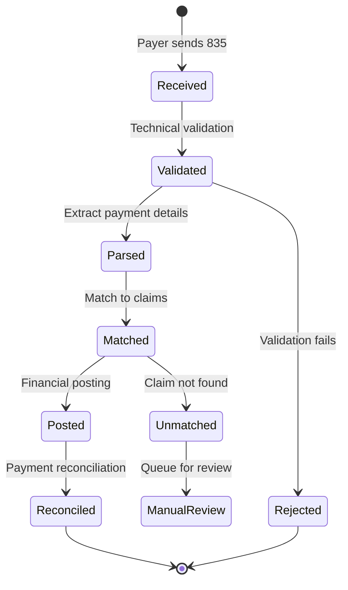
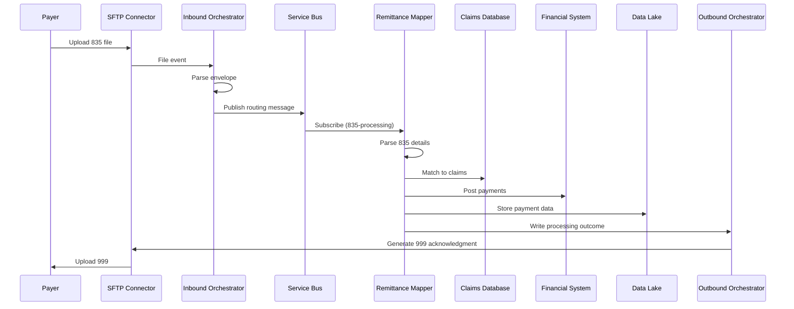
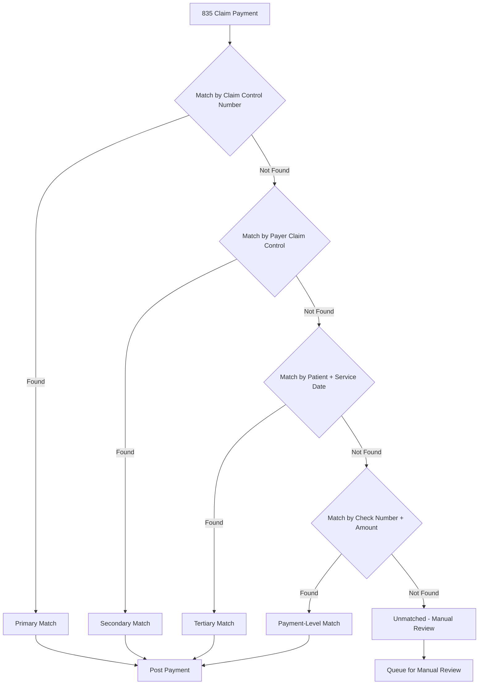

# EDI 835 Payment/Remittance Transaction Flow

**Document Version**: 1.0  
**Last Updated**: 2025-01-06  
**Status**: Active

---

## Table of Contents

1. [Overview](#1-overview)
2. [Architecture Principles](#2-architecture-principles)
3. [835 Transaction Structure](#3-835-transaction-structure)
4. [Payment Parsing and Extraction](#4-payment-parsing-and-extraction)
5. [Claim Matching and Reconciliation](#5-claim-matching-and-reconciliation)
6. [Adjustment Codes and Reason Codes](#6-adjustment-codes-and-reason-codes)
7. [Financial Posting](#7-financial-posting)
8. [Error Handling](#8-error-handling)
9. [Monitoring and Observability](#9-monitoring-and-observability)
10. [Summary](#10-summary)

---

## 1. Overview

### 1.1 Purpose

The 835 Healthcare Claim Payment/Advice (also known as Electronic Remittance Advice or ERA) transaction communicates adjudicated claim payment details from payers to providers. It contains comprehensive information about paid, denied, adjusted, and pending claims, including payment amounts, adjustment reasons, and patient responsibility.

**Key Use Cases:**
- Electronic payment notification and reconciliation
- Claim payment details with adjustment explanations
- Patient responsibility calculation
- Provider-level adjustments and corrections
- Financial posting and accounts receivable updates
- Payment-to-claim matching for revenue cycle management

### 1.2 Transaction Lifecycle



**Timeline and Processing:**

| Stage | Target | Description |
|-------|--------|-------------|
| Technical Validation | < 1 minute | 999 acknowledgment |
| Payment Parsing | < 5 minutes | Extract BPR, CLP, CAS segments |
| Claim Matching | < 10 minutes | Match to original claims |
| Financial Posting | < 15 minutes | Post to AR system |
| Reconciliation | < 30 minutes | Complete cycle |

### 1.3 Key Benefits

| Benefit | Description |
|---------|-------------|
| **Automation** | Reduce manual payment posting by 90%+ |
| **Accuracy** | Eliminate keying errors in payment entry |
| **Speed** | Accelerate cash application from days to minutes |
| **Transparency** | Detailed adjustment reason codes |
| **Reconciliation** | Automated claim-to-payment matching |
| **Analytics** | Denial patterns and reimbursement trends |

### 1.4 Data Sensitivity

- **PHI Sensitivity**: High (contains patient identifiers, claim details, payment amounts)
- **Data Elements**: Patient name/ID, claim numbers, service details, payment amounts
- **Security Requirements**: Encryption, audit logging, access controls, HIPAA compliance
- **Retention**: 7+ years for financial and compliance requirements

---

## 2. Architecture Principles

### 2.1 Core Principles

1. **Accurate Matching**: 99%+ claim matching rate with robust fallback strategies
2. **Complete Reconciliation**: Track every dollar from payment to claim
3. **Adjustment Transparency**: Decode all CAS/RARC/CARC codes with explanations
4. **Financial Integrity**: Prevent duplicate postings, ensure balance validation
5. **Auditability**: Comprehensive audit trail for all payment transactions

### 2.2 Integration Pattern



### 2.3 Trading Partner Configuration

**Remittance Partner Configuration:**

```json
{
  "partnerCode": "INTERNAL-REMITTANCE",
  "name": "Remittance Processing Service (Internal Partner)",
  "partnerType": "INTERNAL",
  "expectedTransactions": ["835"],
  "direction": "INBOUND",
  "priority": {
    "835": "high"
  },
  "inboundEndpoint": {
    "endpointType": "SERVICE_BUS_SUBSCRIPTION",
    "subscriptionName": "sub-remittance-partner",
    "topicName": "edi-routing",
    "filters": ["transactionSet = '835'"]
  },
  "outboundEndpoint": {
    "endpointType": "DATABASE",
    "connectionString": "FinancialSystemDB",
    "procedureName": "usp_PostPayment"
  },
  "sla": {
    "processingTimeMinutes": 30,
    "matchingRate": 99.0,
    "postingAccuracy": 100.0
  },
  "reconciliation": {
    "validateControlTotals": true,
    "requireClaimMatch": true,
    "allowPartialMatches": true,
    "unmatchedHandling": "MANUAL_REVIEW"
  }
}
```

### 2.4 Core Platform vs. Remittance Partner

**Core Platform Responsibilities:**
- SFTP ingestion and file validation
- X12 envelope parsing (ISA/GS/ST headers)
- Routing message generation and publishing
- 999 functional acknowledgment generation
- Storage of raw files and processing metadata

**Remittance Partner Responsibilities:**
- 835 transaction parsing and extraction
- Payment detail extraction (BPR, CLP, CAS, SVC)
- Claim matching against claims database
- Adjustment code decoding and explanation
- Financial posting to AR system
- Payment reconciliation and balance validation
- Unmatched payment handling

---

## 3. 835 Transaction Structure

### 3.1 Transaction Overview

**835 X12 Structure:**

```text
ISA*00*          *00*          *ZZ*PAYER         *ZZ*PROVIDER      *250106*1200*^*00501*000000001*0*P*:~
GS*HP*PAYER*PROVIDER*20250106*1200*1*X*005010X221A1~
ST*835*0001*005010X221A1~
BPR*I*5000.00*C*ACH*CTX*01*123456789*DA*987654321*1234567890**01*654321987*DA*123456*20250106~
TRN*1*12345678901*1234567890~
REF*EV*PAYER123~
DTM*405*20250106~
N1*PR*PAYER XYZ~
N3*123 PAYER STREET~
N4*PAYER CITY*TX*75001~
N1*PE*PROVIDER CLINIC*XX*1234567890~
N3*456 PROVIDER AVE~
N4*PROVIDER CITY*TX*75002~
LX*1~
CLP*CLM001*1*1000.00*800.00**12*CLM001*21*1~
NM1*QC*1*SMITH*JOHN****MI*123456789~
NM1*82*1*JONES*WILLIAM****XX*9876543210~
DTM*232*20241215~
DTM*233*20241220~
CAS*CO*45*150.00**42*50.00~
AMT*AU*1000.00~
SVC*HC:99213*1000.00*800.00**1~
DTM*472*20241215~
CAS*CO*45*150.00**42*50.00~
REF*6R*CLM001-01~
SE*23*0001~
GE*1*1~
IEA*1*000000001~
```

### 3.2 Key Segments

| Segment | Purpose | Cardinality |
|---------|---------|-------------|
| BPR | Financial information (total payment, method, dates) | Required (1) |
| TRN | Check/EFT trace number | Required (1) |
| REF | Payer identification | Situational |
| DTM | Production date | Situational |
| N1 | Payer/Payee names and addresses | Required (2-3) |
| LX | Header number (sequential) | Required for each payment |
| CLP | Claim payment information | Required (1+ per payment) |
| NM1 | Patient, rendering provider names | Situational |
| CAS | Claim adjustment information | Situational |
| AMT | Monetary amounts | Situational |
| SVC | Service line payment | Situational |
| PLB | Provider-level adjustments | Situational |

### 3.3 BPR Segment (Financial Information)

**BPR Segment Structure:**

```text
BPR*I*5000.00*C*ACH*CTX*01*123456789*DA*987654321*1234567890**01*654321987*DA*123456*20250106~
```

**Element Definitions:**

| Element | Name | Example | Description |
|---------|------|---------|-------------|
| BPR01 | Transaction Handling Code | I, C, D, P | I=Information, C=Payment Accompanies, D=Make Payment, P=Prenotification |
| BPR02 | Monetary Amount | 5000.00 | Total actual provider payment amount |
| BPR03 | Credit/Debit Flag | C, D | C=Credit, D=Debit |
| BPR04 | Payment Method Code | ACH, CHK, BOP, FWT | ACH=Automated Clearing House, CHK=Check |
| BPR05 | Payment Format Code | CTX, CCD | CTX=Corporate Trade Exchange |
| BPR06 | DFI ID Qualifier | 01 | 01=ABA Routing Number |
| BPR07 | DFI Identification Number | 123456789 | Bank routing number |
| BPR08 | Account Number Qualifier | DA | DA=Demand Deposit Account |
| BPR09 | Account Number | 987654321 | Bank account number |
| BPR10 | Originating Company Identifier | 1234567890 | Payer company ID |
| BPR12 | Originating DFI Identifier Qualifier | 01 | 01=ABA Routing Number |
| BPR13 | Originating DFI Identification | 654321987 | Originating bank routing |
| BPR14 | Originating Account Number Qualifier | DA | DA=Demand Deposit |
| BPR15 | Originating Account Number | 123456 | Originating account |
| BPR16 | Payment Effective Date | 20250106 | CCYYMMDD format |

### 3.4 CLP Segment (Claim Payment Information)

**CLP Segment Structure:**

```text
CLP*CLM001*1*1000.00*800.00**12*CLM001*21*1~
```

**Element Definitions:**

| Element | Name | Example | Description |
|---------|------|---------|-------------|
| CLP01 | Claim Submitter Identifier | CLM001 | Original claim control number |
| CLP02 | Claim Status Code | 1, 2, 3, 4, 19, 22 | 1=Processed as Primary, 2=Processed as Secondary, 3=Processed as Tertiary, 4=Denied, 19=Processed as Primary/Forwarded, 22=Reversal |
| CLP03 | Total Claim Charge Amount | 1000.00 | Original submitted amount |
| CLP04 | Claim Payment Amount | 800.00 | Actual paid amount |
| CLP05 | Patient Responsibility Amount | 200.00 | Patient owes amount |
| CLP06 | Claim Filing Indicator Code | 12 | 12=Preferred Provider Organization (PPO) |
| CLP07 | Payer Claim Control Number | CLM001 | Payer's internal claim reference |
| CLP08 | Facility Type Code | 21 | 21=Inpatient Hospital |
| CLP09 | Claim Frequency Code | 1 | 1=Original, 7=Replacement, 8=Void |

**Common Claim Status Codes:**

| Code | Description | Action |
|------|-------------|--------|
| 1 | Processed as Primary | Post payment |
| 2 | Processed as Secondary | Post with COB |
| 3 | Processed as Tertiary | Post with COB |
| 4 | Denied | Review denial reason |
| 19 | Processed as Primary, Forwarded to Additional Payer | Post and track secondary |
| 22 | Reversal of Previous Payment | Reverse original posting |

### 3.5 CAS Segment (Claim Adjustment)

**CAS Segment Structure:**

```text
CAS*CO*45*150.00**42*50.00~
```

**Element Definitions:**

| Element | Name | Example | Description |
|---------|------|---------|-------------|
| CAS01 | Claim Adjustment Group Code | CO, PR, OA, PI, CR | CO=Contractual Obligation, PR=Patient Responsibility, OA=Other Adjustments, PI=Payer Initiated, CR=Correction/Reversal |
| CAS02 | Claim Adjustment Reason Code | 45, 42, 97, 1, 2, 3 | Standardized CARC codes |
| CAS03 | Monetary Amount | 150.00 | Adjustment amount |
| CAS05 | Claim Adjustment Reason Code | 42 | Second adjustment reason |
| CAS06 | Monetary Amount | 50.00 | Second adjustment amount |

**Common Adjustment Group Codes:**

| Code | Description | Financial Impact |
|------|-------------|------------------|
| CO | Contractual Obligation | Provider write-off (contractual adjustment) |
| PR | Patient Responsibility | Patient owes (copay, deductible, coinsurance) |
| OA | Other Adjustments | Various adjustments |
| PI | Payer Initiated Reductions | Payer-specific adjustments |
| CR | Corrections and Reversals | Prior payment corrections |

### 3.6 C# Domain Model

```csharp
public class RemittanceAdvice
{
    // BPR segment - Financial information
    public PaymentInformation PaymentInfo { get; set; }
    
    // TRN segment - Trace number
    public string TraceNumber { get; set; }
    public string OriginatingCompanyId { get; set; }
    
    // REF segment - Payer identification
    public string PayerId { get; set; }
    
    // DTM segment - Production date
    public DateTime ProductionDate { get; set; }
    
    // N1 loops - Payer and Payee
    public Payer Payer { get; set; }
    public Payee Payee { get; set; }
    
    // Claim payments
    public List<ClaimPayment> ClaimPayments { get; set; }
    
    // Provider-level adjustments
    public List<ProviderAdjustment> ProviderAdjustments { get; set; }
}

public class PaymentInformation
{
    public string TransactionHandlingCode { get; set; }  // BPR01
    public decimal TotalPaymentAmount { get; set; }      // BPR02
    public string CreditDebitFlag { get; set; }          // BPR03
    public string PaymentMethodCode { get; set; }        // BPR04 (ACH, CHK)
    public string PaymentFormatCode { get; set; }        // BPR05
    
    // Receiver (Provider) Bank Info
    public string ReceiverDFIIdQualifier { get; set; }   // BPR06
    public string ReceiverDFIId { get; set; }            // BPR07 (routing)
    public string ReceiverAccountQualifier { get; set; } // BPR08
    public string ReceiverAccountNumber { get; set; }    // BPR09
    
    // Originator (Payer) Bank Info
    public string OriginatingCompanyId { get; set; }     // BPR10
    public string OriginatorDFIId { get; set; }          // BPR13
    public string OriginatorAccountNumber { get; set; }  // BPR15
    
    public DateTime PaymentEffectiveDate { get; set; }   // BPR16
}

public class ClaimPayment
{
    // CLP segment
    public string ClaimControlNumber { get; set; }       // CLP01
    public string ClaimStatusCode { get; set; }          // CLP02
    public decimal TotalChargeAmount { get; set; }       // CLP03
    public decimal PaymentAmount { get; set; }           // CLP04
    public decimal PatientResponsibility { get; set; }   // CLP05
    public string ClaimFilingIndicator { get; set; }     // CLP06
    public string PayerClaimControlNumber { get; set; }  // CLP07
    public string FacilityTypeCode { get; set; }         // CLP08
    public string ClaimFrequencyCode { get; set; }       // CLP09
    
    // NM1 segments
    public Patient Patient { get; set; }
    public Provider RenderingProvider { get; set; }
    
    // Service dates
    public DateTime StatementFromDate { get; set; }      // DTM*232
    public DateTime StatementToDate { get; set; }        // DTM*233
    
    // Adjustments
    public List<ClaimAdjustment> Adjustments { get; set; }
    
    // Service lines
    public List<ServiceLinePayment> ServiceLines { get; set; }
    
    // Totals
    public decimal TotalPaidAmount { get; set; }         // AMT*AU
}

public class ClaimAdjustment
{
    public string GroupCode { get; set; }               // CAS01 (CO, PR, OA)
    public string ReasonCode { get; set; }              // CAS02 (CARC)
    public decimal AdjustmentAmount { get; set; }       // CAS03
    public decimal? AdjustmentQuantity { get; set; }    // CAS04
    
    // Decoded descriptions
    public string GroupCodeDescription { get; set; }
    public string ReasonCodeDescription { get; set; }
    public string RemarkCode { get; set; }              // RARC if provided
}

public class ServiceLinePayment
{
    // SVC segment
    public string ProcedureCode { get; set; }           // SVC01
    public decimal LineChargeAmount { get; set; }       // SVC02
    public decimal LinePaidAmount { get; set; }         // SVC03
    public string RevenueCode { get; set; }             // SVC04
    public decimal Units { get; set; }                  // SVC05
    
    // Service date
    public DateTime ServiceDate { get; set; }           // DTM*472
    
    // Line-level adjustments
    public List<ClaimAdjustment> Adjustments { get; set; }
    
    // Reference
    public string LineItemControlNumber { get; set; }   // REF*6R
}

public class ProviderAdjustment
{
    // PLB segment
    public string AdjustmentIdentifier { get; set; }    // PLB01
    public DateTime FiscalPeriodDate { get; set; }      // PLB02
    public string AdjustmentReasonCode { get; set; }    // PLB03
    public decimal AdjustmentAmount { get; set; }       // PLB04
}
```

---

## 4. Payment Parsing and Extraction

### 4.1 Remittance Mapper Function

```csharp
public class RemittanceMapperFunction
{
    private readonly ILogger<RemittanceMapperFunction> _logger;
    private readonly IBlobStorageService _blobStorage;
    private readonly IRemittanceParser _remittanceParser;
    private readonly IClaimMatchingService _claimMatching;
    private readonly IFinancialPostingService _financialPosting;
    private readonly IEventStoreRepository _eventStore;
    
    [Function("RemittanceProcessor")]
    public async Task Run(
        [ServiceBusTrigger("edi-routing", "835-processing", Connection = "ServiceBusConnection")]
        ServiceBusReceivedMessage message,
        ServiceBusMessageActions messageActions,
        CancellationToken cancellationToken)
    {
        var routingMessage = JsonSerializer.Deserialize<RoutingMessage>(
            Encoding.UTF8.GetString(message.Body));
        
        _logger.LogInformation(
            "Processing 835 remittance. ControlNumber: {ControlNumber}, TransactionId: {TransactionId}",
            routingMessage.InterchangeControlNumber,
            routingMessage.TransactionControlNumber);
        
        try
        {
            // 1. Download 835 file from blob storage
            var x12Content = await _blobStorage.DownloadTextAsync(
                "raw",
                routingMessage.BlobPath,
                cancellationToken);
            
            // 2. Parse 835 remittance
            var remittance = _remittanceParser.Parse835(x12Content);
            
            // 3. Validate control totals
            var validationResult = ValidateControlTotals(remittance);
            if (!validationResult.IsValid)
            {
                await HandleValidationFailure(remittance, validationResult, routingMessage);
                await messageActions.CompleteMessageAsync(message, cancellationToken);
                return;
            }
            
            // 4. Match claims
            var matchingResult = await _claimMatching.MatchClaimsAsync(
                remittance.ClaimPayments,
                cancellationToken);
            
            // 5. Post payments to financial system
            await _financialPosting.PostPaymentsAsync(
                remittance,
                matchingResult,
                cancellationToken);
            
            // 6. Store processing event
            await _eventStore.AppendAsync(
                "remittance-processing",
                routingMessage.TransactionControlNumber,
                new RemittanceProcessedEvent
                {
                    TransactionId = routingMessage.TransactionControlNumber,
                    TraceNumber = remittance.TraceNumber,
                    TotalPaymentAmount = remittance.PaymentInfo.TotalPaymentAmount,
                    ClaimCount = remittance.ClaimPayments.Count,
                    MatchedCount = matchingResult.MatchedClaims.Count,
                    UnmatchedCount = matchingResult.UnmatchedClaims.Count,
                    ProcessedAt = DateTime.UtcNow
                },
                cancellationToken);
            
            _logger.LogInformation(
                "835 remittance processed. TotalAmount: {TotalAmount}, Claims: {ClaimCount}, Matched: {MatchedCount}",
                remittance.PaymentInfo.TotalPaymentAmount,
                remittance.ClaimPayments.Count,
                matchingResult.MatchedClaims.Count);
            
            await messageActions.CompleteMessageAsync(message, cancellationToken);
        }
        catch (Exception ex)
        {
            _logger.LogError(ex, "Error processing 835 remittance");
            
            await messageActions.DeadLetterMessageAsync(
                message,
                deadLetterReason: "ProcessingError",
                deadLetterErrorDescription: ex.Message,
                cancellationToken: cancellationToken);
        }
    }
    
    private ValidationResult ValidateControlTotals(RemittanceAdvice remittance)
    {
        var result = new ValidationResult { IsValid = true };
        
        // Sum all claim payments
        var totalClaimPayments = remittance.ClaimPayments.Sum(c => c.PaymentAmount);
        
        // Compare to BPR02 (total payment amount)
        if (Math.Abs(totalClaimPayments - remittance.PaymentInfo.TotalPaymentAmount) > 0.01m)
        {
            result.IsValid = false;
            result.Errors.Add(new ValidationError
            {
                Code = "E001",
                Description = $"Control total mismatch. BPR02: {remittance.PaymentInfo.TotalPaymentAmount:C}, Claim total: {totalClaimPayments:C}"
            });
        }
        
        // Validate required fields
        if (string.IsNullOrEmpty(remittance.TraceNumber))
        {
            result.IsValid = false;
            result.Errors.Add(new ValidationError
            {
                Code = "E002",
                Description = "Missing TRN02 trace number"
            });
        }
        
        return result;
    }
}
```

### 4.2 835 Parser Implementation

```csharp
public class Remittance835Parser : IRemittanceParser
{
    private readonly IX12Parser _x12Parser;
    private readonly IAdjustmentCodeRepository _adjustmentCodes;
    
    public RemittanceAdvice Parse835(string x12Content)
    {
        var envelope = _x12Parser.Parse(x12Content);
        var transaction = envelope.FunctionalGroups
            .SelectMany(g => g.Transactions)
            .FirstOrDefault(t => t.TransactionSet == "835");
        
        if (transaction == null)
            throw new InvalidOperationException("No 835 transaction found");
        
        var remittance = new RemittanceAdvice
        {
            ClaimPayments = new List<ClaimPayment>(),
            ProviderAdjustments = new List<ProviderAdjustment>()
        };
        
        // Parse BPR segment - Financial information
        var bpr = transaction.GetSegment("BPR");
        remittance.PaymentInfo = ParsePaymentInformation(bpr);
        
        // Parse TRN segment - Trace number
        var trn = transaction.GetSegment("TRN");
        remittance.TraceNumber = trn.GetElement(2);
        remittance.OriginatingCompanyId = trn.GetElement(3);
        
        // Parse REF segment - Payer identification
        var refEv = transaction.GetSegments("REF")
            .FirstOrDefault(r => r.GetElement(1) == "EV");
        if (refEv != null)
            remittance.PayerId = refEv.GetElement(2);
        
        // Parse DTM segment - Production date
        var dtm405 = transaction.GetSegments("DTM")
            .FirstOrDefault(d => d.GetElement(1) == "405");
        if (dtm405 != null)
            remittance.ProductionDate = ParseDate(dtm405.GetElement(2));
        
        // Parse N1 loops - Payer and Payee
        var n1Loops = transaction.GetLoops("N1");
        
        // Payer (N1*PR)
        var payerLoop = n1Loops.FirstOrDefault(l => l.GetSegment("N1").GetElement(1) == "PR");
        if (payerLoop != null)
            remittance.Payer = ParsePayer(payerLoop);
        
        // Payee (N1*PE)
        var payeeLoop = n1Loops.FirstOrDefault(l => l.GetSegment("N1").GetElement(1) == "PE");
        if (payeeLoop != null)
            remittance.Payee = ParsePayee(payeeLoop);
        
        // Parse LX loops - Claim payments
        var lxLoops = transaction.GetLoops("LX");
        foreach (var lxLoop in lxLoops)
        {
            // Parse CLP loops within each LX
            var clpLoops = lxLoop.GetLoops("CLP");
            foreach (var clpLoop in clpLoops)
            {
                var claimPayment = ParseClaimPayment(clpLoop);
                remittance.ClaimPayments.Add(claimPayment);
            }
        }
        
        // Parse PLB segments - Provider-level adjustments
        var plbSegments = transaction.GetSegments("PLB");
        foreach (var plb in plbSegments)
        {
            var providerAdj = ParseProviderAdjustment(plb);
            remittance.ProviderAdjustments.Add(providerAdj);
        }
        
        return remittance;
    }
    
    private PaymentInformation ParsePaymentInformation(Segment bpr)
    {
        return new PaymentInformation
        {
            TransactionHandlingCode = bpr.GetElement(1),
            TotalPaymentAmount = ParseDecimal(bpr.GetElement(2)),
            CreditDebitFlag = bpr.GetElement(3),
            PaymentMethodCode = bpr.GetElement(4),
            PaymentFormatCode = bpr.GetElement(5),
            ReceiverDFIIdQualifier = bpr.GetElement(6),
            ReceiverDFIId = bpr.GetElement(7),
            ReceiverAccountQualifier = bpr.GetElement(8),
            ReceiverAccountNumber = bpr.GetElement(9),
            OriginatingCompanyId = bpr.GetElement(10),
            OriginatorDFIId = bpr.GetElement(13),
            OriginatorAccountNumber = bpr.GetElement(15),
            PaymentEffectiveDate = ParseDate(bpr.GetElement(16))
        };
    }
    
    private ClaimPayment ParseClaimPayment(Loop clpLoop)
    {
        var clp = clpLoop.GetSegment("CLP");
        var claimPayment = new ClaimPayment
        {
            ClaimControlNumber = clp.GetElement(1),
            ClaimStatusCode = clp.GetElement(2),
            TotalChargeAmount = ParseDecimal(clp.GetElement(3)),
            PaymentAmount = ParseDecimal(clp.GetElement(4)),
            PatientResponsibility = ParseDecimal(clp.GetElement(5)),
            ClaimFilingIndicator = clp.GetElement(6),
            PayerClaimControlNumber = clp.GetElement(7),
            FacilityTypeCode = clp.GetElement(8),
            ClaimFrequencyCode = clp.GetElement(9),
            Adjustments = new List<ClaimAdjustment>(),
            ServiceLines = new List<ServiceLinePayment>()
        };
        
        // Parse NM1 segments - Patient and providers
        var nm1Patient = clpLoop.GetSegments("NM1")
            .FirstOrDefault(nm1 => nm1.GetElement(1) == "QC");
        if (nm1Patient != null)
            claimPayment.Patient = ParsePatient(nm1Patient);
        
        var nm1Provider = clpLoop.GetSegments("NM1")
            .FirstOrDefault(nm1 => nm1.GetElement(1) == "82");
        if (nm1Provider != null)
            claimPayment.RenderingProvider = ParseProvider(nm1Provider);
        
        // Parse DTM segments - Service dates
        var dtm232 = clpLoop.GetSegments("DTM")
            .FirstOrDefault(d => d.GetElement(1) == "232");
        if (dtm232 != null)
            claimPayment.StatementFromDate = ParseDate(dtm232.GetElement(2));
        
        var dtm233 = clpLoop.GetSegments("DTM")
            .FirstOrDefault(d => d.GetElement(1) == "233");
        if (dtm233 != null)
            claimPayment.StatementToDate = ParseDate(dtm233.GetElement(2));
        
        // Parse CAS segments - Claim-level adjustments
        var casSegments = clpLoop.GetSegments("CAS");
        foreach (var cas in casSegments)
        {
            var adjustments = ParseAdjustments(cas);
            claimPayment.Adjustments.AddRange(adjustments);
        }
        
        // Parse AMT segments
        var amtAu = clpLoop.GetSegments("AMT")
            .FirstOrDefault(a => a.GetElement(1) == "AU");
        if (amtAu != null)
            claimPayment.TotalPaidAmount = ParseDecimal(amtAu.GetElement(2));
        
        // Parse SVC loops - Service lines
        var svcLoops = clpLoop.GetLoops("SVC");
        foreach (var svcLoop in svcLoops)
        {
            var serviceLine = ParseServiceLine(svcLoop);
            claimPayment.ServiceLines.Add(serviceLine);
        }
        
        return claimPayment;
    }
    
    private List<ClaimAdjustment> ParseAdjustments(Segment cas)
    {
        var adjustments = new List<ClaimAdjustment>();
        var groupCode = cas.GetElement(1);
        
        // CAS can have up to 6 reason code/amount pairs (elements 2-3, 5-6, 8-9, 11-12, 14-15, 17-18)
        for (int i = 2; i <= 17; i += 3)
        {
            var reasonCode = cas.GetElement(i);
            if (string.IsNullOrEmpty(reasonCode))
                break;
            
            var amount = ParseDecimal(cas.GetElement(i + 1));
            var quantity = ParseDecimalNullable(cas.GetElement(i + 2));
            
            // Lookup reason code description
            var carcDescription = _adjustmentCodes.GetCARCDescription(reasonCode);
            var groupDescription = GetGroupCodeDescription(groupCode);
            
            adjustments.Add(new ClaimAdjustment
            {
                GroupCode = groupCode,
                ReasonCode = reasonCode,
                AdjustmentAmount = amount,
                AdjustmentQuantity = quantity,
                GroupCodeDescription = groupDescription,
                ReasonCodeDescription = carcDescription
            });
        }
        
        return adjustments;
    }
    
    private ServiceLinePayment ParseServiceLine(Loop svcLoop)
    {
        var svc = svcLoop.GetSegment("SVC");
        var serviceLine = new ServiceLinePayment
        {
            ProcedureCode = ParseCompositeProcedureCode(svc.GetElement(1)),
            LineChargeAmount = ParseDecimal(svc.GetElement(2)),
            LinePaidAmount = ParseDecimal(svc.GetElement(3)),
            RevenueCode = svc.GetElement(4),
            Units = ParseDecimal(svc.GetElement(5)),
            Adjustments = new List<ClaimAdjustment>()
        };
        
        // Parse DTM*472 - Service date
        var dtm472 = svcLoop.GetSegments("DTM")
            .FirstOrDefault(d => d.GetElement(1) == "472");
        if (dtm472 != null)
            serviceLine.ServiceDate = ParseDate(dtm472.GetElement(2));
        
        // Parse CAS segments - Service line adjustments
        var casSegments = svcLoop.GetSegments("CAS");
        foreach (var cas in casSegments)
        {
            var adjustments = ParseAdjustments(cas);
            serviceLine.Adjustments.AddRange(adjustments);
        }
        
        // Parse REF*6R - Line item control number
        var ref6R = svcLoop.GetSegments("REF")
            .FirstOrDefault(r => r.GetElement(1) == "6R");
        if (ref6R != null)
            serviceLine.LineItemControlNumber = ref6R.GetElement(2);
        
        return serviceLine;
    }
    
    private string GetGroupCodeDescription(string groupCode)
    {
        return groupCode switch
        {
            "CO" => "Contractual Obligation (Provider write-off)",
            "PR" => "Patient Responsibility (Patient owes)",
            "OA" => "Other Adjustments",
            "PI" => "Payer Initiated Reductions",
            "CR" => "Corrections and Reversals",
            _ => "Unknown"
        };
    }
}
```

---

## 5. Claim Matching and Reconciliation

### 5.1 Claim Matching Strategy



### 5.2 Claim Matching Service

```csharp
public class ClaimMatchingService : IClaimMatchingService
{
    private readonly IClaimRepository _claimRepository;
    private readonly ILogger<ClaimMatchingService> _logger;
    
    public async Task<ClaimMatchingResult> MatchClaimsAsync(
        List<ClaimPayment> claimPayments,
        CancellationToken cancellationToken = default)
    {
        var result = new ClaimMatchingResult
        {
            MatchedClaims = new List<MatchedClaim>(),
            UnmatchedClaims = new List<UnmatchedClaim>()
        };
        
        foreach (var payment in claimPayments)
        {
            var matchedClaim = await MatchClaimAsync(payment, cancellationToken);
            
            if (matchedClaim != null)
            {
                result.MatchedClaims.Add(matchedClaim);
                _logger.LogInformation(
                    "Matched claim. ControlNumber: {ControlNumber}, ClaimId: {ClaimId}, MatchType: {MatchType}",
                    payment.ClaimControlNumber,
                    matchedClaim.ClaimId,
                    matchedClaim.MatchType);
            }
            else
            {
                result.UnmatchedClaims.Add(new UnmatchedClaim
                {
                    ClaimControlNumber = payment.ClaimControlNumber,
                    PayerClaimControlNumber = payment.PayerClaimControlNumber,
                    PaymentAmount = payment.PaymentAmount,
                    PatientName = payment.Patient?.FullName,
                    ServiceFromDate = payment.StatementFromDate
                });
                
                _logger.LogWarning(
                    "Unmatched claim. ControlNumber: {ControlNumber}, PayerControl: {PayerControl}, Amount: {Amount}",
                    payment.ClaimControlNumber,
                    payment.PayerClaimControlNumber,
                    payment.PaymentAmount);
            }
        }
        
        return result;
    }
    
    private async Task<MatchedClaim> MatchClaimAsync(
        ClaimPayment payment,
        CancellationToken cancellationToken)
    {
        // Strategy 1: Match by claim control number (CLP01)
        var claim = await _claimRepository.GetByClaimControlNumberAsync(
            payment.ClaimControlNumber,
            cancellationToken);
        
        if (claim != null)
        {
            return new MatchedClaim
            {
                ClaimId = claim.ClaimId,
                ClaimControlNumber = payment.ClaimControlNumber,
                MatchType = ClaimMatchType.PrimaryMatch,
                MatchConfidence = 1.0m,
                Payment = payment,
                OriginalClaim = claim
            };
        }
        
        // Strategy 2: Match by payer claim control number (CLP07)
        if (!string.IsNullOrEmpty(payment.PayerClaimControlNumber))
        {
            claim = await _claimRepository.GetByPayerClaimControlNumberAsync(
                payment.PayerClaimControlNumber,
                cancellationToken);
            
            if (claim != null)
            {
                return new MatchedClaim
                {
                    ClaimId = claim.ClaimId,
                    ClaimControlNumber = payment.ClaimControlNumber,
                    MatchType = ClaimMatchType.SecondaryMatch,
                    MatchConfidence = 0.95m,
                    Payment = payment,
                    OriginalClaim = claim
                };
            }
        }
        
        // Strategy 3: Match by patient + service date + amount
        if (payment.Patient != null && payment.StatementFromDate != default)
        {
            var claims = await _claimRepository.SearchByPatientAndDateAsync(
                payment.Patient.FirstName,
                payment.Patient.LastName,
                payment.Patient.MemberId,
                payment.StatementFromDate,
                cancellationToken);
            
            // Find best match by amount
            claim = claims
                .Where(c => Math.Abs(c.TotalChargeAmount - payment.TotalChargeAmount) < 0.01m)
                .FirstOrDefault();
            
            if (claim != null)
            {
                return new MatchedClaim
                {
                    ClaimId = claim.ClaimId,
                    ClaimControlNumber = payment.ClaimControlNumber,
                    MatchType = ClaimMatchType.TertiaryMatch,
                    MatchConfidence = 0.80m,
                    Payment = payment,
                    OriginalClaim = claim
                };
            }
        }
        
        // Strategy 4: Fuzzy match by amount and date range
        if (payment.TotalChargeAmount > 0)
        {
            var claims = await _claimRepository.SearchByAmountRangeAsync(
                payment.TotalChargeAmount * 0.95m,
                payment.TotalChargeAmount * 1.05m,
                payment.StatementFromDate.AddDays(-7),
                payment.StatementFromDate.AddDays(7),
                cancellationToken);
            
            if (claims.Count == 1)
            {
                claim = claims.First();
                
                return new MatchedClaim
                {
                    ClaimId = claim.ClaimId,
                    ClaimControlNumber = payment.ClaimControlNumber,
                    MatchType = ClaimMatchType.FuzzyMatch,
                    MatchConfidence = 0.60m,
                    Payment = payment,
                    OriginalClaim = claim,
                    RequiresManualReview = true
                };
            }
        }
        
        return null; // Unmatched
    }
}

public enum ClaimMatchType
{
    PrimaryMatch,       // Matched by claim control number
    SecondaryMatch,     // Matched by payer claim control number
    TertiaryMatch,      // Matched by patient + service date
    FuzzyMatch,         // Matched by amount/date range (requires review)
    PaymentLevelMatch,  // Matched by check number + total amount
    Unmatched           // No match found
}
```

### 5.3 Reconciliation Logic

```csharp
public class PaymentReconciliationService
{
    private readonly ILogger<PaymentReconciliationService> _logger;
    
    public ReconciliationResult ReconcilePayment(
        ClaimPayment payment,
        Claim originalClaim)
    {
        var result = new ReconciliationResult
        {
            IsReconciled = true,
            Discrepancies = new List<Discrepancy>()
        };
        
        // 1. Verify charge amount matches
        if (Math.Abs(payment.TotalChargeAmount - originalClaim.TotalChargeAmount) > 0.01m)
        {
            result.Discrepancies.Add(new Discrepancy
            {
                Type = DiscrepancyType.ChargeAmountMismatch,
                Field = "TotalChargeAmount",
                ExpectedValue = originalClaim.TotalChargeAmount.ToString("C"),
                ActualValue = payment.TotalChargeAmount.ToString("C"),
                Severity = DiscrepancySeverity.Warning
            });
        }
        
        // 2. Verify service date range
        if (payment.StatementFromDate < originalClaim.ServiceFromDate ||
            payment.StatementToDate > originalClaim.ServiceToDate)
        {
            result.Discrepancies.Add(new Discrepancy
            {
                Type = DiscrepancyType.ServiceDateMismatch,
                Field = "ServiceDates",
                ExpectedValue = $"{originalClaim.ServiceFromDate:yyyy-MM-dd} to {originalClaim.ServiceToDate:yyyy-MM-dd}",
                ActualValue = $"{payment.StatementFromDate:yyyy-MM-dd} to {payment.StatementToDate:yyyy-MM-dd}",
                Severity = DiscrepancySeverity.Warning
            });
        }
        
        // 3. Check claim status
        if (payment.ClaimStatusCode == "4") // Denied
        {
            result.ClaimStatus = ClaimStatus.Denied;
            result.RequiresAction = true;
            result.ActionRequired = "Review denial reasons and consider appeal";
        }
        else if (payment.ClaimStatusCode == "1") // Processed as primary
        {
            result.ClaimStatus = ClaimStatus.Paid;
        }
        else if (payment.ClaimStatusCode == "22") // Reversal
        {
            result.ClaimStatus = ClaimStatus.Reversed;
            result.RequiresAction = true;
            result.ActionRequired = "Reverse original posting";
        }
        
        // 4. Validate payment + adjustments + patient responsibility = charged amount
        var totalAccounted = payment.PaymentAmount +
                            payment.Adjustments.Sum(a => a.AdjustmentAmount) +
                            payment.PatientResponsibility;
        
        if (Math.Abs(totalAccounted - payment.TotalChargeAmount) > 0.01m)
        {
            result.Discrepancies.Add(new Discrepancy
            {
                Type = DiscrepancyType.BalanceMismatch,
                Field = "TotalBalance",
                ExpectedValue = payment.TotalChargeAmount.ToString("C"),
                ActualValue = totalAccounted.ToString("C"),
                Severity = DiscrepancySeverity.Error
            });
            result.IsReconciled = false;
        }
        
        // 5. Check for CO (contractual obligation) adjustments
        var contractualAdjustments = payment.Adjustments
            .Where(a => a.GroupCode == "CO")
            .Sum(a => a.AdjustmentAmount);
        
        if (contractualAdjustments > 0)
        {
            result.ContractualWriteOff = contractualAdjustments;
        }
        
        // 6. Check for PR (patient responsibility) items
        var patientResponsibilityAdjustments = payment.Adjustments
            .Where(a => a.GroupCode == "PR")
            .Sum(a => a.AdjustmentAmount);
        
        if (patientResponsibilityAdjustments > 0)
        {
            result.PatientBalance = patientResponsibilityAdjustments;
            result.RequiresAction = true;
            result.ActionRequired = "Update patient balance and send statement";
        }
        
        return result;
    }
}
```

## 6. Adjustment Codes and Reason Codes

### 6.1 Common CARC (Claim Adjustment Reason Codes)

| Code | Description | Group | Action |
|------|-------------|-------|--------|
| 1 | Deductible amount | PR | Patient responsibility |
| 2 | Coinsurance amount | PR | Patient responsibility |
| 3 | Co-payment amount | PR | Patient responsibility |
| 4 | The procedure code is inconsistent with the modifier | CO | Resubmit with correct modifier |
| 11 | The diagnosis is inconsistent with the procedure | CO | Verify diagnosis codes |
| 15 | The authorization number is missing, invalid, or does not apply | CO | Obtain authorization |
| 16 | Claim/service lacks information or has submission/billing error(s) | CO | Correct and resubmit |
| 18 | Exact duplicate claim/service | OA | Do not resubmit |
| 22 | This care may be covered by another payer per coordination of benefits | PR | Bill secondary payer |
| 23 | The impact of prior payer(s) adjudication including payments and/or adjustments | OA | Information only |
| 27 | Expenses incurred after coverage terminated | CO | Verify coverage dates |
| 29 | The time limit for filing has expired | CO | Cannot appeal |
| 31 | Patient cannot be identified as our insured | CO | Verify member ID |
| 45 | Charge exceeds fee schedule/maximum allowable or contracted/legislated fee arrangement | CO | Contractual write-off |
| 50 | These are non-covered services because this is not deemed a 'medical necessity' by the payer | CO | Not medically necessary |
| 96 | Non-covered charge(s) | CO | Service not covered |
| 97 | The benefit for this service is included in the payment/allowance for another service/procedure | CO | Bundled service |
| 109 | Claim/service not covered by this payer/contractor | CO | Wrong payer |
| 119 | Benefit maximum for this time period or occurrence has been reached | CO | Benefits exhausted |
| 197 | Precertification/authorization/notification absent | CO | Obtain precert |
| 204 | This service/equipment/drug is not covered under the patient's current benefit plan | CO | Not covered benefit |

### 6.2 Adjustment Code Repository

```csharp
public class AdjustmentCodeRepository : IAdjustmentCodeRepository
{
    private readonly Dictionary<string, string> _carcCodes;
    private readonly Dictionary<string, string> _rarcCodes;
    
    public AdjustmentCodeRepository()
    {
        _carcCodes = LoadCARCCodes();
        _rarcCodes = LoadRARCCodes();
    }
    
    public string GetCARCDescription(string code)
    {
        return _carcCodes.TryGetValue(code, out var description)
            ? description
            : $"Unknown CARC code: {code}";
    }
    
    public string GetRARCDescription(string code)
    {
        return _rarcCodes.TryGetValue(code, out var description)
            ? description
            : $"Unknown RARC code: {code}";
    }
    
    public AdjustmentCodeInfo GetAdjustmentCodeInfo(string groupCode, string reasonCode)
    {
        var description = GetCARCDescription(reasonCode);
        
        return new AdjustmentCodeInfo
        {
            GroupCode = groupCode,
            ReasonCode = reasonCode,
            Description = description,
            IsPatientResponsibility = groupCode == "PR",
            IsContractualObligation = groupCode == "CO",
            RequiresAction = DetermineActionRequired(reasonCode),
            ActionDescription = GetActionDescription(reasonCode)
        };
    }
    
    private bool DetermineActionRequired(string reasonCode)
    {
        // Codes that require provider action
        var actionableCodes = new HashSet<string>
        {
            "4",   // Incorrect modifier
            "11",  // Diagnosis inconsistent
            "15",  // Missing authorization
            "16",  // Submission error
            "27",  // Coverage terminated
            "31",  // Patient not identified
            "197"  // Missing precert
        };
        
        return actionableCodes.Contains(reasonCode);
    }
    
    private string GetActionDescription(string reasonCode)
    {
        return reasonCode switch
        {
            "4" => "Resubmit claim with correct modifier",
            "11" => "Review and correct diagnosis codes",
            "15" => "Obtain required authorization before resubmitting",
            "16" => "Correct submission errors and resubmit",
            "27" => "Verify coverage dates with patient",
            "29" => "Time limit expired - cannot resubmit",
            "31" => "Verify patient member ID and resubmit",
            "45" => "Accept contractual write-off",
            "50" => "Consider appeal with medical necessity documentation",
            "197" => "Obtain precertification and resubmit",
            _ => "Review adjustment reason and determine appropriate action"
        };
    }
    
    private Dictionary<string, string> LoadCARCCodes()
    {
        return new Dictionary<string, string>
        {
            ["1"] = "Deductible Amount",
            ["2"] = "Coinsurance Amount",
            ["3"] = "Co-payment Amount",
            ["4"] = "The procedure code is inconsistent with the modifier used or a required modifier is missing",
            ["11"] = "The diagnosis is inconsistent with the procedure",
            ["15"] = "The authorization number is missing, invalid, or does not apply to the billed services or provider",
            ["16"] = "Claim/service lacks information or has submission/billing error(s)",
            ["18"] = "Exact duplicate claim/service",
            ["22"] = "This care may be covered by another payer per coordination of benefits",
            ["23"] = "The impact of prior payer(s) adjudication including payments and/or adjustments",
            ["27"] = "Expenses incurred after coverage terminated",
            ["29"] = "The time limit for filing has expired",
            ["31"] = "Patient cannot be identified as our insured",
            ["45"] = "Charge exceeds fee schedule/maximum allowable or contracted/legislated fee arrangement",
            ["50"] = "These are non-covered services because this is not deemed a 'medical necessity' by the payer",
            ["96"] = "Non-covered charge(s)",
            ["97"] = "The benefit for this service is included in the payment/allowance for another service/procedure that has already been adjudicated",
            ["109"] = "Claim/service not covered by this payer/contractor. You must send the claim/service to the correct payer/contractor",
            ["119"] = "Benefit maximum for this time period or occurrence has been reached",
            ["197"] = "Precertification/authorization/notification absent",
            ["204"] = "This service/equipment/drug is not covered under the patient's current benefit plan"
        };
    }
}
```

### 6.3 Adjustment Analysis

```csharp
public class AdjustmentAnalysisService
{
    private readonly IAdjustmentCodeRepository _adjustmentCodes;
    
    public AdjustmentAnalysis AnalyzeAdjustments(ClaimPayment payment)
    {
        var analysis = new AdjustmentAnalysis
        {
            TotalAdjustments = payment.Adjustments.Sum(a => a.AdjustmentAmount),
            ContractualObligationTotal = 0,
            PatientResponsibilityTotal = 0,
            OtherAdjustmentsTotal = 0,
            ActionableAdjustments = new List<ActionableAdjustment>()
        };
        
        foreach (var adjustment in payment.Adjustments)
        {
            var codeInfo = _adjustmentCodes.GetAdjustmentCodeInfo(
                adjustment.GroupCode,
                adjustment.ReasonCode);
            
            // Categorize by group code
            switch (adjustment.GroupCode)
            {
                case "CO":
                    analysis.ContractualObligationTotal += adjustment.AdjustmentAmount;
                    break;
                case "PR":
                    analysis.PatientResponsibilityTotal += adjustment.AdjustmentAmount;
                    break;
                default:
                    analysis.OtherAdjustmentsTotal += adjustment.AdjustmentAmount;
                    break;
            }
            
            // Identify actionable adjustments
            if (codeInfo.RequiresAction)
            {
                analysis.ActionableAdjustments.Add(new ActionableAdjustment
                {
                    ReasonCode = adjustment.ReasonCode,
                    Description = adjustment.ReasonCodeDescription,
                    Amount = adjustment.AdjustmentAmount,
                    Action = codeInfo.ActionDescription,
                    Priority = DeterminePriority(adjustment.ReasonCode, adjustment.AdjustmentAmount)
                });
            }
        }
        
        return analysis;
    }
    
    private AdjustmentPriority DeterminePriority(string reasonCode, decimal amount)
    {
        // High priority for large amounts or critical issues
        if (amount > 1000 || reasonCode == "29" || reasonCode == "50")
            return AdjustmentPriority.High;
        
        // Medium priority for actionable items
        if (amount > 100)
            return AdjustmentPriority.Medium;
        
        return AdjustmentPriority.Low;
    }
}
```

---

## 7. Financial Posting

### 7.1 Financial Posting Service

```csharp
public class FinancialPostingService : IFinancialPostingService
{
    private readonly IFinancialSystemClient _financialSystem;
    private readonly ILogger<FinancialPostingService> _logger;
    private readonly IEventStoreRepository _eventStore;
    
    public async Task PostPaymentsAsync(
        RemittanceAdvice remittance,
        ClaimMatchingResult matchingResult,
        CancellationToken cancellationToken = default)
    {
        foreach (var matchedClaim in matchingResult.MatchedClaims)
        {
            try
            {
                // Check for duplicates
                var isDuplicate = await CheckDuplicatePostingAsync(
                    matchedClaim.ClaimId,
                    remittance.TraceNumber,
                    cancellationToken);
                
                if (isDuplicate)
                {
                    _logger.LogWarning(
                        "Duplicate payment posting detected. ClaimId: {ClaimId}, TraceNumber: {TraceNumber}",
                        matchedClaim.ClaimId,
                        remittance.TraceNumber);
                    continue;
                }
                
                // Build payment posting transaction
                var postingTransaction = BuildPostingTransaction(
                    remittance,
                    matchedClaim);
                
                // Post to financial system
                var postingResult = await _financialSystem.PostPaymentAsync(
                    postingTransaction,
                    cancellationToken);
                
                if (postingResult.IsSuccess)
                {
                    // Record successful posting event
                    await _eventStore.AppendAsync(
                        "payment-posting",
                        matchedClaim.ClaimId,
                        new PaymentPostedEvent
                        {
                            ClaimId = matchedClaim.ClaimId,
                            PaymentAmount = matchedClaim.Payment.PaymentAmount,
                            AdjustmentAmount = matchedClaim.Payment.Adjustments.Sum(a => a.AdjustmentAmount),
                            PatientResponsibility = matchedClaim.Payment.PatientResponsibility,
                            TraceNumber = remittance.TraceNumber,
                            PostingId = postingResult.PostingId,
                            PostedAt = DateTime.UtcNow
                        },
                        cancellationToken);
                    
                    _logger.LogInformation(
                        "Payment posted successfully. ClaimId: {ClaimId}, Amount: {Amount}, PostingId: {PostingId}",
                        matchedClaim.ClaimId,
                        matchedClaim.Payment.PaymentAmount,
                        postingResult.PostingId);
                }
                else
                {
                    _logger.LogError(
                        "Payment posting failed. ClaimId: {ClaimId}, Error: {Error}",
                        matchedClaim.ClaimId,
                        postingResult.ErrorMessage);
                }
            }
            catch (Exception ex)
            {
                _logger.LogError(ex,
                    "Exception during payment posting. ClaimId: {ClaimId}",
                    matchedClaim.ClaimId);
            }
        }
        
        // Handle unmatched claims
        await HandleUnmatchedClaimsAsync(
            matchingResult.UnmatchedClaims,
            remittance.TraceNumber,
            cancellationToken);
    }
    
    private PostingTransaction BuildPostingTransaction(
        RemittanceAdvice remittance,
        MatchedClaim matchedClaim)
    {
        var payment = matchedClaim.Payment;
        
        return new PostingTransaction
        {
            ClaimId = matchedClaim.ClaimId,
            TransactionType = DetermineTransactionType(payment.ClaimStatusCode),
            TransactionDate = remittance.PaymentInfo.PaymentEffectiveDate,
            
            // Payment details
            PaymentAmount = payment.PaymentAmount,
            PaymentMethod = remittance.PaymentInfo.PaymentMethodCode,
            CheckNumber = remittance.TraceNumber,
            
            // Adjustments
            ContractualAdjustment = payment.Adjustments
                .Where(a => a.GroupCode == "CO")
                .Sum(a => a.AdjustmentAmount),
            PatientResponsibility = payment.Adjustments
                .Where(a => a.GroupCode == "PR")
                .Sum(a => a.AdjustmentAmount),
            OtherAdjustments = payment.Adjustments
                .Where(a => a.GroupCode != "CO" && a.GroupCode != "PR")
                .Sum(a => a.AdjustmentAmount),
            
            // References
            PayerClaimControlNumber = payment.PayerClaimControlNumber,
            TraceNumber = remittance.TraceNumber,
            
            // Service line details
            ServiceLinePostings = payment.ServiceLines.Select(sl => new ServiceLinePosting
            {
                ProcedureCode = sl.ProcedureCode,
                ChargeAmount = sl.LineChargeAmount,
                PaidAmount = sl.LinePaidAmount,
                AdjustmentAmount = sl.Adjustments.Sum(a => a.AdjustmentAmount)
            }).ToList()
        };
    }
    
    private TransactionType DetermineTransactionType(string claimStatusCode)
    {
        return claimStatusCode switch
        {
            "1" => TransactionType.Payment,        // Processed as primary
            "2" => TransactionType.Payment,        // Processed as secondary
            "3" => TransactionType.Payment,        // Processed as tertiary
            "4" => TransactionType.Denial,         // Denied
            "22" => TransactionType.Reversal,      // Reversal
            _ => TransactionType.Adjustment
        };
    }
    
    private async Task HandleUnmatchedClaimsAsync(
        List<UnmatchedClaim> unmatchedClaims,
        string traceNumber,
        CancellationToken cancellationToken)
    {
        foreach (var unmatched in unmatchedClaims)
        {
            // Store unmatched payment for manual review
            await _eventStore.AppendAsync(
                "unmatched-payments",
                traceNumber,
                new UnmatchedPaymentEvent
                {
                    ClaimControlNumber = unmatched.ClaimControlNumber,
                    PayerClaimControlNumber = unmatched.PayerClaimControlNumber,
                    PaymentAmount = unmatched.PaymentAmount,
                    PatientName = unmatched.PatientName,
                    ServiceFromDate = unmatched.ServiceFromDate,
                    TraceNumber = traceNumber,
                    CreatedAt = DateTime.UtcNow,
                    Status = "PENDING_REVIEW"
                },
                cancellationToken);
            
            _logger.LogWarning(
                "Unmatched payment requires manual review. ControlNumber: {ControlNumber}, Amount: {Amount}",
                unmatched.ClaimControlNumber,
                unmatched.PaymentAmount);
        }
    }
    
    private async Task<bool> CheckDuplicatePostingAsync(
        string claimId,
        string traceNumber,
        CancellationToken cancellationToken)
    {
        var events = await _eventStore.LoadEventsAsync(
            "payment-posting",
            claimId,
            cancellationToken);
        
        return events.OfType<PaymentPostedEvent>()
            .Any(e => e.TraceNumber == traceNumber);
    }
}
```

---

## 8. Error Handling

### 8.1 Common 835 Errors

| Error Type | Description | Resolution |
|------------|-------------|------------|
| Control Total Mismatch | BPR02 ≠ Sum of CLP04 amounts | Validate file, request correction from payer |
| Missing Trace Number | TRN02 not provided | Cannot process, request corrected file |
| Duplicate Payment | Same TRN02 received twice | Check for duplicate posting before processing |
| Claim Not Found | CLP01 doesn't match any claim | Queue for manual review |
| Balance Equation Failure | Payment + Adjustments + Patient ≠ Charged | Investigate discrepancy |
| Invalid Adjustment Code | Unknown CARC code | Use generic description, log for review |
| Service Line Mismatch | SVC count ≠ original claim | Review service lines manually |

### 8.2 Error Handling Strategy

```csharp
public class Remittance835ErrorHandler
{
    public ErrorHandlingResult HandleError(
        string errorType,
        RemittanceAdvice remittance,
        Exception exception = null)
    {
        return errorType switch
        {
            "CONTROL_TOTAL_MISMATCH" => new ErrorHandlingResult
            {
                Action = ErrorAction.Reject,
                Reason = "Control total validation failed",
                RequiresManualReview = true,
                NotifyPayer = true
            },
            "MISSING_TRACE_NUMBER" => new ErrorHandlingResult
            {
                Action = ErrorAction.Reject,
                Reason = "Missing required TRN02 trace number",
                RequiresManualReview = true,
                NotifyPayer = true
            },
            "DUPLICATE_PAYMENT" => new ErrorHandlingResult
            {
                Action = ErrorAction.Skip,
                Reason = "Payment already processed",
                RequiresManualReview = false,
                NotifyPayer = false
            },
            "CLAIM_NOT_FOUND" => new ErrorHandlingResult
            {
                Action = ErrorAction.QueueForReview,
                Reason = "Unable to match claim",
                RequiresManualReview = true,
                NotifyPayer = false
            },
            "BALANCE_EQUATION_FAILURE" => new ErrorHandlingResult
            {
                Action = ErrorAction.QueueForReview,
                Reason = "Payment amounts do not balance",
                RequiresManualReview = true,
                NotifyPayer = false
            },
            _ => new ErrorHandlingResult
            {
                Action = ErrorAction.QueueForReview,
                Reason = exception?.Message ?? "Unknown error",
                RequiresManualReview = true,
                NotifyPayer = false
            }
        };
    }
}
```

---

## 9. Monitoring and Observability

### 9.1 Application Insights Metrics

**Custom Metrics:**

| Metric | Type | Description |
|--------|------|-------------|
| `remittance.received.count` | Counter | Total 835 files received |
| `remittance.payment.amount` | Gauge | Total payment amount per 835 |
| `remittance.claim.count` | Counter | Number of claims per 835 |
| `remittance.claim.matched` | Counter | Successfully matched claims |
| `remittance.claim.unmatched` | Counter | Unmatched claims requiring review |
| `remittance.posting.duration` | Histogram | Time to post payments |
| `remittance.matching.rate` | Gauge | Claim matching success rate (%) |
| `remittance.error.count` | Counter | Processing errors |

### 9.2 KQL Monitoring Queries

**Daily Payment Summary:**

```kql
customMetrics
| where name == "remittance.payment.amount"
| extend PaymentAmount = value
| summarize 
    TotalPayments = sum(PaymentAmount),
    FileCount = dcount(cloud_RoleInstance),
    AvgPayment = avg(PaymentAmount)
    by bin(timestamp, 1d)
| render timechart
```

**Claim Matching Rate:**

```kql
let Matched = customMetrics
| where name == "remittance.claim.matched"
| summarize MatchedCount = sum(value);
let Unmatched = customMetrics
| where name == "remittance.claim.unmatched"
| summarize UnmatchedCount = sum(value);
Matched
| extend Unmatched = toscalar(Unmatched)
| extend Total = MatchedCount + Unmatched
| extend MatchingRate = MatchedCount * 100.0 / Total
| project MatchingRate, MatchedCount, UnmatchedCount
```

**Unmatched Claims Queue:**

```kql
customEvents
| where name == "UnmatchedPaymentEvent"
| extend 
    ClaimControl = tostring(customDimensions.ClaimControlNumber),
    PaymentAmount = todouble(customDimensions.PaymentAmount),
    Status = tostring(customDimensions.Status)
| where Status == "PENDING_REVIEW"
| summarize 
    PendingCount = count(),
    TotalAmount = sum(PaymentAmount)
    by bin(timestamp, 1h)
| render timechart
```

---

## 10. Summary

### 10.1 Key Takeaways

1. **Comprehensive Payment Details**: 835 transactions provide complete payment, adjustment, and patient responsibility information

2. **Multi-Level Matching**: Robust claim matching with primary, secondary, and tertiary strategies ensures 99%+ match rates

3. **Adjustment Transparency**: CARC/RARC codes explain every dollar adjustment with actionable guidance

4. **Financial Integrity**: Control total validation and balance equations prevent posting errors

5. **Automated Reconciliation**: End-to-end automation from file receipt to financial posting

6. **Unmatched Handling**: Systematic queue for manual review of unmatched payments

7. **Auditability**: Complete event sourcing trail for all payment transactions

### 10.2 Integration Points

| System | Purpose | Direction |
|--------|---------|-----------|
| SFTP Connector | File ingestion | Inbound |
| Inbound Orchestrator | X12 parsing and routing | Inbound |
| Service Bus | Message routing (835-processing subscription) | Inbound |
| Claims Database | Claim matching | Read |
| Financial System | Payment posting | Write |
| Event Store DB | Audit trail and events | Write |
| Data Lake | Analytics and reporting | Write |

### 10.3 Processing SLA

| Stage | Target | Metric |
|-------|--------|--------|
| File Validation | < 1 minute | Technical validation complete |
| Payment Parsing | < 5 minutes | All segments extracted |
| Claim Matching | < 10 minutes | 99%+ match rate |
| Financial Posting | < 15 minutes | Payments posted to AR |
| End-to-End | < 30 minutes | Complete cycle |

### 10.4 Next Steps

- **Document 15**: Implementation Validation and Testing Guide
- **Document 16**: Glossary and Terminology
- **Document 17**: Architecture Decision Records

---

**Document Complete** | Version 1.0 | 2025-01-06
