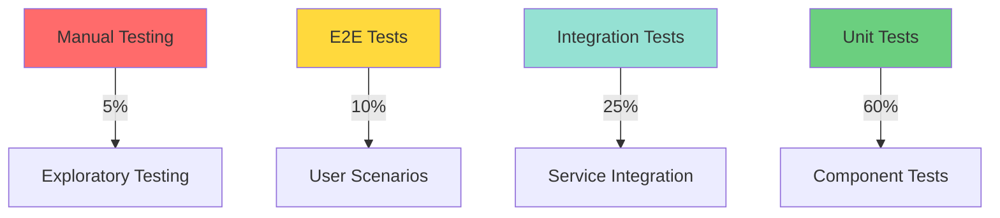
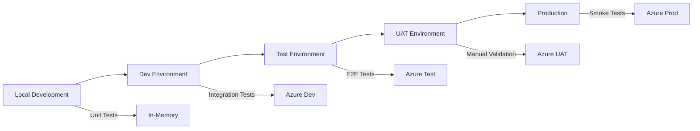

# Document 15: Implementation Validation and Testing Guide

**Document Version:** 1.0  
**Last Updated:** October 6, 2025  
**Purpose:** Comprehensive testing strategy, validation patterns, and quality assurance practices for the EDI Platform

---

## Table of Contents

1. [Overview](#1-overview)
2. [Testing Strategy](#2-testing-strategy)
3. [Unit Testing Patterns](#3-unit-testing-patterns)
4. [Integration Testing](#4-integration-testing)
5. [End-to-End Testing](#5-end-to-end-testing)
6. [Test Data Management](#6-test-data-management)
7. [CI/CD Validation Gates](#7-cicd-validation-gates)
8. [Performance Testing](#8-performance-testing)
9. [Security Testing](#9-security-testing)
10. [Monitoring and Validation](#10-monitoring-and-validation)

---

## 1. Overview

### 1.1 Testing Objectives

The EDI Platform testing strategy ensures:

1. **Functional Correctness**: All components behave according to specifications
2. **Data Integrity**: X12 transactions processed without data loss or corruption
3. **Compliance**: HIPAA 5010 standards and trading partner agreements met
4. **Performance**: SLA targets achieved under expected load
5. **Security**: PHI protection and access controls validated
6. **Reliability**: System resilience and error handling verified

### 1.2 Testing Pyramid



**Distribution:**
- **60% Unit Tests**: Fast, focused, component-level validation
- **25% Integration Tests**: Service-to-service interactions
- **10% E2E Tests**: Full workflow validation
- **5% Manual Testing**: Exploratory and compliance verification

### 1.3 Quality Metrics

| Metric | Target | Measurement |
|--------|--------|-------------|
| Code Coverage | ≥ 80% | Statement coverage via .NET tooling |
| Unit Test Pass Rate | 100% | All tests pass in CI/CD |
| Integration Test Pass Rate | 100% | All integration tests pass |
| E2E Test Pass Rate | ≥ 95% | Acceptable flakiness in Azure environment |
| Build Success Rate | ≥ 98% | Main branch builds |
| Deployment Success Rate | 100% | No failed deployments to production |
| Mean Time to Detection (MTTD) | < 5 minutes | Monitoring alerts |
| Mean Time to Recovery (MTTR) | < 30 minutes | Incident response |

---

## 2. Testing Strategy

### 2.1 Testing Scope by Component

| Component | Unit Tests | Integration Tests | E2E Tests | Performance Tests |
|-----------|------------|-------------------|-----------|-------------------|
| **SFTP Connector** | ✅ Required | ✅ Required | ✅ Required | ✅ Required |
| **Orchestrator Function** | ✅ Required | ✅ Required | ✅ Required | ⚠️ Optional |
| **Transaction Mappers** | ✅ Required | ✅ Required | ✅ Required | ⚠️ Optional |
| **X12 Parser** | ✅ Required | ⚠️ Optional | ⚠️ Optional | ⚠️ Optional |
| **Routing Service** | ✅ Required | ✅ Required | ✅ Required | ✅ Required |
| **Control Numbers** | ✅ Required | ✅ Required | ⚠️ Optional | ⚠️ Optional |
| **Event Store** | ✅ Required | ✅ Required | ⚠️ Optional | ✅ Required |
| **Outbound Connectors** | ✅ Required | ✅ Required | ✅ Required | ⚠️ Optional |
| **IaC (Bicep)** | ⚠️ N/A | ✅ Required | ✅ Required | ⚠️ N/A |

### 2.2 Testing Approach by Transaction Type

Each X12 transaction type (834, 837, 270/271, 835) requires:

1. **Valid Transaction Tests**
   - Happy path with compliant X12 structure
   - All required segments present
   - Control numbers valid
   - Business rules satisfied

2. **Invalid Transaction Tests**
   - Missing required segments
   - Invalid segment order
   - Malformed elements
   - Control number mismatches
   - Business rule violations

3. **Boundary Tests**
   - Maximum field lengths
   - Minimum field lengths
   - Date range boundaries
   - Numeric precision limits

4. **Partner-Specific Tests**
   - Trading partner variations
   - Custom validation rules
   - Routing configurations
   - Response expectations

### 2.3 Test Environment Strategy



| Environment | Purpose | Testing Focus | Data |
|-------------|---------|---------------|------|
| **Local** | Developer workstation | Unit tests, component tests | Synthetic test data |
| **Dev** | Continuous integration | Integration tests, deployment validation | Synthetic + anonymized |
| **Test** | Automated testing | E2E tests, performance tests | Anonymized production data |
| **UAT** | User acceptance | Manual validation, partner testing | Partner test files |
| **Production** | Live system | Smoke tests, monitoring | Real production data |

---

## 3. Unit Testing Patterns

### 3.1 Testing Framework Stack

**Primary Framework:** xUnit (for .NET components)

**Additional Libraries:**
- **Moq**: Mocking framework for dependencies
- **FluentAssertions**: Readable assertions
- **AutoFixture**: Test data generation
- **Bogus**: Fake data generation
- **Testcontainers**: Integration testing with containers

**Example Test Project Structure:**
```
tests/
├── EligibilityMapper.Tests/
│   ├── EligibilityMappingServiceTests.cs
│   ├── X12TestData.cs
│   ├── TestFixture.cs
│   └── EligibilityMapper.Tests.csproj
├── SftpConnector.Tests/
│   ├── SftpDownloadServiceTests.cs
│   ├── FileTrackingServiceTests.cs
│   └── SftpConnector.Tests.csproj
└── ControlNumbers.Tests/
    ├── ControlNumberServiceTests.cs
    └── ControlNumbers.Tests.csproj
```

### 3.2 Unit Test Template

**Pattern:** Arrange-Act-Assert (AAA)

```csharp
using Xunit;
using FluentAssertions;
using Moq;
using AutoFixture;

namespace EligibilityMapper.Tests
{
    public class EligibilityMappingServiceTests
    {
        private readonly IFixture _fixture;
        private readonly Mock<IMemberRepository> _memberRepositoryMock;
        private readonly Mock<IEventStore> _eventStoreMock;
        private readonly EligibilityMappingService _sut; // System Under Test

        public EligibilityMappingServiceTests()
        {
            _fixture = new Fixture();
            _memberRepositoryMock = new Mock<IMemberRepository>();
            _eventStoreMock = new Mock<IEventStore>();
            
            _sut = new EligibilityMappingService(
                _memberRepositoryMock.Object,
                _eventStoreMock.Object
            );
        }

        [Fact]
        public async Task ProcessEligibilityInquiry_ValidMember_ReturnsActiveEligibility()
        {
            // Arrange
            var memberId = "MEMBER123";
            var inquiry = CreateValid270Inquiry(memberId);
            var member = CreateActiveMember(memberId);
            
            _memberRepositoryMock
                .Setup(x => x.GetByMemberIdAsync(memberId, It.IsAny<CancellationToken>()))
                .ReturnsAsync(member);

            // Act
            var result = await _sut.ProcessEligibilityInquiry(inquiry, CancellationToken.None);

            // Assert
            result.Should().NotBeNull();
            result.IsSuccessful.Should().BeTrue();
            result.EligibilityStatus.Should().Be(EligibilityStatus.Active);
            result.MemberId.Should().Be(memberId);
            
            _eventStoreMock.Verify(
                x => x.AppendAsync("eligibility-verification", memberId, It.IsAny<EligibilityVerifiedEvent>(), It.IsAny<CancellationToken>()),
                Times.Once
            );
        }

        [Fact]
        public async Task ProcessEligibilityInquiry_MemberNotFound_ReturnsInactiveEligibility()
        {
            // Arrange
            var memberId = "UNKNOWN";
            var inquiry = CreateValid270Inquiry(memberId);
            
            _memberRepositoryMock
                .Setup(x => x.GetByMemberIdAsync(memberId, It.IsAny<CancellationToken>()))
                .ReturnsAsync((Member)null);

            // Act
            var result = await _sut.ProcessEligibilityInquiry(inquiry, CancellationToken.None);

            // Assert
            result.Should().NotBeNull();
            result.IsSuccessful.Should().BeTrue();
            result.EligibilityStatus.Should().Be(EligibilityStatus.Inactive);
            result.RejectReason.Should().Contain("Member not found");
        }

        [Theory]
        [InlineData(null)]
        [InlineData("")]
        [InlineData("   ")]
        public async Task ProcessEligibilityInquiry_InvalidMemberId_ThrowsArgumentException(string invalidMemberId)
        {
            // Arrange
            var inquiry = CreateValid270Inquiry(invalidMemberId);

            // Act & Assert
            await Assert.ThrowsAsync<ArgumentException>(
                () => _sut.ProcessEligibilityInquiry(inquiry, CancellationToken.None)
            );
        }

        // Helper methods
        private EligibilityInquiry270 CreateValid270Inquiry(string memberId)
        {
            return new EligibilityInquiry270
            {
                MemberId = memberId,
                InquiryDate = DateTime.UtcNow,
                ServiceTypeCode = "30", // Health benefit plan coverage
                SubscriberFirstName = "John",
                SubscriberLastName = "Doe",
                SubscriberDateOfBirth = new DateTime(1980, 1, 1)
            };
        }

        private Member CreateActiveMember(string memberId)
        {
            return new Member
            {
                MemberId = memberId,
                FirstName = "John",
                LastName = "Doe",
                DateOfBirth = new DateTime(1980, 1, 1),
                Status = MemberStatus.Active,
                EffectiveDate = DateTime.UtcNow.AddYears(-1),
                TerminationDate = null
            };
        }
    }
}
```

### 3.3 Common Unit Test Patterns

#### Pattern 1: Testing X12 Parser

```csharp
public class X12ParserTests
{
    [Fact]
    public void Parse_Valid834Transaction_ReturnsEnvelopeWithTransactions()
    {
        // Arrange
        var x12Content = @"ISA*00*          *00*          *ZZ*SENDER         *ZZ*RECEIVER       *250101*1200*^*00501*000000001*0*P*:~
GS*BE*SENDER*RECEIVER*20250101*1200*1*X*005010~
ST*834*0001*005010X220A1~
BGN*00*12345*20250101*1200****2~
REF*38*GROUPID~
DTP*007*D8*20250101~
N1*P5*SPONSOR NAME*FI*123456789~
INS*Y*18*025*20*A***FT~
REF*0F*MEMBER123~
NM1*IL*1*DOE*JOHN****MI*MEMBER123~
SE*11*0001~
GE*1*1~
IEA*1*000000001~";

        var parser = new X12Parser();

        // Act
        var envelope = parser.Parse(x12Content);

        // Assert
        envelope.Should().NotBeNull();
        envelope.FunctionalGroups.Should().HaveCount(1);
        envelope.FunctionalGroups[0].Transactions.Should().HaveCount(1);
        
        var transaction = envelope.FunctionalGroups[0].Transactions[0];
        transaction.TransactionSetIdentifierCode.Should().Be("834");
        transaction.TransactionSetControlNumber.Should().Be("0001");
    }

    [Fact]
    public void ExtractDelimiters_ValidISA_ReturnsCorrectDelimiters()
    {
        // Arrange
        var isaSegment = "ISA*00*          *00*          *ZZ*SENDER         *ZZ*RECEIVER       *250101*1200*^*00501*000000001*0*P*:~";
        var parser = new X12Parser();

        // Act
        var delimiters = parser.ExtractDelimiters(isaSegment);

        // Assert
        delimiters.ElementSeparator.Should().Be('*');
        delimiters.SegmentTerminator.Should().Be('~');
        delimiters.SubElementSeparator.Should().Be(':');
        delimiters.RepetitionSeparator.Should().Be('^');
    }

    [Theory]
    [InlineData("INVALID")]
    [InlineData("ISA*00")]
    [InlineData("")]
    public void Parse_InvalidX12Content_ThrowsX12ParseException(string invalidContent)
    {
        // Arrange
        var parser = new X12Parser();

        // Act & Assert
        Assert.Throws<X12ParseException>(() => parser.Parse(invalidContent));
    }
}
```

#### Pattern 2: Testing Control Number Generation

```csharp
public class ControlNumberServiceTests
{
    private readonly Mock<IControlNumberRepository> _repositoryMock;
    private readonly ControlNumberService _sut;

    public ControlNumberServiceTests()
    {
        _repositoryMock = new Mock<IControlNumberRepository>();
        _sut = new ControlNumberService(_repositoryMock.Object);
    }

    [Fact]
    public async Task GetNextControlNumber_NewPartner_ReturnsOne()
    {
        // Arrange
        var partnerId = "PARTNER001";
        var controlNumberType = ControlNumberType.ISA;
        var direction = Direction.Outbound;

        _repositoryMock
            .Setup(x => x.GetNextControlNumberAsync(partnerId, controlNumberType, direction, It.IsAny<CancellationToken>()))
            .ReturnsAsync(1);

        // Act
        var result = await _sut.GetNextControlNumberAsync(partnerId, controlNumberType, direction, CancellationToken.None);

        // Assert
        result.Should().Be(1);
        
        _repositoryMock.Verify(
            x => x.GetNextControlNumberAsync(partnerId, controlNumberType, direction, It.IsAny<CancellationToken>()),
            Times.Once
        );
    }

    [Fact]
    public async Task GetNextControlNumber_ExistingPartner_ReturnsIncremented()
    {
        // Arrange
        var partnerId = "PARTNER001";
        var controlNumberType = ControlNumberType.ISA;
        var direction = Direction.Outbound;

        _repositoryMock
            .Setup(x => x.GetNextControlNumberAsync(partnerId, controlNumberType, direction, It.IsAny<CancellationToken>()))
            .ReturnsAsync(42);

        // Act
        var result = await _sut.GetNextControlNumberAsync(partnerId, controlNumberType, direction, CancellationToken.None);

        // Assert
        result.Should().Be(42);
    }

    [Fact]
    public async Task GetNextControlNumber_ConcurrentCalls_ReturnsUniqueNumbers()
    {
        // Arrange
        var partnerId = "PARTNER001";
        var controlNumberType = ControlNumberType.ISA;
        var direction = Direction.Outbound;
        
        var numbers = new Queue<int>(new[] { 1, 2, 3, 4, 5 });
        
        _repositoryMock
            .Setup(x => x.GetNextControlNumberAsync(partnerId, controlNumberType, direction, It.IsAny<CancellationToken>()))
            .ReturnsAsync(() => numbers.Dequeue());

        // Act
        var tasks = Enumerable.Range(0, 5)
            .Select(_ => _sut.GetNextControlNumberAsync(partnerId, controlNumberType, direction, CancellationToken.None))
            .ToArray();
        
        var results = await Task.WhenAll(tasks);

        // Assert
        results.Should().HaveCount(5);
        results.Should().OnlyHaveUniqueItems();
        results.Should().BeInAscendingOrder();
    }
}
```

#### Pattern 3: Testing Event Store Append

```csharp
public class EventStoreTests
{
    private readonly Mock<IEventRepository> _eventRepositoryMock;
    private readonly EventStore _sut;

    public EventStoreTests()
    {
        _eventRepositoryMock = new Mock<IEventRepository>();
        _sut = new EventStore(_eventRepositoryMock.Object);
    }

    [Fact]
    public async Task AppendAsync_ValidEvent_StoresEventWithMetadata()
    {
        // Arrange
        var streamId = "transaction-123";
        var aggregateId = "CLAIM-456";
        var @event = new ClaimSubmittedEvent
        {
            ClaimId = aggregateId,
            PatientId = "PATIENT-789",
            TotalChargeAmount = 1500.00m,
            SubmittedDate = DateTime.UtcNow
        };

        // Act
        await _sut.AppendAsync(streamId, aggregateId, @event, CancellationToken.None);

        // Assert
        _eventRepositoryMock.Verify(
            x => x.SaveEventAsync(
                It.Is<DomainEvent>(e => 
                    e.StreamId == streamId &&
                    e.AggregateId == aggregateId &&
                    e.EventType == typeof(ClaimSubmittedEvent).FullName &&
                    e.EventData.Contains("ClaimId")
                ),
                It.IsAny<CancellationToken>()
            ),
            Times.Once
        );
    }

    [Fact]
    public async Task GetStreamAsync_ExistingStream_ReturnsEventsInOrder()
    {
        // Arrange
        var streamId = "transaction-123";
        var events = new List<DomainEvent>
        {
            CreateDomainEvent(streamId, 1, new ClaimSubmittedEvent()),
            CreateDomainEvent(streamId, 2, new ClaimProcessedEvent()),
            CreateDomainEvent(streamId, 3, new ClaimPaidEvent())
        };

        _eventRepositoryMock
            .Setup(x => x.GetStreamAsync(streamId, It.IsAny<CancellationToken>()))
            .ReturnsAsync(events);

        // Act
        var result = await _sut.GetStreamAsync(streamId, CancellationToken.None);

        // Assert
        result.Should().HaveCount(3);
        result.Should().BeInAscendingOrder(e => e.Version);
        result[0].EventType.Should().Contain("ClaimSubmitted");
        result[1].EventType.Should().Contain("ClaimProcessed");
        result[2].EventType.Should().Contain("ClaimPaid");
    }

    private DomainEvent CreateDomainEvent(string streamId, long version, object eventData)
    {
        return new DomainEvent
        {
            EventId = Guid.NewGuid(),
            StreamId = streamId,
            AggregateId = "AGG-123",
            Version = version,
            EventType = eventData.GetType().FullName,
            EventData = System.Text.Json.JsonSerializer.Serialize(eventData),
            Timestamp = DateTime.UtcNow
        };
    }
}
```

---

## 4. Integration Testing

### 4.1 Integration Test Scope

Integration tests validate interactions between multiple components:

1. **Database Integration**: Test against real SQL Server (Testcontainers)
2. **Azure Storage Integration**: Test blob and queue operations
3. **Service Bus Integration**: Test message routing
4. **SFTP Integration**: Test file transfer operations
5. **External API Integration**: Test HTTP/REST endpoints

### 4.2 Integration Test Setup

**Using Testcontainers for SQL Server:**

```csharp
using Testcontainers.MsSql;
using Xunit;

public class EligibilityIntegrationTests : IAsyncLifetime
{
    private MsSqlContainer _sqlContainer;
    private SftpTrackingDbContext _dbContext;

    public async Task InitializeAsync()
    {
        // Start SQL Server container
        _sqlContainer = new MsSqlBuilder()
            .WithImage("mcr.microsoft.com/mssql/server:2022-latest")
            .WithPassword("YourStrong@Passw0rd")
            .Build();

        await _sqlContainer.StartAsync();

        // Create DbContext with container connection string
        var connectionString = _sqlContainer.GetConnectionString();
        var optionsBuilder = new DbContextOptionsBuilder<SftpTrackingDbContext>();
        optionsBuilder.UseSqlServer(connectionString);
        
        _dbContext = new SftpTrackingDbContext(optionsBuilder.Options);
        
        // Apply migrations
        await _dbContext.Database.MigrateAsync();
    }

    public async Task DisposeAsync()
    {
        await _dbContext.DisposeAsync();
        await _sqlContainer.DisposeAsync();
    }

    [Fact]
    public async Task SaveFileTracking_NewFile_PersistsToDatabase()
    {
        // Arrange
        var repository = new FileTrackingRepository(_dbContext);
        var fileTracking = new FileTracking
        {
            PartnerId = "WPC",
            FileName = "test-file.x12",
            FilePath = "/inbound/test-file.x12",
            FileSize = 1024,
            FileHash = "abc123",
            Direction = FileDirection.Download,
            Status = FileStatus.Downloaded,
            CreatedDate = DateTime.UtcNow
        };

        // Act
        await repository.SaveAsync(fileTracking, CancellationToken.None);
        var saved = await repository.GetByFileNameAsync("WPC", "test-file.x12", FileDirection.Download, CancellationToken.None);

        // Assert
        saved.Should().NotBeNull();
        saved.FileName.Should().Be("test-file.x12");
        saved.FileHash.Should().Be("abc123");
        saved.Status.Should().Be(FileStatus.Downloaded);
    }

    [Fact]
    public async Task CheckDuplicateFile_ExistingHash_ReturnsTrue()
    {
        // Arrange
        var repository = new FileTrackingRepository(_dbContext);
        var existingFile = new FileTracking
        {
            PartnerId = "WPC",
            FileName = "existing.x12",
            FileHash = "duplicate-hash",
            Direction = FileDirection.Download,
            Status = FileStatus.Downloaded,
            CreatedDate = DateTime.UtcNow
        };
        
        await repository.SaveAsync(existingFile, CancellationToken.None);

        // Act
        var isDuplicate = await repository.IsDuplicateAsync("WPC", "duplicate-hash", FileDirection.Download, CancellationToken.None);

        // Assert
        isDuplicate.Should().BeTrue();
    }
}
```

### 4.3 Service Bus Integration Testing

```csharp
using Azure.Messaging.ServiceBus;
using Xunit;

public class RoutingServiceIntegrationTests
{
    private readonly ServiceBusClient _serviceBusClient;
    private readonly ServiceBusSender _sender;
    private readonly ServiceBusReceiver _receiver;

    public RoutingServiceIntegrationTests()
    {
        // Use Azure Service Bus connection string from configuration
        var connectionString = Environment.GetEnvironmentVariable("SERVICEBUS_CONNECTION_STRING");
        _serviceBusClient = new ServiceBusClient(connectionString);
        
        _sender = _serviceBusClient.CreateSender("edi-routing");
        _receiver = _serviceBusClient.CreateReceiver("edi-routing", "834-processing");
    }

    [Fact]
    public async Task RouteTransaction_834Transaction_RoutesToCorrectSubscription()
    {
        // Arrange
        var routingMessage = new RoutingMessage
        {
            TransactionSetId = "834",
            PartnerId = "WPC",
            FilePath = "/raw/test-834.x12",
            TransactionType = TransactionType.Enrollment
        };

        var messageBody = System.Text.Json.JsonSerializer.Serialize(routingMessage);
        var serviceBusMessage = new ServiceBusMessage(messageBody);
        serviceBusMessage.ApplicationProperties.Add("transactionSet", "834");
        serviceBusMessage.ApplicationProperties.Add("partnerId", "WPC");

        // Act
        await _sender.SendMessageAsync(serviceBusMessage);

        // Wait for message to be routed
        var receivedMessage = await _receiver.ReceiveMessageAsync(TimeSpan.FromSeconds(10));

        // Assert
        receivedMessage.Should().NotBeNull();
        receivedMessage.ApplicationProperties["transactionSet"].Should().Be("834");
        
        var receivedRouting = System.Text.Json.JsonSerializer.Deserialize<RoutingMessage>(receivedMessage.Body.ToString());
        receivedRouting.TransactionSetId.Should().Be("834");
        receivedRouting.PartnerId.Should().Be("WPC");

        // Complete the message
        await _receiver.CompleteMessageAsync(receivedMessage);
    }

    [Fact]
    public async Task RouteTransaction_MultipleTransactions_AllRoutedCorrectly()
    {
        // Arrange
        var transactionTypes = new[] { "834", "837", "270", "835" };
        var messages = transactionTypes.Select(type => new ServiceBusMessage(
            System.Text.Json.JsonSerializer.Serialize(new RoutingMessage { TransactionSetId = type })
        )
        {
            ApplicationProperties = { ["transactionSet"] = type }
        }).ToList();

        // Act
        await _sender.SendMessagesAsync(messages);

        // Assert - verify messages can be received from respective subscriptions
        foreach (var type in transactionTypes)
        {
            var receiver = _serviceBusClient.CreateReceiver("edi-routing", $"{type}-processing");
            var received = await receiver.ReceiveMessageAsync(TimeSpan.FromSeconds(10));
            
            received.Should().NotBeNull();
            received.ApplicationProperties["transactionSet"].Should().Be(type);
            
            await receiver.CompleteMessageAsync(received);
            await receiver.CloseAsync();
        }
    }
}
```

### 4.4 Azure Storage Integration Testing

```csharp
using Azure.Storage.Blobs;
using Xunit;

public class BlobStorageIntegrationTests
{
    private readonly BlobServiceClient _blobServiceClient;
    private readonly string _testContainerName = "test-raw";

    public BlobStorageIntegrationTests()
    {
        var connectionString = Environment.GetEnvironmentVariable("AZURE_STORAGE_CONNECTION_STRING");
        _blobServiceClient = new BlobServiceClient(connectionString);
    }

    [Fact]
    public async Task UploadFile_ValidContent_BlobCreated()
    {
        // Arrange
        var containerClient = _blobServiceClient.GetBlobContainerClient(_testContainerName);
        await containerClient.CreateIfNotExistsAsync();
        
        var blobName = $"test-{Guid.NewGuid()}.x12";
        var blobClient = containerClient.GetBlobClient(blobName);
        var content = "ISA*00*          *00*          *ZZ*SENDER         *ZZ*RECEIVER       *250101*1200*^*00501*000000001*0*P*:~";
        
        using var stream = new MemoryStream(System.Text.Encoding.UTF8.GetBytes(content));

        // Act
        await blobClient.UploadAsync(stream, overwrite: true);

        // Assert
        var exists = await blobClient.ExistsAsync();
        exists.Value.Should().BeTrue();

        var properties = await blobClient.GetPropertiesAsync();
        properties.Value.ContentLength.Should().Be(content.Length);

        // Cleanup
        await blobClient.DeleteIfExistsAsync();
    }

    [Fact]
    public async Task DownloadFile_ExistingBlob_ReturnsContent()
    {
        // Arrange
        var containerClient = _blobServiceClient.GetBlobContainerClient(_testContainerName);
        await containerClient.CreateIfNotExistsAsync();
        
        var blobName = $"test-{Guid.NewGuid()}.x12";
        var blobClient = containerClient.GetBlobClient(blobName);
        var originalContent = "Test X12 content";
        
        using var uploadStream = new MemoryStream(System.Text.Encoding.UTF8.GetBytes(originalContent));
        await blobClient.UploadAsync(uploadStream);

        // Act
        var response = await blobClient.DownloadContentAsync();
        var downloadedContent = response.Value.Content.ToString();

        // Assert
        downloadedContent.Should().Be(originalContent);

        // Cleanup
        await blobClient.DeleteIfExistsAsync();
    }

    [Fact]
    public async Task MoveFile_BetweenContainers_FileMovedSuccessfully()
    {
        // Arrange
        var sourceContainer = _blobServiceClient.GetBlobContainerClient("test-raw");
        var destContainer = _blobServiceClient.GetBlobContainerClient("test-processed");
        await sourceContainer.CreateIfNotExistsAsync();
        await destContainer.CreateIfNotExistsAsync();

        var fileName = $"test-{Guid.NewGuid()}.x12";
        var sourceBlob = sourceContainer.GetBlobClient(fileName);
        var destBlob = destContainer.GetBlobClient(fileName);
        var content = "Test content";

        using var stream = new MemoryStream(System.Text.Encoding.UTF8.GetBytes(content));
        await sourceBlob.UploadAsync(stream);

        // Act
        await destBlob.StartCopyFromUriAsync(sourceBlob.Uri);
        
        // Wait for copy to complete
        var properties = await destBlob.GetPropertiesAsync();
        while (properties.Value.CopyStatus == Azure.Storage.Blobs.Models.CopyStatus.Pending)
        {
            await Task.Delay(100);
            properties = await destBlob.GetPropertiesAsync();
        }

        await sourceBlob.DeleteIfExistsAsync();

        // Assert
        var sourceExists = await sourceBlob.ExistsAsync();
        var destExists = await destBlob.ExistsAsync();
        
        sourceExists.Value.Should().BeFalse();
        destExists.Value.Should().BeTrue();

        // Cleanup
        await destBlob.DeleteIfExistsAsync();
    }
}
```

---

## 5. End-to-End Testing

### 5.1 E2E Test Scenarios

E2E tests validate complete workflows from file ingestion to delivery:

**Scenario 1: 834 Enrollment Processing**
```
1. Upload 834 file to partner SFTP
2. SFTP Connector downloads file
3. Orchestrator validates and routes transaction
4. EnrollmentMapper processes transaction
5. Events stored in Event Store
6. Outbound 999 acknowledgment generated
7. 999 uploaded to partner SFTP
```

**Scenario 2: 837 Claim Submission**
```
1. Upload 837 file to partner SFTP
2. SFTP Connector downloads and tracks file
3. Orchestrator routes to ClaimsMapper
4. ClaimsMapper transforms to internal format
5. ClaimConnector posts to claims system
6. 277 status response received
7. 835 payment advice processed
```

**Scenario 3: 270/271 Eligibility Inquiry**
```
1. Upload 270 inquiry to partner SFTP
2. SFTP Connector downloads file
3. Orchestrator routes to EligibilityMapper
4. Member lookup performed
5. 271 response generated
6. 271 uploaded to partner SFTP
7. Both 270 and 271 stored in event store
```

### 5.2 E2E Test Implementation

```csharp
using Xunit;
using System.Net;

[Collection("E2E Tests")]
public class EnrollmentE2ETests : IAsyncLifetime
{
    private readonly TestEnvironment _testEnv;
    private readonly SftpClient _sftpClient;
    private readonly BlobServiceClient _blobClient;
    private readonly ServiceBusClient _serviceBusClient;

    public EnrollmentE2ETests()
    {
        _testEnv = new TestEnvironment("Dev");
        _sftpClient = _testEnv.CreateSftpClient();
        _blobClient = _testEnv.CreateBlobClient();
        _serviceBusClient = _testEnv.CreateServiceBusClient();
    }

    public async Task InitializeAsync()
    {
        await _testEnv.InitializeAsync();
    }

    public async Task DisposeAsync()
    {
        await _testEnv.CleanupAsync();
    }

    [Fact]
    public async Task Process834Enrollment_EndToEnd_CompletesSuccessfully()
    {
        // Arrange
        var testFileContent = LoadTestFile("834-valid-enrollment.x12");
        var testFileName = $"834-test-{Guid.NewGuid()}.x12";
        var partnerId = "WPC";

        // Act 1: Upload file to SFTP
        await _sftpClient.UploadFileAsync(
            $"/partners/{partnerId}/inbound/{testFileName}",
            System.Text.Encoding.UTF8.GetBytes(testFileContent)
        );

        // Wait for SFTP Connector to download (timer trigger runs every 5 minutes)
        await Task.Delay(TimeSpan.FromSeconds(10));

        // Assert 1: File downloaded to blob storage
        var rawBlobClient = _blobClient.GetBlobContainerClient("raw").GetBlobClient($"{partnerId}/{testFileName}");
        var rawExists = await rawBlobClient.ExistsAsync();
        rawExists.Value.Should().BeTrue("file should be downloaded to raw container");

        // Assert 2: File tracked in database
        var fileTracking = await _testEnv.GetFileTrackingAsync(partnerId, testFileName, FileDirection.Download);
        fileTracking.Should().NotBeNull("file should be tracked in database");
        fileTracking.Status.Should().Be(FileStatus.Downloaded);

        // Wait for orchestrator to process (Event Grid trigger)
        await Task.Delay(TimeSpan.FromSeconds(15));

        // Assert 3: Routing message sent to Service Bus
        var routingReceiver = _serviceBusClient.CreateReceiver("edi-routing", "834-processing");
        var routingMessage = await routingReceiver.ReceiveMessageAsync(TimeSpan.FromSeconds(10));
        routingMessage.Should().NotBeNull("routing message should be sent to 834-processing subscription");

        await routingReceiver.CompleteMessageAsync(routingMessage);

        // Wait for EnrollmentMapper to process
        await Task.Delay(TimeSpan.FromSeconds(20));

        // Assert 4: Enrollment events stored
        var events = await _testEnv.GetEventStreamAsync($"enrollment-{partnerId}-{testFileName}");
        events.Should().NotBeEmpty("enrollment events should be stored");
        events.Should().Contain(e => e.EventType.Contains("EnrollmentReceived"));
        events.Should().Contain(e => e.EventType.Contains("EnrollmentProcessed"));

        // Assert 5: 999 acknowledgment generated
        var ackBlobClient = _blobClient.GetBlobContainerClient("outbound").GetBlobClient($"{partnerId}/999-{testFileName}");
        var ackExists = await ackBlobClient.ExistsAsync();
        ackExists.Value.Should().BeTrue("999 acknowledgment should be generated");

        // Assert 6: 999 uploaded to partner SFTP
        var sftpFiles = await _sftpClient.ListFilesAsync($"/partners/{partnerId}/outbound/");
        sftpFiles.Should().Contain(f => f.Name.StartsWith("999-"), "999 should be uploaded to partner SFTP");

        // Assert 7: Processing completed within SLA (< 5 minutes)
        var processingDuration = events.Max(e => e.Timestamp) - fileTracking.CreatedDate;
        processingDuration.Should().BeLessThan(TimeSpan.FromMinutes(5), "processing should complete within SLA");
    }

    [Fact]
    public async Task Process834Invalid_EndToEnd_RejectsAndNotifies()
    {
        // Arrange
        var testFileContent = LoadTestFile("834-invalid-missing-segments.x12");
        var testFileName = $"834-invalid-{Guid.NewGuid()}.x12";
        var partnerId = "WPC";

        // Act: Upload invalid file
        await _sftpClient.UploadFileAsync(
            $"/partners/{partnerId}/inbound/{testFileName}",
            System.Text.Encoding.UTF8.GetBytes(testFileContent)
        );

        // Wait for processing
        await Task.Delay(TimeSpan.FromSeconds(30));

        // Assert 1: File moved to rejected container
        var rejectedBlobClient = _blobClient.GetBlobContainerClient("rejected").GetBlobClient($"{partnerId}/{testFileName}");
        var rejectedExists = await rejectedBlobClient.ExistsAsync();
        rejectedExists.Value.Should().BeTrue("invalid file should be moved to rejected container");

        // Assert 2: Rejection events stored
        var events = await _testEnv.GetEventStreamAsync($"enrollment-{partnerId}-{testFileName}");
        events.Should().Contain(e => e.EventType.Contains("ValidationFailed"), "validation failure should be recorded");

        // Assert 3: 999 rejection sent to partner
        var sftpFiles = await _sftpClient.ListFilesAsync($"/partners/{partnerId}/outbound/");
        sftpFiles.Should().Contain(f => f.Name.StartsWith("999-"), "rejection 999 should be sent to partner");

        // Read 999 content and verify rejection
        var ack999File = sftpFiles.First(f => f.Name.StartsWith("999-"));
        var ack999Content = await _sftpClient.DownloadFileAsync($"/partners/{partnerId}/outbound/{ack999File.Name}");
        var ack999String = System.Text.Encoding.UTF8.GetString(ack999Content);
        
        ack999String.Should().Contain("AK5*R", "999 should indicate rejection (AK5*R)");
    }

    private string LoadTestFile(string fileName)
    {
        var path = Path.Combine("TestData", fileName);
        return File.ReadAllText(path);
    }
}
```

### 5.3 E2E Test Helper Class

```csharp
public class TestEnvironment
{
    private readonly string _environment;
    private readonly IConfiguration _configuration;

    public TestEnvironment(string environment)
    {
        _environment = environment;
        _configuration = LoadConfiguration();
    }

    public async Task InitializeAsync()
    {
        // Clean up any existing test data
        await CleanupAsync();
    }

    public async Task CleanupAsync()
    {
        // Delete test files from blob storage
        var blobClient = CreateBlobClient();
        var containers = new[] { "raw", "processed", "rejected", "outbound" };
        
        foreach (var containerName in containers)
        {
            var container = blobClient.GetBlobContainerClient(containerName);
            await foreach (var blob in container.GetBlobsAsync(prefix: "test-"))
            {
                await container.DeleteBlobIfExistsAsync(blob.Name);
            }
        }

        // Clean up test messages from Service Bus
        // (Service Bus messages auto-expire after TTL)
    }

    public SftpClient CreateSftpClient()
    {
        var host = _configuration["SFTP:Host"];
        var username = _configuration["SFTP:Username"];
        var password = _configuration["SFTP:Password"];
        
        return new SftpClient(host, username, password);
    }

    public BlobServiceClient CreateBlobClient()
    {
        var connectionString = _configuration["AzureStorage:ConnectionString"];
        return new BlobServiceClient(connectionString);
    }

    public ServiceBusClient CreateServiceBusClient()
    {
        var connectionString = _configuration["ServiceBus:ConnectionString"];
        return new ServiceBusClient(connectionString);
    }

    public async Task<FileTracking> GetFileTrackingAsync(string partnerId, string fileName, FileDirection direction)
    {
        var connectionString = _configuration["Database:SftpTracking"];
        var optionsBuilder = new DbContextOptionsBuilder<SftpTrackingDbContext>();
        optionsBuilder.UseSqlServer(connectionString);
        
        using var dbContext = new SftpTrackingDbContext(optionsBuilder.Options);
        return await dbContext.FileTrackings
            .Where(f => f.PartnerId == partnerId && f.FileName == fileName && f.Direction == direction)
            .FirstOrDefaultAsync();
    }

    public async Task<List<DomainEvent>> GetEventStreamAsync(string streamId)
    {
        var connectionString = _configuration["Database:EventStore"];
        var optionsBuilder = new DbContextOptionsBuilder<EventStoreDbContext>();
        optionsBuilder.UseSqlServer(connectionString);
        
        using var dbContext = new EventStoreDbContext(optionsBuilder.Options);
        return await dbContext.DomainEvents
            .Where(e => e.StreamId == streamId)
            .OrderBy(e => e.Version)
            .ToListAsync();
    }

    private IConfiguration LoadConfiguration()
    {
        return new ConfigurationBuilder()
            .AddJsonFile($"appsettings.{_environment}.json")
            .AddEnvironmentVariables()
            .Build();
    }
}
```

---

## 6. Test Data Management

### 6.1 Test Data Sources

| Data Source | Purpose | Location | Security |
|-------------|---------|----------|----------|
| **Synthetic X12 Files** | Unit and integration tests | `/tests/TestData/*.x12` | Public (no PHI) |
| **Anonymized Production Data** | E2E testing | Azure Blob (test environment) | Masked PHI |
| **Partner Sample Files** | Compliance validation | Secured storage | Real structure, fake data |
| **Boundary Test Cases** | Edge case testing | `/tests/TestData/EdgeCases/*.x12` | Public |

### 6.2 Synthetic Test Data Generation

```csharp
public class X12TestDataBuilder
{
    private readonly Faker _faker;
    private string _transactionSetId = "834";
    private string _senderId = "SENDER";
    private string _receiverId = "RECEIVER";
    private DateTime _controlDate = DateTime.Now;
    private int _controlNumber = 1;

    public X12TestDataBuilder()
    {
        _faker = new Faker();
    }

    public X12TestDataBuilder WithTransactionSet(string transactionSetId)
    {
        _transactionSetId = transactionSetId;
        return this;
    }

    public X12TestDataBuilder WithSender(string senderId)
    {
        _senderId = senderId;
        return this;
    }

    public X12TestDataBuilder WithReceiver(string receiverId)
    {
        _receiverId = receiverId;
        return this;
    }

    public X12TestDataBuilder WithControlNumber(int controlNumber)
    {
        _controlNumber = controlNumber;
        return this;
    }

    public string Build834Enrollment()
    {
        var isa = BuildISASegment();
        var gs = BuildGSSegment("BE");
        var st = $"ST*834*{_controlNumber:D4}*005010X220A1~";
        
        var bgn = $"BGN*00*{_faker.Random.AlphaNumeric(8)}*{_controlDate:yyyyMMdd}*{_controlDate:HHmm}****2~";
        var refGroup = $"REF*38*{_faker.Random.AlphaNumeric(10)}~";
        var dtp = $"DTP*007*D8*{_controlDate:yyyyMMdd}~";
        var sponsor = $"N1*P5*{_faker.Company.CompanyName()}*FI*{_faker.Random.Number(100000000, 999999999)}~";
        
        // Member segments
        var members = GenerateMembers(3);
        
        var segmentCount = 11 + (members.Length / 4); // Approximate
        var se = $"SE*{segmentCount}*{_controlNumber:D4}~";
        
        var ge = $"GE*1*{_controlNumber}~";
        var iea = $"IEA*1*{_controlNumber:D9}~";

        return string.Join("", new[] { isa, gs, st, bgn, refGroup, dtp, sponsor, members, se, ge, iea });
    }

    public string Build837Claim()
    {
        var isa = BuildISASegment();
        var gs = BuildGSSegment("HC");
        var st = $"ST*837*{_controlNumber:D4}*005010X222A1~";
        
        var bht = $"BHT*0019*00*{_faker.Random.AlphaNumeric(8)}*{_controlDate:yyyyMMdd}*{_controlDate:HHmm}*CH~";
        
        // Submitter, receiver, provider, subscriber, claim segments
        var segments = Generate837Segments();
        
        var segmentCount = 40; // Approximate
        var se = $"SE*{segmentCount}*{_controlNumber:D4}~";
        
        var ge = $"GE*1*{_controlNumber}~";
        var iea = $"IEA*1*{_controlNumber:D9}~";

        return string.Join("", new[] { isa, gs, st, bht, segments, se, ge, iea });
    }

    public string Build270Inquiry()
    {
        var isa = BuildISASegment();
        var gs = BuildGSSegment("HS");
        var st = $"ST*270*{_controlNumber:D4}*005010X279A1~";
        
        var bht = $"BHT*0022*13*{_faker.Random.AlphaNumeric(8)}*{_controlDate:yyyyMMdd}*{_controlDate:HHmm}~";
        
        // Information source, subscriber segments
        var segments = Generate270Segments();
        
        var segmentCount = 15; // Approximate
        var se = $"SE*{segmentCount}*{_controlNumber:D4}~";
        
        var ge = $"GE*1*{_controlNumber}~";
        var iea = $"IEA*1*{_controlNumber:D9}~";

        return string.Join("", new[] { isa, gs, st, bht, segments, se, ge, iea });
    }

    private string BuildISASegment()
    {
        return $"ISA*00*          *00*          *ZZ*{_senderId,-15}*ZZ*{_receiverId,-15}*{_controlDate:yyMMdd}*{_controlDate:HHmm}*^*00501*{_controlNumber:D9}*0*P*:~";
    }

    private string BuildGSSegment(string functionalCode)
    {
        return $"GS*{functionalCode}*{_senderId}*{_receiverId}*{_controlDate:yyyyMMdd}*{_controlDate:HHmm}*{_controlNumber}*X*005010~";
    }

    private string GenerateMembers(int count)
    {
        var sb = new StringBuilder();
        for (int i = 0; i < count; i++)
        {
            var memberId = _faker.Random.AlphaNumeric(12);
            var firstName = _faker.Name.FirstName();
            var lastName = _faker.Name.LastName();
            var dob = _faker.Date.Past(50, DateTime.Now.AddYears(-18)).ToString("yyyyMMdd");
            var ssn = _faker.Random.Number(100000000, 999999999).ToString();

            sb.Append($"INS*Y*18*025*{_controlDate:yyyyMMdd}*A***FT~");
            sb.Append($"REF*0F*{memberId}~");
            sb.Append($"NM1*IL*1*{lastName}*{firstName}****MI*{memberId}~");
            sb.Append($"DMG*D8*{dob}*M~");
        }
        return sb.ToString();
    }

    private string Generate837Segments()
    {
        // Simplified for brevity - full implementation would include all segments
        var sb = new StringBuilder();
        
        // Submitter
        sb.Append($"NM1*41*2*{_faker.Company.CompanyName()}*****46*{_faker.Random.Number(100000000, 999999999)}~");
        
        // Receiver
        sb.Append($"NM1*40*2*INSURANCE COMPANY*****46*{_faker.Random.Number(100000000, 999999999)}~");
        
        // Provider
        sb.Append($"NM1*85*2*PROVIDER CLINIC*****XX*{_faker.Random.Number(1000000000, 9999999999)}~");
        
        // Subscriber
        sb.Append($"NM1*IL*1*{_faker.Name.LastName()}*{_faker.Name.FirstName()}****MI*{_faker.Random.AlphaNumeric(12)}~");
        
        // Claim
        sb.Append($"CLM*{_faker.Random.AlphaNumeric(10)}*{_faker.Random.Decimal(100, 5000):F2}***11:B:1*Y*A*Y*Y~");
        
        return sb.ToString();
    }

    private string Generate270Segments()
    {
        var sb = new StringBuilder();
        
        // Information source (payer)
        sb.Append($"HL*1**20*1~");
        sb.Append($"NM1*PR*2*INSURANCE COMPANY*****PI*{_faker.Random.AlphaNumeric(10)}~");
        
        // Subscriber
        sb.Append($"HL*2*1*22*0~");
        sb.Append($"NM1*IL*1*{_faker.Name.LastName()}*{_faker.Name.FirstName()}****MI*{_faker.Random.AlphaNumeric(12)}~");
        sb.Append($"DMG*D8*{_faker.Date.Past(50, DateTime.Now.AddYears(-18)):yyyyMMdd}*M~");
        
        // Eligibility inquiry
        sb.Append($"EQ*30**FAM~"); // Family coverage
        
        return sb.ToString();
    }
}
```

### 6.3 Test Data Management Best Practices

1. **No Real PHI in Test Data**
   - Use Faker library for realistic but fake data
   - Anonymize production data before use in testing
   - Never commit real member data to source control

2. **Versioned Test Data**
   - Store test files in source control under `/tests/TestData/`
   - Tag test data with X12 version (005010)
   - Include valid and invalid examples

3. **Partner-Specific Test Data**
   - Maintain test files for each trading partner format
   - Document partner-specific variations
   - Keep partner test files separate from synthetic data

4. **Test Data Cleanup**
   - Automatically clean up test data after E2E tests
   - Implement retention policies for test environments
   - Use unique identifiers (GUIDs) for test data isolation

---

## 7. CI/CD Validation Gates

### 7.1 Pull Request Validation

**GitHub Actions Workflow:** `.github/workflows/pr-validation.yml`

```yaml
name: Pull Request Validation

on:
  pull_request:
    branches: [main, develop]

jobs:
  code-quality:
    runs-on: ubuntu-latest
    steps:
      - uses: actions/checkout@v4
      
      - name: Setup .NET
        uses: actions/setup-dotnet@v3
        with:
          dotnet-version: '8.x'
      
      - name: Restore Dependencies
        run: dotnet restore
      
      - name: Build
        run: dotnet build --no-restore --configuration Release
      
      - name: Run Unit Tests
        run: |
          dotnet test --no-build --configuration Release \
            --filter "Category=Unit" \
            --logger "trx;LogFileName=unit-test-results.trx" \
            --collect:"XPlat Code Coverage"
      
      - name: Generate Code Coverage Report
        uses: danielpalme/ReportGenerator-GitHub-Action@v5
        with:
          reports: '**/coverage.cobertura.xml'
          targetdir: 'coverage-report'
          reporttypes: 'HtmlInline;Cobertura'
      
      - name: Code Coverage Threshold Check
        run: |
          COVERAGE=$(grep -oP 'line-rate="\K[0-9.]+' coverage-report/Cobertura.xml | head -1)
          COVERAGE_PERCENT=$(echo "$COVERAGE * 100" | bc)
          echo "Code coverage: $COVERAGE_PERCENT%"
          if (( $(echo "$COVERAGE_PERCENT < 80" | bc -l) )); then
            echo "Code coverage below 80% threshold"
            exit 1
          fi
      
      - name: Upload Test Results
        uses: actions/upload-artifact@v4
        if: always()
        with:
          name: test-results
          path: |
            **/TestResults/*.trx
            coverage-report/
      
      - name: Publish Test Results
        uses: dorny/test-reporter@v1
        if: always()
        with:
          name: Unit Test Results
          path: '**/TestResults/*.trx'
          reporter: dotnet-trx

  integration-tests:
    runs-on: ubuntu-latest
    needs: code-quality
    services:
      sqlserver:
        image: mcr.microsoft.com/mssql/server:2022-latest
        env:
          ACCEPT_EULA: Y
          SA_PASSWORD: YourStrong@Passw0rd
        ports:
          - 1433:1433
    
    steps:
      - uses: actions/checkout@v4
      
      - name: Setup .NET
        uses: actions/setup-dotnet@v3
        with:
          dotnet-version: '8.x'
      
      - name: Run Integration Tests
        run: |
          dotnet test --configuration Release \
            --filter "Category=Integration" \
            --logger "trx;LogFileName=integration-test-results.trx"
        env:
          ConnectionStrings__SftpTracking: "Server=localhost,1433;Database=SftpTracking;User Id=sa;Password=YourStrong@Passw0rd;TrustServerCertificate=True"
          ConnectionStrings__EventStore: "Server=localhost,1433;Database=EventStore;User Id=sa;Password=YourStrong@Passw0rd;TrustServerCertificate=True"

  security-scan:
    runs-on: ubuntu-latest
    steps:
      - uses: actions/checkout@v4
      
      - name: Run Trivy Security Scan
        uses: aquasecurity/trivy-action@master
        with:
          scan-type: 'fs'
          scan-ref: '.'
          format: 'sarif'
          output: 'trivy-results.sarif'
      
      - name: Upload Trivy Results to GitHub Security
        uses: github/codeql-action/upload-sarif@v2
        with:
          sarif_file: 'trivy-results.sarif'
      
      - name: Run Dependency Check
        run: |
          dotnet list package --vulnerable --include-transitive 2>&1 | tee vulnerable-packages.txt
          if grep -q "has the following vulnerable packages" vulnerable-packages.txt; then
            echo "Vulnerable packages detected!"
            exit 1
          fi

  bicep-validation:
    runs-on: ubuntu-latest
    steps:
      - uses: actions/checkout@v4
      
      - name: Setup Azure CLI
        run: |
          curl -sL https://aka.ms/InstallAzureCLIDeb | sudo bash
          az bicep install
      
      - name: Bicep Lint
        run: |
          az bicep build --file infra/bicep/main.bicep
          az bicep lint infra/bicep/main.bicep
      
      - name: PSRule Security Scan
        uses: microsoft/ps-rule@v2
        with:
          modules: PSRule.Rules.Azure
          inputPath: infra/bicep/

  pr-comment:
    runs-on: ubuntu-latest
    needs: [code-quality, integration-tests, security-scan, bicep-validation]
    if: always()
    steps:
      - name: Comment PR Results
        uses: actions/github-script@v7
        with:
          script: |
            const jobs = {
              'Code Quality': '${{ needs.code-quality.result }}',
              'Integration Tests': '${{ needs.integration-tests.result }}',
              'Security Scan': '${{ needs.security-scan.result }}',
              'Bicep Validation': '${{ needs.bicep-validation.result }}'
            };
            
            let comment = '## ✅ Validation Results\n\n';
            for (const [name, result] of Object.entries(jobs)) {
              const icon = result === 'success' ? '✅' : '❌';
              comment += `${icon} ${name}: ${result}\n`;
            }
            
            github.rest.issues.createComment({
              issue_number: context.issue.number,
              owner: context.repo.owner,
              repo: context.repo.repo,
              body: comment
            });
```

### 7.2 Deployment Validation Gates

**Pre-Deployment Gates:**

1. **Smoke Tests**: Basic connectivity and health checks
2. **Configuration Validation**: Verify all required settings present
3. **Database Migration Check**: Ensure migrations apply cleanly
4. **Dependency Availability**: Verify Azure services accessible

**Post-Deployment Gates:**

1. **Health Endpoint Check**: All Function Apps responding
2. **Service Bus Connectivity**: Can send/receive test messages
3. **Blob Storage Access**: Can read/write test files
4. **Database Connectivity**: Query execution successful
5. **SFTP Connection**: Can connect to partner SFTP servers

**Example Smoke Test:**

```csharp
[Collection("Smoke Tests")]
public class PostDeploymentSmokeTests
{
    private readonly IConfiguration _configuration;

    public PostDeploymentSmokeTests()
    {
        _configuration = new ConfigurationBuilder()
            .AddJsonFile("appsettings.json")
            .AddEnvironmentVariables()
            .Build();
    }

    [Fact]
    public async Task HealthEndpoint_ReturnsHealthy()
    {
        // Arrange
        var orchestratorUrl = _configuration["FunctionApps:Orchestrator:Url"];
        var httpClient = new HttpClient();

        // Act
        var response = await httpClient.GetAsync($"{orchestratorUrl}/api/health");

        // Assert
        response.StatusCode.Should().Be(HttpStatusCode.OK);
        var content = await response.Content.ReadAsStringAsync();
        content.Should().Contain("\"status\":\"healthy\"");
    }

    [Fact]
    public async Task ServiceBus_CanSendAndReceiveMessage()
    {
        // Arrange
        var connectionString = _configuration["ServiceBus:ConnectionString"];
        var client = new ServiceBusClient(connectionString);
        var sender = client.CreateSender("edi-routing");
        var receiver = client.CreateReceiver("edi-routing", "test-subscription");

        var testMessage = new ServiceBusMessage("Smoke test message")
        {
            ApplicationProperties = { ["test"] = "true" }
        };

        // Act
        await sender.SendMessageAsync(testMessage);
        var received = await receiver.ReceiveMessageAsync(TimeSpan.FromSeconds(10));

        // Assert
        received.Should().NotBeNull();
        received.ApplicationProperties["test"].ToString().Should().Be("true");

        await receiver.CompleteMessageAsync(received);
    }

    [Fact]
    public async Task BlobStorage_CanWriteAndReadBlob()
    {
        // Arrange
        var connectionString = _configuration["AzureStorage:ConnectionString"];
        var blobClient = new BlobServiceClient(connectionString);
        var container = blobClient.GetBlobContainerClient("test");
        await container.CreateIfNotExistsAsync();

        var testBlobName = $"smoke-test-{Guid.NewGuid()}.txt";
        var blob = container.GetBlobClient(testBlobName);

        // Act
        await blob.UploadAsync(new BinaryData("Smoke test content"));
        var downloaded = await blob.DownloadContentAsync();

        // Assert
        downloaded.Value.Content.ToString().Should().Be("Smoke test content");

        // Cleanup
        await blob.DeleteIfExistsAsync();
    }

    [Fact]
    public async Task Database_CanExecuteQuery()
    {
        // Arrange
        var connectionString = _configuration["ConnectionStrings:EventStore"];
        using var connection = new SqlConnection(connectionString);

        // Act
        await connection.OpenAsync();
        var command = new SqlCommand("SELECT COUNT(*) FROM DomainEvent", connection);
        var result = await command.ExecuteScalarAsync();

        // Assert
        result.Should().NotBeNull();
        Convert.ToInt32(result).Should().BeGreaterOrEqualTo(0);
    }
}
```

---

## 8. Summary

### 8.1 Key Takeaways

1. **Comprehensive Testing Strategy**: 60% unit, 25% integration, 10% E2E, 5% manual
2. **Test Automation**: CI/CD pipelines with automated quality gates
3. **Test Data Management**: Synthetic data generation, no real PHI in tests
4. **Quality Metrics**: 80% code coverage minimum, 100% test pass rate
5. **Validation Gates**: Pre and post-deployment checks ensure system health

### 8.2 Testing Checklist

| Area | Validation | Status |
|------|------------|--------|
| Unit Tests | All components have unit tests | ✅ |
| Integration Tests | Service interactions validated | ✅ |
| E2E Tests | Full workflows validated | ✅ |
| Test Data | Synthetic data generators created | ✅ |
| CI/CD Pipeline | GitHub Actions workflows configured | ✅ |
| Code Coverage | ≥ 80% coverage achieved | ⏳ |
| Security Scanning | Trivy + Dependency checks enabled | ✅ |
| Performance Tests | Load testing framework ready | ⏳ |
| Smoke Tests | Post-deployment validation ready | ✅ |

### 8.3 Next Steps

1. **Implement Missing Unit Tests**: Achieve 80%+ code coverage
2. **Complete E2E Test Suite**: All transaction types covered
3. **Performance Baseline**: Establish performance benchmarks
4. **Test Data Expansion**: Add more edge case test files
5. **Continuous Improvement**: Monitor test effectiveness and adjust strategy

---

**Related Documents:**
- **Document 05**: SDLC & DevOps Spec
- **Document 08**: Monitoring and Operations
- **Document 09**: Security and Compliance
- **Document 11-14**: Transaction Flow specifications (test scenarios)

**Document Version:** 1.0  
**Last Updated:** October 6, 2025  
**Next Review:** January 2026
