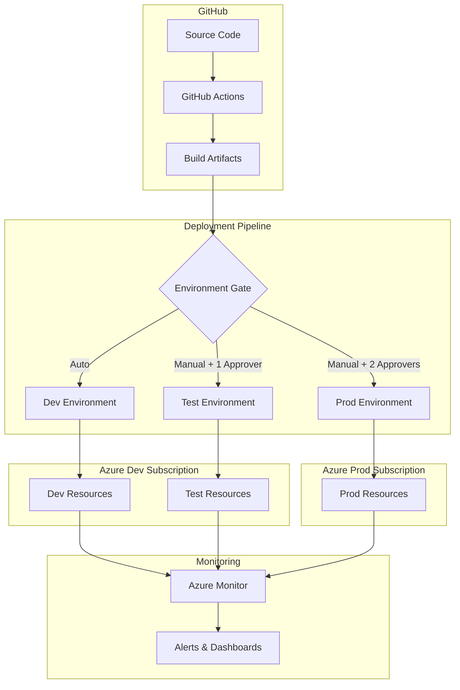
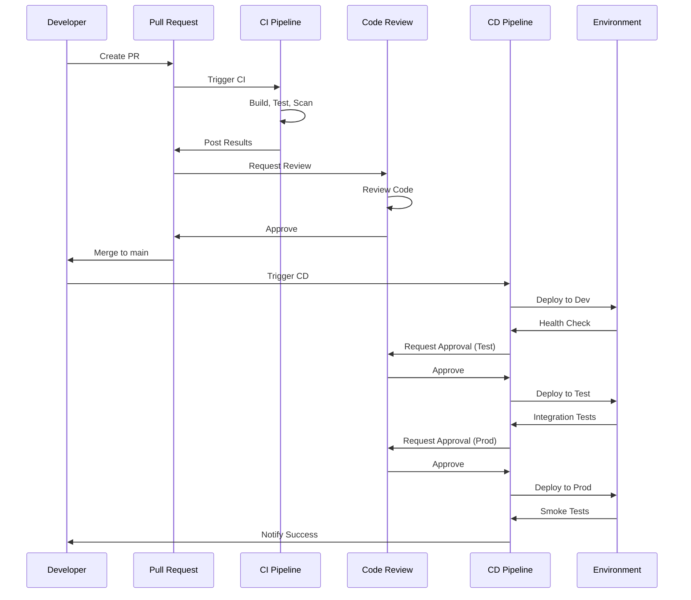

# Deployment Automation Overview

**Document Version:** 1.0  
**Last Updated:** October 6, 2025  
**Status:** Production Ready  
**Owner:** EDI Platform Team

---

## Table of Contents

1. [Executive Summary](#1-executive-summary)
2. [Deployment Architecture](#2-deployment-architecture)
3. [Environment Strategy](#3-environment-strategy)
4. [Deployment Models](#4-deployment-models)
5. [Release Management](#5-release-management)
6. [Governance & Controls](#6-governance--controls)
7. [Metrics & KPIs](#7-metrics--kpis)
8. [Next Steps](#8-next-steps)

---

## 1. Executive Summary

### 1.1 Purpose

This document provides a comprehensive overview of the EDI Platform deployment architecture, strategies, and operational procedures. It serves as the foundational reference for all deployment activities across the platform.

### 1.2 Deployment Philosophy

The EDI Platform follows **DevOps/Platform Engineering principles** where a single unified team owns the entire lifecycle:

- **Build:** Develop features and infrastructure code
- **Test:** Automated and manual testing at all stages
- **Deploy:** Continuous deployment with safety controls
- **Operate:** Monitor, maintain, and respond to incidents
- **Improve:** Continuous optimization based on metrics

### 1.3 Key Principles

| Principle | Description | Implementation |
|-----------|-------------|----------------|
| **Automation First** | Minimize manual intervention | GitHub Actions workflows for all deployments |
| **Infrastructure as Code** | All infrastructure defined in code | Azure Bicep templates versioned in Git |
| **Security by Design** | Security integrated at every stage | Automated scanning, OIDC auth, least privilege |
| **Fail Fast** | Detect issues early in pipeline | PR validation, what-if analysis, smoke tests |
| **Observability** | Full visibility into system state | Azure Monitor, App Insights, deployment logs |
| **Compliance First** | HIPAA requirements embedded | Audit logging, change control, security scanning |

### 1.4 Deployment Scope

The deployment automation covers:

- **Infrastructure:** Azure resources via Bicep (Storage, Service Bus, Key Vault, etc.)
- **Compute:** Azure Functions (7 function apps across 3 environments)
- **Data Pipelines:** Azure Data Factory pipelines
- **Configuration:** Partner configurations, routing rules, mapper configs
- **Monitoring:** Log Analytics, Application Insights, dashboards

---

## 2. Deployment Architecture

### 2.1 High-Level Architecture

### 2.2 Repository Strategy

**Multi-Repository Approach** (See [ADR-012: Multi-Repository Strategy](./17-architecture-decisions.md#14-adr-012-multi-repository-strategy))

The platform uses **separate repositories** for each major component, enabling:
- Independent deployment lifecycles
- Granular access control
- Focused CI/CD pipelines
- Clear team ownership

| Repository | Purpose | Deployment Target | Technology | Deployment Frequency |
|------------|---------|-------------------|------------|---------------------|
| **edi-platform-core** | Shared libraries, core functions | NuGet + Function Apps | C# .NET 9 | Weekly patches |
| **edi-sftp-connector** | SFTP integration connector | Function Apps | C# .NET 9 | Weekly |
| **edi-mappers** | Transaction mappers (834, 837, 270/271, 835) | Function Apps | C# .NET 9 | Bi-weekly |
| **edi-connectors** | Partner integration connectors | Function Apps | C# .NET 9 | As needed |
| **edi-partner-configs** | Partner configurations, routing rules | Blob Storage | JSON/YAML | Multiple daily |
| **edi-database-controlnumbers** | Control number database | Azure SQL | SQL DACPAC | Monthly migrations |
| **edi-database-eventstore** | Event store database | Azure SQL | EF Core migrations | Monthly migrations |
| **edi-database-sftptracking** | SFTP tracking database | Azure SQL | EF Core | Monthly migrations |
| **edi-documentation** | Platform documentation | GitHub Pages | Markdown | As needed |

**Workspace Orchestration:**

- **edi-platform** repository serves as the orchestrator with setup scripts
- VS Code workspace file (`.code-workspace`) provides unified development experience
- PowerShell scripts automate multi-repo operations (clone, branch, status checks)

### 2.3 Deployment Components

#### Infrastructure Layer
- **Provisioning:** Azure Bicep templates
- **Resources:** 50+ Azure resources per environment
- **Configuration:** Environment-specific parameter files
- **Validation:** What-if analysis before deployment

#### Application Layer
- **Build:** .NET compilation, package restore
- **Test:** Unit tests, integration tests, security scans
- **Package:** Zip deployment packages
- **Deploy:** Azure Functions deployment via ARM/zip deploy

#### Data Layer
- **Pipelines:** Azure Data Factory JSON definitions
- **Databases:** EF Core migrations for SQL schemas
- **Storage:** Blob container structure and access policies

#### Configuration Layer
- **Partner Configs:** JSON files uploaded to blob storage
- **Routing Rules:** Service Bus subscriptions and filters
- **Mapper Configs:** Function app settings and environment variables

---

## 3. Environment Strategy

### 3.1 Environment Overview

| Environment | Azure Subscription | Purpose | Data Classification | Deployment Frequency |
|-------------|-------------------|---------|---------------------|---------------------|
| **Dev** | EDI-DEV | Feature development and testing | Synthetic test data | Multiple times daily |
| **Test** | EDI-DEV | Integration and regression testing | Anonymized production data | Daily |
| **Prod** | EDI-PROD | Live production workloads | PHI (HIPAA-regulated) | Weekly (scheduled) |

### 3.2 Environment Characteristics

#### Dev Environment
- **Auto-Deploy:** Every merge to `main` branch
- **Approvals:** None required
- **Testing:** Automated smoke tests post-deployment
- **Data Refresh:** Weekly from synthetic data generator
- **Monitoring:** Basic health checks
- **Retention:** Logs retained 30 days

#### Test Environment
- **Trigger:** Manual after dev validation
- **Approvals:** 1 reviewer from platform team
- **Testing:** Full integration test suite (30+ tests)
- **Data Refresh:** Weekly anonymized copy from prod
- **Monitoring:** Full observability stack
- **Retention:** Logs retained 60 days

#### Prod Environment
- **Trigger:** Manual with change control validation
- **Approvals:** 2 reviewers + 5-minute wait timer
- **Testing:** Smoke tests, health checks, synthetic transactions
- **Data:** Live PHI data
- **Monitoring:** 24/7 monitoring with alerting
- **Retention:** Logs retained 7 years (HIPAA compliance)

### 3.3 Environment Parity

**Goal:** 95%+ parity between test and production

| Component | Dev | Test | Prod |
|-----------|-----|------|------|
| Azure Resources | Core only | Full stack | Full stack |
| Resource SKUs | Basic | Standard | Premium |
| Replication | Single region | Single region | Multi-region |
| Backup | None | Daily | Hourly + geo-redundant |
| Network Isolation | Shared VNet | Shared VNet | Isolated VNet |
| Monitoring Depth | Basic | Standard | Full + 24/7 on-call |

---

## 4. Deployment Models

### 4.1 Infrastructure Deployment (In-Place Updates)

**Use Case:** Infrastructure changes (Bicep templates)

**Process:**
1. **Validation:** What-if analysis shows planned changes
2. **Deployment:** Apply Bicep templates to existing resources
3. **Verification:** Run post-deployment validation scripts
4. **Rollback:** Redeploy previous template version if issues detected

**Advantages:**
- In-place updates minimize downtime
- Resource state preserved where possible
- Fast rollback via redeployment

**Disadvantages:**
- Some changes require resource recreation
- Brief downtime for stateful resources

### 4.2 Function App Deployment (Rolling)

**Use Case:** Application code updates

**Process:**
1. **Build:** Compile C# code, run tests, create zip package
2. **Deploy:** Upload package to Azure Functions
3. **Monitor:** Watch for errors in first 10 minutes
4. **Rollback:** Redeploy previous version if issues detected

**Advantages:**
- Minimal downtime for function apps
- Fast rollback via redeployment
- Automated health checks

**Disadvantages:**
- Brief restart during deployment
- Limited to function apps (not infrastructure)

### 4.3 ADF Pipeline Deployment (Canary)

**Use Case:** Data pipeline updates

**Process:**
1. **Export:** Generate ARM templates from ADF UI
2. **Deploy:** Apply ARM templates to target ADF instance
3. **Test:** Run pipeline with test trigger (single file)
4. **Monitor:** Watch for errors in test run
5. **Promote:** Enable scheduled triggers after validation
6. **Rollback:** Disable triggers and redeploy previous version

**Advantages:**
- Test pipeline with production data (controlled)
- Gradual rollout reduces risk
- Easy to disable/enable triggers

**Disadvantages:**
- Manual test trigger required
- Rollback requires full redeployment

### 4.4 Configuration Deployment (Atomic)

**Use Case:** Partner configs, routing rules

**Process:**
1. **Validate:** JSON schema validation in CI
2. **Upload:** Upload new config to blob storage with version suffix
3. **Switch:** Update app settings to point to new config version
4. **Monitor:** Watch for config load errors
5. **Rollback:** Update app settings to previous version

**Advantages:**
- Instant rollback (change pointer)
- No downtime (configs reloaded automatically)
- Old versions retained for audit

**Disadvantages:**
- Requires versioned config design
- Potential for cache inconsistencies

---

## 5. Release Management

### 5.1 Release Cadence

| Release Type | Frequency | Window | Approval Required |
|--------------|-----------|--------|-------------------|
| **Hotfix** | As needed | Any time | 1 reviewer + incident ticket |
| **Patch** | Weekly | Thursday 10 PM - 12 AM ET | 1 reviewer |
| **Minor** | Bi-weekly | Thursday 10 PM - 2 AM ET | 2 reviewers |
| **Major** | Quarterly | Saturday 2 AM - 8 AM ET | 2 reviewers + change board |

### 5.2 Release Workflow

### 5.3 Versioning Strategy

**Semantic Versioning:** MAJOR.MINOR.PATCH (e.g., 2.5.3)

- **MAJOR:** Breaking changes (API contracts, database schema changes)
- **MINOR:** New features, backward-compatible changes
- **PATCH:** Bug fixes, security patches

**Version Sources:**
- **Git Tags:** `v2.5.3` tags on main branch
- **Assembly Version:** C# projects use `<Version>2.5.3</Version>`
- **Deployment Labels:** Azure resources tagged with `version=2.5.3`

**Branching Strategy:**
- **main:** Production-ready code
- **feature/*:** Feature development
- **hotfix/*:** Emergency production fixes
- **release/*:** Release preparation (optional)

### 5.4 Change Control

**Production deployments require:**

1. **Change Ticket:** Documentation with:
   - Change description and rationale
   - Risk assessment (Low/Medium/High)
   - Rollback plan
   - Testing evidence
   - Stakeholder approvals

2. **Deployment Plan:**
   - Pre-deployment checklist
   - Step-by-step deployment procedure
   - Post-deployment validation
   - Monitoring plan

3. **Communication:**
   - Notify stakeholders 48 hours in advance
   - Schedule deployment window
   - Send deployment start notification
   - Send deployment completion notification

---

## 6. Governance & Controls

### 6.1 Approval Gates

| Environment | Reviewers Required | Wait Timer | Override Allowed |
|-------------|-------------------|------------|------------------|
| Dev | 0 | 0 minutes | N/A |
| Test | 1 (Platform Team) | 0 minutes | No |
| Prod | 2 (Platform Lead + Security) | 5 minutes | No (except admins) |

### 6.2 Branch Protection

**Main Branch Rules:**
- ✅ Require pull request (2 approvals)
- ✅ Require status checks to pass
  - CI build success
  - Security scan pass
  - What-if validation
- ✅ Require conversation resolution
- ✅ Require signed commits
- ✅ No force push
- ✅ No deletions

### 6.3 Security Controls

| Control | Implementation | Compliance |
|---------|----------------|-----------|
| **Authentication** | Azure OIDC (no secrets) | HIPAA, SOC 2 |
| **Authorization** | RBAC with least privilege | HIPAA, SOC 2 |
| **Encryption** | TLS 1.2+ in transit, AES-256 at rest | HIPAA |
| **Audit Logging** | All deployments logged to Log Analytics | HIPAA, SOC 2 |
| **Secret Management** | Azure Key Vault, no secrets in code | HIPAA, SOC 2 |
| **Vulnerability Scanning** | Checkov, CodeQL, Dependabot | SOC 2 |
| **Access Control** | GitHub teams, Azure AD groups | HIPAA, SOC 2 |

### 6.4 Compliance Requirements

**HIPAA (Health Insurance Portability and Accountability Act):**
- ✅ PHI encryption at rest and in transit
- ✅ Access controls with audit logging
- ✅ Security patches applied within 30 days
- ✅ Incident response procedures documented
- ✅ Business Associate Agreements (BAAs) with Azure

**SOC 2 Type II:**
- ✅ Change management controls
- ✅ Segregation of duties
- ✅ Monitoring and alerting
- ✅ Disaster recovery procedures
- ✅ Annual compliance audits

---

## 7. Metrics & KPIs

### 7.1 DORA Metrics

| Metric | Definition | Target | Measurement |
|--------|------------|--------|-------------|
| **Deployment Frequency** | How often code deploys to prod | Daily | GitHub Actions logs |
| **Lead Time for Changes** | Commit to production time | < 24 hours | GitHub + Azure Monitor |
| **Change Failure Rate** | % of deployments causing incidents | < 15% | Incident tickets / deployments |
| **Mean Time to Recovery** | Time to restore service after incident | < 1 hour | Incident duration logs |

### 7.2 Quality Metrics

| Metric | Target | Current | Status |
|--------|--------|---------|--------|
| Unit Test Coverage | > 80% | TBD | 🟡 In Progress |
| Integration Test Pass Rate | > 95% | TBD | 🟡 In Progress |
| Security Scan Pass Rate | 100% (no high/critical) | TBD | 🟡 In Progress |
| Deployment Success Rate | > 95% | TBD | 🟡 In Progress |
| Rollback Rate | < 10% | TBD | 🟡 In Progress |

### 7.3 Operational Metrics

| Metric | Target | Measurement |
|--------|--------|-------------|
| Build Duration | < 5 minutes | GitHub Actions job time |
| Deployment Duration (Dev) | < 10 minutes | Deployment start to health check |
| Deployment Duration (Prod) | < 30 minutes | Deployment start to health check |
| Mean Time Between Failures | > 30 days | Time between incidents |
| Infrastructure Drift Detection | 0 unplanned changes | Weekly drift scan |

### 7.4 Reporting

- **Daily:** Automated deployment summary sent to Teams
- **Weekly:** Deployment metrics dashboard reviewed by team
- **Monthly:** DORA metrics reported to leadership
- **Quarterly:** Compliance and audit metrics reviewed

---

## 8. Next Steps

### 8.1 Implementation Roadmap

1. **Complete GitHub Actions Setup** → See [20-github-actions-setup.md](./20-github-actions-setup.md)
2. **Implement CI/CD Workflows** → See [21-cicd-workflows.md](./21-cicd-workflows.md)
3. **Test Deployment Procedures** → See [22-deployment-procedures.md](./22-deployment-procedures.md)
4. **Configure Monitoring** → Set up Azure Monitor dashboards and alerts
5. **Train Team** → Conduct deployment training sessions
6. **Execute Test Deployments** → Validate entire deployment pipeline
7. **Schedule Production Deployment** → Plan and execute first production deployment

### 8.2 Success Criteria

**Deployment Readiness Checklist:**

- [ ] All GitHub Actions workflows configured and tested
- [ ] Azure OIDC authentication configured for all environments
- [ ] Branch protection rules enabled on main branch
- [ ] Code owners defined and assigned
- [ ] Environment-specific secrets and variables configured
- [ ] Approval gates configured for test and prod
- [ ] Monitoring and alerting configured
- [ ] Rollback procedures documented and tested
- [ ] Team trained on deployment procedures
- [ ] Change management process defined

**Go-Live Criteria:**

- [ ] At least 5 successful deployments to dev environment
- [ ] At least 3 successful deployments to test environment
- [ ] All smoke tests passing in all environments
- [ ] Integration tests passing in test environment
- [ ] Security scans passing (no high/critical vulnerabilities)
- [ ] Rollback tested successfully in dev environment
- [ ] Incident response procedures documented
- [ ] On-call rotation established
- [ ] Stakeholder sign-off obtained

---

## 9. Related Documentation

- **[GitHub Actions Setup](./20-github-actions-setup.md)** - Azure OIDC configuration and repository setup
- **[CI/CD Workflows](./21-cicd-workflows.md)** - Detailed workflow implementations
- **[Deployment Procedures](./22-deployment-procedures.md)** - Step-by-step deployment guides
- **[Rollback Procedures](./23-rollback-procedures.md)** - Emergency rollback procedures
- **[Architecture Overview](./00-executive-overview.md)** - EDI Platform architecture
- **[Security & Compliance](./09-security-compliance.md)** - Security controls and HIPAA compliance

---

**Document Maintenance:**
- Review quarterly or after significant architecture changes
- Update after major incidents or lessons learned
- Validate metrics and targets annually

**Feedback:** Create GitHub issue or contact platform team

---

**Status:** ✅ Ready for implementation
