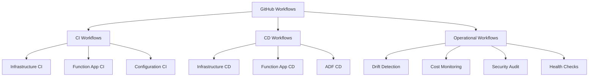
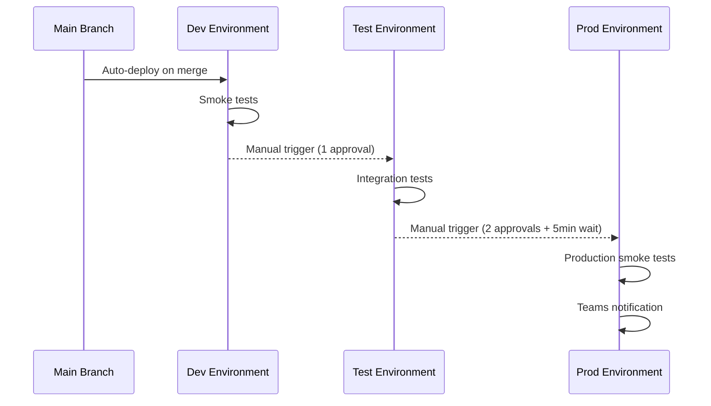

# CI/CD Workflows Implementation Guide

**Document Version:** 1.0  
**Last Updated:** October 6, 2025  
**Status:** Production Ready  
**Owner:** EDI Platform Team (DevOps)

---

## Table of Contents

1. [Workflow Architecture](#1-workflow-architecture)
2. [Infrastructure Workflows](#2-infrastructure-workflows)
3. [Function App Workflows](#3-function-app-workflows)
4. [ADF Workflows](#4-adf-workflows)
5. [Operational Workflows](#5-operational-workflows)
6. [Reusable Components](#6-reusable-components)
7. [Best Practices](#7-best-practices)

---

## 1. Workflow Architecture

### 1.1 Workflow Categories



### 1.2 Multi-Repository CI/CD Strategy

**Repository-Specific Workflows**

Each repository has its own GitHub Actions workflows tailored to its deployment needs:

| Repository | CI Workflow | CD Workflow | Deployment Strategy |
|------------|-------------|-------------|--------------------|
| **edi-platform-core** | `function-ci.yml` | `function-cd.yml` | Build → NuGet publish → Function deploy |
| **edi-sftp-connector** | `function-ci.yml` | `function-cd.yml` | Build → Test → Deploy to dev/test/prod |
| **edi-mappers** | `function-ci.yml` | `function-cd.yml` | Build → Test → Deploy per mapper |
| **edi-connectors** | `function-ci.yml` | `function-cd.yml` | Build → Test → Deploy per connector |
| **edi-partner-configs** | `config-ci.yml` | `config-cd.yml` | Validate JSON → Upload to blob |
| **edi-database-*** | `database-ci.yml` | `database-cd.yml` | Build DACPAC → Deploy with EF migrations |
| **edi-documentation** | `docs-ci.yml` | N/A | Markdown linting, link validation |

**Cross-Repository Coordination**

For coordinated releases across multiple repositories:

```yaml
# edi-platform/.github/workflows/orchestrated-deploy.yml
name: Orchestrated Platform Deploy
on:
  workflow_dispatch:
    inputs:
      environment:
        type: choice
        options: [dev, test, prod]

jobs:
  deploy-core:
    uses: PointCHealth/edi-platform-core/.github/workflows/deploy.yml@main
    with:
      environment: ${{ inputs.environment }}
  
  deploy-mappers:
    needs: deploy-core
    uses: PointCHealth/edi-mappers/.github/workflows/deploy.yml@main
    with:
      environment: ${{ inputs.environment }}
  
  deploy-connectors:
    needs: deploy-core
    uses: PointCHealth/edi-sftp-connector/.github/workflows/deploy.yml@main
    with:
      environment: ${{ inputs.environment }}
```

**Benefits of Multi-Repo Workflows:**

- ✅ **Fast builds**: Only build changed components (5 min vs. 30 min)
- ✅ **Isolated failures**: One repo's broken tests don't block others
- ✅ **Parallel deploys**: Deploy independent components simultaneously
- ✅ **Clear ownership**: Each team owns their repo's CI/CD
- ✅ **Flexible cadence**: Deploy configs 10x/day, functions 1x/week

### 1.3 Workflow Naming Convention

| Pattern | Example | Purpose |
|---------|---------|---------|  
| `*-ci.yml` | `infra-ci.yml` | Continuous Integration (PR validation) |
| `*-cd.yml` | `infra-cd.yml` | Continuous Deployment (environment deployment) |
| `*-monitoring.yml` | `cost-monitoring.yml` | Scheduled operational tasks |
| `*-audit.yml` | `security-audit.yml` | Compliance and security checks |

### 1.4 Common Workflow Structure

All workflows follow this structure:

```yaml
name: Workflow Name

on:
  # Triggers (push, pull_request, schedule, workflow_dispatch)

permissions:
  # Minimal permissions required

env:
  # Global environment variables

jobs:
  job-name:
    name: Human-Readable Job Name
    runs-on: ubuntu-latest  # or windows-latest
    environment: dev  # if deploying

    steps:
      - name: Checkout
        uses: actions/checkout@v4

      - name: Setup Tools
        # Install required tools

      - name: Execute Tasks
        # Main workflow logic

      - name: Upload Artifacts
        # Save outputs if needed

      - name: Job Summary
        # Post to $GITHUB_STEP_SUMMARY
```

---

## 2. Infrastructure Workflows

### 2.1 Infrastructure CI (`infra-ci.yml`)

**Purpose:** Validate Bicep templates on pull requests

**Triggers:**

- `pull_request` on paths: `infra/**`, `env/**`
- `workflow_dispatch` (manual)

**Jobs:**

1. **Bicep Build** - Compile Bicep to ARM JSON
2. **Bicep Lint** - Check for warnings/errors
3. **Security Scan** - PSRule + Checkov
4. **What-If Analysis** - Preview infrastructure changes
5. **PR Comment** - Post what-if results to PR

**Key Features:**

- Security scanning with SARIF upload
- What-if analysis against dev environment
- Automated PR comments with deployment preview
- Artifact retention for 14 days

**Sample Workflow:**

```yaml
name: Infrastructure CI

on:
  pull_request:
    branches: [main]
    paths:
      - 'infra/**'
      - 'env/**'
      - '.github/workflows/infra-ci.yml'
  workflow_dispatch:

permissions:
  id-token: write
  contents: read
  pull-requests: write
  security-events: write

jobs:
  validate:
    name: Validate IaC
    runs-on: ubuntu-latest

    steps:
      - name: Checkout
        uses: actions/checkout@v4

      - name: Setup Azure CLI
        run: |
          curl -sL https://aka.ms/InstallAzureCLIDeb | sudo bash
          az bicep install

      - name: Bicep Build
        run: |
          az bicep build --file infra/bicep/main.bicep
          echo "✅ Bicep build successful" >> $GITHUB_STEP_SUMMARY

      - name: Bicep Lint
        run: |
          OUTPUT=$(az bicep lint infra/bicep/main.bicep 2>&1)
          echo "$OUTPUT"
          if echo "$OUTPUT" | grep -qi "warning\|error"; then
            echo "::error::Bicep lint found issues"
            exit 1
          fi

      - name: Security Scan (Checkov)
        uses: bridgecrewio/checkov-action@v12
        with:
          directory: infra/bicep
          framework: bicep
          output_format: sarif
          output_file_path: checkov-results.sarif

      - name: Upload Security Scan Results
        uses: github/codeql-action/upload-sarif@v2
        if: always()
        with:
          sarif_file: checkov-results.sarif

      - name: Azure Login
        uses: azure/login@v1
        with:
          client-id: ${{ secrets.AZURE_CLIENT_ID }}
          tenant-id: ${{ secrets.AZURE_TENANT_ID }}
          subscription-id: ${{ secrets.AZURE_SUBSCRIPTION_ID_DEV }}

      - name: What-If Analysis
        id: whatif
        run: |
          az deployment group what-if \
            --resource-group ${{ vars.DEV_RESOURCE_GROUP }} \
            --template-file infra/bicep/main.bicep \
            --parameters env/dev.parameters.json \
            > whatif-output.txt 2>&1 || true

          cat whatif-output.txt

      - name: Comment PR
        uses: actions/github-script@v7
        if: github.event_name == 'pull_request'
        with:
          script: |
            const fs = require('fs');
            const output = fs.readFileSync('whatif-output.txt', 'utf8');

            const body = `### 📋 Infrastructure What-If Results

            <details>
            <summary>Click to view changes</summary>

            \`\`\`
            ${output.substring(0, 60000)}
            \`\`\`

            </details>
            `;

            github.rest.issues.createComment({
              owner: context.repo.owner,
              repo: context.repo.repo,
              issue_number: context.issue.number,
              body: body
            });
```

### 2.2 Infrastructure CD (`infra-cd.yml`)

**Purpose:** Deploy infrastructure to environments

**Triggers:**

- `push` to `main` (auto-deploy dev)
- `workflow_dispatch` with environment input

**Jobs:**

1. **deploy-dev** - Auto-deploy to dev on main merge
2. **deploy-test** - Manual trigger after dev validation (1 approver)
3. **deploy-prod** - Manual trigger after test validation (2 approvers)

**Key Features:**

- Environment-specific approval gates
- What-if analysis before production deployment
- Post-deployment smoke tests
- Resource tagging with deployment metadata
- Teams notifications for prod deployments

**Environment Flow:**



**Sample Workflow:**

```yaml
name: Infrastructure CD

on:
  push:
    branches: [main]
    paths:
      - 'infra/**'
  workflow_dispatch:
    inputs:
      environment:
        required: true
        type: choice
        options: [dev, test, prod]

permissions:
  id-token: write
  contents: read

jobs:
  deploy-dev:
    name: Deploy to Dev
    runs-on: ubuntu-latest
    environment: dev
    if: github.event_name == 'push' || inputs.environment == 'dev'

    steps:
      - name: Checkout
        uses: actions/checkout@v4

      - name: Azure Login
        uses: azure/login@v1
        with:
          client-id: ${{ secrets.AZURE_CLIENT_ID }}
          tenant-id: ${{ secrets.AZURE_TENANT_ID }}
          subscription-id: ${{ secrets.AZURE_SUBSCRIPTION_ID_DEV }}

      - name: Deploy Infrastructure
        run: |
          az deployment group create \
            --resource-group ${{ vars.DEV_RESOURCE_GROUP }} \
            --template-file infra/bicep/main.bicep \
            --parameters env/dev.parameters.json \
            --parameters deploymentTime="$(date -u +%Y-%m-%dT%H:%M:%SZ)" \
            --parameters gitSha="${{ github.sha }}"

      - name: Smoke Tests
        run: |
          echo "Running smoke tests..."
          # Add smoke test commands here

      - name: Job Summary
        run: |
          echo "### ✅ Dev Deployment Complete" >> $GITHUB_STEP_SUMMARY
          echo "- **Environment:** dev" >> $GITHUB_STEP_SUMMARY
          echo "- **Commit:** ${{ github.sha }}" >> $GITHUB_STEP_SUMMARY
          echo "- **Time:** $(date -u)" >> $GITHUB_STEP_SUMMARY

  deploy-test:
    name: Deploy to Test
    runs-on: ubuntu-latest
    environment: test
    if: inputs.environment == 'test'
    needs: []  # No dependency on dev for manual triggers

    steps:
      - name: Checkout
        uses: actions/checkout@v4

      - name: Azure Login
        uses: azure/login@v1
        with:
          client-id: ${{ secrets.AZURE_CLIENT_ID }}
          tenant-id: ${{ secrets.AZURE_TENANT_ID }}
          subscription-id: ${{ secrets.AZURE_SUBSCRIPTION_ID_DEV }}

      - name: Deploy Infrastructure
        run: |
          az deployment group create \
            --resource-group ${{ vars.TEST_RESOURCE_GROUP }} \
            --template-file infra/bicep/main.bicep \
            --parameters env/test.parameters.json \
            --parameters deploymentTime="$(date -u +%Y-%m-%dT%H:%M:%SZ)" \
            --parameters gitSha="${{ github.sha }}"

      - name: Integration Tests
        run: |
          echo "Running integration tests..."
          # Add integration test commands here

  deploy-prod:
    name: Deploy to Prod
    runs-on: ubuntu-latest
    environment: prod
    if: inputs.environment == 'prod'

    steps:
      - name: Checkout
        uses: actions/checkout@v4

      - name: Azure Login
        uses: azure/login@v1
        with:
          client-id: ${{ secrets.AZURE_CLIENT_ID }}
          tenant-id: ${{ secrets.AZURE_TENANT_ID }}
          subscription-id: ${{ secrets.AZURE_SUBSCRIPTION_ID_PROD }}

      - name: What-If Analysis
        run: |
          echo "### 📋 Production What-If Analysis" >> $GITHUB_STEP_SUMMARY
          az deployment group what-if \
            --resource-group ${{ vars.PROD_RESOURCE_GROUP }} \
            --template-file infra/bicep/main.bicep \
            --parameters env/prod.parameters.json | tee -a $GITHUB_STEP_SUMMARY

      - name: Deploy Infrastructure
        run: |
          az deployment group create \
            --resource-group ${{ vars.PROD_RESOURCE_GROUP }} \
            --template-file infra/bicep/main.bicep \
            --parameters env/prod.parameters.json \
            --parameters deploymentTime="$(date -u +%Y-%m-%dT%H:%M:%SZ)" \
            --parameters gitSha="${{ github.sha }}"

      - name: Production Smoke Tests
        run: |
          echo "Running production smoke tests..."
          # Add smoke test commands here

      - name: Notify Teams
        if: always()
        run: |
          # Send Teams notification (if webhook configured)
          echo "Sending Teams notification..."
```

---

## 3. Function App Workflows

### 3.0 NuGet Package Publishing (`publish-nuget.yml`)

**Repository:** `edi-platform-core` only  
**Purpose:** Publish shared libraries to GitHub Packages for consumption by other repositories

**Triggers:**

- `push` to `main` on paths: `shared/**`, `**/*.csproj`
- `release` published
- `workflow_dispatch` (manual)

**Jobs:**

1. **Build & Test** - Compile shared libraries and run tests
2. **Pack** - Create NuGet packages with symbols
3. **Publish** - Upload to GitHub Packages

**Key Features:**

- Automatic versioning from csproj
- Symbol packages for debugging
- Skip duplicate packages
- Automatic authentication via `GITHUB_TOKEN`
- Job summary with published packages

**Sample Workflow:**

```yaml
name: Publish NuGet Packages

on:
  push:
    branches: [main]
    paths:
      - 'shared/**'
      - '**/*.csproj'
  release:
    types: [published]
  workflow_dispatch:

permissions:
  contents: read
  packages: write

jobs:
  publish:
    name: Publish to GitHub Packages
    runs-on: ubuntu-latest
    
    steps:
      - name: Checkout
        uses: actions/checkout@v4
      
      - name: Setup .NET
        uses: actions/setup-dotnet@v4
        with:
          dotnet-version: '9.0.x'
      
      - name: Restore Dependencies
        run: dotnet restore
      
      - name: Build Shared Libraries
        run: dotnet build shared --configuration Release --no-restore
      
      - name: Run Tests
        run: dotnet test shared --configuration Release --no-build --verbosity normal
      
      - name: Pack NuGet Packages
        run: |
          echo "### 📦 Packing NuGet Packages" >> $GITHUB_STEP_SUMMARY
          for project in shared/*/; do
            echo "Packing $project..."
            dotnet pack "$project" \
              --configuration Release \
              --no-build \
              --output ./packages \
              --include-symbols \
              --include-source
          done
      
      - name: List Packages
        run: |
          echo "" >> $GITHUB_STEP_SUMMARY
          echo "**Packages Created:**" >> $GITHUB_STEP_SUMMARY
          ls -1 ./packages/*.nupkg | sed 's|./packages/||' | sed 's|^|- |' >> $GITHUB_STEP_SUMMARY
      
      - name: Publish to GitHub Packages
        run: |
          dotnet nuget push ./packages/*.nupkg \
            --source https://nuget.pkg.github.com/${{ github.repository_owner }}/index.json \
            --api-key ${{ secrets.GITHUB_TOKEN }} \
            --skip-duplicate
      
      - name: Job Summary
        run: |
          echo "" >> $GITHUB_STEP_SUMMARY
          echo "### ✅ Published Successfully" >> $GITHUB_STEP_SUMMARY
          echo "**Feed URL:** https://nuget.pkg.github.com/PointCHealth/index.json" >> $GITHUB_STEP_SUMMARY
          echo "**Commit:** ${{ github.sha }}" >> $GITHUB_STEP_SUMMARY
```

**Usage in Consumer Repositories:**

Other repositories (edi-sftp-connector, edi-mappers, etc.) consume these packages. See Multi-Repo Strategy documentation for detailed setup.

---

### 3.1 Function App CI (`function-ci.yml`)

**Purpose:** Build and test Azure Functions on pull requests

**Triggers:**

- `pull_request` on paths: `src/**`, `*.csproj`
- `workflow_dispatch`

**Jobs:**

1. **Build** - Restore, build, test .NET projects
2. **Security Scan** - CodeQL + dependency scanning
3. **Unit Tests** - Run xUnit tests with coverage
4. **Package** - Create zip deployment package

**Sample Workflow:**

```yaml
name: Function App CI

on:
  pull_request:
    branches: [main]
    paths:
      - 'src/**'
      - '**/*.csproj'
      - '.github/workflows/function-ci.yml'

permissions:
  contents: read
  packages: read  # Required for GitHub Packages
  security-events: write
  pull-requests: write

jobs:
  build:
    runs-on: ubuntu-latest

    steps:
      - uses: actions/checkout@v4

      - name: Setup .NET
        uses: actions/setup-dotnet@v3
        with:
          dotnet-version: '9.0.x'

      - name: Restore Dependencies
        env:
          GITHUB_TOKEN: ${{ secrets.GITHUB_TOKEN }}  # Auth for GitHub Packages
        run: dotnet restore

      - name: Build
        run: dotnet build --configuration Release --no-restore

      - name: Run Tests
        run: dotnet test --no-build --verbosity normal --collect:"XPlat Code Coverage"

      - name: Upload Coverage
        uses: codecov/codecov-action@v3
        with:
          directory: TestResults/

      - name: Publish
        run: |
          dotnet publish --configuration Release --output ./output

      - name: Create Deployment Package
        run: |
          cd output
          zip -r ../function-app.zip .

      - name: Upload Artifact
        uses: actions/upload-artifact@v4
        with:
          name: function-app-pr-${{ github.event.pull_request.number }}
          path: function-app.zip
          retention-days: 7

      - name: Job Summary
        run: |
          echo "### ✅ Build Complete" >> $GITHUB_STEP_SUMMARY
          echo "- **PR:** #${{ github.event.pull_request.number }}" >> $GITHUB_STEP_SUMMARY
          echo "- **Build:** Success" >> $GITHUB_STEP_SUMMARY
          echo "- **Tests:** Passed" >> $GITHUB_STEP_SUMMARY
```

### 3.2 Function App CD (`function-cd.yml`)

**Purpose:** Deploy function apps to environments

**Triggers:**

- `push` to `main` (build artifacts)
- `workflow_dispatch` with environment input

**Deployment Strategy:**

- **Dev:** Zip deploy directly to function app
- **Test:** Deploy with health checks
- **Prod:** Deploy with extended health checks and rollback capability

**Sample Workflow:**

```yaml
name: Function App CD

on:
  push:
    branches: [main]
    paths:
      - 'src/**'
  workflow_dispatch:
    inputs:
      environment:
        required: true
        type: choice
        options: [dev, test, prod]

permissions:
  id-token: write
  contents: read

jobs:
  build:
    runs-on: ubuntu-latest

    steps:
      - uses: actions/checkout@v4

      - name: Setup .NET
        uses: actions/setup-dotnet@v3
        with:
          dotnet-version: '9.0.x'

      - name: Build and Publish
        run: |
          dotnet publish --configuration Release --output ./output

      - name: Create Zip
        run: |
          cd output
          zip -r ../function-app.zip .

      - name: Upload Artifact
        uses: actions/upload-artifact@v4
        with:
          name: function-app-${{ github.run_number }}
          path: function-app.zip

  deploy-dev:
    needs: build
    runs-on: ubuntu-latest
    environment: dev
    if: github.event_name == 'push' || inputs.environment == 'dev'

    steps:
      - name: Download Artifact
        uses: actions/download-artifact@v4
        with:
          name: function-app-${{ github.run_number }}

      - name: Azure Login
        uses: azure/login@v1
        with:
          client-id: ${{ secrets.AZURE_CLIENT_ID }}
          tenant-id: ${{ secrets.AZURE_TENANT_ID }}
          subscription-id: ${{ secrets.AZURE_SUBSCRIPTION_ID_DEV }}

      - name: Deploy to Azure Functions
        uses: Azure/functions-action@v1
        with:
          app-name: func-edi-router-dev-eastus2
          package: function-app.zip

      - name: Health Check
        run: |
          echo "Waiting for function app to restart..."
          sleep 30
          echo "Checking health endpoint..."
          curl -f https://func-edi-router-dev-eastus2.azurewebsites.net/api/health || exit 1
          echo "✅ Health check passed" >> $GITHUB_STEP_SUMMARY

  deploy-test:
    needs: build
    runs-on: ubuntu-latest
    environment: test
    if: inputs.environment == 'test'

    steps:
      - name: Download Artifact
        uses: actions/download-artifact@v4
        with:
          name: function-app-${{ github.run_number }}

      - name: Azure Login
        uses: azure/login@v1
        with:
          client-id: ${{ secrets.AZURE_CLIENT_ID }}
          tenant-id: ${{ secrets.AZURE_TENANT_ID }}
          subscription-id: ${{ secrets.AZURE_SUBSCRIPTION_ID_DEV }}

      - name: Deploy to Azure Functions
        uses: Azure/functions-action@v1
        with:
          app-name: func-edi-router-test-eastus2
          package: function-app.zip

      - name: Health Check
        run: |
          sleep 30
          curl -f https://func-edi-router-test-eastus2.azurewebsites.net/api/health || exit 1

  deploy-prod:
    needs: build
    runs-on: ubuntu-latest
    environment: prod
    if: inputs.environment == 'prod'

    steps:
      - name: Download Artifact
        uses: actions/download-artifact@v4
        with:
          name: function-app-${{ github.run_number }}

      - name: Azure Login
        uses: azure/login@v1
        with:
          client-id: ${{ secrets.AZURE_CLIENT_ID }}
          tenant-id: ${{ secrets.AZURE_TENANT_ID }}
          subscription-id: ${{ secrets.AZURE_SUBSCRIPTION_ID_PROD }}

      - name: Deploy to Azure Functions
        uses: Azure/functions-action@v1
        with:
          app-name: func-edi-router-prod-eastus2
          package: function-app.zip

      - name: Production Health Check
        run: |
          echo "Waiting for function app to restart..."
          sleep 30
          
          echo "Running health checks..."
          for i in {1..5}; do
            if curl -f https://func-edi-router-prod-eastus2.azurewebsites.net/api/health; then
              echo "✅ Health check passed (attempt $i)"
              break
            else
              echo "⚠️ Health check failed (attempt $i)"
              if [ $i -eq 5 ]; then
                echo "::error::Health check failed after 5 attempts"
                exit 1
              fi
              sleep 10
            fi
          done

      - name: Notify Teams
        if: always()
        run: |
          echo "Sending Teams notification..."
          # Add Teams webhook notification here
```

---

## 4. ADF Workflows

### 4.1 ADF Validation (`adf-ci.yml`)

**Purpose:** Validate ADF resources on pull requests

**Triggers:**

- `pull_request` on paths: `adf/**`

**Jobs:**

1. **Validate** - Run ADF validation build
2. **Lint** - Check JSON schema compliance

### 4.2 ADF Export (`adf-export.yml`)

**Purpose:** Export ADF ARM templates after publish

**Triggers:**

- `push` to `main` branch in ADF collaboration branch

**Jobs:**

1. **Export ARM** - Generate ARM templates from ADF UI
2. **Upload Artifact** - Save templates for deployment

### 4.3 ADF Deployment (`adf-cd.yml`)

**Purpose:** Deploy ADF pipelines to environments

**Triggers:**

- `workflow_dispatch` with environment input

**Jobs:**

1. **Deploy** - Apply ARM templates to target ADF
2. **Test Pipeline** - Run test trigger
3. **Enable Triggers** - Activate scheduled triggers

---

## 5. Operational Workflows

### 5.1 Drift Detection (`drift-detection.yml`)

**Purpose:** Nightly infrastructure drift detection

**Triggers:**

- `schedule: '0 2 * * *'` (2 AM UTC daily)
- `workflow_dispatch`

**Jobs:**

- Run what-if analysis against all environments
- Create GitHub issue if drift detected
- Tag issue with environment label

**Sample Workflow:**

```yaml
name: Drift Detection

on:
  schedule:
    - cron: '0 2 * * *'  # 2 AM UTC daily
  workflow_dispatch:

permissions:
  id-token: write
  contents: read
  issues: write

jobs:
  detect-drift:
    runs-on: ubuntu-latest

    strategy:
      matrix:
        environment: [dev, test, prod]

    steps:
      - name: Checkout
        uses: actions/checkout@v4

      - name: Azure Login
        uses: azure/login@v1
        with:
          client-id: ${{ secrets.AZURE_CLIENT_ID }}
          tenant-id: ${{ secrets.AZURE_TENANT_ID }}
          subscription-id: ${{ secrets[format('AZURE_SUBSCRIPTION_ID_{0}', matrix.environment)] }}

      - name: Run What-If
        id: whatif
        run: |
          az deployment group what-if \
            --resource-group rg-edi-${{ matrix.environment }}-eastus2 \
            --template-file infra/bicep/main.bicep \
            --parameters env/${{ matrix.environment }}.parameters.json \
            > drift-output.txt 2>&1

          if grep -q "Resource changes:" drift-output.txt; then
            echo "drift_detected=true" >> $GITHUB_OUTPUT
          fi

      - name: Create Issue
        if: steps.whatif.outputs.drift_detected == 'true'
        uses: actions/github-script@v7
        with:
          script: |
            const fs = require('fs');
            const output = fs.readFileSync('drift-output.txt', 'utf8');
            
            github.rest.issues.create({
              owner: context.repo.owner,
              repo: context.repo.repo,
              title: `[Drift] Infrastructure drift detected in ${{ matrix.environment }}`,
              body: `Drift detected in ${{ matrix.environment }} environment.\n\n\`\`\`\n${output}\n\`\`\``,
              labels: ['drift-detection', '${{ matrix.environment }}']
            });
```

### 5.2 Cost Monitoring (`cost-monitoring.yml`)

**Purpose:** Daily cost tracking and budget alerts

**Triggers:**

- `schedule: '0 8 * * *'` (8 AM UTC daily)
- `workflow_dispatch`

**Jobs:**

1. **Fetch Costs** - Query Azure Cost Management API
2. **Analyze** - Calculate budget percentages
3. **Alert** - Create issue if over budget
4. **Report** - Post Teams summary

### 5.3 Security Audit (`security-audit.yml`)

**Purpose:** Weekly security scanning and compliance validation

**Triggers:**

- `schedule: '0 3 * * 1'` (Monday 3 AM UTC)
- `pull_request` (on-demand)

**Jobs:**

1. **IaC Security** - Checkov + PSRule
2. **Code Security** - CodeQL
3. **Dependencies** - Vulnerability scanning
4. **Compliance** - HIPAA requirement validation

### 5.4 Health Checks (`function-health-check.yml`)

**Purpose:** Proactive function app health monitoring

**Triggers:**

- `schedule: '*/15 * * * *'` (every 15 minutes)
- Callable from other workflows

**Jobs:**

- Test health endpoints for all function apps
- Create issue if production failures detected
- Post metrics to Application Insights

---

## 6. Reusable Components

### 6.1 Composite Actions

Create composite actions for common tasks:

**File:** `.github/actions/azure-login/action.yml`

```yaml
name: 'Azure Login'
description: 'Login to Azure using OIDC'

inputs:
  environment:
    description: 'Environment (dev/test/prod)'
    required: true

runs:
  using: 'composite'
  steps:
    - name: Azure Login
      uses: azure/login@v1
      with:
        client-id: ${{ env.AZURE_CLIENT_ID }}
        tenant-id: ${{ env.AZURE_TENANT_ID }}
        subscription-id: ${{ env.AZURE_SUBSCRIPTION_ID }}
```

### 6.2 Reusable Workflows

Create reusable workflows for shared logic:

**File:** `.github/workflows/reusable-deploy.yml`

```yaml
name: Reusable Deployment

on:
  workflow_call:
    inputs:
      environment:
        required: true
        type: string
      artifact-name:
        required: true
        type: string

jobs:
  deploy:
    runs-on: ubuntu-latest
    environment: ${{ inputs.environment }}

    steps:
      - name: Download Artifact
        uses: actions/download-artifact@v4
        with:
          name: ${{ inputs.artifact-name }}

      - name: Deploy
        run: echo "Deploying to ${{ inputs.environment }}"
```

**Usage in caller workflow:**

```yaml
jobs:
  deploy-dev:
    uses: ./.github/workflows/reusable-deploy.yml
    with:
      environment: dev
      artifact-name: my-app
```

---

## 7. Best Practices

### 7.1 Workflow Design

- ✅ **Single Responsibility** - One workflow per purpose (CI vs CD)
- ✅ **Fail Fast** - Run quick checks first (lint before build)
- ✅ **Parallel Jobs** - Use matrix strategy for parallelization
- ✅ **Idempotent** - Workflows should be re-runnable
- ✅ **Minimal Permissions** - Grant only required permissions

### 7.2 Performance Optimization

- **Caching:** Cache dependencies (NuGet, Bicep modules)
- **Artifacts:** Only upload necessary files
- **Conditionals:** Skip jobs when files unchanged
- **Concurrency:** Prevent duplicate runs

```yaml
concurrency:
  group: ${{ github.workflow }}-${{ github.ref }}
  cancel-in-progress: true  # Cancel previous runs
```

### 7.3 Security

- **Secret Management:** Use GitHub Secrets, never commit
- **OIDC Authentication:** Prefer OIDC over service principal secrets
- **Least Privilege:** Minimal permissions in `permissions:` block
- **Dependency Pinning:** Pin action versions to specific SHA

```yaml
- uses: actions/checkout@8e5e7e5ab8b370d6c329ec480221332ada57f0ab  # v4.1.1
```

### 7.4 Debugging

Enable debug logging:

```powershell
# Add repository secrets
gh secret set ACTIONS_RUNNER_DEBUG --body "true" --repo $repo
gh secret set ACTIONS_STEP_DEBUG --body "true" --repo $repo
```

Use workflow commands:

```yaml
- name: Debug
  run: |
    echo "::debug::This is a debug message"
    echo "::warning::This is a warning"
    echo "::error::This is an error"
```

### 7.5 Documentation

- **Workflow Comments:** Add comments to complex logic
- **Job Summaries:** Use `$GITHUB_STEP_SUMMARY` for reports
- **PR Comments:** Post results to pull requests
- **README:** Document workflow triggers and purpose

---

## 8. Next Steps

1. **Implement Workflows** - Copy workflow templates to repositories
2. **Test Workflows** - Trigger each workflow manually
3. **Monitor Executions** - Review Actions tab for results
4. **Iterate** - Refine based on team feedback

---

## 9. Related Documentation

- **[GitHub Actions Setup](./20-github-actions-setup.md)** - Initial setup
- **[Deployment Procedures](./22-deployment-procedures.md)** - Deployment execution
- **[Rollback Procedures](./23-rollback-procedures.md)** - Emergency rollback
- **[Deployment Overview](./19-deployment-automation-overview.md)** - High-level architecture

---

**Document Maintenance:**

- Update after adding new workflows
- Review quarterly for action version updates
- Document lessons learned from incidents

**Feedback:** Create GitHub issue or contact platform team

---

**Status:** ✅ Ready for implementation
