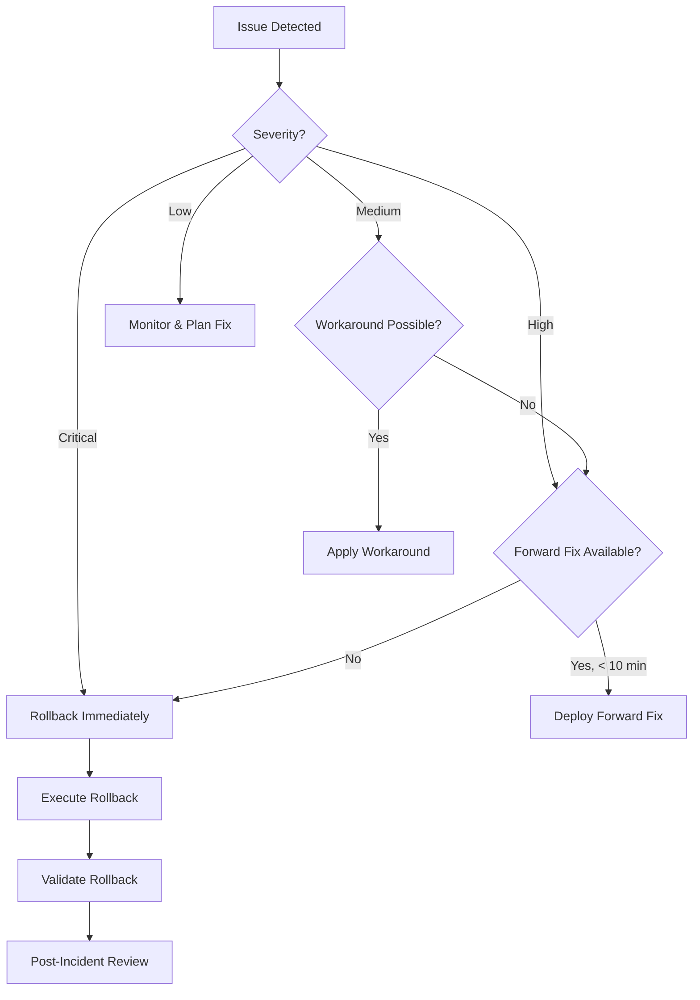

# Rollback Procedures

**Document Version:** 1.0  
**Last Updated:** October 6, 2025  
**Status:** Production Ready  
**Owner:** EDI Platform Team (Operations)  
**CRITICAL:** Memorize these procedures for incident response

---

## Table of Contents

1. [Overview](#1-overview)
2. [Decision Criteria](#2-decision-criteria)
3. [Infrastructure Rollback](#3-infrastructure-rollback)
4. [Function App Rollback](#4-function-app-rollback)
5. [ADF Pipeline Rollback](#5-adf-pipeline-rollback)
6. [Configuration Rollback](#6-configuration-rollback)
7. [Emergency Procedures](#7-emergency-procedures)
8. [Post-Rollback Actions](#8-post-rollback-actions)

---

## 1. Overview

### 1.1 Rollback Philosophy

**Goal:** Restore service as quickly as possible, investigate root cause later

**Principles:**

- 🚨 **Speed Over Perfection** - Don't debug in production during outage
- 🔄 **Known-Good State** - Revert to last working version
- 📊 **Monitor Closely** - Watch metrics during and after rollback
- 📝 **Document Everything** - Capture timeline for post-mortem

### 1.2 Rollback SLAs

| Component | Target Rollback Time | Maximum Downtime |
|-----------|---------------------|------------------|
| **Function Apps** | 5 minutes | 10 minutes |
| **Configuration** | 2 minutes | 5 minutes |
| **Infrastructure** | 15 minutes | 30 minutes |
| **ADF Pipelines** | 10 minutes | 20 minutes |

---

## 2. Decision Criteria

### 2.1 When to Rollback

Rollback immediately if:

- ❌ **Error Rate Spike:** >5% increase in error rate
- ❌ **Performance Degradation:** >50% increase in latency
- ❌ **Service Unavailable:** Health endpoints returning 500 errors
- ❌ **Data Loss Risk:** Potential for data corruption or loss
- ❌ **Security Incident:** Security vulnerability introduced
- ❌ **Regulatory Violation:** HIPAA compliance issue

### 2.2 When NOT to Rollback

Consider alternatives if:

- ✅ **Minor Performance Issue:** <5% latency increase, not affecting users
- ✅ **Known Issue with Workaround:** Issue can be mitigated without rollback
- ✅ **Forward Fix Available:** Bug fix can be deployed faster than rollback
- ✅ **Configuration Tweak Needed:** Issue resolved by config change only

### 2.3 Rollback Decision Tree



---

## 3. Infrastructure Rollback

### 3.1 Bicep Infrastructure Rollback

**Scenario:** Recent infrastructure deployment caused issues

#### Step 1: Identify Last Known Good Deployment

```powershell
# List recent deployments
az deployment group list \
  --resource-group rg-edi-prod-eastus2 \
  --query "[?properties.provisioningState=='Succeeded'].{Name:name, Timestamp:properties.timestamp, SHA:tags.deploymentSha}" \
  --output table
```

**Identify:** Last successful deployment before the issue

#### Step 2: Checkout Previous Commit

```powershell
# Clone repository (if not already cloned)
git clone https://github.com/PointCHealth/edi-platform-core.git
cd edi-platform-core

# Find last good commit
git log --oneline --all -- infra/bicep/

# Checkout last good commit
git checkout <GOOD_COMMIT_SHA>
```

#### Step 3: Deploy Previous Version

```powershell
# Login to Azure
az login

# Set subscription
az account set --subscription <PROD_SUBSCRIPTION_ID>

# Deploy last known good configuration
az deployment group create \
  --resource-group rg-edi-prod-eastus2 \
  --template-file infra/bicep/main.bicep \
  --parameters env/prod.parameters.json \
  --name rollback-$(Get-Date -Format "yyyyMMdd-HHmmss")
```

**Expected Duration:** 10-15 minutes

#### Step 4: Validate Rollback

```powershell
# Check deployment status
az deployment group show \
  --resource-group rg-edi-prod-eastus2 \
  --name rollback-<TIMESTAMP> \
  --query properties.provisioningState
```

**Expected Result:** `"Succeeded"`

#### Step 5: Run Smoke Tests

```powershell
# Execute smoke test suite
pwsh scripts/smoke-tests.ps1 -Environment prod -ResourceGroup rg-edi-prod-eastus2
```

### 3.2 Rollback via GitHub Actions

**Alternative:** Use GitHub Actions workflow for rollback

#### Navigate to GitHub Actions

**Repository:** PointCHealth/edi-platform-core

**Workflow:** Infrastructure CD

#### Run Rollback Workflow

1. Click **Actions** tab
2. Select **Infrastructure CD** workflow
3. Click **Run workflow**
4. **Inputs:**
   - Environment: `prod`
   - Commit SHA: `<GOOD_COMMIT_SHA>` (if workflow supports it)
5. Click **Run workflow**

**Approval:** May require override approval gates in emergency (if configured)

---

## 4. Function App Rollback

### 4.1 Quick Rollback via Azure Portal (Fastest)

**Use When:** Need immediate rollback

#### Navigate to Function App

1. Open **Azure Portal**
2. Navigate to function app (e.g., `func-edi-router-prod-eastus2`)
3. Select **Deployment Center**
4. View **Deployment History**
5. Select previous successful deployment
6. Click **Redeploy**

**Expected Duration:** 2-3 minutes

### 4.2 Rollback via Azure CLI

**Use When:** Scripted rollback preferred

#### Step 1: Find Previous Artifact

```powershell
# List recent workflow runs
gh run list --workflow function-cd.yml --repo PointCHealth/edi-platform-core --limit 10
```

**Identify:** Last successful run before the problematic deployment

#### Step 2: Download Artifact

```powershell
# Download artifact from previous run
gh run download <GOOD_RUN_ID> \
  --repo PointCHealth/edi-platform-core \
  --name function-app-<GOOD_RUN_NUMBER>
```

#### Step 3: Deploy Previous Version

```powershell
# Login to Azure
az login
az account set --subscription <PROD_SUBSCRIPTION_ID>

# Deploy previous version
az functionapp deployment source config-zip \
  --name func-edi-router-prod-eastus2 \
  --resource-group rg-edi-prod-eastus2 \
  --src function-app-<GOOD_RUN_NUMBER>.zip
```

**Expected Duration:** 3-5 minutes

#### Step 4: Validate Rollback

```powershell
# Test health endpoint
curl https://func-edi-router-prod-eastus2.azurewebsites.net/api/health

# Check Application Insights for errors
az monitor app-insights query \
  --app func-edi-router-prod-eastus2 \
  --analytics-query "exceptions | where timestamp > ago(5m) | count" \
  --resource-group rg-edi-prod-eastus2
```

**Expected Result:** Health check passes, 0 exceptions

#### Step 5: Restart Function App (if needed)

```powershell
# Restart to clear any cached issues
az functionapp restart \
  --name func-edi-router-prod-eastus2 \
  --resource-group rg-edi-prod-eastus2
```

### 4.3 Rollback All Function Apps

**Use When:** Multiple function apps need rollback

```powershell
# List of function apps to rollback
$functionApps = @(
    "func-edi-router-prod-eastus2",
    "func-edi-validator-prod-eastus2",
    "func-edi-orchestrator-prod-eastus2",
    "func-edi-mapper-837-prod-eastus2",
    "func-edi-mapper-835-prod-eastus2"
)

# Previous artifact path
$artifactPath = "function-app-<GOOD_RUN_NUMBER>.zip"

foreach ($app in $functionApps) {
    Write-Host "Rolling back $app..." -ForegroundColor Yellow
    
    az functionapp deployment source config-zip \
      --name $app \
      --resource-group rg-edi-prod-eastus2 \
      --src $artifactPath
    
    Write-Host "✅ $app rolled back" -ForegroundColor Green
}
```

### 4.4 Rollback via GitHub Actions

#### Run Rollback Workflow

1. Navigate to **Actions → Function App CD**
2. Click **Run workflow**
3. **Inputs:**
   - Environment: `prod`
   - Artifact: `function-app-<GOOD_RUN_NUMBER>`
4. Click **Run workflow**

**Approval:** May require override in emergency

---

## 5. ADF Pipeline Rollback

### 5.1 Disable Triggers Immediately

**First Action:** Stop data processing if pipelines are failing

```powershell
# Stop all triggers in production ADF
$triggers = az datafactory trigger list \
  --factory-name adf-edi-prod-eastus2 \
  --resource-group rg-edi-prod-eastus2 \
  --query "[].name" \
  --output tsv

foreach ($trigger in $triggers) {
    Write-Host "Stopping trigger: $trigger" -ForegroundColor Yellow
    az datafactory trigger stop \
      --factory-name adf-edi-prod-eastus2 \
      --resource-group rg-edi-prod-eastus2 \
      --name $trigger
}
```

**Expected Duration:** 1-2 minutes

### 5.2 Deploy Previous ARM Templates

#### Step 1: Find Previous ARM Templates

```powershell
# Download ARM templates from previous GitHub run
gh run list --workflow adf-export.yml --repo PointCHealth/edi-platform-core --limit 10
gh run download <GOOD_RUN_ID> --repo PointCHealth/edi-platform-core --name adf-arm-templates
```

#### Step 2: Deploy Previous Version

```powershell
# Deploy ARM templates
az deployment group create \
  --resource-group rg-edi-prod-eastus2 \
  --template-file ARMTemplateForFactory.json \
  --parameters ARMTemplateParametersForFactory.json \
  --name rollback-adf-$(Get-Date -Format "yyyyMMdd-HHmmss")
```

**Expected Duration:** 5-10 minutes

#### Step 3: Validate Rollback

```powershell
# Test pipeline with sample data
az datafactory pipeline create-run \
  --factory-name adf-edi-prod-eastus2 \
  --resource-group rg-edi-prod-eastus2 \
  --name PL_Inbound_SFTP_to_Storage \
  --parameters '@test-parameters.json'

# Monitor pipeline run
az datafactory pipeline-run show \
  --factory-name adf-edi-prod-eastus2 \
  --resource-group rg-edi-prod-eastus2 \
  --run-id <RUN_ID>
```

#### Step 4: Re-enable Triggers

```powershell
# Re-enable triggers after validation
foreach ($trigger in $triggers) {
    Write-Host "Starting trigger: $trigger" -ForegroundColor Green
    az datafactory trigger start \
      --factory-name adf-edi-prod-eastus2 \
      --resource-group rg-edi-prod-eastus2 \
      --name $trigger
}
```

### 5.3 Manual Rollback in ADF UI

**Alternative:** Use ADF Studio for manual rollback

1. Open **Azure Data Factory Studio**
2. Navigate to **Manage → Git configuration**
3. Select previous commit from dropdown
4. Click **Apply** to revert workspace
5. Click **Publish** to deploy changes

---

## 6. Configuration Rollback

### 6.1 Partner Configuration Rollback

**Fastest Rollback:** Change configuration version pointer

#### Step 1: Identify Previous Configuration Version

```powershell
# List configuration versions in blob storage
az storage blob list \
  --account-name stediproeastus2 \
  --container-name configs \
  --prefix "config-v" \
  --query "[].name" \
  --output table
```

**Identify:** Previous configuration version (e.g., `config-v2024-10-05-100000`)

#### Step 2: Update App Settings

```powershell
# Update all function apps to use previous config version
$functionApps = @(
    "func-edi-router-prod-eastus2",
    "func-edi-validator-prod-eastus2",
    "func-edi-orchestrator-prod-eastus2"
)

$previousVersion = "config-v2024-10-05-100000"

foreach ($app in $functionApps) {
    Write-Host "Updating $app..." -ForegroundColor Cyan
    az functionapp config appsettings set \
      --name $app \
      --resource-group rg-edi-prod-eastus2 \
      --settings "ConfigVersion=$previousVersion"
}
```

**Expected Duration:** 1-2 minutes

#### Step 3: Restart Function Apps

```powershell
# Restart all function apps to load previous config
foreach ($app in $functionApps) {
    Write-Host "Restarting $app..." -ForegroundColor Cyan
    az functionapp restart \
      --name $app \
      --resource-group rg-edi-prod-eastus2
}
```

**Expected Duration:** 2-3 minutes

#### Step 4: Validate Rollback

```powershell
# Test configuration with sample transaction
curl -X POST https://func-edi-router-prod-eastus2.azurewebsites.net/api/route \
  -H "Content-Type: application/json" \
  -d '@test-message.json'
```

### 6.2 Rollback via Blob Storage

**Alternative:** Restore previous blob container snapshot

```powershell
# List blob snapshots
az storage blob list \
  --account-name stediproeastus2 \
  --container-name configs \
  --include s \
  --prefix "config-v2024-10-06" \
  --query "[].{name:name, snapshot:snapshot}" \
  --output table

# Copy snapshot to restore
az storage blob copy start \
  --account-name stediproeastus2 \
  --destination-container configs \
  --destination-blob partner-001.json \
  --source-account-name stediproeastus2 \
  --source-container configs \
  --source-blob partner-001.json \
  --source-snapshot <SNAPSHOT_ID>
```

---

## 7. Emergency Procedures

### 7.1 Emergency Contacts

| Role | Contact | Phone | Availability |
|------|---------|-------|--------------|
| **Platform Lead** | vincemic | XXX-XXX-XXXX | 24/7 |
| **On-Call Engineer** | PagerDuty | XXX-XXX-XXXX | 24/7 |
| **Security Team** | security@pointc.com | XXX-XXX-XXXX | Business hours |
| **Azure Support** | Azure Portal | N/A | 24/7 |

### 7.2 Complete Service Outage

**If all rollback attempts fail:**

#### Step 1: Stop All Traffic

```powershell
# Disable all function apps
$functionApps = @(
    "func-edi-router-prod-eastus2",
    "func-edi-validator-prod-eastus2",
    "func-edi-orchestrator-prod-eastus2"
)

foreach ($app in $functionApps) {
    az functionapp stop --name $app --resource-group rg-edi-prod-eastus2
}

# Stop all ADF triggers
$triggers = az datafactory trigger list \
  --factory-name adf-edi-prod-eastus2 \
  --resource-group rg-edi-prod-eastus2 \
  --query "[].name" -o tsv

foreach ($trigger in $triggers) {
    az datafactory trigger stop \
      --factory-name adf-edi-prod-eastus2 \
      --resource-group rg-edi-prod-eastus2 \
      --name $trigger
}
```

#### Step 2: Communicate Status

```powershell
# Send outage notification
# Post to:
# - Teams channel
# - Email stakeholders
# - Status page (if applicable)
```

#### Step 3: Restore from Backup

```powershell
# Restore infrastructure from previous known-good state
# This may require Azure Support assistance

# Contact Azure Support
# Open Azure Portal → Help + Support → New support request
# Severity: A - Critical
# Problem type: Technical
```

### 7.3 Data Corruption

**If deployment caused data corruption:**

#### Step 1: Stop Data Processing

```powershell
# Stop all data ingestion immediately
# Follow Step 1 from Complete Service Outage
```

#### Step 2: Assess Damage

```powershell
# Query affected data
# Run validation scripts to identify corrupt records
pwsh scripts/validate-data-integrity.ps1 -Environment prod
```

#### Step 3: Restore Data

```powershell
# Restore from backup
# Use point-in-time restore for SQL databases
# Use blob snapshots for storage accounts
```

#### Step 4: Notify Compliance Team

- Email: compliance@pointc.com
- Required for PHI data incidents
- Document incident timeline

---

## 8. Post-Rollback Actions

### 8.1 Immediate Actions (Within 1 Hour)

- [ ] Verify service is fully restored
- [ ] Monitor metrics for 1 hour
- [ ] Document rollback timeline
- [ ] Notify stakeholders of resolution
- [ ] Create incident ticket

### 8.2 Short-Term Actions (Within 24 Hours)

- [ ] Conduct initial root cause analysis
- [ ] Document lessons learned
- [ ] Update runbooks if needed
- [ ] Create bug fix ticket
- [ ] Schedule post-mortem meeting

### 8.3 Long-Term Actions (Within 1 Week)

- [ ] Complete post-mortem report
- [ ] Implement preventive measures
- [ ] Update CI/CD pipelines if needed
- [ ] Update monitoring/alerting
- [ ] Share lessons learned with team

### 8.4 Post-Mortem Template

```markdown
# Incident Post-Mortem

**Date:** YYYY-MM-DD
**Incident:** [Brief description]
**Severity:** Critical/High/Medium/Low

## Timeline
- HH:MM - Deployment initiated
- HH:MM - Issue detected
- HH:MM - Rollback initiated
- HH:MM - Service restored

## Root Cause
[Detailed explanation of what went wrong]

## Impact
- **Duration:** X minutes
- **Users Affected:** X users
- **Data Loss:** Yes/No
- **Financial Impact:** $X

## What Went Well
- [List actions that worked well]

## What Didn't Go Well
- [List areas for improvement]

## Action Items
1. [ ] [Action item with owner and due date]
2. [ ] [Action item with owner and due date]

## Lessons Learned
[Key takeaways from the incident]
```

---

## 9. Rollback Testing

### 9.1 Quarterly Rollback Drills

**Schedule:** First Thursday of each quarter, 2 PM ET

**Procedure:**

1. Deploy intentional "breaking" change to dev environment
2. Detect the issue
3. Execute rollback procedure
4. Validate rollback success
5. Document time taken and any issues

### 9.2 Rollback Drill Checklist

- [ ] All team members notified of drill
- [ ] Dev environment backed up before drill
- [ ] Breaking change deployed successfully
- [ ] Issue detection time recorded
- [ ] Rollback executed successfully
- [ ] Rollback time recorded
- [ ] Lessons learned documented
- [ ] Runbooks updated if needed

---

## 10. Related Documentation

- **[Deployment Overview](./19-deployment-automation-overview.md)** - High-level deployment architecture
- **[GitHub Actions Setup](./20-github-actions-setup.md)** - Initial setup
- **[CI/CD Workflows](./21-cicd-workflows.md)** - Workflow implementations
- **[Deployment Procedures](./22-deployment-procedures.md)** - Standard deployment procedures
- **[Monitoring & Operations](./08-monitoring-operations.md)** - Monitoring and alerting

---

**Document Maintenance:**

- Review after each production rollback
- Update after rollback drills
- Validate procedures quarterly

**Feedback:** Create GitHub issue or contact platform team

---

**Status:** ✅ Critical - Keep accessible at all times

**Emergency Access:** Bookmark this page and keep offline copy
