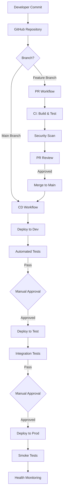

# EDI Platform Deployment Documentation

**Version:** 1.0  
**Last Updated:** October 6, 2025  
**Status:** Production Ready  
**Owner:** EDI Platform Team

---

## 📚 Documentation Overview

This directory contains comprehensive deployment automation documentation for the EDI Platform, covering CI/CD pipelines, deployment strategies, and operational procedures.

---

## 📖 Document Catalog

| Document | Purpose | Audience | Priority |
|----------|---------|----------|----------|
| **[19-deployment-automation-overview.md](./19-deployment-automation-overview.md)** | High-level deployment architecture and strategy | All team members | 🔴 High |
| **[20-github-actions-setup.md](./20-github-actions-setup.md)** | GitHub Actions infrastructure and configuration | DevOps Engineers | 🔴 High |
| **[21-cicd-workflows.md](./21-cicd-workflows.md)** | Detailed CI/CD workflow implementations | Developers, DevOps | 🔴 High |
| **[22-deployment-procedures.md](./22-deployment-procedures.md)** | Step-by-step deployment procedures | Operations Team | 🟠 Critical |
| **[23-rollback-procedures.md](./23-rollback-procedures.md)** | Emergency rollback procedures | Operations, Support | 🔴 Critical |

---

## 🎯 Quick Start

### For Developers

1. Read **[19-deployment-automation-overview.md](./19-deployment-automation-overview.md)** for context
2. Review **[21-cicd-workflows.md](./21-cicd-workflows.md)** for PR and merge workflows
3. Understand **[23-rollback-procedures.md](./23-rollback-procedures.md)** for emergency scenarios

### For DevOps Engineers

1. Start with **[20-github-actions-setup.md](./20-github-actions-setup.md)** for initial configuration
2. Follow **[21-cicd-workflows.md](./21-cicd-workflows.md)** to implement workflows
3. Configure monitoring per **[22-deployment-procedures.md](./22-deployment-procedures.md)**

### For Operations Team

1. Review **[22-deployment-procedures.md](./22-deployment-procedures.md)** for deployment execution
2. **Memorize** **[23-rollback-procedures.md](./23-rollback-procedures.md)** for incident response
3. Bookmark both documents for quick access during incidents

---

## 🗺️ Architecture Overview

---

## 🌍 Environment Strategy

| Environment | Purpose | Deployment Trigger | Approval Required | Data |
|-------------|---------|-------------------|-------------------|------|
| **Dev** | Development testing | Automatic on merge to `main` | No | Synthetic |
| **Test** | Integration testing | Manual after dev validation | 1 reviewer | Anonymized production copy |
| **Prod** | Production workloads | Manual with change control | 2 reviewers + 5min wait | Live production data (PHI) |

---

## 🔐 Security & Compliance

### Authentication

- **Azure OIDC:** Passwordless authentication via OpenID Connect
- **No Secrets:** No long-lived credentials stored in GitHub
- **Short-Lived Tokens:** Tokens valid only for workflow duration

### Scanning

- **IaC Security:** Checkov, PSRule for Azure
- **Code Security:** CodeQL, .NET Security Analyzers
- **Dependencies:** Dependabot, Snyk
- **Secrets:** GitHub Secret Scanning with push protection

### Compliance

- **HIPAA:** Security scanning, access controls, audit logging
- **Change Control:** Approval gates, change validation
- **Audit Trail:** All deployments logged with SHA, actor, timestamp

---

## 📊 Deployment Metrics

### Key Performance Indicators

| Metric | Target | Current | Status |
|--------|--------|---------|--------|
| Deployment Frequency | Daily | TBD | 🟡 In Progress |
| Lead Time for Changes | < 1 day | TBD | 🟡 In Progress |
| Change Failure Rate | < 15% | TBD | 🟡 In Progress |
| Mean Time to Recovery | < 1 hour | TBD | 🟡 In Progress |
| Deployment Success Rate | > 95% | TBD | 🟡 In Progress |

### Monitoring Dashboards

- **Azure Monitor:** Real-time resource health
- **Application Insights:** Application performance
- **GitHub Actions:** Workflow execution metrics
- **Cost Management:** Budget tracking and forecasting

---

## 🚀 Deployment Workflow Summary

### Infrastructure Deployment (Bicep)

1. **PR Created:** CI validates Bicep, runs what-if, security scans
2. **PR Approved:** Merge to main triggers CD workflow
3. **Dev Deploy:** Automatic deployment to dev environment
4. **Test Deploy:** Manual trigger after dev validation
5. **Prod Deploy:** Manual trigger with approval gates

### Function App Deployment (.NET)

1. **PR Created:** CI builds, tests, security scans
2. **PR Approved:** Merge to main builds deployment artifacts
3. **Dev Deploy:** Automatic deployment to dev function apps
4. **Test Deploy:** Manual trigger after integration tests
5. **Prod Deploy:** Manual trigger with health checks

### Azure Data Factory Deployment

1. **ADF Authoring:** Develop in ADF UI connected to Git
2. **PR Workflow:** Validation build from collaboration branch
3. **Main Merge:** Export ARM templates via build
4. **Environment Deploy:** Deploy ARM templates to target environment
5. **Post-Deploy:** Run validation tests and data quality checks

---

## 🛠️ Tools & Technologies

| Category | Tool | Purpose |
|----------|------|---------|
| **CI/CD Platform** | GitHub Actions | Workflow orchestration |
| **IaC** | Azure Bicep | Infrastructure provisioning |
| **Security Scanning** | Checkov, PSRule, CodeQL | Vulnerability detection |
| **Dependency Management** | Dependabot | Automated dependency updates |
| **Monitoring** | Azure Monitor, App Insights | Observability |
| **Notifications** | Microsoft Teams | Team communication |

---

## 📋 Implementation Checklist

### Phase 1: Setup (Week 1)

- [ ] Complete **[GitHub Actions Setup](./20-github-actions-setup.md)**
  - [ ] Azure OIDC authentication configured
  - [ ] GitHub repository secrets and variables configured
  - [ ] GitHub environments with approval gates created
  - [ ] Branch protection rules enabled
- [ ] Test OIDC authentication workflow
- [ ] Create CODEOWNERS file

### Phase 2: CI/CD Implementation (Week 2)

- [ ] Implement **[CI/CD Workflows](./21-cicd-workflows.md)**
  - [ ] Infrastructure CI/CD workflows
  - [ ] Function App CI/CD workflows
  - [ ] Configuration CI/CD workflows
- [ ] Test workflows in dev environment
- [ ] Document any customizations

### Phase 3: Testing & Validation (Week 3)

- [ ] Execute **[Deployment Procedures](./22-deployment-procedures.md)**
  - [ ] Deploy to dev environment (5+ times)
  - [ ] Deploy to test environment (3+ times)
  - [ ] Run integration tests
  - [ ] Validate monitoring and alerting
- [ ] Test **[Rollback Procedures](./23-rollback-procedures.md)**
  - [ ] Infrastructure rollback
  - [ ] Function app rollback
  - [ ] Configuration rollback

### Phase 4: Production Readiness (Week 4)

- [ ] Conduct deployment training
- [ ] Schedule production deployment
- [ ] Execute production deployment
- [ ] Monitor for 48 hours
- [ ] Conduct post-deployment review

---

## 🆘 Emergency Procedures

### Immediate Actions

1. **Detect Issue** - Monitor alerts, health checks, user reports
2. **Assess Severity** - Use decision criteria from [Rollback Procedures](./23-rollback-procedures.md)
3. **Execute Rollback** - Follow appropriate rollback procedure
4. **Validate** - Confirm service restored
5. **Communicate** - Notify stakeholders

### Emergency Contacts

| Role | Contact | Availability |
|------|---------|--------------|
| **Platform Lead** | vincemic | 24/7 |
| **On-Call Engineer** | PagerDuty | 24/7 |
| **Security Team** | @security-team | Business hours |

### Critical Documents

Keep these documents accessible at all times:

- 🔴 **[Rollback Procedures](./23-rollback-procedures.md)** - Memorize for incident response
- 🟠 **[Deployment Procedures](./22-deployment-procedures.md)** - Reference for standard deployments

---

## 📞 Support & Contacts

| Role | Contact | Escalation |
|------|---------|------------|
| **Platform Lead** | vincemic | @vincemic |
| **DevOps Team** | @platform-team | @security-team |
| **On-Call** | PagerDuty | After-hours support |
| **Security Team** | @security-team | Security incidents |

---

## 📝 Document Maintenance

- **Review Cadence:** Quarterly or after major platform changes
- **Update Procedure:** PR to this repository with 2 approvals
- **Version History:** See Git commit history
- **Feedback:** Create GitHub issue or contact vincemic

---

## 🎓 Training Resources

### Internal Documentation

- **[Architecture Overview](./00-executive-overview.md)** - EDI Platform architecture
- **[Data Ingestion Layer](./01-data-ingestion-layer.md)** - SFTP connector and ingestion
- **[Processing Pipeline](./02-processing-pipeline.md)** - Core processing functions
- **[Security & Compliance](./09-security-compliance.md)** - HIPAA compliance

### External Documentation

- [GitHub Actions Documentation](https://docs.github.com/en/actions)
- [Azure Bicep Documentation](https://learn.microsoft.com/azure/azure-resource-manager/bicep/)
- [Azure Functions Documentation](https://learn.microsoft.com/azure/azure-functions/)
- [Azure Data Factory Documentation](https://learn.microsoft.com/azure/data-factory/)

---

## 🔄 Continuous Improvement

### Feedback Loop

1. **Capture Issues** - Document deployment issues and near-misses
2. **Analyze** - Review issues in weekly team meetings
3. **Improve** - Update procedures and automation
4. **Validate** - Test improvements in dev environment
5. **Deploy** - Roll out improvements to all environments

### Quarterly Review

- Review deployment metrics and KPIs
- Analyze DORA metrics trends
- Conduct rollback drill
- Update documentation
- Share lessons learned

---

## ✅ Success Criteria

### Deployment Readiness

- [ ] All GitHub Actions workflows configured and tested
- [ ] Azure OIDC authentication working
- [ ] Branch protection enabled
- [ ] Environment approval gates configured
- [ ] Monitoring and alerting configured
- [ ] Rollback procedures tested
- [ ] Team trained on deployment procedures
- [ ] Change management process defined

### Go-Live Criteria

- [ ] 5+ successful dev deployments
- [ ] 3+ successful test deployments
- [ ] All smoke tests passing
- [ ] Integration tests passing
- [ ] Security scans passing
- [ ] Rollback tested successfully
- [ ] Stakeholder sign-off obtained

---

## 🚦 Current Status

**Phase:** 🟡 Implementation In Progress

**Next Steps:**

1. Complete GitHub Actions setup
2. Implement CI/CD workflows
3. Execute test deployments
4. Schedule production deployment

---

## 📄 Document History

| Version | Date | Author | Changes |
|---------|------|--------|---------|
| 1.0 | Oct 6, 2025 | GitHub Copilot | Initial deployment documentation package |

---

## 🎉 Ready to Get Started?

1. **Read** [Deployment Overview](./19-deployment-automation-overview.md)
2. **Setup** [GitHub Actions](./20-github-actions-setup.md)
3. **Implement** [CI/CD Workflows](./21-cicd-workflows.md)
4. **Deploy** following [Deployment Procedures](./22-deployment-procedures.md)
5. **Prepare** for incidents with [Rollback Procedures](./23-rollback-procedures.md)

---

**Questions?** Create a GitHub issue or contact the platform team.

**Status:** ✅ Ready for implementation

🚀 **Happy Deploying!**
